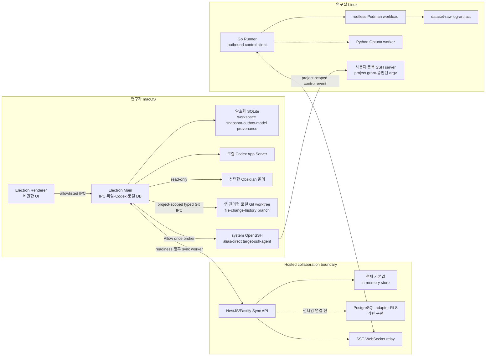
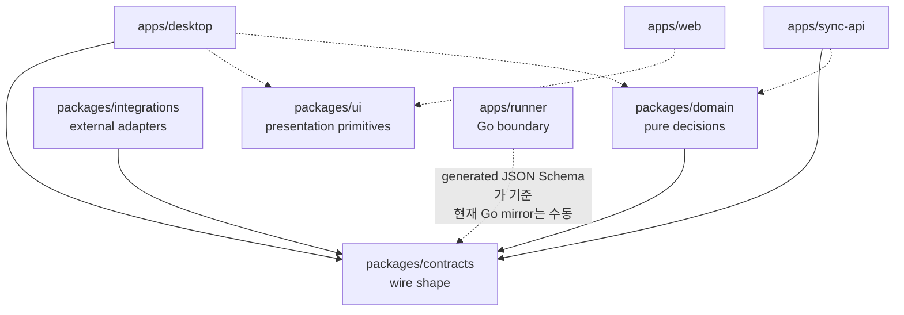
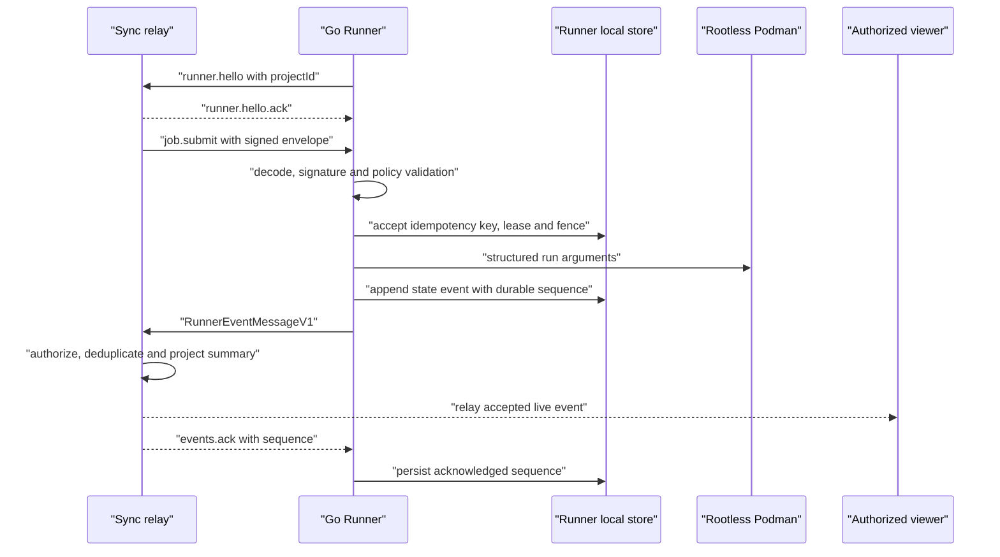
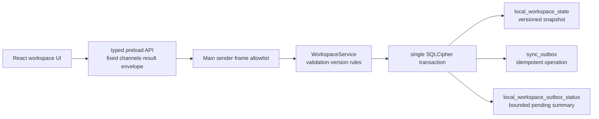
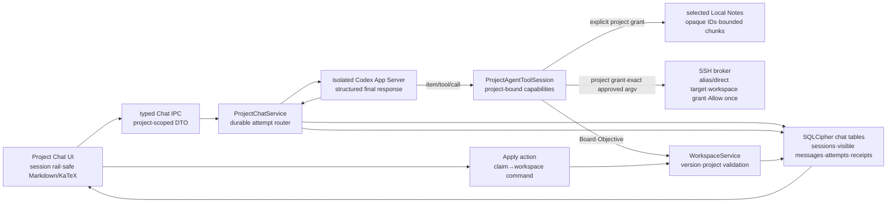
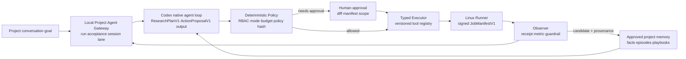

# GOSU 아키텍처 및 유지보수 가이드

이 문서는 GOSU의 장기적인 소프트웨어 경계와 변경 원칙을 정의한다. 현재 저장소의 실제
구현을 기준으로 작성했으며, 완성된 기능과 후속 계획을 구분한다. 제품 소개나 배포 절차보다
"어느 코드가 무엇을 소유하며, 변경이 다른 영역으로 번지지 않게 하려면 어떻게 해야 하는가"에
초점을 둔다.

## 1. 상태 표기

이 문서에서는 다음 표기를 사용한다.

- **구현됨**: 현재 기본 실행 경로에서 동작하고 자동 테스트가 있는 기능
- **기반 구현**: 계약, 정책, 저장소 어댑터 또는 UI가 있으나 제품 흐름 전체에는 연결되지 않은 기능
- **계획됨**: 목표 아키텍처에는 포함되지만 현재 코드로 실행할 수 없는 기능

GOSU는 현재 운영형 MVP의 기반 단계다. 비공개 연구 데이터, 실제 자격 증명 또는 비용이 큰
무인 실험을 맡길 수 있는 프로덕션 시스템으로 간주하면 안 된다.

## 2. 목표와 비목표

### 목표

- 연구 프로젝트, 목표·평가지표, 실험, 논문 작성·검토, 참고문헌, 노트와 강의 자료를 하나의
  프로젝트 범위에서 연결한다.
- 연구 원본은 가능한 한 기존 원본 시스템과 연구자의 장비에 남기는 local-first 구조를 유지한다.
- 외부 연동이나 실행기 장애가 Kanban, 로컬 문서, 다른 독립 모듈을 연쇄적으로 중단시키지 않게
  한다.
- 모든 위험한 자동화에 명시적인 계약, 예산, 승인, provenance와 되돌리기 경계를 둔다.
- 모델명과 외부 서비스의 세부 동작을 제품 도메인에 하드코딩하지 않고 provider·connector
  adapter 뒤에 둔다.
- 상태 변경은 낙관적 버전, idempotency key, lease와 fencing token으로 재시도와 중복 실행에
  견딜 수 있게 한다.

### 현재 비목표

- 연구 파일 전체를 GOSU Hosted Sync에 복제하는 것
- Windows·Linux 데스크톱, Slurm·Kubernetes 또는 wet-lab 장비 제어
- Overleaf·Obsidian·Zotero와의 양방향 동기화
- 실시간 공동 LaTeX 편집
- 보호 브랜치 병합, 근거 최종 채택 또는 외부 export를 사람 승인 없이 수행하는 것
- 현재 단계에서의 공개 인터넷 배포, 비용이 큰 무인 workload 또는 프로덕션 보안 보증

## 3. 실행 토폴로지와 신뢰 경계

핵심 경계는 다음과 같다.

1. Renderer는 신뢰하지 않는다. Node.js, 파일시스템, Git, SSH, Keychain, Codex 프로세스에 직접
   접근하지 못한다.
2. Hosted Sync는 협업 metadata의 원본일 수 있지만 연구 원문의 cloud mirror가 아니다.
3. Runner는 Hosted 환경에서 연산하지 않는다. 연구실이 운영하는 Linux 장비에서 outbound
   연결만 만들고, 로컬 정책이 허용한 서명 manifest만 실행한다.
4. 외부 서비스 자격 증명은 adapter 호출 시 로컬 secret provider에서 받는다. 계약, Git 이력,
   Hosted DB, event, URL 또는 로그에 값을 넣지 않는다.

## 4. 저장소 구조와 코드 소유권

| 경로                    | 소유 책임                                                                       | 현재 상태                                                                        |
| ----------------------- | ------------------------------------------------------------------------------- | -------------------------------------------------------------------------------- |
| `apps/desktop`          | macOS 로컬 UI, privileged adapter, 암호화 local state, Codex·Vault·Git·SSH 경계 | 실행 가능한 Project Chat·Kanban·Objective·Repository·Literature·승인형 SSH slice |
| `apps/web`              | Owner·Lab 관리 경험                                                             | demo fixture 기반의 인터랙티브 UI                                                |
| `apps/sync-api`         | 인증·인가, 협업 command/query, SSE, Runner relay, Hosted persistence 경계       | memory runtime 구현, PostgreSQL 기반 구현                                        |
| `apps/runner`           | manifest 검증, lease/fence, container 실행, event spool, Stop·Kill              | 제한된 로컬 실행 경로 구현                                                       |
| `packages/contracts`    | 프로세스와 언어를 넘는 versioned wire schema                                    | 구현됨                                                                           |
| `packages/domain`       | I/O 없는 상태 전이, 정책, 예산·불변성, version conflict 규칙                    | 구현됨                                                                           |
| `packages/integrations` | GitHub·Zotero·Obsidian·Overleaf port와 제한된 adapter                           | 기반 구현                                                                        |
| `packages/ui`           | 공통 visual token과 작은 presentational primitive                               | 기반 구현                                                                        |
| `scripts`               | local Sync 준비 확인, Desktop process supervision, 환경 진단                    | 구현됨                                                                           |

### 논리 모듈 소유권

제품 모듈은 아직 모두 독립 디렉터리로 분리되어 있지 않다. 새 기능은 아래 소유권을 기준으로
배치하고, 한 모듈이 다른 모듈의 저장 테이블을 직접 읽지 않게 한다.

| 논리 모듈                  | 현재 코드 소유자                                                               | 구현 수준                                                                                                                                      |
| -------------------------- | ------------------------------------------------------------------------------ | ---------------------------------------------------------------------------------------------------------------------------------------------- |
| Identity & Lab             | `apps/sync-api/src/auth.ts`, memory store, PostgreSQL schema                   | JWT 검증과 개발 auth 구현; Google·Apple PKCE·초대는 계획됨                                                                                     |
| Project Portfolio & Kanban | Desktop workspace service, renderer portfolio navigator, Sync controller/store | 다중 project folder 탐색·로컬 hide, project Archive·복원 가능한 Trash, Board 설정·task metadata·filter·drag·archive 구현; Hosted 전달은 계획됨 |
| Goal & Evaluation          | Desktop workspace service, contracts, domain, Sync endpoints                   | 로컬 draft 저장·freeze·명시적 새 version 구현; 승인·Hosted 전달은 계획됨                                                                       |
| Experiment Orchestration   | contracts, domain, Runner                                                      | signed job 실행 기반 구현; campaign scheduler와 완전한 optimizer 연동은 계획됨                                                                 |
| Manuscript                 | Desktop Repository workspace와 향후 manuscript module                          | 앱 관리형 Git worktree·파일/Markdown preview·change/history/branch·commit 구현; LaTeX compile·PDF preview는 계획됨                             |
| Review & Approval          | PostgreSQL approval schema와 Web UI 표현                                       | 기반 구현; 실제 review anchor·approval command는 계획됨                                                                                        |
| Reference & Literature     | Desktop Literature workspace와 Zotero read-only connector                      | Crossref 검색·누적 evidence table·JSON/CSV/BibTeX transfer·metadata-only AI 정리 구현; Zotero 앱 연결은 계획됨                                 |
| Obsidian Knowledge         | Desktop Vault reader, Markdown renderer, project knowledge port                | read-only 선택·GFM 렌더링·wiki-link 탐색·로컬 raster preview·프로젝트별 agent grant 구현                                                       |
| Lecture                    | Owner Web UI 표현                                                              | 생성·편집·출처 연결은 계획됨                                                                                                                   |
| AI Gateway                 | Desktop Project Chat service와 Codex App Server                                | 다중 chat session·동적 model/mode catalog·native harness·project/SSH tool·thread/turn·모델 provenance 구현                                     |
| Integration Hub            | Desktop Git Workspace·승인형 SSH broker, `packages/integrations` registry      | GitHub HTTPS clone·bounded Git·OpenSSH alias/direct import·프로젝트별 remote workspace grant 구현; GitHub App 계정 연결은 계획됨               |
| Sync, Audit & Notification | Sync memory store, PostgreSQL audit·outbox schema                              | 개발 relay 구현; production outbox publisher·Redis·notification은 계획됨                                                                       |

## 5. 의존성 규칙

다음 규칙은 기능 구현보다 우선한다.

- `packages/contracts`는 다른 GOSU workspace에 의존하지 않는다.
- `packages/domain`은 contracts만 의존하며 네트워크, 파일, DB, Electron, NestJS를 import하지 않는다.
- `packages/integrations`는 외부 API의 세부 형식을 소유한다. 앱이나 domain에 provider 응답 형식을
  노출하지 않는다.
- `packages/ui`는 도메인 command를 실행하거나 persistence를 소유하지 않는다.
- 앱은 공유 package에 의존할 수 있지만 앱끼리 source import하지 않는다. 통신은 versioned
  REST, SSE, WebSocket, IPC 또는 file/export contract를 사용한다.
- 다른 모듈의 테이블에 직접 SQL을 작성하지 않는다. 소유 모듈의 repository·port 또는 command를
  호출한다.
- domain 결정을 controller, React component, Electron IPC handler 또는 connector에 복제하지
  않는다.
- 새 외부 provider는 adapter가 필요하지만 새 모델은 필요하지 않다. 모델 ID는 opaque string으로
  유지하고 provider catalog에서 동적으로 읽는다.
- 계약을 우회하는 `any`, 임의 JSON, raw shell string 또는 암묵적 last-write-wins를 새 경계에
  도입하지 않는다.

현재 예외도 명시해야 한다. Runner의 Go manifest type은 생성물이 아니라 TypeScript schema를
수동으로 mirror한다. 따라서 contract drift test와 언어 간 fixture 검증이 필수이며, 장기적으로는
고정된 generator 또는 런타임 JSON Schema 검증으로 대체해야 한다.

## 6. 데이터 원본과 개인정보 경계

| 데이터                                           | authoritative source                                                 | Hosted Sync 보관 정책                                                                               |
| ------------------------------------------------ | -------------------------------------------------------------------- | --------------------------------------------------------------------------------------------------- |
| 코드, LaTeX, 생성된 `.bib`, 재현 설정, slide     | GitHub와 앱 관리형 local worktree                                    | repository label과 향후 branch·commit·PR metadata만; 파일·diff 금지                                 |
| 선택한 Markdown과 첨부                           | 사용자의 Obsidian Vault                                              | 연결 상태만; 본문은 금지                                                                            |
| 서지 metadata, collection, PDF                   | Zotero                                                               | 연결 상태와 선택 item ID만; PDF 금지                                                                |
| 검색 문헌 metadata, review annotation, 검색 이력 | 프로젝트별 Desktop Literature SQLCipher tables와 선택한 import file  | 현재 Hosted Sync·outbox 대상이 아님; 원문·abstract·로컬 file path 금지                              |
| dataset, raw metric·log, checkpoint, artifact    | Linux Runner                                                         | 원본 금지; 상태와 명시적 summary metric만                                                           |
| 프로젝트, Kanban, 보이는 대화, 승인, 감사        | 최종 목표는 Hosted Sync; 현재 Desktop slice는 암호화 로컬 원본       | 협업 metadata 저장 대상                                                                             |
| Codex 인증, API key, SSH material, runner secret | Keychain·Codex credential store·runner secret store                  | 금지                                                                                                |
| SSH connection profile                           | 모든 local project가 공유하는 Desktop SQLCipher registry             | Hosted Sync 금지; alias 또는 정규화된 direct host·user·port·inactive `-L`; secret·원본 command 금지 |
| SSH remote workspace grant                       | 프로젝트별 Desktop SQLCipher table                                   | Hosted Sync 금지; connection ID·canonical root·permission mode만 저장                               |
| SSH command output                               | 해당 Project Chat turn의 Main-process memory와 ephemeral tool result | raw output 저장·동기화 금지; 모델이 답변에 포함한 문장만 대화 정책 적용                             |
| SSH approval request·outcome metadata            | 현재 app process의 in-memory broker event                            | durable audit가 아니며 SQLCipher·Hosted Sync·outbox·telemetry 저장 금지                             |
| tool payload, 파일 본문, shell 출력, raw diff    | 로컬 실행 문맥                                                       | 금지                                                                                                |

Hosted Sync에 저장하지 않는다는 것과 LLM에 전혀 전송하지 않는다는 것은 다르다. Local Notes는 기본적으로
Mac 안에만 남지만, 사용자가 특정 Vault를 특정 project agent에 승인한 경우 그 turn에서 agent가 실제로
list한 note의 display title·opaque ID와, 실제 read한 bounded excerpt·content SHA-256·offset·전체 문자 수가
설정된 Codex/LLM provider로 전송된다. Vault root·상대 path·전체 tool payload는 모델에 주지 않고 원본 note
file이나 raw tool payload를 자동 저장·동기화하지 않는다. 다만 모델이 이 metadata나 excerpt를 visible
answer에 인용하거나 요약하면 그 문장은 보이는 대화이므로 암호화 local DB에 저장되고 향후 Hosted Sync
대상이 될 수 있다. Local Notes와 Agent Settings 화면은 승인 전에 이 점을 명시한다. GOSU는 모든 terminal
receipt에 별도로 display title, opaque note ID 일부, content SHA-256과 excerpt 여부를 붙인다. 이 승인은
project별이며 다른 project나 새로 선택한 Vault로 자동 승계하지 않는다.

`isSummary: true`인 Runner metric만 run summary projection에 들어간다. 그 외 metric point, log,
resource sample, artifact reference는 WebSocket으로 실시간 relay할 수 있지만 memory store도 값을
보존하지 않는다. 이 구분을 바꿀 때는 단순 schema 변경이 아니라 privacy·retention 설계 변경으로
취급한다.

Owner의 가시성도 tenant 범위 안에서만 적용된다. Owner는 동기화된 상태, 보이는 대화, 승인과
감사를 볼 수 있지만 다른 사용자의 secret, 로컬 Vault file 자체, repository 원문 또는 Runner 원본을
직접 읽을 권한을 얻지 않는다. 단, 사용자가 승인한 excerpt를 모델이 보이는 대화에 인용했다면 Owner가
그 동기화된 대화를 통해 인용문을 볼 수 있다는 점은 별도의 privacy 예외다.

현재 Desktop의 Project·Kanban·Objective vertical slice는 Hosted delivery worker가 연결되기 전에도
쓸 수 있도록 암호화 SQLite를 실행 원본으로 사용한다. 이는 장기적인 협업 authority를 바꾼 것이
아니다. 각 로컬 mutation은 optimistic entity version을 확인하고 workspace snapshot과 idempotent
outbox operation을 같은 transaction에 기록한다. delivery가 구현되기 전 UI의 pending 표시는
“로컬에 안전하게 대기 중”만 의미하며, 서버 반영이나 다른 사용자와의 동기화를 의미하지 않는다.

## 7. 계약과 이벤트 흐름

### 계약의 원본

- Zod source는 `packages/contracts/src`에 둔다.
- Draft-07 JSON Schema는 `packages/contracts/generated/json-schema`에 생성해 commit한다.
- 생성 파일은 직접 수정하지 않는다.
- 깨지는 변경은 기존 version을 재해석하지 말고 새 version을 만든다. 배포된 producer와 consumer가
  공존하는 기간에는 dual-read 또는 명시적인 upcaster를 둔다.
- untrusted input은 contract parse 후 domain rule을 적용하고, 그 다음 persistence·side effect를
  수행한다.

주요 공개 계약은 동적 model catalog, objective·budget, `JobManifestV1`,
`RunnerEventV1`·`RunnerEventMessageV1`, `SyncEventV1`, connector capability다.

### 협업 command 흐름

1. client는 project 범위, `expectedVersion`, idempotency key를 포함한 command를 보낸다.
2. API가 인증과 lab·project·role authorization을 수행한다.
3. Zod가 wire shape를 검증하고 domain이 상태 전이·불변성을 판단한다.
4. repository가 상태, audit와 outbox를 하나의 transaction으로 기록한다.
5. publisher가 commit된 outbox event를 전달한다.
6. client는 entity version을 확인해 local cache를 갱신한다. conflict는 덮어쓰지 않고 사용자 또는
   command-specific resolver에 반환한다.

현재 memory store는 1–3단계의 일부, idempotency, optimistic version과 in-process event emit을
구현한다. 4–5단계의 production 경로는 PostgreSQL adapter와 schema까지만 있으며 Nest runtime에는
연결되지 않았다.

### Runner event 흐름

Runner delivery는 at-least-once다. Sync는 `projectId + runnerId + eventId` fingerprint로 exact
duplicate를 제거하고, attempt별 sequence projection에서 stale event를 거절한다. ACK는 수신한
durable sequence를 가리킨다. invalid manifest는 lineage가 없으므로 spool event를 만들지 않는다.

## 8. Desktop 보안 모델

현재 구현된 보안 불변식은 다음과 같다.

- `contextIsolation: true`, `nodeIntegration: false`, `sandbox: true`를 유지한다.
- preload는 작은 `window.gosu` API만 노출한다. arbitrary IPC channel이나 raw Electron object를
  노출하지 않는다. sandboxed preload의 runtime validator는 build 안에 묶고, production build
  검사는 `electron` 외의 external `require()`가 남으면 실패시킨다. preload가 통째로 로드되지 않아
  Renderer가 빈 화면이 되는 packaging regression을 이 경계에서 차단한다.
- Main은 sender가 현재 window의 exact main frame이며 신뢰한 production file URL 또는 설정된
  development origin인지 매 IPC 호출마다 확인한다. development origin은 명시적 port를 가진
  loopback HTTP(S)만 허용하며 packaged build는 `ELECTRON_RENDERER_URL` override를 무시한다.
- navigation과 redirect는 신뢰한 renderer URL 밖으로 나가지 못한다. 새 창은 거부하고 HTTPS
  링크만 system browser로 연다.
- macOS application menu의 `Settings…`는 payload를 받지 않는 고정 Main→Renderer event 하나만
  preload에 노출한다. generic route·channel 이름을 Renderer가 선택하게 하지 않으며, early event는
  preload가 한 번 buffer해 같은 window의 app-level Settings 화면으로 전달한다.
- packaged CSP는 script와 connection을 same-origin으로 제한하고 object·frame·base를 차단한다.
  Vite 개발 모드에서만 exact trusted origin의 inline refresh bootstrap과 HMR WebSocket을 허용한다.
- SQLite key는 random 32-byte 값이며 `safeStorage`로 봉인한다. 암호화 기능이 없으면 local DB를
  열지 않는다.
- Obsidian reader는 사용자가 고른 root 아래의 bounded Markdown만 읽는다. symlink, root escape,
  과도한 파일 크기·개수·깊이를 거부한다. grant ID는 canonical root와 root device·inode에 묶이고 매
  list/read 전후에 root identity를 재검사한다. `VaultAccess`는 reader와 selection을 하나의 immutable
  state로 완성한 뒤 원자적으로 교체하며, 전환 중이던 accessor는 `vault_grant_stale`로 실패한다.
  Renderer는 `gosu:vault:current`에서 Main의 authoritative selection을 다시 받아 reload 뒤 표시와 실제
  capability가 어긋나지 않게 한다. agent read는 root나 path를 받지 않고 Vault ID와 note ID를 Main에서
  다시 해석한다. `O_NOFOLLOW`로 연 file descriptor의 device·inode와 post-open canonical target을 읽기
  전후에 비교한다. Node의 path API만으로 ancestor 전체를 descriptor-relative하게 고정할 수는 없으므로,
  정교한 local directory-swap race를 완전히 닫으려면 후속 native `openat` traversal이 필요하다.
- Codex child는 허용된 최소 환경만 상속하고 stdio JSON-RPC로 initialize한다. GOSU 전용
  `CODEX_HOME`을 사용하며 최초 한 번만 기존 로컬 Codex 인증을 mode `0600`으로 가져온다. import
  marker가 남으므로 GOSU에서 로그아웃한 뒤 다음 실행에 개인 Codex 인증을 몰래 재수입하지 않는다.
  인증정보는 Hosted Sync로 보내지 않는다.
- Project Chat의 Codex SQLite runtime은 mode `0700` 임시 디렉터리로 분리하고 child 종료 후 삭제한다.
  process config에서 transcript history, analytics, OTel export와 user-prompt logging을 끈다. 실제
  integration test는 ephemeral prompt가 장기 `CODEX_HOME`에 남지 않고 임시 SQLite에만 존재했다가
  cleanup되는지 검사한다.
- model picker는 paginated `model/list` 전체 결과를 사용한다. 새 catalog를 가져올 때마다 snapshot
  event를 내보내 SQLCipher에 저장하고, `turn/start` 직전에도 cached catalog를 authority로 재사용하지 않고
  provider에서 fresh catalog를 받아 explicit model·reasoning ID를 다시 검증한다. 사라진 ID는 provider
  fallback에 맡기기 전에 fail closed한다. 실제 resolved model ID와 reasoning option은 turn provenance로
  기록하며 early `model/rerouted` event도 turn 시작 응답까지 bounded buffer에 보존한다.
- agent mode picker는 pinned Codex App Server의 experimental `collaborationMode/list` 결과를 strict하게
  검증하고 opaque mode ID·표시명·추천 model/reasoning을 사용한다. GOSU가 `default`, `plan` 또는 향후
  mode 목록을 제품 enum으로 하드코딩하지 않는다. mode catalog는 canonical SHA-256으로 고정하며 prompt
  조립 뒤 catalog가 바뀌거나 mode·추천 model이 사라지면 silent fallback 없이 turn을 중단한다.
- GOSU는 Codex의 base instructions와 agent loop를 덮어쓰지 않는다. `thread/start`에는 project 권한,
  evidence 취급, Apply gate만 포함한 최소 product policy를 developer instructions로 주고,
  `turn/start.collaborationMode.settings.developer_instructions`는 `null`로 보내 Codex에 내장된 mode
  instructions를 사용한다. pinned 0.146.0 runtime에서 thread developer instructions와 collaboration-mode
  developer fragment는 별도 context layer로 유지되므로 native mode가 product policy를 제거하지 않는다.
  request-shape test는 두 layer가 동시에 전달되는지 고정한다. personality와 model verbosity도 Codex native
  setting으로 전달한다.
- Project Chat turn은 `approvalPolicy: never`, read-only sandbox, network off, empty environments와
  empty runtime roots로 시작한다. process와 thread 양쪽에서 shell, unified exec, browser, Apps,
  plugins, MCP, image generation, multi-agent와 utility tool을 끈다. 예외는 Main이 turn마다 선언하는
  `gosu_project` namespace의 typed dynamic tool뿐이다. Board·Objective·Local Notes·SSH workspace catalog
  조회는 read-only다. 별도 Main broker의 workspace command는 사용자 `Allow once` 뒤 Git inspection 또는
  선택적으로 project code를 실행할 수 있는 bounded test/build를 수행하므로 side effect가 가능하며 remote
  sandbox가 아니다. 이 예외는 Codex sandbox 자체에 shell이나 network를 부여하지 않는다. `thread/start`
  직후 예상 밖 MCP inventory가 0이
  아니면 fail closed하고 thread를 해제한다. server-initiated command·file approval은 Main이 거절하고 그 밖의
  지원하지 않는 request에는 제한된 protocol error만 돌려준다.
- dynamic tool transport는 thread별 allowlist와 handler를 묶고 strict request envelope, namespace와
  tool 일치, 실제 `turn/start` ID binding, 중복 call ID, turn·thread 호출 수, 동시성,
  argument·result character cap과 기본 10초 timeout을 검사한다. 긴 승인이 필요한 declared tool만
  registration에 고정된 timeout override를 가질 수 있고 override 상한은 180초다. 현재
  `run_ssh_workspace_command`만 최대 30초 approval과 120초 execution을 포함하는 155초 bound를 사용하며, 모델이
  timeout을 늘리거나 미등록 tool에 override를 붙일 수 없다. 조기 tool call이 먼저 도착하면 그 turn ID로
  임시 binding한 뒤 `turn/start` 응답과 반드시 일치하는지 재검사한다. 실제 tool argument는 다시 strict
  Zod schema로 검증한다. handler 성공만으로 읽기 출처를 확정하지 않고, 검증된 tool result를 현재 Codex
  child의 stdin에 쓴 뒤 최대 1초 안에 write callback이 성공해야만 delivery를 `delivered`로 확정한다.
  write를 시작하기 전의 invalid result·handler timeout·tool revoke는 `discarded`다. write가 시작된 뒤의
  acknowledgement timeout·async write error·connection 변경·tool revoke는 이미 일부 byte가 전달됐을
  가능성을 되돌릴 수 없으므로 `uncertain`으로 정산하고 출처에는 `delivery unconfirmed`를 붙인다. App
  Server는 provider의 thread ID를 MCP inventory await 전에 동기적으로 예약하고, Project Chat router도
  active thread ID의 단일 소유권을 검사한다. provider가 기존 ID를 동시에 다시 반환해도 기존 project
  handler·Vault grant를 덮어쓰거나 unsubscribe하지 않고 두 번째 start를 거절한다. raw tool call·note
  body는 Project Chat DB, Renderer, telemetry에 자동 전달하지 않는다. 모델이 visible reply에 인용한 note
  text는 raw payload가 아니라 보이는 대화의 privacy 정책을 따른다.
- Codex의 reasoning, command output, file diff, tool payload는 Project Chat DB나 Renderer로 전달하지
  않는다. Renderer에는 보이는 최종 답변, turn 상태, 검증된 action receipt만 보낸다.
- Project Chat profile·custom instruction·조립된 prompt provenance는 로컬 SQLCipher에만 저장한다.
  Hosted Sync, workspace outbox와 telemetry로 보내지 않으며 custom instruction도 project data와 같은
  untrusted input으로 취급한다.
- SSH transport profile은 모든 local project가 공유하는 SQLCipher registry가 소유하되 remote workspace
  권한은 별도 project-scoped, versioned grant로 분리한다. profile은 기존 `~/.ssh/config` alias 또는
  정규화된 direct target 중 하나이며, grant만 connection ID·canonical root·`diagnostics|workspace` mode를
  가진다. Project Chat은 active project에 속한 grant의 opaque ID·label·mode만 볼 수 있고 Main이
  project·session·attempt·turn·tool-call과 실제 connection을 주입한다. 모델은 host·username·port·root·
  credential·private-key path를 list 결과에서 받거나 다른 project의 grant를 선택할 수 없다.
- Connections의 별도 importer는 전체 `ssh -p ... user@host -L ...` 문자열을 shell이나 LLM으로 실행하지
  않고 bounded parser로 분해한다. `ssh`, `-p`, `-l`, 하나의 destination과 loopback-only `-L`만 허용하고
  remote command, quoting·expansion, key/config/proxy/jump, reverse/dynamic forwarding, TTY와 agent forwarding
  option은 거절한다. 원본 paste 문자열은 저장하지 않고 host·optional user/port와 정규화된 `-L` plan만
  저장한다. `-L`은 UI에 inactive로 표시하며 Project Chat transport는 항상 forwarding을 지운다. 기존 alias
  form과 row는 그대로 호환한다. 사용자가 server name을 생략하면 endpoint를 복사한 이름 대신 순번이 붙은
  opaque default label을 만들어 model-visible workspace catalog가 host·user·port를 우회 노출하지 않게 한다.
- remote workspace grant는 Renderer의 현재 project를 Main에서 다시 검증한 뒤 생성·수정한다. `workspace`
  mode는 사용자가 exact remote root와 project code 실행 위험을 명시적으로 확인해야 한다. direct target의
  user가 `root`면 connection과 approval UI에 ROOT/HIGH RISK를 표시한다. root diagnostics는 file/process
  secret을 읽지 못하는 축소 allowlist만 쓰고, root workspace 실행도 일반 grant보다 안전하다고 주장하지
  않는다. alias profile과 user를 생략한 direct target은 실제 account privilege를 확정할 수 없으므로
  `unknown`·HIGH RISK로 표시한다. alias에는 `workspace` mode grant를 허용하지 않으며, user를 생략한 direct
  target의 workspace mode도 사용자가 이 불확실성과 code-execution risk를 명시적으로 확인해야 한다. 명시적
  `root`가 아닌 unknown target이 실제 root인지 Main이 감지할 수 없다는 한계가 있다. canonical root와
  relative subdirectory 검사는 lexical policy이며 symlink·project code·build tool을 격리하는 remote
  sandbox가 아니다.
- system diagnostics와 `run_ssh_workspace_command`는 서로 다른 typed policy다. workspace tool은 exact grant,
  concrete executable, argument array, relative subdirectory와 bounded timeout을 받고 shell·inline eval,
  `sudo`·`su`·`doas`, nested SSH·transfer, TTY·forwarding·background/unattended 실행을 pre-approval에서
  fail closed한다. `diagnostics` mode는 bounded inspect만, `workspace` mode는 inspect와 작은 test/build
  allowlist만 허용한다. Git inspect는 subcommand별 argument schema를 사용하고 fsmonitor·hook·pager config와
  external diff·textconv를 Main이 exact approval preview 전에 비활성화한다. project test/build는 repository code를 해당 remote account 권한으로 실행할 수 있음을
  승인창에 명시한다. 모든 command는 actual target, root/cwd, operation class와 exact preview를 보여 주는
  30초짜리 `Allow once` 승인을 새로 받아야 하며 승인 후 profile·grant version을 다시 확인한다.
  이미 시작된 profile·grant mutation queue가 끝나기 전에는 이 최종 확인과 transport 시작을 진행하지 않아
  승인과 revoke/update가 겹쳐도 이전 권한으로 실행되지 않는다. Node test는 명시적인 `node --test`만
  허용하며 일반 `node script.js`는 test로 분류하지 않는다.
- `/usr/bin/ssh`는 `shell: false` argument array, POSIX token quoting, strict host-key, no TTY·forwarding·
  local command·password prompt 옵션을 사용한다. alias는 사용자의 OpenSSH config와 agent/Keychain을 쓰고,
  direct target은 `-F none`을 사용하고 importer에 제공된 경우에만 user/port를 명시해 config option을
  상속하지 않는다.
  `ForkAfterAuthentication=no`와 `ControlMaster=no`를 강제해 추적 중인 child를 background transport로
  분리하지 못하게 한다. OpenSSH 자체 진단은 process별 권한 `0600` 임시 `-E` log로 격리하고 exit 255는
  이 private diagnostic으로만 분류한 뒤 log directory를 항상 삭제한다. timeout, cancel, grant/profile 삭제,
  session/turn 종료와 app shutdown은 로컬 OpenSSH child에 SIGTERM 뒤 SIGKILL을 보낼 뿐 remote process tree
  종료를 보증하지 않는다. 장기·무인 workload와 hard confinement는 Runner가 소유해야 한다.
- raw remote stdout/stderr는 Main memory에서 bounded·cropped `untrusted_remote_output` tool result로 Codex에
  전달한 뒤 폐기하며 SQLCipher, Hosted Sync, outbox와 telemetry에 저장하지 않는다. 모델이 그 결과를
  visible answer에 요약하면 그 문장만 일반 대화 보존 정책을 따른다. approval request·allowed/denied/
  expired/cancelled event, command binding과 outcome metadata도 현재 app process와 turn 수명의 ephemeral
  상태이며 durable append-only audit가 아니다. connection label 자체도 tenant secret으로 사용하지 않는다.

### Markdown reader 경계

Local Notes의 기본 화면은 Markdown 원문이 아니라 CommonMark와 GFM의 heading, list, table, task
list, blockquote, code block, footnote를 렌더링한다. 사용자는 같은 화면의 `Source` toggle로 원문을
확인할 수 있다. 표시 크기와 색상은 전역 Appearance 설정의 font scale·theme token을 그대로
사용한다.

왼쪽 file explorer는 Main이 이미 검증해 반환한 bounded `VaultSelection.files` snapshot만 Renderer에서
directory-first natural order의 tree로 만든다. 폴더는 기본적으로 접혀 있고 같은 row를 다시 누르면
열림·닫힘이 전환되며, sibling과 접힌 subtree의 기존 expansion은 보존한다. 파일 또는 Markdown
wiki-link를 열면 해당 note의 ancestor만 펼쳐 현재 파일을 드러낸다. expansion과 roving keyboard focus는
Vault별 volatile UI state라 localStorage·Hosted Sync·LLM context에 저장하지 않고 새 Vault에서는
초기화한다. tree model은 absolute·dot-segment·empty component·control character·과도한 길이·non-Markdown·
file/directory 충돌 path를 normalize하지 않고 제외한다. `role="tree"`/`treeitem`, `aria-expanded`·
`aria-selected`, 방향키·Home/End navigation을 제공하며 읽는 동안에도 폴더 탐색은 유지한다. 현재 contract는
Markdown path만 제공하므로 읽을 수 있는 Markdown을 포함한 폴더만 표시하고 empty 또는 attachment-only
folder를 열거하기 위해 Main capability를 넓히지 않는다.

Markdown은 선택한 Vault에서 왔더라도 신뢰하지 않는다. Renderer는 raw HTML을 해석하지 않고,
Markdown AST를 `rehype-sanitize` allowlist로 정리한 뒤 React element로 만든다. `script`, event
handler, `iframe`, `object`, 임의 style과 SVG는 reader DOM에 들어갈 수 없다. frontmatter는 코드를
실행하거나 Vault의 `cssclasses`를 적용하지 않고 접을 수 있는 read-only `Properties` 원문으로만
표시한다.

본문의 `$ ... $` inline 수식과 독립 줄의 `$$ ... $$` display 수식은 Project Chat과 같은
`markdown-math-policy.ts`를 통해 bundled KaTeX HTML/MathML로 렌더링한다. remark 순서는 frontmatter와
GFM 뒤에 math marker를 만들고 Obsidian wiki-link를 처리하며, rehype 단계는 untrusted tree를 먼저
sanitize한 뒤 local KaTeX를 실행한다. sanitizer는 `math-inline`·`math-display` marker만 추가로 허용하고
KaTeX는 `trust: false`, `strict: warn`, `maxExpand: 1000`, `maxSize: 20`을 사용한다. 문서 하나에서
렌더링하는 수식은 최대 256개, 수식 하나는 4,096자, 전체 TeX source는 32,768자로 제한한다. 한도를
넘은 수식은 없애지 않고 inline 또는 fenced TeX code로 보여 주며, 긴 display 수식은 reader 안에서
가로 scroll한다. 일반 prose와 긴 URL·무공백 token은 document 폭 안에서 줄바꿈하고, KaTeX의
`white-space: nowrap`으로 폭을 유지해야 하는 긴 inline 수식은 해당 수식 자체가 가로 scroll region이
된다. display 수식·code block·넓은 GFM table도 각각 자기 block 안에서 scroll하므로 바깥 Local Notes나
Repository layout을 밀어내거나 문서 끝의 전역 scrollbar에 의존하지 않는다. KaTeX CSS와 font는 앱
package에 포함되고 Appearance font scale과 theme을 상속하며 외부 network를 요청하지 않는다. `Source`
mode는 이 파이프라인을 거치지 않아 원문 delimiter를 그대로 표시한다.

Obsidian `[[note]]`, alias와 표준 상대 `.md` link는 raw text 치환이 아닌 Markdown AST 단계에서
처리한다. 따라서 inline/fenced code 안의 wiki-link 표시는 바뀌지 않는다. 대상은 현재 note 기준의
exact path를 먼저 사용하고, basename은 Vault에서 유일할 때만 해석한다. missing·ambiguous link나
Vault root 위로 벗어나는 path는 클릭할 수 없게 표시한다. heading·block fragment가 포함된 link도
note 파일까지는 해석하지만 해당 fragment로 자동 scroll하는 기능과 note transclusion은 아직
구현하지 않았다.

외부 link는 정확한 HTTPS URL만 fixed preload IPC를 통해 Main process가 system browser로 연다.
Renderer navigation과 새 창은 계속 차단한다. 외부 image는 privacy를 위해 자동 요청하지 않는다.
Vault-local PNG, JPEG, GIF, WebP, AVIF만 typed attachment IPC로 읽으며 Main process가 note 기준 경로,
root containment, symlink, 허용 확장자와 file signature, 8 MB 크기 제한을 다시 확인한다. 검증된 bytes만
base64 data URL로 Renderer에 반환하며 절대 경로와 `file://` 권한은 노출하지 않는다. SVG, PDF,
audio·video와 embedded note rendering은 후속 범위다.

Repository의 Markdown preview도 같은 sanitize·link 정책을 재사용하지만 데이터 source capability는
공유하지 않는다. 특히 repository Markdown의 상대 image가 같은 이름의 비공개 Obsidian attachment를
읽지 않도록 Vault image loader를 명시적으로 끈다. Repository-local raster preview는 별도의 bounded
Git asset IPC가 생기기 전까지 blocked placeholder로 표시한다.

### Literature Discovery & Review 경계

프로젝트 folder의 `Literature`는 Crossref public REST API에서 서지 metadata를 검색하고, 결과를 해당
프로젝트의 암호화 SQLCipher evidence table에 누적한다. 검색어, 선택적인 출판 연도 범위와 최대 50건을
typed command로 보내며 Main process의 고정 `https://api.crossref.org/v1/works` adapter만 외부 요청을
수행한다. provider 응답은 title, author, journal·venue, year, subject, DOI, work type, citation count와
HTTPS source URL allowlist로 즉시 정규화하고 raw response와 abstract는 저장하거나 Renderer에 보내지
않는다. 요청은 process 전체에서 직렬화하고 public은 최소 250 ms, polite pool은 최소 125 ms 간격을 두며
15초 timeout, 4 MB response 한도와 429 전용 오류를 둔다. 429의 `Retry-After`는 최대 30초로 제한해 다음
요청 전에 적용하고 header가 없으면 2초 backoff한다.
`GOSU_CROSSREF_MAILTO`와 `GOSU_CROSSREF_USER_AGENT`는 polite-pool 식별을 위한 선택 설정이며 인증정보가
아니다. 값이 없으면 version이 포함된 공개 GOSU user agent를 사용한다.

`literature_records`, `literature_search_runs`, `literature_search_hits`는 Workspace snapshot이나 다른
모듈의 table이 아닌 Literature 모듈 소유다. 모든 query와 mutation은 Main에서 active project 존재 여부를
다시 검사하고 project ID를 SQL predicate에 포함한다. 앱 재시작 중 남은 `running` search는 `failed`로
reconcile하고, 최근 검색은 `Search again` 입력으로 복원할 수 있다. 자동 background scheduler는 아직
없으므로 continual review는 사용자가 같은 검색이나 새 검색을 다시 실행할 때 additive merge하는
형태다. active evidence table은 프로젝트당 500건으로 제한하고 검색·import가 한도를 넘으면 일부만
반영하지 않고 transaction 전체를 거절한다. 동일성은 normalized DOI, 같은 provider record ID, metadata
fingerprint 순서로 판정하며 세 identity가 서로 다른 기존 row를 가리키면 임의 merge 없이 전체 작업을
거절한다. 새 검색은
기존 record를 지우지 않으며 source metadata만 갱신하고 사람의 topics·summary·relevance·review status는
보존한다. source field나 fingerprint가 실제로 바뀌면 기존 metadata에 근거한 AI draft와 provenance는
무효화해 다음 AI batch 후보로 되돌린다. 삭제는 active table에서 숨기는 soft delete이고 hard-delete
command는 제공하지 않는다.

사람의 annotation, provider source field와 AI draft는 별도 column·version으로 관리한다. 수동 편집은
record version과 annotation version을 함께 비교하고, AI batch도 각 row의 expected record version과
annotation version이 모두 일치할 때만 하나의 transaction으로 적용한다. 따라서 검색 갱신이나 사람이
수정한 record를 늦게 끝난 AI turn이 덮어쓰지 않는다. `Organize with Codex`는 AI draft가 아직 없는
다음 최대 50개 정규화 metadata만
pinned Codex App Server의 새 read-only thread에 보내며 dynamic tool, shell과 network를 주지 않는다.
manual note와 paper full text는 prompt에 포함하지 않는다. structured output은 입력 record ID를 정확히
한 번씩 반환해야 하고, model ID·reasoning option·입력 SHA-256·생성 시각·`metadataOnly: true` provenance를
저장한다. metadata만으로 알 수 없는 방법·결과·한계는 추측하지 않도록 표시하며 결과는 사람이 검토할
draft이지 verified evidence가 아니다. Codex 장애는 검색·표·수동 review·transfer를 막지 않는다.

Import와 Export는 Renderer가 path나 file body를 넘기는 범용 파일 IPC가 아니다. Main의 고정 dialog가
JSON, CSV, BibTeX 한 파일만 고르고 8 MB·500 record·regular-file·no-symlink 정책으로 같은 file handle에서
읽는다. export는 선택한 directory의 private 0600 temporary regular file에 쓰고 `fsync`한 뒤 atomic rename해
기존 파일을 부분적으로 손상시키거나 destination symlink를 따라가지 않는다. Renderer에는 basename,
건수와 export SHA-256만 돌려준다. JSON/CSV는 versioned deterministic interchange이고 CSV는 spreadsheet
formula injection을 방지한다. BibTeX citation key는 안정적으로 생성하고 project 내 collision에 suffix를
붙인다. parser는 `%` line comment와 `@string`·`@preamble`·`@comment` special entry를 건너뛰지만 external
macro `#` concatenation은 지원하지 않고 명시적으로 거절한다. export에는 source metadata와 사람이 검토한
field만 포함하고 AI annotation, provider raw
ID, project ID, local version·삭제 상태는 제외한다. import는 DOI→provider ID→fingerprint로 기존 row와
병합하고 manual review는 복원할 수 있지만 AI provenance를 신뢰해 가져오지 않으며 Crossref source를
generic import source로 강등하지 않는다. Zotero local mirror·citation insertion·PDF 확인과 background
alert는 후속 adapter 범위다.

### Git Workspace 경계

Project의 `repository`에는 URL이나 SSH 주소가 아니라 검증된 `owner/repository` label만 저장한다.
이 label은 암호화 workspace snapshot과 outbox에 들어갈 수 있지만 token, credential, local path,
파일 본문과 raw diff는 들어갈 수 없다. 과거 snapshot이 임의 repository 문자열을 포함해도 agent에는
검증된 label만 보이며, 새 project 생성과 연결 command는 URL·userinfo·token 모양을 경계에서 거부한다.

Clone은 Electron Main이 `app.getPath('userData')/git-workspaces/<project UUID>` 아래에 만드는 앱 관리형
worktree만 허용한다. Project Chat의 임시 Codex workspace, Obsidian Vault나 사용자가 고른 임의 폴더를
Git root로 재사용하지 않는다. clone은 HTTPS, no-submodule, no-checkout으로 임시 sibling directory에
받고 다음 검증을 모두 통과한 뒤 atomic rename한다.

- project가 active이고 exact UUID directory를 소유하는 현재 macOS 사용자여야 한다.
- repository directory와 `.git`은 실제 directory여야 하며 symlink일 수 없다. macOS의 `/var`와
  `/private/var` 같은 신뢰한 parent alias는 canonical parent 기준으로 처리하되 project directory 자체의
  alias는 거부한다.
- `.git`의 HEAD, config, index, refs, logs, objects와 Git이 쓰는 주요 admin file은 canonical metadata
  tree 안의 regular single-link file/directory여야 한다. symlink 또는 outside hard link가 보이면 read와
  mutation을 모두 중단한다.
- object alternates, HTTP alternates, grafts, partial-clone/promisor marker와 promisor config는 허용하지
  않는다. 다른 project나 host path의 object를 같은 SHA처럼 읽거나 조회 중 lazy network fetch하는 것을
  막는다.
- `rev-parse --show-toplevel`은 canonical project root와 같아야 한다.
- `origin` URL은 정확히 하나이고 userinfo·query·fragment 없는 예상 GitHub HTTPS repository여야 한다.
  다중 URL, `pushurl`, `insteadOf`/`pushInsteadOf`, custom upload/receive pack, local `http.*`와
  `include.path/includeIf`는 network command 전에 거부한다.
- symbolic HEAD는 `refs/heads/<validated branch>`만 가리킬 수 있고 그 local branch 자체는 direct ref여야
  한다. detached HEAD는 exact object ID로만 표현하며 remote-tracking/local ref와 loose ref/reflog path의
  filesystem symlink를 거부한다.
- remote가 비어 있어 unborn default branch만 있는 경우 HEAD를 `null`로 표현하고 checkout을 생략한다.
  첫 file stage·unstage·commit 뒤 같은 workspace에서 정상 history로 전환한다.

Renderer에는 filesystem path, Node, raw Git command나 generic IPC를 노출하지 않는다. 고정 preload API는
snapshot, clone, text/Markdown preview, diff, commit detail, stage/unstage/commit, branch create/switch,
Fetch, fast-forward-only Pull, current-branch Push와 Finder reveal만 제공한다. force push, reset, clean,
discard, stash, branch 삭제, merge, rebase, submodule update와 arbitrary command는 현재 surface에 없다.

Git child는 shell 없이 고정 executable과 argv array로 실행한다. hook, fsmonitor, pager, external diff,
textconv, commit signature 표시·검증, merge signature 검증, global attributes, interactive prompt와
submodule recursion을 끄고 output·timeout·파일 수·preview 크기를 제한한다. Clone checkout과 branch
switch에도 `--no-recurse-submodules`를 명시해 repository-local `submodule.recurse`가 nested worktree를
움직이거나 그 안의 filter를 실행하지 못하게 한다. History와 commit detail은
`--no-show-signature`, Pull merge는 `--no-verify-signatures`를 다시 명시해 repository-local
`gpg.program`이 조회나 fast-forward 과정에서 실행되지 않게 한다. Network command를 포함한 모든
operational Git command는 global/system config를 기본 격리한다. Commit 직전의
`git config --get user.name/user.email`만 authorship을 얻기 위한 제한된 read로 예외 처리하고, 검증한 값을
격리된 commit argv에 다시 넣는다. 이름이나 이메일이 없거나 control character를 포함하면 commit을
중단한다. HTTPS protocol만 허용하며,
`GIT_ASKPASS`·`SSH_ASKPASS`와 `core.askPass`를 `/usr/bin/false`로 고정해 저장소 또는 parent process가
지정한 credential executable을 실행하지 않는다. macOS에서는 command-line에서 초기화한 Keychain
credential helper만 사용한다. local/worktree config가
filter, hook, alternate refs command, include 또는 외부 command를 다시 켜면 fail closed하고, stage
대상에 `filter` attribute가 있어도 실행하지 않는다. Snapshot과 diff도 status/diff 전에 같은
local/worktree config gate를 통과해야 하므로 Repository 화면을 여는 것만으로 filter command가 실행되지
않는다. 모든 child에 `--no-replace-objects`/`GIT_NO_REPLACE_OBJECTS=1`을 적용해 replace ref가 표시 SHA와
실제 history/diff/merge 대상을 바꾸지 못하게 한다. 또한
`--literal-pathspecs`와 `GIT_LITERAL_PATHSPECS=1`을 강제해 `*`, `?`, `[]`, `:(...)`가 포함된 실제 파일명을
renderer가 선택해도 다른 파일로 확장되지 않는다. symlink·submodule·binary·2 MiB 초과 파일은 tree에
표시할 수 있지만 본문을 Renderer에 반환하지 않는다. UTF-8 preview cutoff는 최대 3 byte를 backtrack해
완전한 code point에서 끝내므로 큰 정상 text를 binary로 오인하지 않는다. History는 먼저 validated
OID-only 목록을 고정하고 NUL-framed metadata가 그 순서와 정확히 일치할 때만 표시한다. Commit detail은
current HEAD에서 reachable한 commit object만 허용해 blob, tree, dangling object로 file-preview policy를
우회할 수 없다. 깨끗한 macOS에 `/usr/bin/git`을 제공하는 Apple Command Line Tools가 없으면
설치가 필요한 bounded 오류를 표시한다. pinned Git 배포와 GitHub App token lifecycle은 후속 범위다.

모든 mutation은 UI snapshot의 exact full HEAD SHA 또는 unborn `null`과 exact symbolic branch를 함께
보내며 Main에서 다시 비교한다. 같은 commit을 가리키는 다른 branch로 외부 전환했어도 stale command는
중단된다. Create Branch는 mutable HEAD 대신 그 reviewed SHA를 explicit start point로 사용한다. Commit은
snapshot의 index fingerprint를 요구하고, `write-tree` 전후 fingerprint가 같을 때 exact tree를
`commit-tree`로 만들며 local branch는 expected HEAD CAS `update-ref --no-deref`로만 이동한다. Renderer도
현재 fingerprint의 모든 staged diff를 연 뒤에만 Commit을 활성화한다. 외부 process가 index를 바꾸면
reviewed tree만 commit되거나 명시적인 stale-index 오류로 중단된다. Rename diff와 Unstage는 original과
destination literal path를 함께 처리한다.

project별 in-process queue가 index lock 경합을 막고, base가 바뀌면 자동 merge/rebase하지 않는다. Pull은
clean worktree와 exact `origin/<current branch>` upstream을 요구한다. Fetch/Pull은 remote head를 예측
불가능한 `refs/gosu/fetch/<session>/...` direct ref에 먼저 받고, 검증한 SHA를 remote-tracking ref에
`update-ref --no-deref` CAS로 반영한다. 따라서 악성 `origin/<branch>` symbolic ref가 local branch를
덮어쓸 수 없다. Pull은 network 이후 HEAD/clean 상태를 다시 확인하고 fetched exact SHA에
`merge --ff-only`만 수행하며 merge commit이나 rebase는 만들지 않는다. 일반 Fetch도 repository의
`remote.origin.fetch`를 신뢰하지 않고 tag·prune·FETCH_HEAD 기록을 끈다. Push도
검토된 exact HEAD SHA를 source로 삼아 예상 GitHub HTTPS URL의 current branch에만 보낸다. branch가
network call 중 움직여도 새 commit은 전송하지 않고 상태 경합으로 중단한다. `--no-follow-tags`,
`--signed=no`, no-submodule 옵션을 강제해 local config가 tag, push certificate 또는 submodule push로
전송 범위를 넓힐 수 없게 하며 force option은 생성하지 않는다. 성공 뒤 `origin/<branch>` tracking ref는
이전 값과 함께 atomic compare-and-swap으로만 갱신한다.

Git file tree와 raw file/diff/history는 로컬 조회 결과다. Hosted DB, workspace outbox, telemetry 또는
Project Chat context에 자동 포함하지 않는다. GitHub remote 장애나 Git 설치 실패는 Repository 화면의
bounded error로 격리하며 Kanban, Objective, Local Notes와 기존 Project Chat을 중단시키지 않는다.

### 현재 로컬 workspace 흐름

- Renderer는 project·task·objective별 typed command만 호출한다. 임의 channel이나 generic cache
  조회 API는 노출하지 않는다.
- Main의 workspace handler는 예상 가능한 validation·version·recovery 실패를 reject하지 않고
  제한된 result envelope로 resolve한다. Preload가 이를 Renderer의 로컬 `Error`로 바꾸므로 Electron
  내부 오류 로거가 project 입력이나 local path를 Main console에 출력하지 않는다. IPC boundary에서
  command input을 먼저 검증해 입력 오류와 persisted snapshot recovery 오류를 구분한다.

### 운영형 Kanban의 소유권과 호환성

- 내부 상태 ID `backlog`, `planned`, `in_progress`, `review`, `done`은 sync command와 Project Chat
  action의 안정적인 의미로 유지한다. 사용자는 프로젝트마다 Board 제목, 다섯 column 표시명·순서와
  optional soft WIP limit을 바꿀 수 있지만 새 status ID를 만들거나 기존 ID를 삭제하지 않는다. 각
  column header의 `Rename` 동작과 상단 Board 설정은 같은 reusable editor를 열기 때문에 validation
  규칙이 갈라지지 않는다.
- `ProjectRecord.board`와 project-level `archivedAt`, Task의 description·priority·due date·labels·
  task-level `archivedAt`은 schema-v1 안의
  optional nested field다. v0.3.2 snapshot에 필드가 없어도 resolver가 런타임 기본값을 제공하며
  top-level 필드나 workspace schema version을 바꾸지 않는다. 새 project는 생성 시점의 full Board
  설정을 항상 저장하지만 기존 project의 optional shape은 계속 읽는다.
- project rename은 optimistic Project version을 검사하고 표시명만 바꾼다. repository·외부 연동의
  안정 식별자로 쓰일 수 있는 기존 slug는 조용히 다시 만들지 않는다. `project.rename` command와
  outbox provenance가 같은 workspace transaction에 남는다.
- project 삭제 UI는 hard delete가 아니라 `trashedAt`을 기록하는 `project.trash`다. 이름을 정확히
  입력하는 첫 경고와 최종 확인의 두 단계를 통과해야 하며, 기본 project picker에서는 숨기되 Settings의
  Trash에서 같은 UUID를 `project.restore`로 복원할 수 있다. task, objective, Board, Project Chat과
  pending outbox는 삭제하지 않는다. Trash의 기존 chat transcript는 읽을 수 있지만 새 turn·profile
  변경·action Apply를 Main service가 거절한다. Renderer의 disabled button에 의존하지 않고 Main의
  project-scoped gate가 starting·active turn과 chat mutation 중 `project.trash`를 원자적으로 거절하며,
  내부 호출이 이 gate를 우회한 terminal 경합에서도 assistant text만 보존하고 action proposal은
  폐기한다. 영구 삭제 command는 제공하지 않는다.
- project lifecycle은 서로 다른 세 상태로 분리한다. Active는 `archivedAt`과 `trashedAt`이 모두 없고,
  Archived는 `archivedAt`만 있으며, Trash는 `trashedAt`이 있는 모든 project다. `project.archive`와
  `project.unarchive`는 Project version CAS와 같은 SQLCipher transaction의 outbox provenance를 사용한다.
  Archived project의 기존 snapshot·chat transcript는 보존하지만 rename, Board·Objective·Task mutation,
  새 Project Chat turn·profile 변경·action Apply와 agent read tool은 Main에서 거절한다. Archived project를
  Trash로 옮길 때 `archivedAt`을 보존하므로 Trash 복원은 원래 Archived 상태로 돌아간다.
  optional project field는 legacy snapshot을 그대로 읽지만 새 outbox command enum을 모르는 v0.7 이하로의
  downgrade는 지원하지 않는다. downgrade 지원이 필요해지면 workspace/outbox schema migration을 별도
  ADR로 설계해야 한다.
- Renderer의 `project-sidebar.tsx`는 모든 Active project 이름을 folder tree로 보여주고, 여러 folder의
  Chat·Board·Goal & Metrics 하위 항목을 동시에 펼칠 수 있다. folder row를 누르면 그 project를 선택하며
  같은 row를 다시 누르면 하위 항목만 접고 현재 작업 화면은 유지한다. Hidden과 Archived는 별도
  recovery group으로 표시하고 Connections·Local Notes·Settings는 project 밖의 global navigation으로 둔다.
- folder 펼침, Active group 접힘, `Hide locally`와 왼쪽 project sidebar 전체의 접힘 상태는 개인 Mac의
  navigation preference다. `project-navigation-state.ts`가 UUID 목록과 boolean만 versioned
  `localStorage` key `gosu:project-navigation:v1`에 저장하며 SQLCipher snapshot, outbox, Git 또는
  Hosted Sync에는 넣지 않는다. sidebar를 접어도 현재 project·tab·chat draft는 그대로 유지하고
  Codex turn이나 SSH 작업을 중단하지 않는다. titlebar의 항상 보이는 panel button과
  `View → Toggle Project Sidebar` (`Control+Command+S`)가 같은 toggle을 호출한다. Main과 preload는
  payload 없는 고정 IPC channel만 노출하며 Renderer load 전 menu 요청은 toggle parity로 합쳐 전달한다.
  Desktop wide layout은 sidebar DOM과 고정된 2열 grid placement를 유지한 채 첫 track만 280/252px에서
  0px로 전환하고 nav opacity·짧은 translate를 함께 적용한다. content를 다른 row/column으로 재배치하지
  않고 `scrollbar-gutter: stable`로 scrollbar 출현에 따른 좌우 흔들림을 막는다. Renderer의
  `html`·`body`·`#root`와 `desktop-shell`은 window viewport 높이에 고정하고 document overflow를
  차단한다. 46px titlebar는 첫 grid row에 남고, 두 번째 row의 nav와 content만 각자의 세로 scroll을
  소유하며 `overscroll-behavior: contain`으로 scroll chaining을 막는다. 따라서 Connections처럼 긴
  surface도 GOSU window chrome이나 다른 pane을 밀어내지 않는다. 이 경계는 `position: sticky`에
  의존하지 않으며 compact logo·toggle·sync indicator도 같은 titlebar height token을 사용한다.
  접힌 nav는 transition
  종료 뒤 hidden visibility가 되며 `inert`·`aria-hidden`·pointer 차단으로 접근할 수 없다. keyboard 또는
  menu로 접을 때 sidebar 내부 focus는 먼저 titlebar toggle로 옮겨 숨겨진 control에 남지 않게 한다.
  좁은 stacked layout의 project navigation은 `min(320px, 40vh)` 높이 안에서 독립적으로 scroll해
  project가 많거나 글자 크기가 커져도 content row를 없애지 않는다. 이 layout은 즉시 접고
  `prefers-reduced-motion`에서는 모든 sidebar transition을 제거한다.
  Hide는 project lifecycle이나 협업자 화면을 바꾸지 않고 `Show` 또는 `Show all`로 즉시 되돌린다.
  진행 중인 Codex turn 표시와 중지 진입점을 숨기지 않도록 해당 project가 busy인 동안 Hide와 Archive를
  비활성화한다.
  Archive는 이 로컬 preference와 달리 domain command이므로 두 개념을 같은 필드나 API로 합치지 않는다.
- Renderer의 `board-view.tsx`는 form·drag-and-drop·Delete 확인과 프로젝트별 임시 view state를
  소유한다. `kanban-board-model.ts`는 column resolve, 검색·priority·label·due date filter와 안전한
  drop 판단만 수행하는 pure helper다. 프로젝트 전환 시 `BoardView`를 project ID로 remount해 draft,
  filter, Task trash mode와 drag ID가 다른 프로젝트로 넘어가지 않게 한다.
- Board 설정은 Project version, task 수정·이동·Delete·restore는 Task version으로 optimistic
  conflict를 검사한다. Main의 `WorkspaceService`만 persisted snapshot을 바꾸며 각각
  `project.board.update`, `task.update`, `task.archive`, `task.restore` outbox command를 같은 SQLCipher
  transaction에 남긴다.
- 카드의 `Delete`는 hard delete가 아니라 `archivedAt`과 새 entity version을 남기는 복원 가능한
  soft delete다. 확인을 통과한 task는 기본 Board에서 빠지고 `Task trash`에 나타나며 `Restore`로 같은
  UUID를 되살린다. 저장·sync 호환성을 위해 내부 command 이름은 `task.archive`·`task.restore`를
  유지한다. 기본 Board와 Project Chat model context에는 active task만 들어가며 Task trash의 task는
  명시적으로 복원하기 전까지 제외한다. 영구 삭제 command는 제공하지 않는다.
- WIP limit은 현재 column의 전체 active task 수로 계산하는 시각적 경고다. filter 결과만 세거나
  이동을 막지 않는다. 임의 column 추가·삭제, column 내부 수동 ranking, saved view와 bulk edit는
  후속 범위다.

### Project Chat 흐름과 소유권

- `project_chat_sessions`, `project_chat_session_messages`, `project_chat_messages`,
  `project_chat_attempts`, `project_chat_actions`, `project_chat_profiles`,
  `project_chat_instruction_revisions`는 Project Chat 모듈이
  소유한다. 대화를
  `local_workspace_state` JSON이나 workspace sync outbox에 넣지 않는다. 따라서 긴 대화가
  Project·Task·Objective snapshot의 크기와 delivery 순서에 영향을 주지 않는다.
- 각 project는 정확히 하나의 durable default root session marker를 갖는다. active project 존재·Archive·
  Trash 상태를 Main에서 먼저 검증한 뒤 chat을 처음 조회할 때 default를 idempotent하게 만들므로 잘못된
  project UUID가 orphan session을 만들 수 없다. legacy `snapshot(projectId)`·send·cancel caller는 이 default로
  routing하며, 기존 message와 attempt는 migration에서 순서를 잃지 않고 같은 membership으로 backfill한다.
  초기 default title은 `Project chat`이고 일반 session처럼 rename할 수 있지만 `isDefault`, project identity,
  parent lineage와 생성 identity는 update/delete trigger로 바꿀 수 없다. 현재 catalog는 정확히 하나의
  default를 가져야 한다.
- `New chat`은 history가 빈 독립 root를 만들고 같은 project의 root title과 충돌하면 `New chat 2`처럼
  번호를 붙인다. branch는 `parentSessionId`와 `branchedFromMessageId`를 함께 고정하고, source session의
  terminal `complete` message까지 기존 immutable message membership만 하나의 transaction에서 연결한다.
  message 본문·action·attempt·model provenance를 복제하지 않으며 branch 이후 source history도 child에
  유입되지 않는다. source session에 속하지 않은 message, 다른 project, active/incomplete point, ordinal
  gap·cycle·손상된 lineage는 fail closed한다. 최대 session 100개, branch depth 32, inherited message
  5,000개와 trim된 title 120자 제한을 적용한다.
- fixed IPC는 session list, selected-session snapshot, root create, completed-message branch와 rename만
  노출한다. rail은 모든 session을 동시에 표시하고 default·independent·branched·active 상태, branch parent와
  생성 시각을 보여 준다. 선택 session별 React key와 generation guard가 retry·scroll·늦게 도착한
  hydration을 격리한다. keyed `ProjectChatView`보다 오래 사는 Desktop shell이 unsent composer draft를
  project+session key의 Renderer volatile memory에만 보존해 session을 오간 뒤 복원하고 성공한 send 뒤
  해당 값만 지운다. 같은 project+session의 parent rerender나 model·reasoning 변경은 typed draft,
  retry provenance와 Advanced 열림 상태를 바꾸지 않고, 실제 project/session identity 전환에서만 새 draft를
  hydrate하고 retry·Advanced를 초기화한다. 이 draft는 SQLCipher·Hosted Sync 원본이 아니다.
  snapshot·event·cancel·retry·action도
  project+session composite key와 membership을 다시 검사해 다른 session이나 project의 상태가 섞이지
  않게 한다.
- Project Chat은 다른 workspace 화면과 분리된 compact content layout을 사용한다. active project의 chat은
  공통 page heading과 그 안의 `New project` action을 렌더링하지 않고 internal chat toolbar와 session rail이
  content 상단부터 시작한다. 제거된 heading 높이도 chat viewport에 돌려준다. 새 project 생성은 titlebar에서
  다시 열 수 있는 Projects sidebar의 `＋`에서 계속 제공하며 Board·Repository·Settings 등 다른 surface는
  공통 heading과 action을 유지한다. session rail은 좁은 고정 navigation column으로 유지하고 chat workspace에는 desktop
  최대 폭·높이 cap을 두지 않아 현재 window를 사용하며 transcript 안쪽 여백도 제한한다. message card는
  넓은 코드·표·수식을 위해 가용 폭의 96%, 최대 1,180px까지 확장하되 작은 window에서는 기존 horizontal
  session rail breakpoint를 유지한다. 완료된 최신 message가 transcript보다 길면 container-local scroll을
  그 message의 header와 top inset에 맞춰 시작해 toolbar 아래에서 첫 줄이 잘리지 않게 한다. active turn 시작 시
  bottom의 thinking state를 보여준다. terminal event가 새 snapshot보다 먼저 와도 stale user message로
  이동하지 않고 새 assistant message ID를 기다리며, 무관한 parent rerender는 현재 scroll을 바꾸지 않는다.
  다른 surface의 공통 spacing은 이 chat 전용 class의 영향을 받지 않는다.
- 한 project에는 동시에 하나의 Codex turn만 허용한다. 사용자는 active turn 중에도 다른 session을 열어
  history를 읽거나 새 root/완료 지점 branch를 만들 수 있지만, 다른 session의 composer·model·reasoning·
  profile·rename은 잠긴다. active session에는 `●`와 Stop을 표시하고 다른 session에는 해당 active session으로
  이동하라는 상태를 표시한다. 이 gate는 UI 편의가 아니라 Main의 project-level lifecycle lock으로도 강제한다.
- project profile은 provider가 발견한 nullable opaque Codex collaboration mode ID,
  `auto`·`none`·`friendly`·`pragmatic` personality, `auto`·`low`·`medium`·`high` native verbosity,
  `project`·`board`·`objective` context scope, nullable project-local Vault grant와 최대 4,000자의 custom
  instruction을 소유한다. v0.6의 `context`·`planner`·`reviewer`와 `concise`·`standard`·`deep` column은
  migration·과거 receipt 판독을 위해 남기되 새 UI의 harness 원본으로 사용하지 않는다.
  Settings의 저장은 profile version CAS를 사용하고 stale edit는 `chat_profile_conflict`로 끝난다.
  Vault grant 저장 시 Main이 현재 선택된 Vault의 opaque ID와 이름을 다시 대조한다. folder가 바뀌면
  기존 grant는 inactive이며 자동 이전하지 않는다. active turn 중 profile 변경은 거절해 한 turn의
  capability snapshot을 고정한다. Renderer reload 때도 Main의 현재 Vault를 typed IPC로 hydrate하며 stale
  hydration response가 이후의 새 folder 선택을 덮지 못하도록 generation guard를 둔다. Chat composer의
  capability status는 grant가 없거나 inactive일 때 project AI Agent Settings로 가는 `Authorize…` 동선을
  제공한다. Local Notes 화면도 진입 시 현재 active project의 암호화 profile을 hydrate하고, project 이름과
  `authorized`·`not authorized`·`inactive`·`checking`·`unavailable` 상태를 함께 표시한다. 사용자는 이
  화면에서 현재 folder를 직접 승인하거나 기존 grant를 즉시 해제할 수 있고, 같은 project의 AI Agent
  Settings로 바로 이동할 수 있다. 직접 변경은 storage-only profile field를 spread하지 않고 허용된 설정
  field를 명시적으로 보존한 CAS command만 전송한다. 승인은 Main이 확인한 exact Vault ID·이름과 active
  turn 없음이 모두 충족될 때만 가능하며, 저장 직전에 선택 folder의 canonical root와 device·inode identity도
  다시 검증한다. 해제는 Vault가 사라졌거나 상태 확인이 실패했어도 가능하다. Notes 진입 hydration이 진행
  중이면 direct action을 잠근다. Hydration busy state는 단일 current ID가 아니라 project별 in-flight set으로
  추적해 다른 project의 동시에 끝나는 snapshot이 이 잠금을 풀 수 없게 한다. local profile mutation은 진행
  중인 hydration token을 무효화하며, Renderer의 snapshot merge도 profile version을 단조롭게 유지하므로
  지연된 이전 snapshot이 새 grant를 화면에서 되돌릴 수 없다.
  authoritative status를 아직 확인 중이거나 IPC 오류로 확인하지 못했는데 저장된 grant가 있으면 chat
  send를 차단해 Main의 숨은 기존 capability가 UI 표시와 다르게 사용되지 않게 한다. Agent Settings의
  grant·revoke button은 profile 저장 전 local draft임을 label로 표시하고, Local Notes의 direct action은
  성공한 CAS 저장 결과를 즉시 상태에 반영한다.
  custom instruction 변경은 append-only revision과 content hash를 남기며 이전 attempt의 의미를
  덮어쓰지 않는다. Chat 화면의 per-turn override는 profile을 수정하지 않고 해당 attempt에만 고정된다.
- prompt assembly는 변경 가능한 문자열 연결을 Renderer에 두지 않는다. Main은 versioned immutable
  GOSU product policy만 developer instruction으로 만들고, Codex의 Default·Plan 동작과 답변 verbosity를
  자체 prompt로 재구현하지 않는다. custom project preference, project context, visible history와 user
  message는 모두 별도의 untrusted JSON envelope에 넣는다.
  context는 최대 48,000자, history는 최근 40개·24,000자, assembled prompt는 160,000자로 제한한다.
  policy·legacy compatibility·custom·context·history·message·최종 prompt의 SHA-256과
  profile/instruction revision, workspace revision, dynamic tool catalog hash, 실제 활성 Vault ID,
  Codex mode catalog hash, 선택 mode·personality·verbosity·effective reasoning과 truncation 여부를 attempt
  provenance assembly v3에 기록한다. 이전 assembly v1·v2 provenance는 계속 읽을 수 있다.
- 기존 reviewer profile은 migration 호환 경로에서만 조언 전용으로 유지한다. 모델이 구조화 action을
  반환하더라도 service가 `actions=[]`로 강제한다. 사용자가 새 native mode를 명시하면 legacy reviewer를
  벗어난다. native mode를 포함한 모든 turn은 동일한 read-only·no-network·no-shell·no-subagent 경계를
  사용한다. GOSU project read tool과 별도 `Allow once`를 요구하는 Main-process SSH broker만 명시적
  capability 예외이며, SSH 실행이 Codex child 자체에 shell·network 권한을 부여하지는 않는다.
- 현재 `gosu_project` namespace는 `read_workspace`, `list_local_notes`, `read_local_note`,
  `list_ssh_workspaces`, `run_ssh_workspace_command`를 제공한다.
  `read_workspace`는 active project ID를 handler closure에 묶어 Board와 최신 Objective만 반환하며
  모델 argument로 project ID를 받지 않는다. repository는 credential·URL·SSH 주소를 제외한 canonical
  `owner/repository` label만 agent context에 포함한다. Local Notes tool은 profile grant가 현재 선택 Vault와
  일치할 때만 catalog에 나타난다. list는 opaque note ID와 display title만 반환하고 read는 호출당
  24,000자, ephemeral turn당 합계 96,000자로 제한한다. 동시 호출은 read 전에 budget을 reserve하고 모든
  tool 결과는 직렬화 후 48,000자 안으로 축약한다. note text와 tool result는 untrusted evidence이며 그
  안의 지시를 실행하지 않는다.
- SSH workspace list tool은 active project의 grant만 읽어 opaque grant ID, connection label과 permission
  mode를 반환한다. global registry의 ungranted connection, 다른 project의 grant, actual target과 root는
  모델에 노출하지 않는다. command tool의 project·session·attempt·turn·tool-call·connection binding은
  모델 argument가 아니라 Main이 주입하고 grant를 다시 조회한다. 최대 20개 argument는 별도 token으로
  검증하며 absolute executable, relative workspace subdirectory와 mode별 inspect/test/build allowlist를
  적용한다. raw shell·inline interpreter eval, privilege escalation, nested transport·transfer, TTY·forwarding과
  unattended execution은 approval UI 전에 fail closed한다.
- approval center는 actual target, ROOT/HIGH RISK, connection label, project/session, workspace root/cwd,
  operation class와 exact remote preview를 표시하며 사용자는 각
  실행을 `Allow once` 또는 Deny한다. approval은 최대 30초, 전체 pending 16개·turn당 4개, 전체 active
  4개·turn당 1개다. turn terminal/cancel, connection 삭제와 앱 종료는 pending 요청을 거절하고 active local
  SSH transport를 abort한다. 화면에서 project/session을 벗어나면 strict project/session payload만 받는
  cancellation-only `gosu:ssh:cancel-scope` IPC와 Project Chat revoke IPC가 Main의 pending·active transport와
  해당 live agent tool session을 찾아 attempt-scoped abort signal과 scope epoch를 폐기한다. revoke epoch는
  storage 검증보다 먼저 in-memory capability와 transport를 폐기한다. explicit session epoch와 revoke-all
  project epoch를 분리해 이전 session A의 revoke가 새 session B를 잘못 막지 않으면서, send의 첫 await 전에
  비교할 generation을 바꾸므로 이미 보이는 pending·active
  command뿐 아니라 connection lookup 중인 요청과 전환 race 뒤의 future SSH tool call도 fail closed하며,
  SSH 밖의 Codex turn은 계속 진행한다. dynamic tool timeout과 thread revoke는 handler에 AbortSignal을
  전달하고 SSH broker는 이를 connection lookup·pending approval·approved active transport 전체 수명에
  연결한다. approved chain은 runner 실행 직전과 result 채택 직전에 abort 상태를 다시 확인하고,
  single-terminal settlement로 runner가 signal을 무시하거나 늦게 성공해도 cancellation이 최종 결과로
  유지된다. abort·deny·expire·정상 종료마다 listener를 제거하며 timeout 응답을 먼저 보냈더라도 실제
  handler가 settle할 때까지 해당 in-flight capacity를 유지해 zombie 작업이 동시 실행 상한을 우회하지
  못하게 한다. Stop은 project/session lookup과 Codex
  interrupt보다 먼저, terminal notification은 Local Notes delivery settlement와 receipt persistence보다 먼저
  live SSH capability와 transport를 동기적으로 폐기한다. Renderer는 `turn.started` 전 startup 동안 Stop을
  표시하지 않고 project busy 상태만 보여 준다. timeout·output cap·transport failure는 typed error로 끝나 다른
  Project Chat capability를 중단시키지 않지만, local abort 뒤 remote process 종료는 보증하지 않는다.
  approval event·binding·outcome은 현재 memory-only라 restart 후 감사 원본으로 쓸 수 없다.
- agent가 실제로 읽은 note는 성공·invalid response·중단·실패·turn 등록 실패를 포함한 모든 terminal
  assistant receipt 끝에 sanitized title, opaque ID prefix, full-content SHA-256 전체 값과 excerpt 여부를
  남긴다. 자동 source appendix에는 raw note body, root/path와 tool arguments를 넣지 않는다. 다만 모델이
  note를 visible reply에 직접 인용·요약하면 그 reply는 SQLCipher message와 향후 Hosted Sync 대상이다.
  terminal 경로는 pending note delivery를 최대 100ms 동안 bounded settlement한 뒤 App Server의 해당
  thread tool registration을 동기적으로 revoke한다. revoke로 확정된 `uncertain` 결과까지 한 microtask
  안에서 반영한 다음 `Local Notes accessed` appendix를 봉인한다. timeout 뒤 완료된 handler는 note
  result를 Codex로 보내거나 receipt를 뒤늦게 변경할 수 없다. source identity는
  `note ID + content SHA-256` pair이므로 같은 note의 서로 다른 content version을 한 turn에서 읽어도 각각
  보존하고, 동일 version의 여러 excerpt만 하나의 source entry로 합친다.
- tool access는 UI section 자체나 database table 접근이 아니라 module capability다. 현재 구현된
  Board·Goal & Metrics·승인된 Local Notes와 active project에 grant된 SSH workspace의 opaque ID·label·mode만
  읽을 수 있다. SSH host resolution·credential·private-key path·remote root, Settings·Project Trash는
  list tool에 노출하지 않으며
  Experiments·Manuscript·Review·References·Lecture는 domain service가 완성되기 전에는 접근 가능한 것처럼
  표시하지 않는다. Board 쓰기는 기존 `task.create`·`task.update` proposal과 사용자 Apply만 사용하고,
  SSH workspace command는 별도의 project grant와 exact Allow-once broker boundary를 사용한다.
- 사용자 메시지를 받으면 Codex를 호출하기 전에 attempt와 user message를 한 transaction으로
  `starting` 상태에 기록한다. `turn/start`가 성공하면 실제 thread ID, turn ID, requested·resolved
  model provenance를 포함해 `running`으로 CAS 전이하고, terminal attempt와 assistant receipt도 한
  transaction으로 저장한다. process 재시작 시 남아 있는 `starting`·`running` attempt는
  `application_interrupted`로 바꾸고 정확히 하나의 보이는 중단 receipt를 만든다.
- 실패·중단 attempt는 UI에서 삭제하지 않는다. 사용자는 `Retry this turn`으로 원래 attempt를 명시해
  새 attempt를 만들 수 있고 `retryOfAttemptId`로 lineage를 남긴다. 실패한 partial history는 새 model
  prompt에 완료된 대화처럼 재주입하지 않는다. attempt ID가 없던 이전 버전의 실패 receipt도 바로 앞
  user message와 한 쌍으로 인식해 retry prompt에서 제외한다. 완료된 attempt를 retry하거나 다른
  project의 attempt를 지정하면 거절한다.
- Codex thread는 메시지마다 새 `ephemeral` thread로 만든다. 완료·실패·중단 후 즉시
  `thread/unsubscribe`한다. thread·turn ID는 attempt provenance로는 저장하지만 재시작 후 resume하지
  않는다. 대화 연속성은
  SQLCipher의 보이는 메시지 중 최근 최대 40개·24,000자를 다음 turn에 재주입해 유지한다.
- Codex가 turn을 수락한 뒤 `running` receipt 저장 또는 active router 등록이 실패하면 해당 turn을 먼저
  best-effort interrupt하고 thread를 해제한다. interrupt 확인까지 실패하면 실제 thread·turn·model
  provenance를 보존한 `application_interrupted` receipt를 남겨 숨은 실행을 자동 retry하지 않는다.
- turn prompt에는 현재 프로젝트의 이름·repository 식별자, Board 제목과 canonical status/display
  label mapping, 최대 200개 active Task의 bounded metadata, 최신 Objective와 해당 프로젝트의
  bounded visible history만 선제적으로 넣는다. archived Task는 개수만 제공한다. 다른 프로젝트,
  연구 파일과 secret은 포함하지 않는다. Vault 본문은 선제 context에 넣지 않고 승인된 read tool로
  model이 요청한 bounded chunk만 제공한다.
- snapshot은 현재 active turn ID를 포함한다. 창 재생성이나 Renderer reload가 `turn.started` event를
  놓쳐도 Thinking·Stop 상태를 복구하며, load generation과 event sequence guard가 오래된 snapshot이
  새 turn 상태나 action receipt를 덮지 못하게 한다.
- 앱 시작과 사용자의 Reconnect는 Codex account 상태와 전체 동적 model catalog를 다시 확인한다.
  연결이 끊기면 이전 catalog를 폐기하며 Board·Settings·Local notes는 계속 동작한다. 선택한 model이
  없어졌을 때 다른 model로 조용히 바꾸지 않는다.
- model별 reasoning option과 personality 지원 여부는 paginated `model/list` catalog가 제공한 실제 값만
  사용한다. `supportedReasoningEfforts[].reasoningEffort`의 opaque ID를 option ID와 짧은 label에 그대로
  쓰고 provider description을 label로 바꾸거나 `medium`·`high` 같은 목록을 하드코딩·번역·재정렬하지
  않는다. 따라서 provider가 새 effort ID를 추가하면 앱 업데이트 없이 catalog 순서대로 나타난다.
  `Model default`는 null이며 `defaultReasoningEffort`는 default 표시만 결정한다. 선택 ID가 refresh 뒤
  사라지거나 다른 model에서 지원되지 않으면 unavailable로 남기고 send를 중단하지 임의 fallback하지
  않는다. requested/resolved model ID, catalog hash, 실제 reasoning ID와 native mode 설정은 각 attempt
  provenance에 기록한다. 사용자가 선택한 model/reasoning이 mode 추천보다 우선하고, mode 추천은 provider
  기본값보다 우선한다. personality 미지원 model에는 Main도 설정을 거절한다.
- Project Chat의 user·assistant 본문은 같은 `react-markdown` pipeline으로 렌더링한다. `remark-gfm` 뒤
  `remark-math`가 `$ ... $` inline math와 독립 줄의 `$$ ... $$` display math marker를 만들고, raw HTML은
  `skipHtml`로 버린다. `rehype-sanitize`가 untrusted tree에서 기본 safe element와 KaTeX 입력용
  `math-inline`·`math-display` marker class만 보존한 **뒤에** bundled `rehype-katex`가 local HTML/MathML을
  생성한다. KaTeX는 `trust: false`, `strict: warn`, `maxExpand: 1000`, `maxSize: 20`으로 제한한다.
  공통 math policy는 문서당 수식 개수·개별·총 TeX 길이도 제한하고 초과 source를 code fallback으로
  보존해 Local Notes와 Chat 사이의 안전 설정이 갈라지지 않게 한다.
  link는 정확한 HTTPS만 Main의 external-browser IPC로 열고 image는 remote fetch 대신 blocked placeholder로
  바꾼다. 깨진 수식은 escaped error/fallback으로 해당 message 안에 남아 transcript 전체를 throw하지
  않으며 원문과 message provenance는 그대로 유지한다. KaTeX CSS와 font는 package에 묶여 theme·font
  scale을 따르고 수식 표시 때문에 외부 network를 요청하지 않는다.
- Codex final은 JSON Schema와 Zod가 함께 검증하는 `reply + actions` 계약이다. v1 action은
  `task.create`와 `task.update`뿐이며 모델이 `projectId`를 정할 수 없다.
- 제안 action은 곧바로 실행되지 않는다. 사용자가 Apply하면 SQLCipher row를 `proposed → applying`으로
  원자 claim한 뒤 기존 `WorkspaceService` command를 호출한다. update는 Task의 project 소속과
  optimistic `expectedVersion`을 다시 검사하며 중복 Apply는 새 mutation을 만들지 않는다.
- `applying` 중 process가 중단되면 다음 DB open에서 `application_interrupted`로 표시한다. Board에
  반영됐는지 확인하기 전 자동 retry하지 않아 중복 Task 생성을 막는다.
- Board mutation 성공 뒤 action receipt 저장만 실패한 경우도 `application_interrupted`로 남기고
  `workspaceChanged: true`를 알린다. 이미 반영된 mutation을 거짓 실패로 표시하거나 자동 재시도하지
  않는다.
- IPC DTO와 Zod schema는 `apps/desktop/src/shared/workspace-contracts.ts`, runtime 상태 DTO는
  `apps/desktop/src/shared/runtime-contracts.ts`가 소유한다. Renderer와 Preload는 privileged Main
  구현을 import하지 않고 이 shared contract의 type만 사용한다.
- `WorkspaceService`는 untrusted payload와 persisted snapshot을 Zod로 검증하고 mutation을 직렬화한다.
- 각 task와 objective는 entity version을 가지며 stale command는 conflict로 끝난다. 자동 merge나
  last-write-wins는 수행하지 않는다.
- workspace 전체 revision은 성공한 mutation마다 증가한다. commit이 실패하면 in-memory snapshot도
  갱신하지 않는다. SQL transaction은 persisted revision이 정확히 이전 revision일 때만 snapshot을
  CAS 갱신하므로 예외적으로 두 DB connection이 겹쳐도 같은 revision이 서로를 덮어쓰지 못한다.
- 동일한 revision을 outbox operation의 durable `workspaceRevision`으로 기록하고 pending command는
  이 값으로 정렬한다. 같은 millisecond에 기록된 create→update 또는 save→freeze가 UUID 순서로
  뒤집히지 않는다.
- sequence 도입 전 local row는 open migration에서 기존 insertion `rowid` 순서를 한 번만
  `workspaceRevision` column과 정상 operation JSON에 backfill하고, 이후에는 그 durable 값을 사용한다.
  파싱할 수 없는 operation payload는 삭제하거나 재작성하지 않고 opaque provenance로 그대로 보존한다.
  기존 revision과 row 순서가 모순되는 partial migration은 임의로 재번호를 만들지 않고 queue만
  recovery-required로 막는다. 이때 snapshot과 기존 Board 읽기는 계속 가능하다.
- UI는 outbox payload 전체를 받지 않는다. transaction에서 함께 갱신되는 singleton summary의
  pending count와 latest revision만 고정 크기 IPC로 읽는다. summary 오류는 snapshot 로딩과
  격리되어 정상 project·task·objective를 숨기지 않는다. 앱을 열 때와 summary를 읽을 때 실제
  outbox row에서 singleton을 다시 계산해 누락되거나 불일치하는 legacy summary를 복구한다.
- project별 task 접근을 검사해 다른 project ID를 통한 수정은 거절한다.
- objective freeze는 현재 단일 사용자 로컬 불변성 기능이다. Owner 승인이나 RBAC 승인으로 해석하면
  안 되며, 변경하려면 명시적으로 다음 objective version을 시작해야 한다.
- 이 slice에는 outbox delivery, conflict reconciliation, 로그인·연구실 RBAC가 아직 없다. 따라서
  pending operation을 synced로 표시하지 않는다.

### App-level Settings, 표시 설정과 로컬 기본 Board template

- Settings는 project module tab이 아니라 workspace와 분리된 app-level surface다. global Settings
  button과 macOS `GOSU > Settings…` (`Command+,`)가 같은 화면을 열고 Done으로 이전 workspace로
  돌아간다. category는 Appearance, Board defaults, Projects, AI Agent로 분리한다.
- appearance(`system`·`dark`·`light`)와 text size(`compact`·`default`·`large`·`extra-large`)는
  schema version이 있는 Renderer `localStorage` preference다. React mount 전에 root dataset에
  적용해 시작 시 theme flash를 줄이고, 변경은 semantic color·font token을 통해 전체 UI에 반영한다.
  네 font preset의 body 기준은 각각 12·14·16·18 px이며 component가 고정된 작은 pixel font를 다시
  도입하지 않고 semantic token을 사용한다.
- 같은 local preference에는 새 project용 default Board title, column 표시명·순서와 WIP limit도
  들어간다. legacy preference에 이 필드가 없거나 유효하지 않으면 display 설정은 보존하고 Board
  template만 GOSU 기본값으로 복구한다.
- template preference 자체는 SQLCipher, Git 또는 Hosted Sync에 저장하지 않는다. project 생성 시에만
  그 시점의 독립 copy를 typed `project.create` command로 보내 Main에서 다시 검증하고 Project record와
  outbox payload에 원자적으로 기록한다. 이후 Settings template 변경은 기존 Board를 바꾸지 않는다.
- appearance와 text size 및 project folder 접힘·hide는 IPC에 넣지 않는다. project rename·Archive·
  Trash·restore는 Workspace SQLCipher가,
  AI Agent profile은 Project Chat SQLCipher table이 각각 소유한다. Renderer preference는 파일·Keychain·Codex
  권한을 얻지 않으며, 프로젝트를 아직 만들지 않았거나 workspace 복구가 실패해도 Settings 화면은
  열려야 한다.
  앞으로 계정 간 preference 동기화가 필요하면 전용 계약과 명시적 opt-in을 별도로 설계한다.

### Project Agent Runtime: native Codex harness와 후속 자율 실행 설계

Project Chat에는 pinned local [Codex App Server](https://learn.chatgpt.com/docs/app-server)의 native
thread/turn/item agent loop와 dynamic tools를 사용해 active project의 Board·Objective와 명시적으로
승인한 Local Notes를 읽고, 현재 project에 grant된 OpenSSH alias/direct target에 exact Allow-once
workspace command를 요청하는 bounded tool loop가 구현되어 있다. GOSU가 별도의 planner/reviewer loop를
재작성하지 않고 Codex가 제공하는
collaboration mode·reasoning·personality·verbosity를 조합한다.
다만 이는 navigation UI나 DB를 자유롭게 조작하는 agent가 아니며 mutation은 검증된 proposal과 사용자
Apply를 거친다. 승인형 SSH는 local shell/network 권한을 Codex에 주는 것이 아니라 Main의 고정 broker가
project grant와 argv policy를 검증해 한 command만 대리 실행하는 좁은 예외다. remote workspace mode는
interactive terminal이나 hard sandbox가 아니며, arbitrary local file·subagent, 실험 campaign 실행과 논문 변경을
포함한 프로젝트 자율 실행 runtime은 아직 계획 단계다.

OpenClaw와 Hermes는 gateway lifecycle, policy, memory를 비교 검토하는 참고 자료일 뿐 GOSU의 agent
harness dependency가 아니다. 후속 기능도 우선 Codex App Server의 native thread/turn/dynamic-tool
계약으로 확장하고, GOSU는 연구 도메인 capability·승인·provenance만 소유한다. Codex plugin·skill과
multi-agent는 child thread가 project authorization을 상속하고 audit할 수 있기 전까지 비활성화한다.

적용할 경계는 다음과 같다.

- **Gateway와 run lifecycle**: Electron Main의 local gateway가 provider session, run queue, event와
  cancellation의 control plane을 소유한다. Linux Runner는 execution data plane이고 Hosted Sync는
  협업·승인·감사 metadata만 다룬다. LLM 호출 전에 `AgentRun`을 durable accept하고 `runId`를 반환한
  뒤 lifecycle, assistant, tool, observation stream을 분리한다. project/session lane별 직렬화와
  idempotency key·fencing token으로 stale run이 최신 상태를 덮지 못하게 한다.
- **Native agent loop와 계획 계약**: Codex가 목표와 허용된 tool observation을 바탕으로 계획을
  진행하되, GOSU가 받는 변경 출력은 `ObjectiveVersion`, expected metric, precondition, rollback,
  budget을 포함한 versioned `ResearchPlanV1`과 `ActionProposalV1`으로 제한한다. Codex mode가 connector나
  shell 권한을 스스로 얻거나 성공을 최종 판정하지 않는다.
- **Policy**: LLM·plugin과 분리된 결정론적 engine이 lab/project RBAC, Autopilot mode, metric·dataset,
  budget, network·secret, branch/base-SHA와 policy hash를 평가해 `allow`, `deny`, `needsApproval`을
  결정한다. session ID는 routing 식별자일 뿐 authorization 근거가 아니다.
- **Executor와 tool manifest**: tool은 version, JSON Schema input/output, capability, side-effect,
  idempotency와 source hash를 선언한다. MVP는 bundled·allowlisted adapter만 로드하고 deny가 allow보다
  우선한다. 실험은 raw shell string이 아니라 서명된 `JobManifestV1`만 Runner에 전달한다. connector는
  별도 worker process로 격리한다.
- **Observer와 evidence**: Runner, Git, compiler와 evaluator event를 append-only observation과
  `ExecutionReceipt`로 만든다. trusted evaluator와 guardrail이 metric 채택을 판단하며 LLM 문장은
  evidence가 아니다. 실패·중단·negative result도 lineage에서 제거하지 않는다.
- **Memory와 skill learning**: bounded curated memory와 on-demand searchable history를 분리해
  (1) run 시작 시 고정된 bounded working snapshot, (2) project-scoped episodic history,
  (3) 승인된 structured fact, (4) versioned procedural playbook을 별도 저장한다. 새 memory·playbook은
  source, run, commit, ObjectiveVersion provenance가 있는 candidate→diff→human approval을 거친다.

채택하지 않을 패턴도 불변식으로 둔다. 임의 marketplace plugin·MCP·skill을 Main process에 로드하지
않고, host shell을 기본 tool로 제공하지 않으며, project 사이에 persistent execution container를
공유하지 않는다. agent가 만든 memory·skill·code를 기본 자동 반영하지 않고 model/provider 오류를
silent fallback으로 숨기지 않는다. approval regex, redaction, prompt scan은 보조 방어이며 실제 보안
경계는 OS process, container, credential store와 tenant authorization이다.

### 로컬 실행과 패키징 경로

`pnpm app:dev`는 일반적인 workspace 병렬 실행과 별개의 사용자용 local slice다.
package script의 shell은 `exec`로 supervisor에 교체되어 terminal signal을 중간에서 소비하지 않는다.

1. `GOSU_SYNC_API_URL`을 credential·path가 없고 port가 명시된 loopback HTTP base URL로 검증한다.
2. 고정된 `/v1/health/ready`에서 service identity와 readiness를 확인한다.
3. 건강한 기존 GOSU Sync가 없으면 loopback memory Sync를 시작하고 준비 완료까지 기다린다. 같은
   port에서 다른 서비스가 응답하면 충돌로 중단한다.
4. 준비된 base URL만 Electron Main에 전달하고 Desktop을 시작한다.
5. Desktop이 끝나거나 `Ctrl+C`를 받으면 진행 중인 probe/readiness를 취소하고 이후 child 생성을
   차단한 뒤 소유한 process group을 종료해 watcher와 Electron helper가 남지 않게 한다.

Desktop Main은 single-instance lock을 먼저 획득한다. 같은 user data를 사용하는 두 앱이 동시에
SQLCipher workspace를 열지 않으며 두 번째 실행은 기존 창만 앞으로 가져온다. terminal이나 상위
process가 사라진 뒤 `stdout`·`stderr`가 닫혀도 `EIO`·`EPIPE`만 제한적으로 흡수해 진단 출력의
연쇄 crash를 막고, 그 밖의 process output 오류는 그대로 실패시킨다. 개발 launcher가 비정상
종료되어 signal cleanup을 실행하지 못한 경우에도 Desktop은 supervisor PID liveness를 확인해 고아
DB writer로 남지 않는다.

root `turbo.json`의 package-specific `@gosu/desktop#build` task는 Desktop build output을 `out/**`로
좁힌다. 일반 package compile 결과는 계속 cache하지만 Electron packaging이 만드는 `dist/**`의 `.app`과
DMG는 Turbo cache에 넣지 않는다. `dist/**`는 release마다 직접 재생성·검증한다. 이 override를 제거하면
수백 MB 앱 bundle과 DMG가 반복 압축되어 `.turbo/cache`가 수십 GB 이상 커질 수 있으므로, 변경 후에는
Turbo dry-run의 resolved Desktop output과 실제 cache 크기를 함께 확인한다.
`scripts/turbo-cache-policy.test.mjs`는 이 package-specific output이 `out/**`에서 넓어지는 회귀를 막는다.

`pnpm app:doctor`는 Node, macOS target, workspace 의존성, Electron·Codex package와 local port를
비밀값 없이 검사한다. `pnpm app:package`는 전체 품질 게이트 후 ad-hoc 서명된 개발용 DMG를
만든다. 이 로컬 전용 경로는 Electron 하위 바이너리까지 일관되게 서명하기 위해 Hardened Runtime을
끄지만, 기본 macOS production 설정의 Hardened Runtime은 그대로 유지한다. DMG는 Hosted Sync가
없어도 local-first 기능과 runtime 상태를 표시하며, 실제 배포용 Developer ID 서명·notarization과
update channel은 아직 없다. `afterPack` hook은 Electron 기본 plist에서 사용하지 않는 카메라,
마이크, Bluetooth 권한 설명을 제거하고 arbitrary network load를 끈 뒤 loopback 예외만 유지한다.
ad-hoc signature의 designated requirement는 build마다 달라질 수 있으므로 기존 `Electron Safe
Storage` Keychain item을 읽을 때 macOS가 사용자 승인을 다시 요구할 수 있다. 이를 피하려고 Keychain
ACL을 약화하거나 key를 평문으로 옮기지 않으며, 안정적인 무인 upgrade는 Developer ID signing 이후
제공한다.
`pnpm app:package:release`는 Hardened Runtime을 유지하고 signing identity가 없으면
`forceCodeSigning`으로 즉시 실패하는 release 전용 경로다. Developer ID와 notarization credential은
공개 저장소가 아닌 release 환경에서만 주입한다.
패키지 안의 Codex JavaScript launcher와 native binary는 `app.asar.unpacked`에 두며 Main이 실제
unpacked 경로를 계산해 실행한다. child process에 virtual `app.asar` 경로를 넘기면 native binary
spawn이 실패하므로 경로 변환을 unit test와 설치본 smoke test로 검증한다.

앱 아이콘은 `apps/desktop/build` 안에서 역할별로 분리한다. `icon-source.png`는 사용자가 승인한
고해상도 편집 원본이고, 앱이 직접 읽지 않는다. `icon.png`는 투명한 바깥 모서리와 macOS squircle
silhouette를 가진 1024×1024 RGBA canonical rendition이며 개발 실행의 Dock 아이콘으로 쓴다.
`icon.icns`는 같은 rendition에서 16·32·64·128·256·512·1024px를 만든 설치 앱·DMG용 자산이다.
아이콘을 바꿀 때는 두 runtime 자산을 함께 재생성하고 ICNS를 다시 iconset으로 추출한 1024px
rendition을 canonical PNG로 확정한다. 이렇게 하면 `iconutil`의 PNG 재인코딩에도 두 자산이 byte
단위로 일치한다. `scripts/icon-assets.test.mjs`가 RGBA 크기, 투명 모서리, 충분한 squircle 면적,
package 설정과 ICNS의 `ic10` rendition 일치를 검사해 네모 아이콘이나 Electron 기본 아이콘으로의
회귀를 막는다.

현재 한계도 중요하다. local outbox table은 존재하지만 Sync delivery·reconciliation worker는 아직
없다. Codex Project Chat은 실제 thread·turn과 연결됐지만 논문 작성·patch approval 흐름은 아직
연결되지 않았다. 앱 관리형 Git Workspace는 동작하지만 GitHub App 설치·PR review·보호 branch gate,
repository asset preview와 LaTeX compile·PDF preview는 아직 계획 상태다. macOS Keychain의 기존 Git
credential을 사용할 수는 있지만 GOSU 자체 GitHub account lifecycle을 구현한 것은 아니다. 승인형 SSH
command importer와 project-scoped remote workspace broker는 구현됐지만 interactive terminal, PTY, file
transfer, active port forwarding, unattended command, remote patch RPC와 Runner 설치·복구 connector는 계획
상태다. importer에 포함된 loopback `-L`은 inactive plan일 뿐 tunnel을 열지 않는다. workspace mode는
concrete executable과 inspect/test/build allowlist만 허용하며 raw shell이나 임의 source patch surface가
아니다. test/build는 project code를 remote account 권한으로 실행할 수 있고 lexical root 검사는 sandbox가
아니므로 사용자가 HIGH-RISK `Allow once`를 확인해야 한다. local
OpenSSH transport를 timeout·cancel로 종료해도 연결이 이미 끊어진 뒤 remote process tree가 종료됐다고
보증할 수 없으므로 장기 workload는 SSH broker가 아니라 lease·fencing·reconciliation이 있는 Runner를
사용해야 한다. raw SSH output은 현재 turn memory에만 있고 durable transcript가 아니며, approval request·
command hash·binding·allowed/denied/expired/cancelled outcome도 해당 app process/turn 수명의 event일 뿐
append-only audit가 아니다. Literature는 metadata 검색·review table까지 구현됐지만 paper full text 확인,
Zotero 동기화, 예약된 background alert와 Hosted collaboration은 아직 보증하지 않는다. DMG 설정은 있으나
Developer ID 서명·notarization·auto-update를 보증하지 않는다. 개발 DMG는 ad-hoc signature만 사용한다.

IPC 기능을 추가할 때는 preload type, argument schema, Main sender 검증, 최소 반환값, 실패 테스트를
한 묶음으로 변경한다. Renderer 편의를 이유로 filesystem path나 secret 값을 넓게 반환하면 안 된다.

## 9. Sync API 수명주기

### HTTP와 SSE

- `/v1/health/live`와 `/v1/health/ready`만 인증 없이 고정된 비민감 상태를 반환한다. 그 외 요청은
  global auth guard를 통과한다.
- development auth는 lab·subject·role header 세 개를 모두 요구하고 production 환경에서 거부된다.
- OIDC mode는 이미 발급된 GOSU JWT의 issuer, audience, expiration, lab과 role claim을 검증한다.
  Google·Apple login이나 session issuance를 구현한 것은 아니다.
- controller는 lab·project 확인 후 role별 command 권한을 검사한다.
- SSE는 현재 in-process memory event를 lab 기준으로 filter한다. durable resume stream이 아니다.

### WebSocket relay

- browser는 exact Origin allowlist를 통과해야 한다.
- Origin이 없는 native peer는 `x-gosu-client-kind: runner`를 선언하고 동일한 인증을 통과해야 한다.
- runner는 `runner.hello`로 project를 고정하고 Owner 또는 Project Lead 권한으로만 publish한다.
- viewer subscription과 runner publish는 서로 다른 client kind로 격리한다.
- payload는 제한되며 compression은 꺼져 있고, send buffer가 한도를 넘는 느린 viewer는 끊는다.
- relay는 raw payload를 로그에 남기지 않고 일반화된 거절 사유만 기록한다.

현재 runtime repository는 항상 memory store다. 지원하지 않는 `GOSU_PERSISTENCE` 값은 memory로
fallback하지 않고 시작 단계에서 거부한다. PostgreSQL migration과 adapter에는 tenant context,
forced RLS, optimistic version,
idempotency, approval, audit와 transactional outbox 기반이 있지만 bootstrap wiring, migration
운영, Redis coordination, outbox publisher와 실제 장애 복구 검증은 남아 있다.

## 10. Runner 수명주기와 실행 정책

### 시작과 연결

- 기본값은 execution disabled이며 control URL이 없으면 control client도 disabled다.
- control을 켜면 runner와 project ID가 필요하다. loopback `ws://` 개발 연결은 lab header를
  명시하고, non-loopback은 `wss://`만 허용한다.
- 현재 Node relay가 runner mTLS를 종료하거나 검증하지 않는다. production ingress와 workload
  identity는 계획 상태다.
- 연결이 끊기면 client는 backoff로 재연결하고 미확인 spool event를 재전송한다. 실행 중인
  workload는 main process context가 살아 있는 한 계속되지만 새 remote job은 받을 수 없다.

### 제출과 실행

1. strict JSON envelope와 만료되지 않은 lease를 decode한다.
2. manifest hash와 Ed25519 signature를 검증한다.
3. local policy version·hash, image digest, executable, mount, secret reference, CPU·memory·GPU·시간과
   objective GPU-hour budget을 검증한다.
4. idempotency key와 fencing token을 local atomic store에 기록한다.
5. rootless Podman command를 shell 없이 argument array로 구성한다.
6. lifecycle을 local store에 기록하고 project·campaign·trial·attempt lineage가 있는 event를 durable
   spool에 append한다.
7. shared state event로 변환해 Sync로 보내고 ACK sequence를 저장한다.

현재 workload는 non-root user, no-new-privileges, all capability drop, read-only root filesystem,
PID·CPU·memory limit과 `--network=none`을 사용한다. workspace만 제한적으로 read-write mount한다.
host mount, container socket, privileged 실행, shell executable과 inline secret-like argument를
거부한다. dataset·scratch resolver는 아직 없으며, network allowlist도 enforceable egress adapter가
없으므로 설정과 manifest 양쪽에서 fail-closed로 거부한다.

GPU는 기본 비활성이다. 운영자가 구체적인 NVIDIA CDI selector를 허용하고 VRAM 선언 상한과
GPU-hour budget을 설정한 경우에만 선택된 device를 전달한다. VRAM 값은 admission guardrail이지
하드웨어 partition 보증이 아니므로 엄격한 격리가 필요하면 MIG 같은 별도 수단이 필요하다.

### 상태와 제어

공유 trial 상태는 `pending → leased → running → terminal`을 기본으로 하며 `lost`는 reconciliation
후에만 복구할 수 있다. Runner 내부에는 container 제어를 위해 accepted, queued,
stop_requested, kill_requested 같은 세부 상태가 추가로 있다. 외부로 보낼 때는 versioned shared
state로 명시적으로 변환한다.

Stop은 queued workload를 종료하거나 실행 중 container에 grace를 주고, Kill은 즉시 container를
종료한다. 둘 다 exact current lease와 fence를 요구하고 replay는 no-op이다. superseded lease의
workload는 먼저 kill하여 중복 GPU 실행을 막는다.

현재 빠진 운영 기능은 repository checkout, artifact upload, secret materialization 검증,
active-container host-crash reconciliation, cross-process state lock, production enrollment와 완전한
optimizer scheduling이다.

## 11. 장애 격리 원칙

| 장애                               | 유지되어야 하는 기능                  | 처리 원칙                                                                      |
| ---------------------------------- | ------------------------------------- | ------------------------------------------------------------------------------ |
| Codex unavailable                  | local cache, Vault reader, project UI | provider 상태를 실패로 표시하고 다른 모듈을 중단하지 않는다                    |
| SSH unavailable·approval timeout   | Project Chat history, Board, notes    | command만 typed failure로 끝내고 raw diagnostic·output을 저장하지 않는다       |
| GitHub·Zotero·Overleaf unavailable | 로컬 문서와 Kanban                    | connector별 timeout·retry·error를 port 뒤에 격리한다                           |
| Hosted Sync unavailable            | 로컬 편집과 승인 전 작업              | command를 versioned outbox에 두고 재연결 시 conflict를 명시적으로 처리한다     |
| Runner disconnect                  | 현재 trial의 제한된 완료              | 기본적으로 새 trial은 시작하지 않고 spool event를 보존한다                     |
| duplicate event                    | 기존 projection                       | fingerprint와 idempotency 결과를 재사용하고 side effect를 반복하지 않는다      |
| out-of-order event                 | 현재 attempt projection               | stale로 거절하고 ACK·reconciliation 정책을 혼합하지 않는다                     |
| lease expiry·fence conflict        | 유효한 현재 workload                  | 즉시 재실행하지 않고 상태를 조회·조정한다                                      |
| malformed·secret-like payload      | 다른 정상 요청                        | 경계에서 거부하고 원문을 log·spool·telemetry에 남기지 않는다                   |
| PostgreSQL·Redis 장애              | 로컬 앱과 Runner 원본                 | Hosted command를 실패시키되 연구 payload를 임시 cloud 저장소로 우회하지 않는다 |

"fallback"은 보안 또는 provenance를 약화시키는 자동 대체를 의미하지 않는다. 예를 들어 선택한
model이 catalog에서 사라지면 다른 model로 조용히 바꾸지 않고 실행을 중단한다. Git base SHA가
달라져도 자동 merge·rebase하지 않는다. metric·dataset·budget 변경은 기존 objective를 수정하지
않고 새 version과 승인을 요구한다.

## 12. 테스트와 CI

### 로컬 품질 게이트

`pnpm check`는 formatting, contract drift, lint, TypeScript typecheck, test와 build를 순서대로
실행한다. Turbo는 workspace dependency의 build를 먼저 수행하고 root test는 local launcher의 URL,
service identity와 readiness retry 규칙을 검증한다. 특정 package를 변경해도 PR 전에는 전체 gate를
실행한다. Desktop build는 추가로 sandboxed preload bundle을 검사해 허용되지 않은 external module이
남은 artifact를 만들지 않는다.

macOS에서 `pnpm --filter @gosu/desktop smoke:local-db:mac`을 실행하면 Electron ABI의 실제
SQLCipher와 `safeStorage`를 사용해 workspace commit, encrypted file header, close/reopen 복구,
duplicate idempotency key에 의한 transaction rollback과 outbox summary 일관성을 검증한다. 두
SQLCipher connection의 동일 revision 경합, 실제 v0.1 outbox schema migration, 손상된 singleton
summary 재구성, 해석 불가능한 operation payload의 byte-for-byte 보존도 포함한다. legacy schema-v1
snapshot을 연 뒤 Board 설정, task metadata와 archive command를 기록하고 다시 열어 복원되는지도
검증한다. 새 project의 default Board template copy가 snapshot과 create outbox에 함께 보존되는지도
확인한다. project rename의 stable slug, Trash/restore 시 task·objective·chat 보존, chat profile revision과
prompt provenance의 재시작 복원도 확인한다. 이 검사는 native ABI와 Keychain 구현이 다른 Linux CI의
일반 Vitest 경로와 분리한다.

Project Agent tool test는 active project 밖의 Board·Objective가 섞이지 않는지, forged project
argument·credential 포함 repository와 raw path가 차단되는지, grant가 없거나 선택 Vault가 바뀌면 note
tool이 없거나 실패하는지 검증한다. Local Notes는 opaque ID, 호출당 24,000자·동시 호출을 포함한 turn당
96,000자 budget, high-escaping 직렬화 cap, 큰 Board 축약, tail-only excerpt와 모든 terminal source
appendix를 검사한다. 자동 appendix에는 본문과 absolute path가 남지 않아야 하지만, 승인된 note를 모델이
visible answer에 인용한 경우 그 인용문이 durable chat에 저장되는 것도 명시적으로 검증한다. Codex App
Server protocol test는 namespace allowlist, 실제 turn binding, malformed·duplicate call, invalid result,
timeout과 release/disconnect cleanup, barrier를 둔 동시 thread ID 소유권 충돌뿐 아니라 active child의
write callback이 성공한 경우만 `delivered`, write 시작 뒤 error·revoke는 `uncertain`인지 검증한다.
Project Agent tool test는 discard 뒤 late completion 봉인, terminal의 bounded ack wait와 synchronous
transport revoke, write-in-progress 출처의 `delivery unconfirmed`, 같은 note의 서로 다른 content hash
보존도 담당한다. Project Chat service test는 project 간 thread ID 충돌이 기존 owner를 덮어쓰지 않는지
확인한다. result 직렬화 크기와 동시 note budget·큰 Board 축약도 Project Agent tool test가 담당한다.
SQLCipher smoke는 Local Notes grant column이 없던 실제 v0.5 profile schema를 열어 nullable grant로
migration한 뒤 새 grant를 저장할 수 있는지도 확인한다.

Local Notes tree test는 입력 순서와 무관한 directory-first natural ordering, duplicate와 malformed path
제외, nested·sibling expansion 보존, 현재 note ancestor reveal을 고정한다. Renderer test는 접힌 descendant가
DOM에 없고 directory의 `aria-expanded`, 현재 file의 `aria-selected`·`aria-current`, visible row의 단일
roving tab stop과 tree level·position metadata가 일치하는지 검사한다. Markdown document test는 inline·
display MathML, frontmatter·inline/fenced code 제외, escaped·unmatched dollar, malformed·unsafe TeX,
수식 rendering budget의 visible fallback, 긴 prose 줄바꿈과 inline/display 수식·code·table의 local
가로 scroll 계약, 기존 wiki-link·attachment·HTTPS·raw HTML 경계를 함께 검증한다.

Project Chat session test는 legacy single-chat DB가 default session으로 lossless migration되는지,
root session isolation, completed-message branch prefix와 이후 source history 차단, cross-project·
cross-session snapshot/cancel/retry/action 거절, duplicate·stale event guard와 project당 단일 active turn을
검증한다. Renderer test는 session create/select/rename/branch, active session 표시, 다른 session에서
composer 잠금과 selected-session Stop, 긴 최신 답변의 top anchor, 짧은 답변의 bottom clamp와
terminal-event/snapshot 순서 경합을 검사한다.
Markdown test는 GFM과 `$...$`·`$$...$$` KaTeX,
raw HTML·unsafe URL 차단, 긴 입력과 깨진 수식의 bounded fallback을 검증한다. model catalog test는
provider가 제공한 opaque reasoning ID와 짧은 label을 그대로 보존하고 임의 fallback하지 않는지 확인한다.

Project navigation test는 이전 저장값에 sidebar 필드가 없으면 펼침으로 복구하고, sidebar toggle이 folder·
group·hidden project 상태를 보존하는지 확인한다. Renderer test는 접힘·펼침 button의 `aria-controls`와
`aria-expanded`, 46px 공통 titlebar token, viewport height chain과 document overflow 차단, nav·content의
독립 scroll ownership, 고정 content grid placement, animated zero-width track, stable scrollbar gutter,
`inert`·`aria-hidden`, responsive·reduced-motion fallback과 focus 이동 순서를 검사한다. application menu와 preload test는
고정 accelerator, 표준 View 동작 보존, 구독 해제, 잘못된 payload 거절과 Renderer 준비 전 toggle parity를
검증한다.

SSH test는 legacy alias-only schema에서 additive direct-target/grant schema로의 migration,
connection/grant version CAS와 SQLCipher reopen, Renderer에 credential·raw paste·output이 노출되지 않는
IPC, narrow full-command parser, trailing loopback `-L` normalization·inactive retention,
dangerous option·remote command·shell syntax 거절, direct target의 `-F none`과 imported forwarding 미적용,
OpenSSH safe option·argument quoting·environment, background fork 차단, client diagnostic 비공개 격리와
remote stderr 보존을 검증한다. workspace policy test는 project grant isolation, canonical root·relative cwd,
mode별 concrete executable·inspect/test/build allowlist, root diagnostic 축소, shell·inline eval·privilege·
transfer·forwarding 거절, approval exact target/root/mode/command binding·profile/grant revalidation·TTL·capacity·
Allow once·scope cancel, output crop·untrusted marker를 고정한다. Project Agent
통합 test는 모델이 project/session/connection binding을 위조하거나 다른 project grant를 선택할 수 없고
허용된 workspace command도 승인 전에는 실행되지
않으며 navigation·send startup·startup Stop 경합, 실패하거나 지연된 Stop, pending Local Notes delivery가
있는 terminal turn과 app shutdown이 pending approval과 local transport를 즉시 폐기하는지 확인한다. remote
process-tree 종료와 durable approval audit는 현재 구현·테스트 보증 밖이다.

Literature test는 Crossref fixed origin·query encoding·year filter·timeout·response size·429 mapping과 raw
abstract 제외를 검사한다. transfer test는 JSON/CSV/BibTeX deterministic round-trip, DOI·fingerprint·
citation-key consistency, CSV formula injection 방어, HTTPS URL과 8 MB·500건 한도를 확인한다. service와
IPC test는 active project authorization, project isolation, strict sender/input, additive merge, rate-limit
failure isolation, basename-only dialog receipt와 record version conflict를 고정한다. SQLCipher smoke는
DOI→provider→fingerprint dedupe, Crossref/import trust merge, manual·AI annotation atomic CAS, soft delete,
source refresh 뒤 stale AI invalidation, search run restart reconciliation을 실제 Electron ABI close/reopen으로
검증한다. AI test는 최대 50개
metadata-only prompt, dynamic model·reasoning provenance, manual annotation 비노출, exact record/version
response와 malformed·hallucinated·stale batch 전체 거절을 검사한다.

Runner는 별도 Go module이다. 최소 검증은 다음과 같다.

- `gofmt` 결과가 깨끗한지 확인
- `go test -race ./...`
- `go vet ./...`
- Linux binary build
- Python optimizer syntax compile

### GitHub Actions

- CI matrix: `format:check`, `contracts:check`, lint, typecheck, test, build
- Runner job: formatting, race test, vet, build, optimizer syntax
- Security workflow: 전체 Git 이력 secret scan, PR dependency review
- Actions는 최소 `contents: read` 권한과 commit SHA로 고정된 action을 사용한다.
- Dependabot은 npm, Go module과 GitHub Actions를 주 단위로 확인한다.

### 변경별 필수 테스트

- contract 변경: Zod parse, generated-schema drift, consumer fixture, Go mirror wire shape
- domain 변경: 정상 전이, 금지 전이, replay no-op, immutable field와 budget 경계
- API 변경: schema, lab·project isolation, 모든 role, idempotency conflict, version conflict
- relay 변경: Origin·native runner 인증, project isolation, duplicate·stale, backpressure, retention
- Desktop IPC 변경: trusted sender, untrusted frame, path escape, 크기 제한, secret 비노출
- Desktop menu·Settings 변경: fixed no-payload navigation event, early-event buffer, 표준 macOS role 보존
- Project lifecycle 변경: Active/Archived/Trash의 중복 없는 분류, archive/unarchive stale version,
  archived mutation·chat·agent tool 차단, active-turn lifecycle gate, Archived→Trash→restore 상태 보존,
  두 단계 Trash UI, 같은 UUID와 task·objective·chat·outbox 보존
- Project portfolio navigation 변경: 여러 folder 동시 펼침, 같은 folder 재선택 시 접힘, local hide·show·
  show-all, malformed/stale localStorage 복구, hidden·archived fallback과 project 간 active-tab 격리
- Project Chat native harness 변경: dynamic mode catalog·hash·TOCTOU, mode/model/reasoning fallback 금지,
  personality 지원, profile CAS, instruction revision, prompt hash·bound·truncation, project 격리,
  legacy reviewer action suppression, dynamic model/mode/reasoning provenance, session migration·branch lineage·
  project/session event isolation, sanitized Markdown·KaTeX
- SSH broker 변경: global alias/direct-target registry와 project-scoped workspace grant 분리, deterministic
  command import·inactive loopback `-L`, credential·raw paste·raw output 비보존, root 축소 diagnostics와
  mode별 concrete executable·inspect/test/build policy, actual target/root/operation exact Allow once binding,
  profile/grant CAS revalidation과 in-flight mutation/approval 경합, cancellation-only navigation IPC,
  OpenSSH argument array·direct `-F none`·
  background fork 차단·client diagnostic 격리, timeout·capacity·local transport cancel, remote kill·hard
  confinement 비보증과 ephemeral approval metadata
- Literature 변경: active project 격리, Crossref fixed-origin·bounded metadata normalization, DOI→provider→
  fingerprint dedupe, source/manual/AI field ownership, optimistic annotation conflict, no-abstract retention,
  Main-owned no-symlink transfer, deterministic JSON/CSV/BibTeX와 metadata-only Codex provenance
- Runner 변경: signature·policy rejection, fence race, Stop·Kill race, exact JSON wire, Podman argument
  array와 fail-closed 설정
- connector 변경: deterministic fake response, capability 정확성, credential·원문 미저장

현재 빠진 검증은 실제 PostgreSQL·Redis runtime integration, process restart·outbox recovery,
실제 Podman GPU workload, macOS clean-machine OAuth·permission·notarization·update, 외부 connector
sandbox, 그리고 목표부터 논문·export·lecture까지의 최종 E2E다.

## 13. ADR 원칙

다음 변경은 구현 전에 Architecture Decision Record를 작성한다.

- 새 Hosted 데이터 종류 또는 retention 변경
- 새 프로세스·서비스·database·queue 도입
- module ownership이나 dependency direction 변경
- 인증·암호화·secret·network·mount·container 권한 변경
- contract의 breaking change 또는 state machine 의미 변경
- 새로운 AI provider, 자동 승인 범위 또는 무인 실행 범위
- canonical source나 conflict 정책 변경

ADR은 `docs/adr/NNNN-short-title.md` 형식을 권장하며 다음 항목을 포함한다.

1. Context와 해결할 문제
2. Decision과 명확한 범위
3. 검토한 alternatives
4. security·privacy·cost·migration 영향
5. rollout, rollback과 관측 방법
6. 구현·테스트 완료 조건

ADR은 현재 동작을 숨기는 계획 문서가 아니다. 결정이 구현되지 않았다면 상태를 Proposed로 두고,
구현 후 Accepted, 대체되면 Superseded로 변경한다.

## 14. 안전한 변경 레시피

### 새 command 또는 event 추가

1. 소유 모듈과 data authority를 정한다.
2. contracts에 versioned schema와 최소 payload를 추가한다.
3. domain에 순수한 authorization 외 결정과 상태 전이를 추가한다.
4. repository transaction에 state, audit, outbox를 함께 기록한다.
5. producer retry와 consumer idempotency를 정의한다.
6. 다른 lab·project, duplicate, stale, restart 테스트를 추가한다.

### contract 변경

1. additive·optional인지 breaking인지 판정한다.
2. breaking이면 새 version을 만들고 migration 기간의 reader 전략을 기록한다.
3. Zod source를 수정하고 JSON Schema를 생성한다.
4. Desktop, Sync, Runner, fixture를 한 PR에서 맞춘다.
5. generated file을 수동 편집하지 말고 `generate:check`를 통과시킨다.

### Hosted 필드 추가

1. 해당 값이 협업 metadata인지 먼저 증명한다.
2. source, note body, raw log·metric, artifact, secret 또는 hidden tool payload면 추가하지 않는다.
3. tenant·project authorization, RLS, retention, backup, log·trace 노출을 검토한다.
4. safe-payload 검사와 negative test를 추가한다.
5. PostgreSQL adapter를 runtime에 연결하기 전 memory와 PostgreSQL semantics를 동일하게 만든다.

### Runner capability 추가

1. threat model과 승인 주체를 ADR에 기록한다.
2. manifest contract, signature 범위, local policy, concrete executor에 각각 방어층을 둔다.
3. policy version·hash와 objective budget에 capability를 고정한다.
4. broad selector, privilege escalation, host escape와 secret leak의 negative test를 먼저 작성한다.
5. 실행 실패 시 안전한 상태와 reconciliation 절차를 정의한다.

특히 network는 Podman에 단순 bridge를 켜는 것으로 구현하지 않는다. DNS·IP·redirect·IPv6까지
enforce하고 감사할 수 있는 egress adapter가 생기기 전에는 계속 `none`으로 유지한다.

### LLM provider 또는 model 기능 추가

1. `LLMProviderAdapter`를 구현하고 provider credential은 로컬 provider store에 둔다.
2. model ID를 enum으로 만들지 않고 catalog 결과를 그대로 다룬다.
3. 실행마다 requested·resolved model, catalog version과 reasoning option을 기록한다.
4. catalog refresh 실패와 model disappearance를 명시적으로 처리한다.
5. AI 출력은 patch 또는 staging commit으로 만들고 승인 gate를 우회하지 않는다.

### connector 추가

1. capability를 실제 지원 수준으로 선언한다.
2. credential provider와 connector를 분리한다.
3. canonical source, sync direction, cursor·idempotency, rate limit을 문서화한다.
4. 장애가 다른 connector와 core project command에 전파되지 않게 timeout과 error mapping을 둔다.
5. fixture에는 실제 연구 원문, repository private URL 또는 token을 넣지 않는다.

## 15. 알려진 공백과 우선순위

### 프로덕션 전 필수

- Google·Apple OIDC/PKCE, invitation, membership, session issuance와 account linking
- PostgreSQL runtime wiring, migration 운영, Redis coordination와 transactional outbox publisher
- trusted ingress의 TLS·runner mTLS·service credential과 proxy spoofing 방어
- Desktop sync worker, offline command replay와 사람이 이해할 수 있는 conflict UI
- GitHub App 설치·token lifecycle, PR review·보호 branch·AI patch·base-SHA gate
- LaTeX editor·Tectonic compile·PDF preview·review anchor·citation provenance
- Runner enrollment, repository materialization, dataset·scratch resolver, artifact reference·upload,
  restart reconciliation
- bounded/full Autopilot approval와 manuscript evidence gate
- DMG signing, notarization, auto-update와 clean-machine test
- 실제 cross-application E2E와 장애 주입 테스트

### 구현과 문서가 어긋나기 쉬운 지점

- PostgreSQL adapter가 존재한다는 것과 실제 API가 PostgreSQL을 사용한다는 것은 다르다.
- UI에 보이는 버튼·차트가 실제 command나 experiment를 수행한다는 뜻은 아니다.
- Project Chat이 연결됐다는 것과 Codex가 논문 파일을 쓰거나 자동실험을 실행한다는 것은 다르다.
- SSH command broker가 있다는 것과 interactive terminal, 원격 process-tree kill 보증 또는 Runner 기반
  무인 실험 orchestration이 완성됐다는 것은 다르다.
- Repository file·history·branch·commit UI가 있다는 것과 GitHub App 로그인, PR merge 또는
  AI가 worktree를 자유롭게 수정할 권한이 있다는 것은 다르다.
- connector class가 있다는 것과 사용자의 OAuth 연결·증분 sync가 완성됐다는 것은 다르다.
- Literature 검색·누적 table이 있다는 것과 paper full text를 읽어 systematic-review evidence를 검증하거나
  Zotero와 자동 동기화하고 background alert를 수행한다는 것은 다르다.
- macOS package 설정이 있다는 것과 배포 artifact가 서명·notarization됐다는 것은 다르다.
- manifest에 `allowlist` enum이 있다는 것과 Runner network 실행이 허용된다는 것은 다르다. 현재는
  명시적으로 거부된다.

## 16. 유지보수 체크리스트

### 모든 PR

- [ ] 변경의 소유 모듈과 authoritative source가 명확한가?
- [ ] 다른 앱·모듈의 persistence를 직접 읽지 않는가?
- [ ] untrusted input을 contract로 parse한 뒤 domain rule을 적용하는가?
- [ ] lab·project·role authorization이 command, query, search, stream 모두에 있는가?
- [ ] optimistic version, idempotency, replay와 conflict semantics가 정의됐는가?
- [ ] secret, 연구 원문, raw output가 DB·event·log·fixture에 들어가지 않는가?
- [ ] Git 변경이면 arbitrary command·hook·filter·protocol·remote URL 우회가 없는가? HEAD와 branch를
      함께 검증하고 destructive history 작업을 새 IPC에 넣지 않았는가?
- [ ] SSH 변경이면 global transport profile과 project workspace grant가 분리되고 raw paste·credential·
      private-key path가 저장·tool list에 노출되지 않는가? importer가 shell 없이 narrow option만 정규화하고
      forwarding을 자동 실행하지 않는가? active project binding, profile/grant CAS, actual target/root/mode/
      command exact approval, concrete executable·argument array·timeout·output non-retention·turn cleanup이
      유지되는가? root secret read, arbitrary shell·inline eval·privilege·transfer·unattended 실행이 승인 전에
      fail closed하는가? lexical root를 sandbox라 부르거나 local abort를 remote kill 보증, ephemeral metadata를
      durable 감사 원본이라 부르지 않는가?
- [ ] Literature 변경이면 provider raw response·abstract·local path를 저장하지 않고 project isolation,
      source/manual/AI ownership, deterministic transfer와 metadata-only AI provenance를 유지하는가?
- [ ] 실패·cancel·negative result provenance가 사라지지 않는가?
- [ ] 외부 장애가 독립 모듈을 막지 않는가?
- [ ] 구현 상태와 계획 상태를 README·architecture에서 정확히 구분했는가?
- [ ] 전체 `pnpm check`와 해당 runtime의 추가 gate를 통과했는가?

### contract와 state 변경

- [ ] version 호환성과 rollout 순서를 기록했는가?
- [ ] generated JSON Schema와 모든 consumer fixture가 갱신됐는가?
- [ ] duplicate, stale, out-of-order와 restart를 테스트했는가?
- [ ] state 전이가 한 곳의 domain rule로 유지되는가?

### 보안 경계 변경

- [ ] renderer 권한, IPC sender, CSP 또는 external navigation이 넓어지지 않았는가?
- [ ] Runner privilege, mount, network, secret, image·command allowlist가 fail-closed인가?
- [ ] credential이 URL, process argument, event 또는 진단 로그로 이동하지 않는가?
- [ ] 승인·budget·metric·dataset·base-SHA gate를 개발 모드에서도 우회하지 않는가?
- [ ] 새 Hosted 데이터에 RLS, retention, backup과 telemetry 검토가 있는가?

### 릴리스 전

- [ ] release revision의 CI·security check가 모두 성공했는가?
- [ ] 실제 production adapter와 설정이 문서의 주장과 일치하는가?
- [ ] migration rollback과 outbox drain·replay를 검증했는가?
- [ ] runner 중복 실행·Lost reconciliation·Stop·Kill 경합을 검증했는가?
- [ ] clean macOS 설치, OAuth, Keychain, folder permission, signing, notarization, update를 검증했는가?
- [ ] synthetic data E2E가 목표 설정부터 experiment, review, merge, export, lecture까지 통과하는가?

이 체크리스트를 통과하지 못한 기능은 UI에 존재하더라도 production-ready로 표기하지 않는다.
