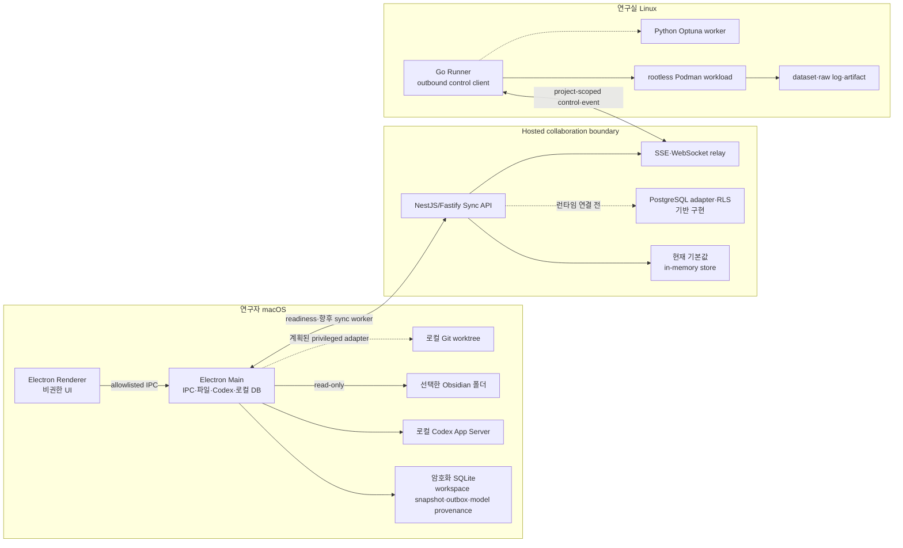
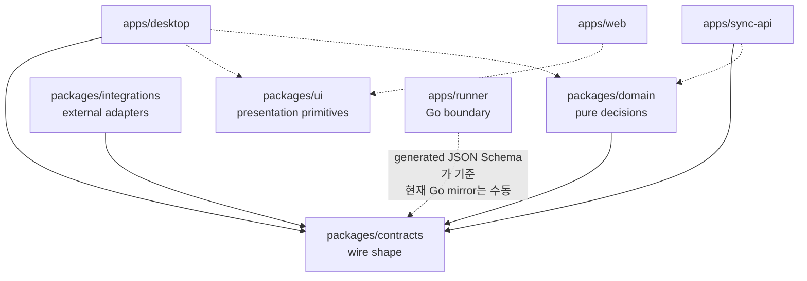
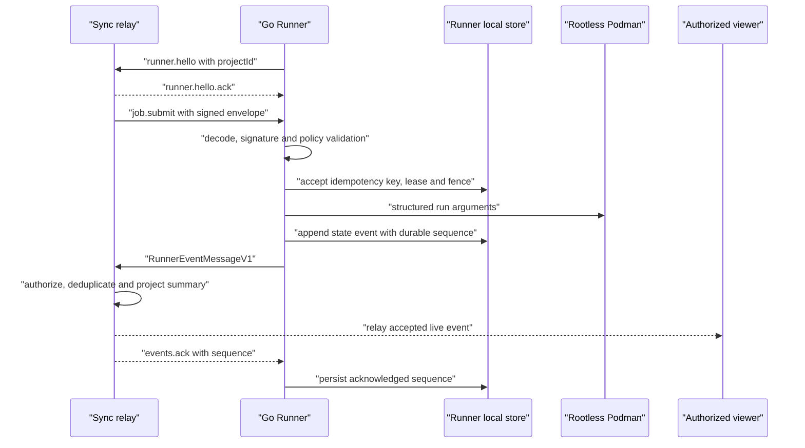
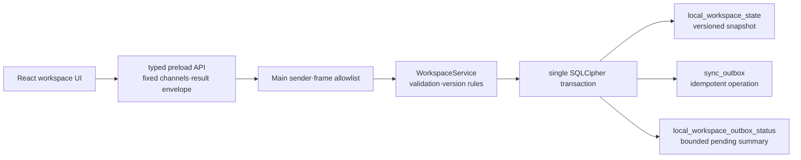

# GOSU 아키텍처 및 유지보수 가이드

이 문서는 GOSU의 장기적인 소프트웨어 경계와 변경 원칙을 정의한다. 현재 저장소의 실제
구현을 기준으로 작성했으며, 완성된 기능과 후속 계획을 구분한다. 제품 소개나 배포 절차보다
"어느 코드가 무엇을 소유하며, 변경이 다른 영역으로 번지지 않게 하려면 어떻게 해야 하는가"에
초점을 둔다.

## 1. 상태 표기

이 문서에서는 다음 표기를 사용한다.

- **구현됨**: 현재 기본 실행 경로에서 동작하고 자동 테스트가 있는 기능
- **기반 구현**: 계약, 정책, 저장소 어댑터 또는 UI가 있으나 제품 흐름 전체에는 연결되지 않은 기능
- **계획됨**: 목표 아키텍처에는 포함되지만 현재 코드로 실행할 수 없는 기능

GOSU는 현재 운영형 MVP의 기반 단계다. 비공개 연구 데이터, 실제 자격 증명 또는 비용이 큰
무인 실험을 맡길 수 있는 프로덕션 시스템으로 간주하면 안 된다.

## 2. 목표와 비목표

### 목표

- 연구 프로젝트, 목표·평가지표, 실험, 논문 작성·검토, 참고문헌, 노트와 강의 자료를 하나의
  프로젝트 범위에서 연결한다.
- 연구 원본은 가능한 한 기존 원본 시스템과 연구자의 장비에 남기는 local-first 구조를 유지한다.
- 외부 연동이나 실행기 장애가 Kanban, 로컬 문서, 다른 독립 모듈을 연쇄적으로 중단시키지 않게
  한다.
- 모든 위험한 자동화에 명시적인 계약, 예산, 승인, provenance와 되돌리기 경계를 둔다.
- 모델명과 외부 서비스의 세부 동작을 제품 도메인에 하드코딩하지 않고 provider·connector
  adapter 뒤에 둔다.
- 상태 변경은 낙관적 버전, idempotency key, lease와 fencing token으로 재시도와 중복 실행에
  견딜 수 있게 한다.

### 현재 비목표

- 연구 파일 전체를 GOSU Hosted Sync에 복제하는 것
- Windows·Linux 데스크톱, Slurm·Kubernetes 또는 wet-lab 장비 제어
- Overleaf·Obsidian·Zotero와의 양방향 동기화
- 실시간 공동 LaTeX 편집
- 보호 브랜치 병합, 근거 최종 채택 또는 외부 export를 사람 승인 없이 수행하는 것
- 현재 단계에서의 공개 인터넷 배포, 비용이 큰 무인 workload 또는 프로덕션 보안 보증

## 3. 실행 토폴로지와 신뢰 경계

핵심 경계는 다음과 같다.

1. Renderer는 신뢰하지 않는다. Node.js, 파일시스템, Git, SSH, Keychain, Codex 프로세스에 직접
   접근하지 못한다.
2. Hosted Sync는 협업 metadata의 원본일 수 있지만 연구 원문의 cloud mirror가 아니다.
3. Runner는 Hosted 환경에서 연산하지 않는다. 연구실이 운영하는 Linux 장비에서 outbound
   연결만 만들고, 로컬 정책이 허용한 서명 manifest만 실행한다.
4. 외부 서비스 자격 증명은 adapter 호출 시 로컬 secret provider에서 받는다. 계약, Git 이력,
   Hosted DB, event, URL 또는 로그에 값을 넣지 않는다.

## 4. 저장소 구조와 코드 소유권

| 경로                    | 소유 책임                                                                 | 현재 상태                                  |
| ----------------------- | ------------------------------------------------------------------------- | ------------------------------------------ |
| `apps/desktop`          | macOS 로컬 UI, privileged adapter, 암호화 local state, Codex·Vault 경계   | 실행 가능한 Project·Kanban·Objective slice |
| `apps/web`              | Owner·Lab 관리 경험                                                       | demo fixture 기반의 인터랙티브 UI          |
| `apps/sync-api`         | 인증·인가, 협업 command/query, SSE, Runner relay, Hosted persistence 경계 | memory runtime 구현, PostgreSQL 기반 구현  |
| `apps/runner`           | manifest 검증, lease/fence, container 실행, event spool, Stop·Kill        | 제한된 로컬 실행 경로 구현                 |
| `packages/contracts`    | 프로세스와 언어를 넘는 versioned wire schema                              | 구현됨                                     |
| `packages/domain`       | I/O 없는 상태 전이, 정책, 예산·불변성, version conflict 규칙              | 구현됨                                     |
| `packages/integrations` | GitHub·Zotero·Obsidian·Overleaf port와 제한된 adapter                     | 기반 구현                                  |
| `packages/ui`           | 공통 visual token과 작은 presentational primitive                         | 기반 구현                                  |
| `scripts`               | local Sync 준비 확인, Desktop process supervision, 환경 진단              | 구현됨                                     |

### 논리 모듈 소유권

제품 모듈은 아직 모두 독립 디렉터리로 분리되어 있지 않다. 새 기능은 아래 소유권을 기준으로
배치하고, 한 모듈이 다른 모듈의 저장 테이블을 직접 읽지 않게 한다.

| 논리 모듈                  | 현재 코드 소유자                                             | 구현 수준                                                                      |
| -------------------------- | ------------------------------------------------------------ | ------------------------------------------------------------------------------ |
| Identity & Lab             | `apps/sync-api/src/auth.ts`, memory store, PostgreSQL schema | JWT 검증과 개발 auth 구현; Google·Apple PKCE·초대는 계획됨                     |
| Project Portfolio & Kanban | Desktop workspace service, Sync controller/store             | 로컬 project 생성·선택과 task 생성·편집·이동 구현; Hosted 전달은 계획됨        |
| Goal & Evaluation          | Desktop workspace service, contracts, domain, Sync endpoints | 로컬 draft 저장·freeze·명시적 새 version 구현; 승인·Hosted 전달은 계획됨       |
| Experiment Orchestration   | contracts, domain, Runner                                    | signed job 실행 기반 구현; campaign scheduler와 완전한 optimizer 연동은 계획됨 |
| Manuscript                 | 향후 desktop workspace module                                | UI 표현만 존재; Git worktree·LaTeX compile·PDF preview는 계획됨                |
| Review & Approval          | PostgreSQL approval schema와 Web UI 표현                     | 기반 구현; 실제 review anchor·approval command는 계획됨                        |
| Reference                  | Zotero read-only connector                                   | metadata mirror primitives 구현; 앱 내 인용 흐름은 계획됨                      |
| Obsidian Knowledge         | Desktop Vault reader, Obsidian parser                        | 제한된 read-only Markdown 선택·읽기 구현                                       |
| Lecture                    | Owner Web UI 표현                                            | 생성·편집·출처 연결은 계획됨                                                   |
| AI Gateway                 | contracts와 Desktop Codex App Server                         | 로그인·catalog discovery 기반 구현; writing turn UI 흐름은 계획됨              |
| Integration Hub            | `packages/integrations` registry와 connector classes         | capability 선언과 제한된 호출 구현; 계정 연결 lifecycle은 계획됨               |
| Sync, Audit & Notification | Sync memory store, PostgreSQL audit·outbox schema            | 개발 relay 구현; production outbox publisher·Redis·notification은 계획됨       |

## 5. 의존성 규칙

다음 규칙은 기능 구현보다 우선한다.

- `packages/contracts`는 다른 GOSU workspace에 의존하지 않는다.
- `packages/domain`은 contracts만 의존하며 네트워크, 파일, DB, Electron, NestJS를 import하지 않는다.
- `packages/integrations`는 외부 API의 세부 형식을 소유한다. 앱이나 domain에 provider 응답 형식을
  노출하지 않는다.
- `packages/ui`는 도메인 command를 실행하거나 persistence를 소유하지 않는다.
- 앱은 공유 package에 의존할 수 있지만 앱끼리 source import하지 않는다. 통신은 versioned
  REST, SSE, WebSocket, IPC 또는 file/export contract를 사용한다.
- 다른 모듈의 테이블에 직접 SQL을 작성하지 않는다. 소유 모듈의 repository·port 또는 command를
  호출한다.
- domain 결정을 controller, React component, Electron IPC handler 또는 connector에 복제하지
  않는다.
- 새 외부 provider는 adapter가 필요하지만 새 모델은 필요하지 않다. 모델 ID는 opaque string으로
  유지하고 provider catalog에서 동적으로 읽는다.
- 계약을 우회하는 `any`, 임의 JSON, raw shell string 또는 암묵적 last-write-wins를 새 경계에
  도입하지 않는다.

현재 예외도 명시해야 한다. Runner의 Go manifest type은 생성물이 아니라 TypeScript schema를
수동으로 mirror한다. 따라서 contract drift test와 언어 간 fixture 검증이 필수이며, 장기적으로는
고정된 generator 또는 런타임 JSON Schema 검증으로 대체해야 한다.

## 6. 데이터 원본과 개인정보 경계

| 데이터                                           | authoritative source                                           | Hosted Sync 보관 정책                     |
| ------------------------------------------------ | -------------------------------------------------------------- | ----------------------------------------- |
| 코드, LaTeX, 생성된 `.bib`, 재현 설정, slide     | GitHub와 local worktree                                        | repository·branch·commit·PR metadata만    |
| 선택한 Markdown과 첨부                           | 사용자의 Obsidian Vault                                        | 연결 상태만; 본문은 금지                  |
| 서지 metadata, collection, PDF                   | Zotero                                                         | 연결 상태와 선택 item ID만; PDF 금지      |
| dataset, raw metric·log, checkpoint, artifact    | Linux Runner                                                   | 원본 금지; 상태와 명시적 summary metric만 |
| 프로젝트, Kanban, 보이는 대화, 승인, 감사        | 최종 목표는 Hosted Sync; 현재 Desktop slice는 암호화 로컬 원본 | 협업 metadata 저장 대상                   |
| Codex 인증, API key, SSH material, runner secret | Keychain·Codex credential store·runner secret store            | 금지                                      |
| tool payload, 파일 본문, shell 출력, raw diff    | 로컬 실행 문맥                                                 | 금지                                      |

`isSummary: true`인 Runner metric만 run summary projection에 들어간다. 그 외 metric point, log,
resource sample, artifact reference는 WebSocket으로 실시간 relay할 수 있지만 memory store도 값을
보존하지 않는다. 이 구분을 바꿀 때는 단순 schema 변경이 아니라 privacy·retention 설계 변경으로
취급한다.

Owner의 가시성도 tenant 범위 안에서만 적용된다. Owner는 동기화된 상태, 보이는 대화, 승인과
감사를 볼 수 있지만 다른 사용자의 secret, 로컬 Vault 본문, repository 원문 또는 Runner 원본을
볼 권한을 얻지 않는다.

현재 Desktop의 Project·Kanban·Objective vertical slice는 Hosted delivery worker가 연결되기 전에도
쓸 수 있도록 암호화 SQLite를 실행 원본으로 사용한다. 이는 장기적인 협업 authority를 바꾼 것이
아니다. 각 로컬 mutation은 optimistic entity version을 확인하고 workspace snapshot과 idempotent
outbox operation을 같은 transaction에 기록한다. delivery가 구현되기 전 UI의 pending 표시는
“로컬에 안전하게 대기 중”만 의미하며, 서버 반영이나 다른 사용자와의 동기화를 의미하지 않는다.

## 7. 계약과 이벤트 흐름

### 계약의 원본

- Zod source는 `packages/contracts/src`에 둔다.
- Draft-07 JSON Schema는 `packages/contracts/generated/json-schema`에 생성해 commit한다.
- 생성 파일은 직접 수정하지 않는다.
- 깨지는 변경은 기존 version을 재해석하지 말고 새 version을 만든다. 배포된 producer와 consumer가
  공존하는 기간에는 dual-read 또는 명시적인 upcaster를 둔다.
- untrusted input은 contract parse 후 domain rule을 적용하고, 그 다음 persistence·side effect를
  수행한다.

주요 공개 계약은 동적 model catalog, objective·budget, `JobManifestV1`,
`RunnerEventV1`·`RunnerEventMessageV1`, `SyncEventV1`, connector capability다.

### 협업 command 흐름

1. client는 project 범위, `expectedVersion`, idempotency key를 포함한 command를 보낸다.
2. API가 인증과 lab·project·role authorization을 수행한다.
3. Zod가 wire shape를 검증하고 domain이 상태 전이·불변성을 판단한다.
4. repository가 상태, audit와 outbox를 하나의 transaction으로 기록한다.
5. publisher가 commit된 outbox event를 전달한다.
6. client는 entity version을 확인해 local cache를 갱신한다. conflict는 덮어쓰지 않고 사용자 또는
   command-specific resolver에 반환한다.

현재 memory store는 1–3단계의 일부, idempotency, optimistic version과 in-process event emit을
구현한다. 4–5단계의 production 경로는 PostgreSQL adapter와 schema까지만 있으며 Nest runtime에는
연결되지 않았다.

### Runner event 흐름

Runner delivery는 at-least-once다. Sync는 `projectId + runnerId + eventId` fingerprint로 exact
duplicate를 제거하고, attempt별 sequence projection에서 stale event를 거절한다. ACK는 수신한
durable sequence를 가리킨다. invalid manifest는 lineage가 없으므로 spool event를 만들지 않는다.

## 8. Desktop 보안 모델

현재 구현된 보안 불변식은 다음과 같다.

- `contextIsolation: true`, `nodeIntegration: false`, `sandbox: true`를 유지한다.
- preload는 작은 `window.gosu` API만 노출한다. arbitrary IPC channel이나 raw Electron object를
  노출하지 않는다.
- Main은 sender가 현재 window의 exact main frame이며 신뢰한 production file URL 또는 설정된
  development origin인지 매 IPC 호출마다 확인한다. development origin은 명시적 port를 가진
  loopback HTTP(S)만 허용하며 packaged build는 `ELECTRON_RENDERER_URL` override를 무시한다.
- navigation과 redirect는 신뢰한 renderer URL 밖으로 나가지 못한다. 새 창은 거부하고 HTTPS
  링크만 system browser로 연다.
- packaged CSP는 script와 connection을 same-origin으로 제한하고 object·frame·base를 차단한다.
  Vite 개발 모드에서만 exact trusted origin의 inline refresh bootstrap과 HMR WebSocket을 허용한다.
- SQLite key는 random 32-byte 값이며 `safeStorage`로 봉인한다. 암호화 기능이 없으면 local DB를
  열지 않는다.
- Obsidian reader는 사용자가 고른 root 아래의 bounded Markdown만 읽는다. symlink, root escape,
  과도한 파일 크기·개수·깊이를 거부한다.
- Codex child는 허용된 최소 환경만 상속하고 stdio JSON-RPC로 initialize한다. 인증은 로컬 Codex
  credential store에 남고 Hosted Sync로 보내지 않는다.
- model picker는 `model/list` 결과를 사용하며 catalog snapshot, resolved model ID와 reasoning
  option을 provenance로 기록할 수 있다.

### 현재 로컬 workspace 흐름

- Renderer는 project·task·objective별 typed command만 호출한다. 임의 channel이나 generic cache
  조회 API는 노출하지 않는다.
- Main의 workspace handler는 예상 가능한 validation·version·recovery 실패를 reject하지 않고
  제한된 result envelope로 resolve한다. Preload가 이를 Renderer의 로컬 `Error`로 바꾸므로 Electron
  내부 오류 로거가 project 입력이나 local path를 Main console에 출력하지 않는다. IPC boundary에서
  command input을 먼저 검증해 입력 오류와 persisted snapshot recovery 오류를 구분한다.
- IPC DTO와 Zod schema는 `apps/desktop/src/shared/workspace-contracts.ts`, runtime 상태 DTO는
  `apps/desktop/src/shared/runtime-contracts.ts`가 소유한다. Renderer와 Preload는 privileged Main
  구현을 import하지 않고 이 shared contract의 type만 사용한다.
- `WorkspaceService`는 untrusted payload와 persisted snapshot을 Zod로 검증하고 mutation을 직렬화한다.
- 각 task와 objective는 entity version을 가지며 stale command는 conflict로 끝난다. 자동 merge나
  last-write-wins는 수행하지 않는다.
- workspace 전체 revision은 성공한 mutation마다 증가한다. commit이 실패하면 in-memory snapshot도
  갱신하지 않는다. SQL transaction은 persisted revision이 정확히 이전 revision일 때만 snapshot을
  CAS 갱신하므로 예외적으로 두 DB connection이 겹쳐도 같은 revision이 서로를 덮어쓰지 못한다.
- 동일한 revision을 outbox operation의 durable `workspaceRevision`으로 기록하고 pending command는
  이 값으로 정렬한다. 같은 millisecond에 기록된 create→update 또는 save→freeze가 UUID 순서로
  뒤집히지 않는다.
- sequence 도입 전 local row는 open migration에서 기존 insertion `rowid` 순서를 한 번만
  `workspaceRevision` column과 정상 operation JSON에 backfill하고, 이후에는 그 durable 값을 사용한다.
  파싱할 수 없는 operation payload는 삭제하거나 재작성하지 않고 opaque provenance로 그대로 보존한다.
  기존 revision과 row 순서가 모순되는 partial migration은 임의로 재번호를 만들지 않고 queue만
  recovery-required로 막는다. 이때 snapshot과 기존 Board 읽기는 계속 가능하다.
- UI는 outbox payload 전체를 받지 않는다. transaction에서 함께 갱신되는 singleton summary의
  pending count와 latest revision만 고정 크기 IPC로 읽는다. summary 오류는 snapshot 로딩과
  격리되어 정상 project·task·objective를 숨기지 않는다. 앱을 열 때와 summary를 읽을 때 실제
  outbox row에서 singleton을 다시 계산해 누락되거나 불일치하는 legacy summary를 복구한다.
- project별 task 접근을 검사해 다른 project ID를 통한 수정은 거절한다.
- objective freeze는 현재 단일 사용자 로컬 불변성 기능이다. Owner 승인이나 RBAC 승인으로 해석하면
  안 되며, 변경하려면 명시적으로 다음 objective version을 시작해야 한다.
- 이 slice에는 outbox delivery, conflict reconciliation, 로그인·연구실 RBAC가 아직 없다. 따라서
  pending operation을 synced로 표시하지 않는다.

### 로컬 실행과 패키징 경로

`pnpm app:dev`는 일반적인 workspace 병렬 실행과 별개의 사용자용 local slice다.
package script의 shell은 `exec`로 supervisor에 교체되어 terminal signal을 중간에서 소비하지 않는다.

1. `GOSU_SYNC_API_URL`을 credential·path가 없고 port가 명시된 loopback HTTP base URL로 검증한다.
2. 고정된 `/v1/health/ready`에서 service identity와 readiness를 확인한다.
3. 건강한 기존 GOSU Sync가 없으면 loopback memory Sync를 시작하고 준비 완료까지 기다린다. 같은
   port에서 다른 서비스가 응답하면 충돌로 중단한다.
4. 준비된 base URL만 Electron Main에 전달하고 Desktop을 시작한다.
5. Desktop이 끝나거나 `Ctrl+C`를 받으면 진행 중인 probe/readiness를 취소하고 이후 child 생성을
   차단한 뒤 소유한 process group을 종료해 watcher와 Electron helper가 남지 않게 한다.

Desktop Main은 single-instance lock을 먼저 획득한다. 같은 user data를 사용하는 두 앱이 동시에
SQLCipher workspace를 열지 않으며 두 번째 실행은 기존 창만 앞으로 가져온다. terminal이나 상위
process가 사라진 뒤 `stdout`·`stderr`가 닫혀도 `EIO`·`EPIPE`만 제한적으로 흡수해 진단 출력의
연쇄 crash를 막고, 그 밖의 process output 오류는 그대로 실패시킨다. 개발 launcher가 비정상
종료되어 signal cleanup을 실행하지 못한 경우에도 Desktop은 supervisor PID liveness를 확인해 고아
DB writer로 남지 않는다.

`pnpm app:doctor`는 Node, macOS target, workspace 의존성, Electron·Codex package와 local port를
비밀값 없이 검사한다. `pnpm app:package`는 전체 품질 게이트 후 unsigned DMG를 만든다. DMG는
Hosted Sync가 없어도 local-first 기능과 runtime 상태를 표시하며, 실제 배포용 서명·notarization과
update channel은 아직 없다. `afterPack` hook은 Electron 기본 plist에서 사용하지 않는 카메라,
마이크, Bluetooth 권한 설명을 제거하고 arbitrary network load를 끈 뒤 loopback 예외만 유지한다.

현재 한계도 중요하다. local outbox table은 존재하지만 Sync delivery·reconciliation worker는 아직
없다. Codex thread·turn primitive는 Main에 있으나 renderer의 실제 논문 작성 흐름과 patch approval
UI에는 아직 연결되지 않았다. Git, SSH, Keychain connector, LaTeX compile, PDF preview도 계획
상태다. DMG 설정은 있으나 서명·notarization·auto-update를 보증하지 않는다.

IPC 기능을 추가할 때는 preload type, argument schema, Main sender 검증, 최소 반환값, 실패 테스트를
한 묶음으로 변경한다. Renderer 편의를 이유로 filesystem path나 secret 값을 넓게 반환하면 안 된다.

## 9. Sync API 수명주기

### HTTP와 SSE

- `/v1/health/live`와 `/v1/health/ready`만 인증 없이 고정된 비민감 상태를 반환한다. 그 외 요청은
  global auth guard를 통과한다.
- development auth는 lab·subject·role header 세 개를 모두 요구하고 production 환경에서 거부된다.
- OIDC mode는 이미 발급된 GOSU JWT의 issuer, audience, expiration, lab과 role claim을 검증한다.
  Google·Apple login이나 session issuance를 구현한 것은 아니다.
- controller는 lab·project 확인 후 role별 command 권한을 검사한다.
- SSE는 현재 in-process memory event를 lab 기준으로 filter한다. durable resume stream이 아니다.

### WebSocket relay

- browser는 exact Origin allowlist를 통과해야 한다.
- Origin이 없는 native peer는 `x-gosu-client-kind: runner`를 선언하고 동일한 인증을 통과해야 한다.
- runner는 `runner.hello`로 project를 고정하고 Owner 또는 Project Lead 권한으로만 publish한다.
- viewer subscription과 runner publish는 서로 다른 client kind로 격리한다.
- payload는 제한되며 compression은 꺼져 있고, send buffer가 한도를 넘는 느린 viewer는 끊는다.
- relay는 raw payload를 로그에 남기지 않고 일반화된 거절 사유만 기록한다.

현재 runtime repository는 항상 memory store다. 지원하지 않는 `GOSU_PERSISTENCE` 값은 memory로
fallback하지 않고 시작 단계에서 거부한다. PostgreSQL migration과 adapter에는 tenant context,
forced RLS, optimistic version,
idempotency, approval, audit와 transactional outbox 기반이 있지만 bootstrap wiring, migration
운영, Redis coordination, outbox publisher와 실제 장애 복구 검증은 남아 있다.

## 10. Runner 수명주기와 실행 정책

### 시작과 연결

- 기본값은 execution disabled이며 control URL이 없으면 control client도 disabled다.
- control을 켜면 runner와 project ID가 필요하다. loopback `ws://` 개발 연결은 lab header를
  명시하고, non-loopback은 `wss://`만 허용한다.
- 현재 Node relay가 runner mTLS를 종료하거나 검증하지 않는다. production ingress와 workload
  identity는 계획 상태다.
- 연결이 끊기면 client는 backoff로 재연결하고 미확인 spool event를 재전송한다. 실행 중인
  workload는 main process context가 살아 있는 한 계속되지만 새 remote job은 받을 수 없다.

### 제출과 실행

1. strict JSON envelope와 만료되지 않은 lease를 decode한다.
2. manifest hash와 Ed25519 signature를 검증한다.
3. local policy version·hash, image digest, executable, mount, secret reference, CPU·memory·GPU·시간과
   objective GPU-hour budget을 검증한다.
4. idempotency key와 fencing token을 local atomic store에 기록한다.
5. rootless Podman command를 shell 없이 argument array로 구성한다.
6. lifecycle을 local store에 기록하고 project·campaign·trial·attempt lineage가 있는 event를 durable
   spool에 append한다.
7. shared state event로 변환해 Sync로 보내고 ACK sequence를 저장한다.

현재 workload는 non-root user, no-new-privileges, all capability drop, read-only root filesystem,
PID·CPU·memory limit과 `--network=none`을 사용한다. workspace만 제한적으로 read-write mount한다.
host mount, container socket, privileged 실행, shell executable과 inline secret-like argument를
거부한다. dataset·scratch resolver는 아직 없으며, network allowlist도 enforceable egress adapter가
없으므로 설정과 manifest 양쪽에서 fail-closed로 거부한다.

GPU는 기본 비활성이다. 운영자가 구체적인 NVIDIA CDI selector를 허용하고 VRAM 선언 상한과
GPU-hour budget을 설정한 경우에만 선택된 device를 전달한다. VRAM 값은 admission guardrail이지
하드웨어 partition 보증이 아니므로 엄격한 격리가 필요하면 MIG 같은 별도 수단이 필요하다.

### 상태와 제어

공유 trial 상태는 `pending → leased → running → terminal`을 기본으로 하며 `lost`는 reconciliation
후에만 복구할 수 있다. Runner 내부에는 container 제어를 위해 accepted, queued,
stop_requested, kill_requested 같은 세부 상태가 추가로 있다. 외부로 보낼 때는 versioned shared
state로 명시적으로 변환한다.

Stop은 queued workload를 종료하거나 실행 중 container에 grace를 주고, Kill은 즉시 container를
종료한다. 둘 다 exact current lease와 fence를 요구하고 replay는 no-op이다. superseded lease의
workload는 먼저 kill하여 중복 GPU 실행을 막는다.

현재 빠진 운영 기능은 repository checkout, artifact upload, secret materialization 검증,
active-container host-crash reconciliation, cross-process state lock, production enrollment와 완전한
optimizer scheduling이다.

## 11. 장애 격리 원칙

| 장애                               | 유지되어야 하는 기능                  | 처리 원칙                                                                      |
| ---------------------------------- | ------------------------------------- | ------------------------------------------------------------------------------ |
| Codex unavailable                  | local cache, Vault reader, project UI | provider 상태를 실패로 표시하고 다른 모듈을 중단하지 않는다                    |
| GitHub·Zotero·Overleaf unavailable | 로컬 문서와 Kanban                    | connector별 timeout·retry·error를 port 뒤에 격리한다                           |
| Hosted Sync unavailable            | 로컬 편집과 승인 전 작업              | command를 versioned outbox에 두고 재연결 시 conflict를 명시적으로 처리한다     |
| Runner disconnect                  | 현재 trial의 제한된 완료              | 기본적으로 새 trial은 시작하지 않고 spool event를 보존한다                     |
| duplicate event                    | 기존 projection                       | fingerprint와 idempotency 결과를 재사용하고 side effect를 반복하지 않는다      |
| out-of-order event                 | 현재 attempt projection               | stale로 거절하고 ACK·reconciliation 정책을 혼합하지 않는다                     |
| lease expiry·fence conflict        | 유효한 현재 workload                  | 즉시 재실행하지 않고 상태를 조회·조정한다                                      |
| malformed·secret-like payload      | 다른 정상 요청                        | 경계에서 거부하고 원문을 log·spool·telemetry에 남기지 않는다                   |
| PostgreSQL·Redis 장애              | 로컬 앱과 Runner 원본                 | Hosted command를 실패시키되 연구 payload를 임시 cloud 저장소로 우회하지 않는다 |

"fallback"은 보안 또는 provenance를 약화시키는 자동 대체를 의미하지 않는다. 예를 들어 선택한
model이 catalog에서 사라지면 다른 model로 조용히 바꾸지 않고 실행을 중단한다. Git base SHA가
달라져도 자동 merge·rebase하지 않는다. metric·dataset·budget 변경은 기존 objective를 수정하지
않고 새 version과 승인을 요구한다.

## 12. 테스트와 CI

### 로컬 품질 게이트

`pnpm check`는 formatting, contract drift, lint, TypeScript typecheck, test와 build를 순서대로
실행한다. Turbo는 workspace dependency의 build를 먼저 수행하고 root test는 local launcher의 URL,
service identity와 readiness retry 규칙을 검증한다. 특정 package를 변경해도 PR 전에는 전체 gate를
실행한다.

macOS에서 `pnpm --filter @gosu/desktop smoke:local-db:mac`을 실행하면 Electron ABI의 실제
SQLCipher와 `safeStorage`를 사용해 workspace commit, encrypted file header, close/reopen 복구,
duplicate idempotency key에 의한 transaction rollback과 outbox summary 일관성을 검증한다. 두
SQLCipher connection의 동일 revision 경합, 실제 v0.1 outbox schema migration, 손상된 singleton
summary 재구성, 해석 불가능한 operation payload의 byte-for-byte 보존도 포함한다. 이 검사는 native
ABI와 Keychain 구현이 다른 Linux CI의 일반 Vitest 경로와 분리한다.

Runner는 별도 Go module이다. 최소 검증은 다음과 같다.

- `gofmt` 결과가 깨끗한지 확인
- `go test -race ./...`
- `go vet ./...`
- Linux binary build
- Python optimizer syntax compile

### GitHub Actions

- CI matrix: `format:check`, `contracts:check`, lint, typecheck, test, build
- Runner job: formatting, race test, vet, build, optimizer syntax
- Security workflow: 전체 Git 이력 secret scan, PR dependency review
- Actions는 최소 `contents: read` 권한과 commit SHA로 고정된 action을 사용한다.
- Dependabot은 npm, Go module과 GitHub Actions를 주 단위로 확인한다.

### 변경별 필수 테스트

- contract 변경: Zod parse, generated-schema drift, consumer fixture, Go mirror wire shape
- domain 변경: 정상 전이, 금지 전이, replay no-op, immutable field와 budget 경계
- API 변경: schema, lab·project isolation, 모든 role, idempotency conflict, version conflict
- relay 변경: Origin·native runner 인증, project isolation, duplicate·stale, backpressure, retention
- Desktop IPC 변경: trusted sender, untrusted frame, path escape, 크기 제한, secret 비노출
- Runner 변경: signature·policy rejection, fence race, Stop·Kill race, exact JSON wire, Podman argument
  array와 fail-closed 설정
- connector 변경: deterministic fake response, capability 정확성, credential·원문 미저장

현재 빠진 검증은 실제 PostgreSQL·Redis runtime integration, process restart·outbox recovery,
실제 Podman GPU workload, macOS clean-machine OAuth·permission·notarization·update, 외부 connector
sandbox, 그리고 목표부터 논문·export·lecture까지의 최종 E2E다.

## 13. ADR 원칙

다음 변경은 구현 전에 Architecture Decision Record를 작성한다.

- 새 Hosted 데이터 종류 또는 retention 변경
- 새 프로세스·서비스·database·queue 도입
- module ownership이나 dependency direction 변경
- 인증·암호화·secret·network·mount·container 권한 변경
- contract의 breaking change 또는 state machine 의미 변경
- 새로운 AI provider, 자동 승인 범위 또는 무인 실행 범위
- canonical source나 conflict 정책 변경

ADR은 `docs/adr/NNNN-short-title.md` 형식을 권장하며 다음 항목을 포함한다.

1. Context와 해결할 문제
2. Decision과 명확한 범위
3. 검토한 alternatives
4. security·privacy·cost·migration 영향
5. rollout, rollback과 관측 방법
6. 구현·테스트 완료 조건

ADR은 현재 동작을 숨기는 계획 문서가 아니다. 결정이 구현되지 않았다면 상태를 Proposed로 두고,
구현 후 Accepted, 대체되면 Superseded로 변경한다.

## 14. 안전한 변경 레시피

### 새 command 또는 event 추가

1. 소유 모듈과 data authority를 정한다.
2. contracts에 versioned schema와 최소 payload를 추가한다.
3. domain에 순수한 authorization 외 결정과 상태 전이를 추가한다.
4. repository transaction에 state, audit, outbox를 함께 기록한다.
5. producer retry와 consumer idempotency를 정의한다.
6. 다른 lab·project, duplicate, stale, restart 테스트를 추가한다.

### contract 변경

1. additive·optional인지 breaking인지 판정한다.
2. breaking이면 새 version을 만들고 migration 기간의 reader 전략을 기록한다.
3. Zod source를 수정하고 JSON Schema를 생성한다.
4. Desktop, Sync, Runner, fixture를 한 PR에서 맞춘다.
5. generated file을 수동 편집하지 말고 `generate:check`를 통과시킨다.

### Hosted 필드 추가

1. 해당 값이 협업 metadata인지 먼저 증명한다.
2. source, note body, raw log·metric, artifact, secret 또는 hidden tool payload면 추가하지 않는다.
3. tenant·project authorization, RLS, retention, backup, log·trace 노출을 검토한다.
4. safe-payload 검사와 negative test를 추가한다.
5. PostgreSQL adapter를 runtime에 연결하기 전 memory와 PostgreSQL semantics를 동일하게 만든다.

### Runner capability 추가

1. threat model과 승인 주체를 ADR에 기록한다.
2. manifest contract, signature 범위, local policy, concrete executor에 각각 방어층을 둔다.
3. policy version·hash와 objective budget에 capability를 고정한다.
4. broad selector, privilege escalation, host escape와 secret leak의 negative test를 먼저 작성한다.
5. 실행 실패 시 안전한 상태와 reconciliation 절차를 정의한다.

특히 network는 Podman에 단순 bridge를 켜는 것으로 구현하지 않는다. DNS·IP·redirect·IPv6까지
enforce하고 감사할 수 있는 egress adapter가 생기기 전에는 계속 `none`으로 유지한다.

### LLM provider 또는 model 기능 추가

1. `LLMProviderAdapter`를 구현하고 provider credential은 로컬 provider store에 둔다.
2. model ID를 enum으로 만들지 않고 catalog 결과를 그대로 다룬다.
3. 실행마다 requested·resolved model, catalog version과 reasoning option을 기록한다.
4. catalog refresh 실패와 model disappearance를 명시적으로 처리한다.
5. AI 출력은 patch 또는 staging commit으로 만들고 승인 gate를 우회하지 않는다.

### connector 추가

1. capability를 실제 지원 수준으로 선언한다.
2. credential provider와 connector를 분리한다.
3. canonical source, sync direction, cursor·idempotency, rate limit을 문서화한다.
4. 장애가 다른 connector와 core project command에 전파되지 않게 timeout과 error mapping을 둔다.
5. fixture에는 실제 연구 원문, repository private URL 또는 token을 넣지 않는다.

## 15. 알려진 공백과 우선순위

### 프로덕션 전 필수

- Google·Apple OIDC/PKCE, invitation, membership, session issuance와 account linking
- PostgreSQL runtime wiring, migration 운영, Redis coordination와 transactional outbox publisher
- trusted ingress의 TLS·runner mTLS·service credential과 proxy spoofing 방어
- Desktop sync worker, offline command replay와 사람이 이해할 수 있는 conflict UI
- GitHub App 설치·token lifecycle, Git worktree·patch·base-SHA gate
- LaTeX editor·Tectonic compile·PDF preview·review anchor·citation provenance
- Runner enrollment, repository materialization, dataset·scratch resolver, artifact reference·upload,
  restart reconciliation
- bounded/full Autopilot approval와 manuscript evidence gate
- DMG signing, notarization, auto-update와 clean-machine test
- 실제 cross-application E2E와 장애 주입 테스트

### 구현과 문서가 어긋나기 쉬운 지점

- PostgreSQL adapter가 존재한다는 것과 실제 API가 PostgreSQL을 사용한다는 것은 다르다.
- UI에 보이는 버튼·차트가 실제 command나 experiment를 수행한다는 뜻은 아니다.
- Codex class에 turn method가 있다는 것과 renderer writing workflow가 연결됐다는 것은 다르다.
- connector class가 있다는 것과 사용자의 OAuth 연결·증분 sync가 완성됐다는 것은 다르다.
- macOS package 설정이 있다는 것과 배포 artifact가 서명·notarization됐다는 것은 다르다.
- manifest에 `allowlist` enum이 있다는 것과 Runner network 실행이 허용된다는 것은 다르다. 현재는
  명시적으로 거부된다.

## 16. 유지보수 체크리스트

### 모든 PR

- [ ] 변경의 소유 모듈과 authoritative source가 명확한가?
- [ ] 다른 앱·모듈의 persistence를 직접 읽지 않는가?
- [ ] untrusted input을 contract로 parse한 뒤 domain rule을 적용하는가?
- [ ] lab·project·role authorization이 command, query, search, stream 모두에 있는가?
- [ ] optimistic version, idempotency, replay와 conflict semantics가 정의됐는가?
- [ ] secret, 연구 원문, raw output가 DB·event·log·fixture에 들어가지 않는가?
- [ ] 실패·cancel·negative result provenance가 사라지지 않는가?
- [ ] 외부 장애가 독립 모듈을 막지 않는가?
- [ ] 구현 상태와 계획 상태를 README·architecture에서 정확히 구분했는가?
- [ ] 전체 `pnpm check`와 해당 runtime의 추가 gate를 통과했는가?

### contract와 state 변경

- [ ] version 호환성과 rollout 순서를 기록했는가?
- [ ] generated JSON Schema와 모든 consumer fixture가 갱신됐는가?
- [ ] duplicate, stale, out-of-order와 restart를 테스트했는가?
- [ ] state 전이가 한 곳의 domain rule로 유지되는가?

### 보안 경계 변경

- [ ] renderer 권한, IPC sender, CSP 또는 external navigation이 넓어지지 않았는가?
- [ ] Runner privilege, mount, network, secret, image·command allowlist가 fail-closed인가?
- [ ] credential이 URL, process argument, event 또는 진단 로그로 이동하지 않는가?
- [ ] 승인·budget·metric·dataset·base-SHA gate를 개발 모드에서도 우회하지 않는가?
- [ ] 새 Hosted 데이터에 RLS, retention, backup과 telemetry 검토가 있는가?

### 릴리스 전

- [ ] release revision의 CI·security check가 모두 성공했는가?
- [ ] 실제 production adapter와 설정이 문서의 주장과 일치하는가?
- [ ] migration rollback과 outbox drain·replay를 검증했는가?
- [ ] runner 중복 실행·Lost reconciliation·Stop·Kill 경합을 검증했는가?
- [ ] clean macOS 설치, OAuth, Keychain, folder permission, signing, notarization, update를 검증했는가?
- [ ] synthetic data E2E가 목표 설정부터 experiment, review, merge, export, lecture까지 통과하는가?

이 체크리스트를 통과하지 못한 기능은 UI에 존재하더라도 production-ready로 표기하지 않는다.
