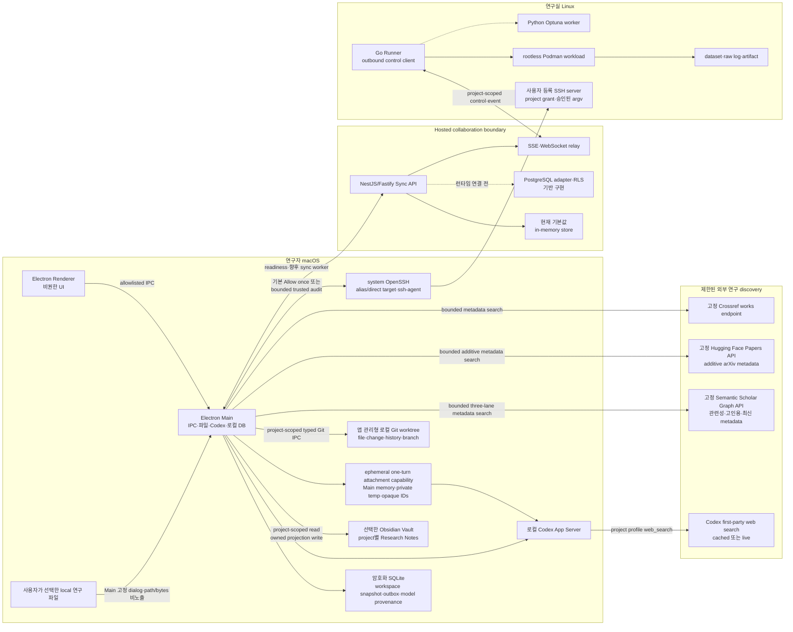
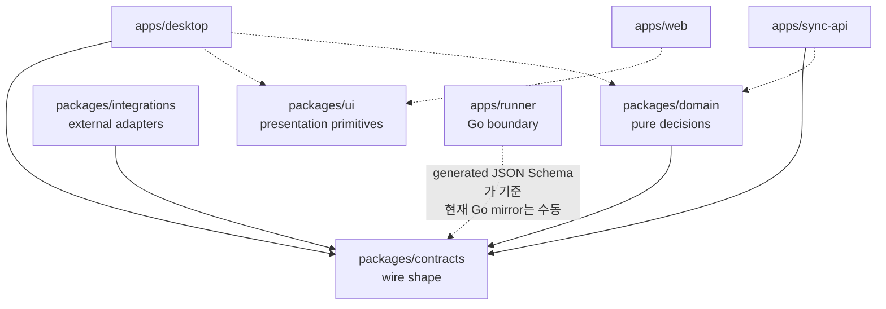
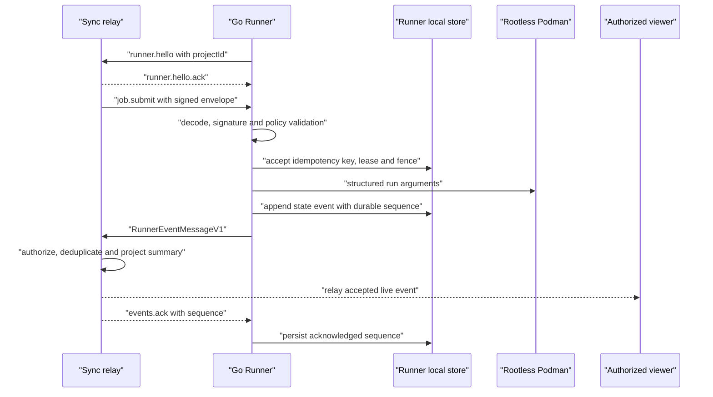
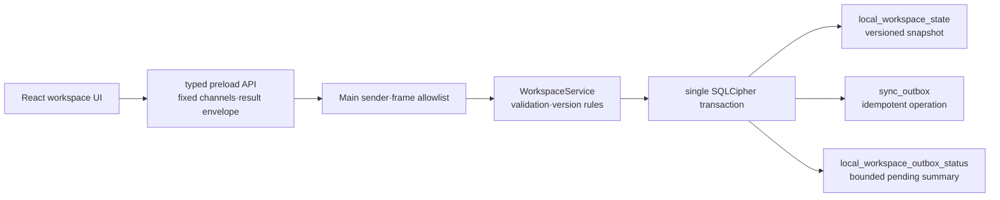
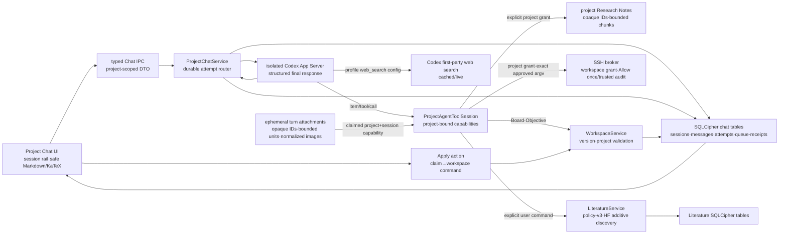
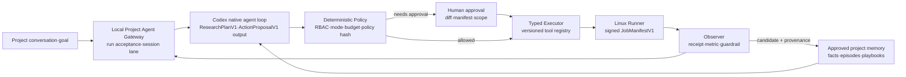

# GOSU 아키텍처 및 유지보수 가이드

이 문서는 GOSU의 장기적인 소프트웨어 경계와 변경 원칙을 정의한다. 현재 저장소의 실제
구현을 기준으로 작성했으며, 완성된 기능과 후속 계획을 구분한다. 제품 소개나 배포 절차보다
"어느 코드가 무엇을 소유하며, 변경이 다른 영역으로 번지지 않게 하려면 어떻게 해야 하는가"에
초점을 둔다.

## 1. 상태 표기

이 문서에서는 다음 표기를 사용한다.

- **구현됨**: 현재 기본 실행 경로에서 동작하고 자동 테스트가 있는 기능
- **기반 구현**: 계약, 정책, 저장소 어댑터 또는 UI가 있으나 제품 흐름 전체에는 연결되지 않은 기능
- **계획됨**: 목표 아키텍처에는 포함되지만 현재 코드로 실행할 수 없는 기능

GOSU는 현재 운영형 MVP의 기반 단계다. 비공개 연구 데이터, 실제 자격 증명 또는 비용이 큰
무인 실험을 맡길 수 있는 프로덕션 시스템으로 간주하면 안 된다.

## 2. 목표와 비목표

### 목표

- 연구 프로젝트, 목표·평가지표, 실험, 논문 작성·검토, 참고문헌과 노트는 project 범위에서
  연결하고, 강의 자료는 여러 project를 선택할 수 있는 workspace 범위에서 합성한다.
- 연구 원본은 가능한 한 기존 원본 시스템과 연구자의 장비에 남기는 local-first 구조를 유지한다.
- 외부 연동이나 실행기 장애가 Kanban, 로컬 문서, 다른 독립 모듈을 연쇄적으로 중단시키지 않게
  한다.
- 모든 위험한 자동화에 명시적인 계약, 예산, 승인, provenance와 되돌리기 경계를 둔다.
- 모델명과 외부 서비스의 세부 동작을 제품 도메인에 하드코딩하지 않고 provider·connector
  adapter 뒤에 둔다.
- 상태 변경은 낙관적 버전, idempotency key, lease와 fencing token으로 재시도와 중복 실행에
  견딜 수 있게 한다.

### 현재 비목표

- 연구 파일 전체를 GOSU Hosted Sync에 복제하는 것
- Windows·Linux 데스크톱, Slurm·Kubernetes 또는 wet-lab 장비 제어
- Overleaf·Obsidian·Zotero와의 양방향 동기화
- 실시간 공동 LaTeX 편집
- 보호 브랜치 병합, 근거 최종 채택 또는 외부 export를 사람 승인 없이 수행하는 것
- 현재 단계에서의 공개 인터넷 배포, 비용이 큰 무인 workload 또는 프로덕션 보안 보증

## 3. 실행 토폴로지와 신뢰 경계

핵심 경계는 다음과 같다.

1. Renderer는 신뢰하지 않는다. Node.js, 파일시스템, Git, SSH, Keychain, Codex 프로세스에 직접
   접근하지 못한다.
2. Hosted Sync는 협업 metadata의 원본일 수 있지만 연구 원문의 cloud mirror가 아니다.
3. Runner는 Hosted 환경에서 연산하지 않는다. 연구실이 운영하는 Linux 장비에서 outbound
   연결만 만들고, 로컬 정책이 허용한 서명 manifest만 실행한다.
4. 외부 서비스 자격 증명은 adapter 호출 시 로컬 secret provider에서 받는다. 계약, Git 이력,
   Hosted DB, event, URL 또는 로그에 값을 넣지 않는다.

## 4. 저장소 구조와 코드 소유권

| 경로                    | 소유 책임                                                                       | 현재 상태                                                                                       |
| ----------------------- | ------------------------------------------------------------------------------- | ----------------------------------------------------------------------------------------------- |
| `apps/desktop`          | macOS 로컬 UI, privileged adapter, 암호화 local state, Codex·Vault·Git·SSH 경계 | 실행 가능한 Project Chat·Kanban·Objective·Repository·Literature·Lecture Studio·승인형 SSH slice |
| `apps/web`              | Owner·Lab 관리 경험                                                             | demo fixture 기반의 인터랙티브 UI                                                               |
| `apps/sync-api`         | 인증·인가, 협업 command/query, SSE, Runner relay, Hosted persistence 경계       | memory runtime 구현, PostgreSQL 기반 구현                                                       |
| `apps/runner`           | manifest 검증, lease/fence, container 실행, event spool, Stop·Kill              | 제한된 로컬 실행 경로 구현                                                                      |
| `packages/contracts`    | 프로세스와 언어를 넘는 versioned wire schema                                    | 구현됨                                                                                          |
| `packages/domain`       | I/O 없는 상태 전이, 정책, 예산·불변성, version conflict 규칙                    | 구현됨                                                                                          |
| `packages/integrations` | GitHub·Zotero·Obsidian·Overleaf port와 제한된 adapter                           | 기반 구현                                                                                       |
| `packages/ui`           | 공통 visual token과 작은 presentational primitive                               | 기반 구현                                                                                       |
| `scripts`               | local Sync 준비 확인, Desktop process supervision, 환경 진단                    | 구현됨                                                                                          |

### 논리 모듈 소유권

제품 모듈은 아직 모두 독립 디렉터리로 분리되어 있지 않다. 새 기능은 아래 소유권을 기준으로
배치하고, 한 모듈이 다른 모듈의 저장 테이블을 직접 읽지 않게 한다.

| 논리 모듈                  | 현재 코드 소유자                                                                | 구현 수준                                                                                                                                                                                                                                                                                              |
| -------------------------- | ------------------------------------------------------------------------------- | ------------------------------------------------------------------------------------------------------------------------------------------------------------------------------------------------------------------------------------------------------------------------------------------------------ |
| Identity & Lab             | `apps/sync-api/src/auth.ts`, memory store, PostgreSQL schema                    | JWT 검증과 개발 auth 구현; Google·Apple PKCE·초대는 계획됨                                                                                                                                                                                                                                             |
| Project Portfolio & Kanban | Desktop workspace service, renderer portfolio navigator, Sync controller/store  | 다중 project folder 탐색·로컬 hide, project Archive·복원 가능한 Trash, 동일 Task의 Kanban·To-do projection, Board 설정·task metadata·filter·drag·archive 구현; Hosted 전달은 계획됨                                                                                                                    |
| Goal & Evaluation          | Desktop workspace service, contracts, domain, Sync endpoints                    | 로컬 draft 저장·freeze·명시적 새 version 구현; 승인·Hosted 전달은 계획됨                                                                                                                                                                                                                               |
| Experiment Orchestration   | Desktop Experiment workspace, contracts, domain, Runner                         | 프로젝트별 idea lineage·검토 outcome·동결 Objective 기반 summary metric trajectory·evidence report를 SQLCipher에 구현; Runner live bridge, campaign scheduler와 완전한 optimizer 연동은 계획됨                                                                                                         |
| Manuscript                 | Desktop Repository workspace와 향후 manuscript module                           | 앱 관리형 Git worktree·파일/Markdown preview·change/history/branch·commit 구현; LaTeX compile·PDF preview는 계획됨                                                                                                                                                                                     |
| Review & Approval          | PostgreSQL approval schema와 Web UI 표현                                        | 기반 구현; 실제 review anchor·approval command는 계획됨                                                                                                                                                                                                                                                |
| Reference & Literature     | Desktop Literature workspace와 Zotero read-only connector                       | Semantic Scholar 우선·Crossref fallback/supplement·Hugging Face Papers additive source의 policy-v3 3-layer discovery, arXiv canonical identity, 누적 evidence table, JSON/CSV/BibTeX transfer, metadata-only AI 정리와 Project Chat search 구현; Zotero 앱 연결은 계획됨                               |
| Obsidian Knowledge         | Desktop Research Notes service, bounded Vault adapter, Markdown renderer        | Vault root 복원·프로젝트별 owned folder·기본 note 구조·v2 공통 문서 metadata envelope·Literature/Papers projection·structured final-response Markdown create·durable 저장 receipt/reconciliation·안전한 rename·GFM/wiki-link/raster preview·읽기/자동 생성 분리 grant 구현                             |
| Lecture                    | Desktop Lecture Studio service, SQLCipher storage, Research Notes artifact port | 여러 project의 reviewed Literature metadata·Experiment lineage 선택, lecture/talk 생성, 독립 chat, append-only revision과 Research Notes Markdown 저장 구현; PPTX/PDF export와 manuscript/full-text ingest는 계획됨                                                                                    |
| AI Gateway                 | Desktop Project Chat service와 Codex App Server                                 | 다중 chat session·session-scoped durable turn queue·최대 4개 session 병렬 turn·동적 branch title·model/mode catalog·native harness·project/SSH/Literature tool·server-owned Research Notes final persistence·프로젝트별 web search mode·범용 one-turn 연구 파일 capability·thread/turn provenance 구현 |
| Integration Hub            | Desktop Git Workspace·승인형 SSH broker, `packages/integrations` registry       | GitHub HTTPS clone·bounded Git·OpenSSH alias/direct import·프로젝트별 remote workspace grant·Allow-once 또는 bounded trusted execution·휘발성 CPU/RAM/GPU snapshot 구현; GitHub App 계정 연결은 계획됨                                                                                                 |
| Sync, Audit & Notification | Sync memory store, PostgreSQL audit·outbox schema                               | 개발 relay 구현; production outbox publisher·Redis·notification은 계획됨                                                                                                                                                                                                                               |

## 5. 의존성 규칙

다음 규칙은 기능 구현보다 우선한다.

- `packages/contracts`는 다른 GOSU workspace에 의존하지 않는다.
- `packages/domain`은 contracts만 의존하며 네트워크, 파일, DB, Electron, NestJS를 import하지 않는다.
- `packages/integrations`는 외부 API의 세부 형식을 소유한다. 앱이나 domain에 provider 응답 형식을
  노출하지 않는다.
- `packages/ui`는 도메인 command를 실행하거나 persistence를 소유하지 않는다.
- 앱은 공유 package에 의존할 수 있지만 앱끼리 source import하지 않는다. 통신은 versioned
  REST, SSE, WebSocket, IPC 또는 file/export contract를 사용한다.
- 다른 모듈의 테이블에 직접 SQL을 작성하지 않는다. 소유 모듈의 repository·port 또는 command를
  호출한다.
- domain 결정을 controller, React component, Electron IPC handler 또는 connector에 복제하지
  않는다.
- 새 외부 provider는 adapter가 필요하지만 새 모델은 필요하지 않다. 모델 ID는 opaque string으로
  유지하고 provider catalog에서 동적으로 읽는다.
- 계약을 우회하는 `any`, 임의 JSON, raw shell string 또는 암묵적 last-write-wins를 새 경계에
  도입하지 않는다.

현재 예외도 명시해야 한다. Runner의 Go manifest type은 생성물이 아니라 TypeScript schema를
수동으로 mirror한다. 따라서 contract drift test와 언어 간 fixture 검증이 필수이며, 장기적으로는
고정된 generator 또는 런타임 JSON Schema 검증으로 대체해야 한다.

## 6. 데이터 원본과 개인정보 경계

| 데이터                                           | authoritative source                                                                     | Hosted Sync 보관 정책                                                                                                                                               |
| ------------------------------------------------ | ---------------------------------------------------------------------------------------- | ------------------------------------------------------------------------------------------------------------------------------------------------------------------- |
| 코드, LaTeX, 생성된 `.bib`, 재현 설정, slide     | GitHub와 앱 관리형 local worktree                                                        | repository label과 향후 branch·commit·PR metadata만; 파일·diff 금지                                                                                                 |
| 프로젝트 Research Notes Markdown과 첨부          | 사용자의 Obsidian Vault 아래 `GOSU/<project>`; Literature 원본은 별도 SQLCipher          | Vault·project 연결 상태만; 본문·절대 경로는 금지                                                                                                                    |
| 서지 metadata, collection, PDF                   | Zotero                                                                                   | 연결 상태와 선택 item ID만; PDF 금지                                                                                                                                |
| 검색 문헌 metadata, review annotation, 검색 이력 | 프로젝트별 Desktop Literature SQLCipher tables, Project Chat search와 선택한 import file | 현재 Hosted Sync·outbox 대상이 아님; raw provider response·원문·abstract·로컬 file path·API key 금지                                                                |
| 실험 idea lineage·검토 outcome·summary metric    | 프로젝트별 Desktop Experiment SQLCipher tables                                           | 현재 Hosted Sync·workspace outbox 대상이 아님; raw Runner metric·log·artifact는 저장하지 않음                                                                       |
| dataset, raw metric·log, checkpoint, artifact    | Linux Runner                                                                             | 원본 금지; 상태와 명시적 summary metric만                                                                                                                           |
| 프로젝트, Kanban, 보이는 대화, 승인, 감사        | 최종 목표는 Hosted Sync; 현재 Desktop slice는 암호화 로컬 원본                           | 협업 metadata 저장 대상                                                                                                                                             |
| Codex 인증, API key, SSH material, runner secret | Keychain·Codex credential store·runner secret store                                      | 금지                                                                                                                                                                |
| SSH connection profile                           | 모든 local project가 공유하는 Desktop SQLCipher registry                                 | Hosted Sync 금지; alias 또는 정규화된 direct host·user·port·inactive `-L`; secret·원본 command 금지                                                                 |
| SSH remote workspace grant                       | 프로젝트별 Desktop SQLCipher table                                                       | Hosted Sync 금지; connection ID·canonical root·permission mode·선택적인 exact-version trusted policy binding만 저장                                                 |
| SSH command output                               | 해당 Project Chat turn의 Main-process memory와 ephemeral tool result                     | raw output 저장·동기화 금지; 모델이 답변에 포함한 문장만 대화 정책 적용                                                                                             |
| SSH workspace text file body                     | 승인된 remote project root의 원본과 해당 turn의 bounded helper/result memory             | SQLCipher·Hosted Sync·outbox·telemetry·Git 자동 저장 금지; exact create/replace 내용은 기본 5분 decision window의 centered blocking approval dialog에만 휘발성 표시 |
| SSH server resource snapshot                     | Desktop Main-process 12초 cache와 Renderer의 마지막 구조화 sample                        | SQLCipher·Hosted Sync·outbox·telemetry·chat prompt 저장 금지; CPU/RAM/GPU 숫자와 bounded issue만 IPC에 노출하고 raw probe output 금지                               |
| SSH Allow-once approval request·outcome metadata | 현재 app process의 in-memory broker event                                                | durable audit가 아니며 SQLCipher·Hosted Sync·outbox·telemetry 저장 금지                                                                                             |
| SSH trusted auto-execution audit                 | 프로젝트별 Desktop SQLCipher append-only table                                           | 실행 전 exact project/grant/connection/policy/turn/tool-call/operation/command hash만 기록; raw command preview·stdout/stderr·secret·Hosted Sync 금지               |
| Project Chat 첨부 연구 파일                      | 사용자가 dialog에서 선택한 local file                                                    | path·원본 bytes·추출 text·정규화 image를 SQLCipher·Hosted Sync·outbox·telemetry에 저장하지 않음; 해당 turn에서 bounded text 또는 image만 provider에 전송            |
| Codex web search result·tool payload             | 해당 Codex turn의 ephemeral provider context                                             | GOSU DB·outbox에 저장하지 않음; 최종 답변의 URL·요약만 visible chat 정책 적용                                                                                       |
| 로컬 통합 검색 query·result                      | 현재 Main-process query와 Renderer view state                                            | SQLCipher·Hosted Sync·outbox·telemetry에 저장하지 않음; 기존 source만 bounded read                                                                                  |
| tool payload, 파일 본문, shell 출력, raw diff    | 로컬 실행 문맥                                                                           | 금지                                                                                                                                                                |

Hosted Sync에 저장하지 않는다는 것과 LLM에 전혀 전송하지 않는다는 것은 다르다. Research Notes는 기본적으로
Mac 안에만 남지만, 사용자가 특정 Vault를 특정 project agent에 승인한 경우 그 turn에서 agent가 실제로
list한 note의 display title·opaque ID와, 실제 read한 bounded excerpt·content SHA-256·offset·전체 문자 수가
설정된 Codex/LLM provider로 전송된다. Vault root·상대 path·전체 tool payload는 모델에 주지 않고 원본 note
file이나 raw tool payload를 자동 저장·동기화하지 않는다. 다만 모델이 이 metadata나 excerpt를 visible
answer에 인용하거나 요약하면 그 문장은 보이는 대화이므로 암호화 local DB에 저장되고 향후 Hosted Sync
대상이 될 수 있다. Research Notes와 Agent Settings 화면은 승인 전에 이 점을 명시한다. GOSU는 모든 terminal
receipt에 별도로 display title, opaque note ID 일부, content SHA-256과 excerpt 여부를 붙인다. 이 승인은
project별이며 다른 project나 새로 선택한 Vault로 자동 승계하지 않는다.

Project Chat 첨부도 같은 구분을 따른다. 사용자가 현재 project·session에서 직접 고른 연구 파일은 Main의
ephemeral one-turn capability로만 처리하며 파일 경로·원본 bytes·추출 본문·정규화 image를 durable prompt
envelope, 보이는 user message, GOSU SQLCipher, outbox 또는 telemetry에 넣지 않는다. 문서·슬라이드는 모델이
`read_turn_attachment_text`로 실제 요청한 bounded reconstruction만 provider로 전달한다. 그림은
metadata를 제거한 private temporary JPEG를 image modality가 확인된 Codex turn의 `localImage` input으로만
전달하고 terminal에서 제거한다. 전달 과정에서 bounded tool result와 image path가 mode `0700`의
ephemeral Codex SQLite runtime에 잠시 기록될 수 있지만 장기 `CODEX_HOME`·GOSU DB와 분리하고 위의
shutdown·startup cleanup 경계를 적용한다. 모델이 excerpt나 그림 분석을 visible answer에 쓰면 해당 문장은 보이는
대화 정책을 따른다. Codex first-party web search의 raw result와 tool payload도 GOSU persistence에는
들어오지 않고, 모델이 최종 답변에 쓴 URL과 설명만 보이는 대화로 남는다. provider 측 attachment·
web-search retention은 GOSU가 통제하는 local retention 경계와 별개다.

`isSummary: true`인 Runner metric만 run summary projection에 들어간다. 그 외 metric point, log,
resource sample, artifact reference는 WebSocket으로 실시간 relay할 수 있지만 memory store도 값을
보존하지 않는다. 이 구분을 바꿀 때는 단순 schema 변경이 아니라 privacy·retention 설계 변경으로
취급한다.

Owner의 가시성도 tenant 범위 안에서만 적용된다. Owner는 동기화된 상태, 보이는 대화, 승인과
감사를 볼 수 있지만 다른 사용자의 secret, 로컬 Vault file 자체, repository 원문 또는 Runner 원본을
직접 읽을 권한을 얻지 않는다. 단, 사용자가 승인한 excerpt를 모델이 보이는 대화에 인용했다면 Owner가
그 동기화된 대화를 통해 인용문을 볼 수 있다는 점은 별도의 privacy 예외다.

현재 Desktop의 Project·Kanban·Objective vertical slice는 Hosted delivery worker가 연결되기 전에도
쓸 수 있도록 암호화 SQLite를 실행 원본으로 사용한다. 이는 장기적인 협업 authority를 바꾼 것이
아니다. 각 로컬 mutation은 optimistic entity version을 확인하고 workspace snapshot과 idempotent
outbox operation을 같은 transaction에 기록한다. delivery가 구현되기 전 UI의 pending 표시는
“로컬에 안전하게 대기 중”만 의미하며, 서버 반영이나 다른 사용자와의 동기화를 의미하지 않는다.

## 7. 계약과 이벤트 흐름

### 계약의 원본

- Zod source는 `packages/contracts/src`에 둔다.
- Draft-07 JSON Schema는 `packages/contracts/generated/json-schema`에 생성해 commit한다.
- 생성 파일은 직접 수정하지 않는다.
- 깨지는 변경은 기존 version을 재해석하지 말고 새 version을 만든다. 배포된 producer와 consumer가
  공존하는 기간에는 dual-read 또는 명시적인 upcaster를 둔다.
- untrusted input은 contract parse 후 domain rule을 적용하고, 그 다음 persistence·side effect를
  수행한다.

주요 공개 계약은 동적 model catalog, objective·budget, `JobManifestV1`,
`RunnerEventV1`·`RunnerEventMessageV1`, `SyncEventV1`, connector capability다.

### 협업 command 흐름

1. client는 project 범위, `expectedVersion`, idempotency key를 포함한 command를 보낸다.
2. API가 인증과 lab·project·role authorization을 수행한다.
3. Zod가 wire shape를 검증하고 domain이 상태 전이·불변성을 판단한다.
4. repository가 상태, audit와 outbox를 하나의 transaction으로 기록한다.
5. publisher가 commit된 outbox event를 전달한다.
6. client는 entity version을 확인해 local cache를 갱신한다. conflict는 덮어쓰지 않고 사용자 또는
   command-specific resolver에 반환한다.

현재 memory store는 1–3단계의 일부, idempotency, optimistic version과 in-process event emit을
구현한다. 4–5단계의 production 경로는 PostgreSQL adapter와 schema까지만 있으며 Nest runtime에는
연결되지 않았다.

### Runner event 흐름

Runner delivery는 at-least-once다. Sync는 `projectId + runnerId + eventId` fingerprint로 exact
duplicate를 제거하고, attempt별 sequence projection에서 stale event를 거절한다. ACK는 수신한
durable sequence를 가리킨다. invalid manifest는 lineage가 없으므로 spool event를 만들지 않는다.

### Desktop Experiment trajectory 흐름

현재 Desktop `Experiments` surface는 원격 Runner가 연결되기 전에도 연구 가설과 검토된 결과를 실제로
기록할 수 있는 local-first projection이다. Renderer는 고정 `experiment-workspace` IPC에서 list,
idea 생성, optimistic-version idea 수정과 manual summary metric 기록만 요청할 수 있다. Main service는
active project를 다시 확인하고, metric 기록 시 해당 project의 최신 Objective가 동결되어 있는지 검사한
뒤 metric identity, direction, aggregation, evaluator·dataset·holdout hash, baseline과 target을 point에
snapshot한다. Renderer는 `source`나 Objective provenance를 선택할 수 없으며 수동 입력은 항상
`manual`이다. `runner-summary` ingress는 향후 Main의 검증된 Runner event adapter 전용으로 남겨 둔다.

`experiment_ideas`와 `experiment_metric_points`는 generic workspace JSON이나 다른 module table에
포함하지 않고 Experiment module의 SQLCipher repository가 소유한다. composite foreign key가 parent와
metric point의 project 경계를 고정하고, idea 수정은 version CAS를 사용한다. metric point는 project별
단조 sequence를 가진 append-only record이며 실패·부분 성공·불확실 결과도 삭제하지 않는다. count limit,
parent·idea 재검사와 insert는 같은 immediate transaction 안에서 수행한다. 이 데이터는 현재 Hosted Sync와
workspace outbox에 들어가지 않는다.

Main은 성공한 변경 뒤 project-scoped `experiment.workspace.changed` event만 Renderer로 보낸다. 화면은
같은 project event를 받으면 snapshot을 다시 읽어 trajectory, idea map과 report를 갱신한다. 차트는
`objectiveId + objectiveVersion + metricKey + evaluatorHash + datasetHash + holdoutHash`가 같은 point만
한 series로 연결하고 maximize/minimize 방향에 맞는 best-so-far를 별도로 계산한다. report도 저장된 idea,
outcome과 선택한 comparable series에서만 best result, baseline 대비 개선, phase와 lineage를 계산한다.
tool call, 작성 line, GPU job처럼 현재 authoritative source가 없는 숫자를 만들지 않는다.

이 surface의 `Local live`는 같은 Mac의 저장·event 반영을 뜻한다. `Runner not connected`인 동안 manual
summary 입력이 원격 실행을 증명하지 않으며, raw learning curve·resource sample을 실시간 relay하는 기능도
아니다. 실제 Runner 연결에서는 검증된 `RunnerEventMessageV1` 중 durable summary만 위 repository port로
투영하고 raw metric·log·resource sample은 기존 retention 정책대로 memory relay에만 둬야 한다.

Project Chat의 workspace-mode foreground Python experiment는 이 Runner bridge를 대신하지 않는다. 모델이
사용자가 승인한 짧은 project script를 실행하고 bounded stdout/stderr를 현재 turn에서 분석할 수 있게 하는
개발 편의 기능이다. 그 출력은 자동으로 metric point나 evidence가 되지 않으며 SQLCipher에 저장되지 않는다.
Objective lock, budget, signed manifest, lease·fencing, live metric relay, durable lineage와 Stop/Kill을 요구하는
실험은 향후 `submit_experiment_trial` 계열 Runner control path를 통해서만 실행해야 한다.

## 8. Desktop 보안 모델

현재 구현된 보안 불변식은 다음과 같다.

- `contextIsolation: true`, `nodeIntegration: false`, `sandbox: true`를 유지한다.
- preload는 작은 `window.gosu` API만 노출한다. arbitrary IPC channel이나 raw Electron object를
  노출하지 않는다. sandboxed preload의 runtime validator는 build 안에 묶고, production build
  검사는 `electron` 외의 external `require()`가 남으면 실패시킨다. preload가 통째로 로드되지 않아
  Renderer가 빈 화면이 되는 packaging regression을 이 경계에서 차단한다.
- Main은 sender가 현재 window의 exact main frame이며 신뢰한 production file URL 또는 설정된
  development origin인지 매 IPC 호출마다 확인한다. development origin은 명시적 port를 가진
  loopback HTTP(S)만 허용하며 packaged build는 `ELECTRON_RENDERER_URL` override를 무시한다.
- navigation과 redirect는 신뢰한 renderer URL 밖으로 나가지 못한다. 새 창은 거부하고 HTTPS
  링크만 system browser로 연다.
- macOS application menu의 `Settings…`는 payload를 받지 않는 고정 Main→Renderer event 하나만
  preload에 노출한다. generic route·channel 이름을 Renderer가 선택하게 하지 않으며, early event는
  preload가 한 번 buffer해 같은 window의 app-level Settings 화면으로 전달한다.
- packaged CSP는 script와 connection을 same-origin으로 제한하고 object·frame·base를 차단한다.
  Vite 개발 모드에서만 exact trusted origin의 inline refresh bootstrap과 HMR WebSocket을 허용한다.
- SQLite key는 random 32-byte 값이며 `safeStorage`로 봉인한다. 암호화 기능이 없으면 local DB를
  열지 않는다.
- Obsidian reader는 사용자가 고른 Vault의 현재 project root 아래 bounded Markdown만 Renderer와 agent에
  제공한다. symlink, root escape, 과도한 파일 크기·개수·깊이를 거부한다. Vault ID는 canonical root와
  root device·inode에, project grant는 별도 binding ID와 ownership marker에 묶이고 매 list/read와 managed
  write 전후에 identity를 재검사한다. `VaultAccess`는 reader와 selection을 하나의 immutable state로 완성한
  뒤 원자적으로 교체하며, 전환 중이던 accessor는 `vault_grant_stale`로 실패한다. Renderer에는 Vault-wide
  `current/read/write` bridge가 없고 project ID가 포함된 Research Notes IPC만 있다. agent read는 root나
  path를 받지 않고 active project ID, binding ID와 note ID를 Main에서 다시 해석한다. `O_NOFOLLOW`로 연
  file descriptor의 device·inode와 post-open canonical target을 읽기
  전후에 비교한다. Node의 path API만으로 ancestor 전체를 descriptor-relative하게 고정할 수는 없으므로,
  정교한 local directory-swap race를 완전히 닫으려면 후속 native `openat` traversal이 필요하다.
- Codex child는 허용된 최소 환경만 상속하고 stdio JSON-RPC로 initialize한다. GOSU 전용
  `CODEX_HOME`을 사용하며 최초 한 번만 기존 로컬 Codex 인증을 mode `0600`으로 가져온다. import
  marker가 남으므로 GOSU에서 로그아웃한 뒤 다음 실행에 개인 Codex 인증을 몰래 재수입하지 않는다.
  인증정보는 Hosted Sync로 보내지 않는다.
- Project Chat의 Codex SQLite runtime은 mode `0700` 임시 디렉터리로 분리하고 child 종료·앱 종료 시
  삭제한다. 정상 종료가 동기 삭제를 마친 뒤 child `close`에서도 한 번 더 정리해 late write를 없앤다.
  process config에서 transcript history, analytics, OTel export와 user-prompt logging을 끈다. crash 뒤
  남은 정확한 `gosu-codex-runtime-*`·`gosu-chat-image-*` 디렉터리는 symlink와 최근·유사 이름을 제외하고
  24시간 age-bound를 넘은 경우에만 다음 primary-instance 시작에서 정리한다. 실제 integration test는
  ephemeral prompt가 장기 `CODEX_HOME`에 남지 않고 임시 SQLite에만 존재했다가 cleanup되는지 검사한다.
- model picker는 paginated `model/list` 전체 결과를 사용한다. 새 catalog를 가져올 때마다 snapshot
  event를 내보내 SQLCipher에 저장하고, `turn/start` 직전에도 cached catalog를 authority로 재사용하지 않고
  provider에서 fresh catalog를 받아 explicit model·reasoning ID를 다시 검증한다. 사라진 ID는 provider
  fallback에 맡기기 전에 fail closed한다. 실제 resolved model ID와 reasoning option은 turn provenance로
  기록하며 early `model/rerouted` event도 turn 시작 응답까지 bounded buffer에 보존한다.
- agent mode picker는 pinned Codex App Server의 experimental `collaborationMode/list` 결과를 strict하게
  검증하고 opaque mode ID·표시명·추천 model/reasoning을 사용한다. GOSU가 `default`, `plan` 또는 향후
  mode 목록을 제품 enum으로 하드코딩하지 않는다. mode catalog는 canonical SHA-256으로 고정하며 prompt
  조립 뒤 catalog가 바뀌거나 mode·추천 model이 사라지면 silent fallback 없이 turn을 중단한다.
- GOSU는 Codex의 base instructions와 agent loop를 덮어쓰지 않는다. `thread/start`에는 project 권한,
  evidence 취급, Apply gate만 포함한 최소 product policy를 developer instructions로 주고,
  `turn/start.collaborationMode.settings.developer_instructions`는 `null`로 보내 Codex에 내장된 mode
  instructions를 사용한다. pinned 0.146.0 runtime에서 thread developer instructions와 collaboration-mode
  developer fragment는 별도 context layer로 유지되므로 native mode가 product policy를 제거하지 않는다.
  request-shape test는 두 layer가 동시에 전달되는지 고정한다. personality와 model verbosity도 Codex native
  setting으로 전달한다.
- Project Chat turn은 `approvalPolicy: never`, read-only sandbox, general network off, empty environments와
  empty runtime roots로 시작한다. process와 thread 양쪽에서 shell, unified exec, browser, Apps,
  plugins, MCP, image generation, multi-agent와 utility tool을 끈다. project profile의
  `webSearchMode`만 Codex first-party `web_search`를 `disabled|cached|live` 중 하나로 설정하며 기본값은
  `cached`다. 이 설정은 shell network, 임의 URL fetch, browser page control, Apps·MCP를 켜지 않는다.
  invalid mode는 thread 생성 전에 거절하고, 선택 mode는 profile과 각 attempt에 고정해 silent fallback을
  허용하지 않는다. web result와 page 내용은 untrusted evidence이며 raw search payload를 Renderer,
  Project Chat DB 또는 telemetry에 자동 전달하지 않는다. 나머지 예외는 Main이 turn마다 선언하는
  `gosu_project` namespace의 typed dynamic tool뿐이다. Board·Objective·Research Notes·SSH workspace catalog와
  정규화된 server resource snapshot 조회는 read-only다. 별도 Main broker의 workspace file operation은
  기본 mode에서 사용자 `Allow once` 뒤 bounded UTF-8 file list/read/create/expected-hash-checked atomic
  replacement를 수행하고, workspace command도 별도의 `Allow once` 뒤 Git inspection, bounded test/build
  또는 제한된 foreground Python experiment를 수행한다. exact non-root direct-target trusted binding이
  유효하면 같은 typed validation과 capacity 제한을 유지한 채 dialog만 생략하고 append-only audit를 실행
  전에 성공시켜야 한다. create/replace와 code execution은 side effect가 가능하며 remote sandbox가 아니다. 이 예외는
  Codex sandbox 자체에 shell이나 network를 부여하지 않는다. `thread/start`
  직후 예상 밖 MCP inventory가 0이
  아니면 fail closed하고 thread를 해제한다. server-initiated command·file approval은 Main이 거절하고 그 밖의
  지원하지 않는 request에는 제한된 protocol error만 돌려준다.
- dynamic tool transport는 thread별 allowlist와 handler를 묶고 strict request envelope, namespace와
  tool 일치, 실제 `turn/start` ID binding, 중복 call ID, turn·thread 호출 수, 동시성,
  argument·result character cap과 기본 10초 timeout을 검사한다. 긴 승인이 필요한 declared tool만
  registration에 고정된 timeout override를 가질 수 있다. 현재
  `search_literature`는 discovery provider의 rate limit·fallback을 포함한 125초,
  `read_ssh_workspace_resources`는 고정 probe의 최악 시간을 포함한 40초,
  `list_ssh_workspace_files`·`read_ssh_workspace_file`·`write_ssh_workspace_file`와
  `run_ssh_workspace_command`는 모두 450초 dynamic-tool budget을 사용한다. 이는 기본 300초 approval
  decision window, 최대 120초 command execution과 transport·settlement용 30초 margin의 합이다. file helper
  execution 자체는 최대 30초지만 approval-bearing file tool도 놓친 Renderer event를 query로 복원할 시간을 포함해
  같은 450초 outer budget을 사용한다.
  attachment list/text-read는 기본 10초 transport bound를 유지하며 모델이 timeout을 늘리거나 미등록
  tool에 override를 붙일 수 없다. 조기 tool call이
  먼저 도착하면 그 turn ID로
  임시 binding한 뒤 `turn/start` 응답과 반드시 일치하는지 재검사한다. 실제 tool argument는 다시 strict
  Zod schema로 검증한다. handler 성공만으로 읽기 출처를 확정하지 않고, 검증된 tool result를 현재 Codex
  child의 stdin에 쓴 뒤 최대 1초 안에 write callback이 성공해야만 delivery를 `delivered`로 확정한다.
  write를 시작하기 전의 invalid result·handler timeout·tool revoke는 `discarded`다. write가 시작된 뒤의
  acknowledgement timeout·async write error·connection 변경·tool revoke는 이미 일부 byte가 전달됐을
  가능성을 되돌릴 수 없으므로 `uncertain`으로 정산하고 출처에는 `delivery unconfirmed`를 붙인다. App
  Server는 provider의 thread ID를 MCP inventory await 전에 동기적으로 예약하고, Project Chat router도
  active thread ID의 단일 소유권을 검사한다. provider가 기존 ID를 동시에 다시 반환해도 기존 project
  handler·Vault/attachment grant를 덮어쓰거나 unsubscribe하지 않고 두 번째 start를 거절한다.
  terminal·cancel은 thread registration과 Literature·attachment·SSH capability를 revoke하고, 늦게 끝난
  handler 결과를 채택하지 않는다. raw tool call·note/attachment body와 temporary image path는 Project
  Chat DB, Renderer, telemetry에 자동 전달하지 않는다.
  모델이 visible reply에 인용한 text는 raw payload가 아니라 보이는 대화의 privacy 정책을 따른다.
- Codex의 reasoning, command output, file diff, tool payload는 Project Chat DB나 Renderer로 전달하지
  않는다. Renderer에는 보이는 최종 답변, turn 상태, 검증된 action receipt만 보낸다.
- Project Chat profile·custom instruction·조립된 prompt provenance는 로컬 SQLCipher에만 저장한다.
  Hosted Sync, workspace outbox와 telemetry로 보내지 않으며 custom instruction도 project data와 같은
  untrusted input으로 취급한다.
- SSH transport profile은 모든 local project가 공유하는 SQLCipher registry가 소유하되 remote workspace
  권한은 별도 project-scoped, versioned grant로 분리한다. profile은 기존 `~/.ssh/config` alias 또는
  정규화된 direct target 중 하나이며, grant만 connection ID·canonical root·`diagnostics|workspace` mode를
  가진다. Project Chat은 active project에 속한 grant의 opaque ID·label·mode만 볼 수 있고 Main이
  project·session·attempt·turn·tool-call과 실제 connection을 주입한다. 모델은 host·username·port·root·
  credential·private-key path를 list 결과에서 받거나 다른 project의 grant를 선택할 수 없다.
  server profile 등록은 transport 후보만 만들며 project grant나 실제 접속을 의미하지 않는다. 등록 직후와
  grant가 없는 Project Chat에는 `Grant to project` 동선을 표시하고 project-scoped form으로 즉시 이동해
  유일한 등록 server를 자동 선택한다. 사용자는 그곳에서 exact remote project root·permission mode·risk를
  별도로 확인해야 하며 UI가 이 승인 단계를 자동 통과하지 않는다. 같은 form과 기존 grant row의 명시적
  `Test server`는 transport/auth 상태만 확인하고 project grant나 command 승인을 대신하지 않는다.
- `workspace` mode의 direct target이고 명시된 SSH user가 non-root `standard`일 때만 사용자가 두 번의
  위험 확인으로 `Trusted workspace / Full access`를 추가할 수 있다. 이 mode는 기존 typed
  list/read/create/hash-checked replace와 inspect/test/build/foreground experiment allowlist에서 반복
  `Allow once`만 생략하며 raw shell, privilege, secret/key path, TTY·forwarding, host mount, grant 밖 path,
  destructive host command와 background/unattended 실행을 추가하지 않는다. trust record는 exact
  project·grant ID/version·connection ID/version·canonical root·policy version에 묶이며 grant/profile 변경,
  revoke, project/session cancel과 shutdown에 즉시 무효화된다. Main은 async audit 전에 global/per-turn slot을
  reservation해 동시 경합을 막고, append-only SQLCipher audit가 성공한 뒤 cancellation·shutdown·binding을
  다시 검사한 경우에만 runner를 시작한다. audit에는 operation과 command hash만 있고 raw preview/output은
  없다. 다만 허용된 Python·test·build는 SSH account의 OS·network 권한으로 subprocess를 실행할 수 있으므로
  typed path policy를 remote sandbox로 표현하지 않는다.
- Connections surface는 global SSH registry의 등록 server card를 Runtime·Codex·project grant보다 먼저
  렌더링하며, card 안에서도 실제 server row 또는 empty state를 onboarding·import·alias 등록 form보다 먼저
  DOM에 배치한다. 이 순서는 first-glance 상태 확인과 keyboard·screen-reader 탐색을 일치시키기 위한 UI
  ordering일 뿐이며 global transport profile 등록 → project-scoped workspace grant → 기본 command별
  `Allow once` 또는 별도 trusted binding 경계를 합치거나 자동 승인하지 않는다. 기존
  import·Test·Edit·Remove와 Project Chat CTA의 grant form
  focus·신규 server preselection은 그대로 유지한다.
- 각 등록 server row의 `Link to <active project>`는 grant를 즉시 만들지 않고 기존 project-scoped grant
  form을 해당 connection으로 미리 선택해 연다. 이미 grant된 row는 project 이름을 포함한 `Linked` 상태를
  표시하고, active project가 없으면 연결 동작을 비활성화한다. 따라서 canonical remote root,
  `diagnostics|workspace` mode와 HIGH-RISK 확인을 생략할 수 없다.
- server resource monitor는 Renderer나 모델이 command를 구성하는 범용 SSH API가 아니다. Main만
  `/bin/cat /proc/stat /proc/meminfo`, 짧은 local sampling interval 뒤의 `/proc/stat`, 고정된
  `/usr/bin/nvidia-smi`, `/usr/local/bin/nvidia-smi`, `/usr/local/nvidia/bin/nvidia-smi`의 bounded absolute
  allowlist를 순서대로 확인하고 첫 실행 가능한 binary에 고정
  `--query-gpu=... --format=csv,noheader,nounits` args를 붙여 non-interactive OpenSSH argv로 실행한다.
  shell·PATH lookup·모델 입력은 사용하지 않으며 executable-not-found일 때만 다음 후보로 이동한다.
  stdout/stderr는 Main에서 strict parser로 CPU utilization·logical processor 수, RAM
  used/total, GPU별 utilization·VRAM·temperature와 bounded issue로 바꾼 뒤 폐기한다. GPU가 없거나 일부
  probe가 실패해도 가능한 CPU/RAM sample은 `partial`로 유지하며 0%로 가장하지 않는다. Project Chat의
  `read_ssh_workspace_resources`도 모델이 준 opaque grant ID를 active project grant로 다시 해석한 뒤 같은
  monitor를 사용한다. 모델에는 connection label, capture 시각·상태, 정규화된 CPU/RAM/GPU 값과 bounded
  issue만 돌려주며 connection ID, host·user·port, workspace root, probe command와 raw output은 노출하지
  않는다. 모델은 `force`를 지정할 수 없고 기존 12초 cache를 공유한다. connection `Test`도 raw OpenSSH
  stderr 대신 `ready | unknown_host_key | authentication_failed | timed_out | connection_failed`의 typed
  code만 반환한다. resource issue는 local SSH client 부재, transport 실패, CPU/RAM parser 실패,
  `nvidia-smi` 실행 파일 부재, NVIDIA device 없음과 malformed probe output을 구분해 사용자가 GPU 0%와
  측정 불가를 혼동하지 않게 한다.
- resource snapshot은 connection profile identity와 generation별 12초 in-memory cache 및 in-flight
  coalescing, 전역 최대 4개 capture로 제한한다. Renderer의 local-only preference는 자동 갱신을
  `Manual / 30 seconds / 1 minute / 5 minutes / 10 minutes` 중에서 고르며 기본값은 1분이다. 자동 모드도
  Connections 또는 Project Chat이 실제로 보이고 document가 visible일 때만 동작한다. recursive timeout은
  이전 조회가 끝난 뒤 다음 주기를 예약해 느린 server 조회를 겹치지 않게 하고, document가 숨겨지면 예약을
  취소하며 다시 보일 때 한 번 즉시 갱신한다. Manual은 자동 예약과 화면 복귀 갱신을 모두 끄되 server별
  명시적 Refresh는 유지한다. 실패해도 마지막 sample을 stale로 표시하고 Board·chat·grant 상태를
  실패시키지 않는다. profile update·remove·import 변경은 진행 중인 이전 probe를 무효화하며, Renderer도
  profile generation이 바뀐 뒤 도착한 응답과 더 오래된 sample을 버린다.
  Connections와 Project Chat은 같은 snapshot state를 공유하지만 resource card의 접기 상태는 UI local
  state다. 접으면 상세 meter만 숨기고 `Server usage` 옆의 compact chip으로 CPU·RAM과 GPU utilization을
  계속 표시한다. multi-GPU는 reporting device 중 최대값을 `GPU max`로 명시하고 reporting count를 함께
  표시하며, unavailable·not-detected·stale을 0%로 가장하지 않는다. live/partial/unavailable 상태, capture
  시각과 bounded issue도 남긴다. Project Chat card는 좁은 대화 공간을 위해 기본으로 접고 Connections
  card는 기본으로 펼친다. 접기는 polling을 중단하거나 project authorization 경계를 바꾸지 않는다.
  SSH resource detail, Project Chat session rail과 Research Notes tree의 접기 방향 표시는 font glyph가 아니라
  shared `CollapseChevron` SVG를 사용한다. 19px viewport와 2.25px round stroke를 고정해 작은 caption font나
  OS font fallback에서도 화살표가 축소되지 않게 하고, 각 button의 28–32px 이상 hit area와 기존
  `aria-label`·`aria-expanded` 계약은 유지한다.
  Connections는 global registry를 볼 수 있지만 Project Chat resource list는 Main이
  active project를 다시 검증한 뒤 그 project에 grant된 connection만 반환한다. Project Chat의 server별
  `Refresh`도 project ID와 connection ID를 함께 받는 별도 IPC에서 active project와 현재 grant를 다시
  검증하고 그 server 하나만 probe한다. project 전환 뒤 이전 project snapshot은 새 chat UI에 투영하지
  않는다.
- Connections의 별도 importer는 전체 `ssh -p ... user@host -L ...` 문자열을 shell이나 LLM으로 실행하지
  않고 bounded parser로 분해한다. `ssh`, `-p`, `-l`, 하나의 destination과 loopback-only `-L`만 허용하고
  remote command, quoting·expansion, key/config/proxy/jump, reverse/dynamic forwarding, TTY와 agent forwarding
  option은 거절한다. 원본 paste 문자열은 저장하지 않고 host·optional user/port와 정규화된 `-L` plan만
  저장한다. `-L`은 UI에 inactive로 표시하며 Project Chat transport는 항상 forwarding을 지운다. 기존 alias
  form과 row는 그대로 호환한다. 사용자가 server name을 생략하면 endpoint를 복사한 이름 대신 순번이 붙은
  opaque default label을 만들어 model-visible workspace catalog가 host·user·port를 우회 노출하지 않게 한다.
- remote workspace grant는 Renderer의 현재 project를 Main에서 다시 검증한 뒤 생성·수정한다. `workspace`
  mode는 사용자가 exact remote root와 project code 실행 위험을 명시적으로 확인해야 한다. direct target의
  user가 `root`면 connection과 approval UI에 ROOT/HIGH RISK를 표시한다. root diagnostics는 file/process
  secret을 읽지 못하는 축소 allowlist만 쓰고, root workspace 실행도 일반 grant보다 안전하다고 주장하지
  않는다. root workspace 실행은 명시적 project grant와 매 operation `Allow once` 뒤에만 남겨 둔
  prototype-only HIGH-RISK 예외다. hardened production 실행은 root SSH workspace가 아니라 non-root
  isolated Runner를 사용해야 한다. alias profile과 user를 생략한 direct target은 실제 account privilege를 확정할 수 없으므로
  `unknown`·HIGH RISK로 표시한다. alias에는 `workspace` mode grant를 허용하지 않으며, user를 생략한 direct
  target의 workspace mode도 사용자가 이 불확실성과 code-execution risk를 명시적으로 확인해야 한다. 명시적
  `root`가 아닌 unknown target이 실제 root인지 Main이 감지할 수 없다는 한계가 있다. canonical root와
  relative subdirectory 검사는 lexical policy이며 symlink·project code·build tool을 격리하는 remote
  sandbox가 아니다.
- system diagnostics와 `run_ssh_workspace_command`는 서로 다른 typed policy다. workspace tool은 exact grant,
  concrete executable, argument array, relative subdirectory와 bounded timeout을 받고 shell·inline eval,
  `sudo`·`su`·`doas`, nested SSH·transfer, TTY·forwarding·background/unattended 실행을 pre-approval에서
  fail closed한다. `diagnostics` mode는 bounded inspect만, `workspace` mode는 inspect, 작은 test/build
  allowlist와 제한된 foreground Python experiment를 허용한다. experiment는 `/usr/bin/python` 또는
  `/usr/bin/python3`, optional `-u`, workspace 안의 relative `.py` entrypoint와 bounded argument만 허용하며
  module·inline eval·stdin script·absolute path·traversal·background 실행을 거절한다. 최대 120초인 foreground
  trial일 뿐 장기·무인 실행이나 hard remote process kill을 보증하지 않는다. Git inspect는 subcommand별
  argument schema를 사용하고 fsmonitor·hook·pager config와 external diff·textconv를 Main이 exact approval
  preview 전에 비활성화한다. project test/build/experiment는 repository code를 해당 remote account 권한으로
  실행할 수 있음을 승인 UI와 trusted consent에 명시한다. 기본 mode의 command는 actual target, root/cwd,
  operation class와 exact preview를 보여 주는 centered blocking alert dialog에서 5분짜리 `Allow once`
  결정을 새로 받고 승인 후 profile·grant version을 다시 확인한다. exact trusted binding이 유효한 경우에만
  같은 typed validation 뒤 dialog 대신 durable audit-before-execute 경로를 사용한다.
  이 승인은 표시된 executable·argv·cwd에만 결합되고 entrypoint나 test/build가 읽을 repository source file
  hash에는 결합되지 않는다. 따라서 승인 뒤 launch 전 source가 바뀔 수 있으며 command approval을 immutable
  source identity 또는 재현성 증명으로 취급하면 안 된다.
  이미 시작된 profile·grant mutation queue가 끝나기 전에는 이 최종 확인과 transport 시작을 진행하지 않아
  승인과 revoke/update가 겹쳐도 이전 권한으로 실행되지 않는다. Node test는 명시적인 `node --test`만
  허용하며 일반 `node script.js`는 test로 분류하지 않는다.
- remote file access는 raw shell, `scp` 또는 모델이 만든 helper script가 아니라
  `list_ssh_workspace_files`·`read_ssh_workspace_file`·`write_ssh_workspace_file`의 typed contract다.
  세 operation 모두 explicit `workspace` mode grant가 필요하며 기본 mode에서는 매 호출 `Allow once`,
  exact trusted binding에서는 같은 validation과 audit-before-execute를 요구한다. Main이
  project·session·attempt·turn·tool-call·connection과 canonical root를 주입한다. list는 최대 200개의
  상대 regular-file 후보와 byte size만, read는 최대 16,000자의 UTF-8 chunk·full-file SHA-256·offset을
  반환한다. create는 `expectedSha256: null`일 때 대상이 없어야 하고, replace는 직전 read에서 받은
  SHA-256과 기존 file이 일치해야 한다. 승인 UI는 action, relative path, expected/new hash와
  create/replace의 exact content를 표시한다. file create/replace 승인과 그 파일을 사용하는 command 실행
  승인은 결합하지 않는다. 기본 mode에서는 각각 별도의 fresh `Allow once` request이고 trusted mode에서도
  서로 다른 operation과 command hash audit로 남는다.
- file broker의 Python program은 app에 고정된 source이며 `/usr/bin/python3 -I -S -c`로만 실행한다.
  모델 가변 데이터는 최대 64 KiB strict JSON stdin으로만 전달되고 command argv나 interpreter code가
  되지 않는다. remote helper는 root와 working directory의 `realpath`를 다시 확인하고 directory file
  descriptor, `O_NOFOLLOW`, 상대 segment 검증으로 symlink·traversal·root 이탈을 차단한다.
  `.git`·`.ssh`·`.gnupg`·`.aws`, `.env*`, credential/private-key 형태의 path, binary·NUL·
  64 KiB 초과 file을 거절한다. write는 같은 directory의 mode 0600 temporary file에 쓴 뒤 fsync하고,
  create-only hard-link 또는 기존 identity/hash 재검사 뒤 atomic replace와 directory fsync를 사용한다.
  delete·rename·chmod·parent directory 생성·binary transfer·large artifact download는 제공하지 않는다.
  이 검사는 accidental overwrite와 path escape를 막는 좁은 broker이며, SSH account나 remote kernel이
  악의적일 때의 hard sandbox 또는 모든 외부 writer와의 선형화 가능한 filesystem transaction은 아니다.
  특히 expected SHA 재검사와 final rename 사이에 unrelated process가 path를 바꿀 수 있으므로 이 동작을
  compare-and-swap 또는 serialization으로 부르지 않는다. remote mutation 뒤 receipt·transport가 실패하면
  commit outcome도 uncertain하다. agent는 같은 path를 다시 읽어 실제 SHA를 proposed content hash와
  비교하기 전에는 재시도하거나 변경되지 않았다고 주장하면 안 된다.
- `/usr/bin/ssh`는 `shell: false` argument array, POSIX token quoting, strict host-key, no TTY·forwarding·
  local command·password prompt 옵션을 사용한다. alias는 사용자의 OpenSSH config와 agent/Keychain을 쓰고,
  direct target은 `-F none`을 사용하고 importer에 제공된 경우에만 user/port를 명시해 config option을
  상속하지 않는다. 일반 command는 `-n`과 ignored stdin을 유지한다. 오직 app-owned file helper만
  `-n`을 제거하고 byte cap을 미리 검증한 exact UTF-8 JSON stdin pipe를 사용하며, stdin SHA-256도
  approved command hash에 포함한다.
  `ForkAfterAuthentication=no`와 `ControlMaster=no`를 강제해 추적 중인 child를 background transport로
  분리하지 못하게 한다. OpenSSH 자체 진단은 process별 권한 `0600` 임시 `-E` log로 격리하고 exit 255는
  이 private diagnostic으로만 분류한 뒤 log directory를 항상 삭제한다. timeout, cancel, grant/profile 삭제,
  session/turn 종료와 app shutdown은 로컬 OpenSSH child에 SIGTERM 뒤 SIGKILL을 보낼 뿐 remote process tree
  종료를 보증하지 않는다. 장기·무인 workload와 hard confinement는 Runner가 소유해야 한다.
- raw remote stdout/stderr는 Main memory에서 bounded·cropped `untrusted_remote_output` tool result로 Codex에
  전달한 뒤 폐기하며 SQLCipher, Hosted Sync, outbox와 telemetry에 저장하지 않는다. 모델이 그 결과를
  visible answer에 요약하면 그 문장만 일반 대화 보존 정책을 따른다. 기본 Allow-once approval
  request·allowed/denied/expired/cancelled event와 outcome은 현재 app process와 turn 수명의 ephemeral
  상태다. trusted auto-execution만 transport 시작 전에 project/grant/connection/policy/turn/tool-call,
  operation과 command SHA-256을 local append-only audit에 기록하며 raw preview·output은 기록하지 않는다.
  connection label 자체도 tenant secret으로 사용하지 않는다.

### Project-scoped Obsidian Research Notes 경계

Research Notes는 임의 local folder browser가 아니라 사용자가 한 번 선택한 Obsidian Vault 안에 만드는
project-scoped workspace다. Vault root의 canonical path와 device/inode identity는 Main process의
`VaultReader`가 검증하고, root 선택은 암호화 local cache에만 보존한다. Renderer에는 absolute root나
Vault 전체 file 목록을 내보내지 않으며 `current`, `read`, `readAttachment`, Literature projection과 paper
note 생성으로 제한된 typed Research Notes IPC만 제공한다.

각 active project는 SQLCipher에 저장한 64-hex `bindingId`와 Vault ID를 가지며, 기본 root는
`GOSU/<safe project name>`이다. NFKC 정규화·separator/control 제거·UTF-8 byte 제한을 통과한 이름만 쓰고,
프로젝트 root에는 숨은 `.gosu-project.json` ownership marker를 둔다. marker의 project ID, binding ID,
Vault ID가 모두 일치할 때만 다음 기본 구조를 생성하거나 읽는다.

- `Literature/Literature Review.md`
- `Papers/Papers Index.md`와 선택된 paper note
- `Experiments/Experiment Log.md`
- `Project Progress/Project Progress.md`
- `Idea Development/Idea Development.md`
- `Lecture Notes & Slides` 아래 Lecture Studio의 immutable revision pair

GOSU가 새로 만드는 모든 Research Notes Markdown은 하나의 versioned v2 frontmatter envelope를 사용한다.
예약 field는 `gosu_schema_version`, stable document ID·kind·managed flag, `created_at`, `modified_at`, 검증된
tag, project ID·이름, origin, Project Chat session ID·이름, creator ID·표시명, project-relative 관련 문서
link, credential 없는 HTTPS 관련 논문 link와 bounded provenance record다. Project Chat artifact는 Main이
실제 session title과 resolved model ID를 주입하므로 모델이 작성자·session metadata를 가장하거나 frontmatter를
본문에 삽입할 수 없다. 초기 template, Literature Review projection, paper note와 Lecture Studio revision도
같은 serializer를 거치며 managed projection을 갱신할 때 `created_at`은 보존하고 `modified_at`만 바꾼다.
현재 `creator_id`·`creator_name`은 인증된 사람 계정이 아니라 문서를 실제 생성한 technical producer identity다.
Project Chat artifact에는 resolved model ID, app-owned template·projection에는 GOSU system identity를 기록한다.
Google·Apple Identity가 구현되기 전까지 이 값을 human actor 감사 identity로 해석하지 않는다.
배열은 중복을 거절하고 caller가 준 stable order로 쓰며 custom property는 reserved key를 덮을 수 없다. 기존 사용자
Markdown과 legacy GOSU 문서는 연결만으로 rewrite하지 않아 사용자의 Git/Obsidian history를 오염시키지 않는다.

기존 사용자 folder가 같은 이름을 쓰면 덮어쓰지 않고 project ID prefix가 붙은 독립 folder를 최초
할당한다. symlink, root escape, marker 변경, file/directory 충돌과 과도하게 큰 managed file은 fail
closed한다. 일반 Vault content는 계속 read-only이며 GOSU write 권한은 ownership marker가 있는 project
root의 초기 template, 고정 Literature projection, 사용자가 명시적으로 만드는 paper note와 승인된
Project Chat의 category-scoped create-only Markdown artifact와 Lecture Studio가 명시한 output project의
revision artifact pair에만 있다. Renderer에는 generic path
write/delete/rename IPC를 제공하지 않는다.

Project Chat의 required structured final response는 `researchNote`를 `none` 또는 단일 `save` payload로
선언한다. `save`는 상대·절대 path 없이 고정 category, title과 Markdown body만 포함하며 terminal에서
모든 model tool intake를 먼저 닫은 뒤 Main이 직접 저장한다. Main은 category를 `Literature`, `Papers`, `Experiments`, `Project Progress`,
`Idea Development` 중 하나로 매핑하고 NFKC·control/separator·UTF-8 byte 제한을 적용한 file stem과
project/binding/attempt의 deterministic 16-hex artifact suffix를 만든다. write는 exclusive create이고
동일 terminal persistence retry는 생성 path와 bytes가 정확히 같을 때만 idempotent success다. 기존 user note와 managed
projection은 교체하지 않는다. active project, binding, Vault identity와 ownership marker를 write 직전과
receipt 확정 전에 다시 확인하며 exact target을 symlink-safe Vault adapter로 다시 읽어 proposed bytes와
비교한다. write 이후 project·binding·grant·ownership 또는 target 확인이 실패하면 성공으로 가장하지 않고
`commit uncertain`으로 남겨 사용자가 Research Notes를 확인하게 한다.

Main은 write 시작 전에 Markdown body나 Vault root 없이 project·session·attempt·binding·category,
deterministic artifact ID와 expected content SHA-256을 SQLCipher receipt journal에 `staged`로 기록한다.
10초의 bounded terminal wait에서 확정되지 않으면 `uncertain`과 server-owned pending appendix를 남기며
경로를 주장하지 않는다. exact path와 bytes가 확인되면 `committed-unreported`에서 assistant message와 같은
transaction으로 상대 경로를 append한 뒤 `reported`가 된다. 앱 시작과 사용자가 Vault를 다시 선택해
project binding이 ready가 된 직후 `staged|uncertain` receipt를 artifact suffix와 exact hash로 재검증한다.
연결된 folder가 실제로 사용 가능하지만 artifact가 없으면 pending 문구를 `abandoned` not-saved receipt로
원자 교체한다. 같은 process의 늦은 exact-byte 성공은 `abandoned`를 다시 promote해 not-saved 문구를 지우고
성공 경로를 정확히 한 번 붙일 수 있다. Vault offline·stale binding·hash mismatch는 absence로 오인하지 않고
다음 reconciliation을 위해 `uncertain`에 남긴다.

Literature의 authoritative source는 project별 SQLCipher table이다. 검색·import·manual review·AI metadata
정리가 commit된 뒤 `Literature Review.md`를 deterministic sort와 source digest로 다시 만든다. 이 파일은
`GOSU-MANAGED-FILE` marker가 있는 경우에만 atomic replace하며 사용자가 같은 경로에 만든 일반 Markdown은
덮어쓰지 않는다. projection 실패는 Literature commit을 rollback하지 않고 다음 진입·변경에서 재시도할
수 있으며, 같은 content면 파일을 다시 교체하지 않는다. `Papers` note는 명시적 UI action, 사람의
review/inclusion 또는 metadata-only AI 정리 시 한 번만
생성한다. 생성 뒤에는 user-owned라 GOSU가 다시 덮어쓰지 않고, full text를 읽지 않았다면
`metadata_only: true`, `full_text_reviewed: false`를 유지한다.

project rename은 workspace DB rename을 먼저 commit한 뒤 owned Obsidian folder move를 시도한다. 성공하면
marker와 display root를 갱신한다. Vault offline, destination collision, source missing 또는 ownership 변경이면
원래 folder를 그대로 두고 `rename-pending`과 bounded attention code를 저장한다. Research Notes 화면에서
상태를 설명하고 안전한 retry를 제공하며, pending 동안 agent tool grant는 비활성이다. project Archive나
Trash는 Obsidian file을 삭제하지 않는다. 같은 Vault를 다시 선택해도 기존 binding과 충돌 회피 suffix를
재사용하고, macOS에서 이름의 대소문자만 바꾸는 rename도 같은 directory identity를 확인해 처리한다.

Project Chat grant는 Vault 전체 ID가 아니라 active project의 `bindingId`에 묶인다. read grant와
`allowAgentMarkdownCreate` capability는 분리하며 기존·legacy grant의 capability 부재는 명시적으로 false다.
Main은 매 turn 전에 project·binding·Vault root identity·ownership marker를 다시 확인한다. 목록은
project-relative Markdown의 opaque ID와 title만, 읽기는 bounded excerpt만 반환한다. reusable Markdown
deliverable은 ordinary short reply·clarification·raw log·중복 Literature projection을 제외하고 별도 저장
지시 없이 structured final response의 단일 create payload로 제출한다. 성공 receipt는 relative path와
content SHA-256만 반환하고 Main이 terminal answer에
`Research Notes/<relative path>`를 append하므로 모델이 위치를 빼먹어도 사용자에게 보인다. 다른 project,
일반 Vault content, absolute path와 managed tool payload는 노출하지 않는다.

이 결정의 배경, 대안과 rollback 경계는
[`ADR 0002`](adr/0002-project-scoped-obsidian-research-notes.md)에 고정한다.

### Workspace-level Lecture Studio 경계

Lecture Studio는 project child tab이 아니라 여러 active project를 source로 선택하는 Workspace 전역 module이다.
한 studio는 source project·Literature record·Experiment idea, `lecture|talk`, 선택적인
`10|20|30|50`분 duration과 한 `outputProjectId`를 소유한다. output project는 source project 중 하나여야
한다. SQLCipher의 Lecture-owned schema가 studio configuration, 전용 user/assistant message, append-only
revision을 보존하며 Project Chat session·queue·profile·message table을 읽거나 수정하지 않는다.
새 studio의 source/output 후보는 active project로 제한하지만, 기존 artifact preview는 archived project를
포함한 workspace snapshot에서 output project 이름을 resolve해 과거 저장 위치를 ID로 퇴행시키지 않는다.
전송하지 않은 studio별 chat draft는 DesktopApp이 소유한 renderer-session volatile map에만 두어 tab
unmount/remount 뒤에도 복원하되 앱 종료 시 폐기하고 SQLCipher, localStorage, Hosted Sync에 기록하지 않는다.

list IPC는 Markdown 본문 없이 bounded studio summary만 반환하고, 선택한 studio의 message와 revision은
detail IPC로 따로 hydrate한다. source candidate IPC는 project별 offset/limit page를 반환하지만, 현재 source
port는 project당 최대 Literature record 500개와 Experiment idea 500개의 bounded set을 메모리에서 읽어
deterministic sort와 slice를 수행한다. 따라서 storage-level cursor paging은 아직 아니며 더 큰 repository를
지원할 때 port를 확장해야 한다. Literature의 기본 후보는 사람이 `included|reviewed`로 분류한 record다.
candidate 화면은 반환 page의 Experiment idea ID만 SQL window query에 넘겨 idea별 최신 metric 1개와 total
count만 받고, generation은 candidate page를 신뢰하지 않고 selected ID를 각 module repository에서 직접 다시
조회해 idea별 최신 64개를 오름차순으로 hydrate한다. frozen manifest에는 Literature record/annotation
version, review status, metadata-only 표시와 manual/AI topic, Experiment idea version·parent·outcome과 bounded
최신 metric tail의
Objective/evaluator/dataset/holdout lineage가 들어간다. 모든 revision은 자기 manifest SHA-256을 보존하므로
이후 source 변경이 과거 deck을 소급 변경하지 않는다.

Main은 output project의 ready Research Notes binding, Vault grant와 ownership marker를 Codex 호출 전에
preflight한다. Codex App Server에는 manifest, 현재 draft와 최근 Lecture chat만 주고 web, dynamic tool,
shell, filesystem, Apps/MCP를 허용하지 않는다. 직렬화된 prompt는 360,000자, source manifest는 120,000자로
제한한다. frozen manifest, 현재 notes/slides와 이번 user request는 모델이 보는 값과 저장 provenance가 항상
같아야 하므로 자르지 않는다. 이 authoritative context가 한도를 넘으면 `lecture_context_too_large`로 Codex
호출 전에 fail closed하고, 축약 가능한 최근 12개 성공 message에만 명시적 truncation marker를 적용한다.
실패·취소·앱 재시작으로 중단된 user request는 각각 `failed|interrupted`로 원자적으로 전이해 다음 prompt에서
제외한다. actual model invocation을 revision에 기록한다. structured output은 notes/slides level-one title,
알려진 `[P#]|[E#]` label, substantive slide별 evidence label, notes의 Sources used mapping, duration별 slide
budget을 검증한다. raw HTML, Markdown image, external image와 다른 citation syntax는 Vault에 쓰기 전에
거부한다. 이는 metadata-only input의 구조적 evidence gate이며 paper full-text 사실 검증이라고 주장하지
않는다.

notes와 slides는 `GOSU/<output project>/Lecture Notes & Slides` 아래 이전 revision을 덮어쓰지 않는 새
bundle로 저장한다. Main은 두 Markdown과 durable journal을 hidden staging directory에 모두 쓰고 fsync한 뒤
directory rename으로 한 번에 공개한다. 일반 revision directory와 분리된 project-local hidden pending index를
bundle publish 전에 fsync하고 durable round-robin cursor로 bounded scan하므로, 많은 확정 revision이 새 crash
journal을 가리지 않는다. SQL completion 실패 시 journal과 exact hash를 대조해 bundle 전체를 rollback하고,
crash 뒤 남은 journal은 다음 시도에서 reconcile한다. orphan index는 exact identity가 맞을 때만 정리하고
충돌하는 사용자 파일은 보존한다. 이 경계는 filesystem과 SQLCipher 사이 cross-store ACID가 아니라 atomic
directory publish와 exact-hash recovery protocol이다. 성공한 UI receipt와
Lecture assistant message에는 실제 project-relative 두 path를 붙인다. Vault·Codex 실패는 Lecture turn만
실패시키고 Board, Literature, Experiment와 기존 Research Notes read를 막지 않는다.

Studio 100개, studio별 message 2,500개와 revision 1,000개의 local capacity는 SQL trigger와 동일한 Main
preflight로 방어한다. message/revision 잔여 용량은 turn 시작 transaction에서 user/assistant pair와 다음
revision을 함께 예약하므로 비싼 Codex 호출 뒤 capacity failure가 발생하지 않는다. 한도 도달은 generic
persistence 오류로 숨기지 않고 `lecture_capacity_reached`로 반환한다.

결정의 배경과 대안은
[`ADR 0003`](adr/0003-workspace-level-lecture-studio.md)에 고정한다.

### Markdown reader 경계

Research Notes의 기본 화면은 Markdown 원문이 아니라 CommonMark와 GFM의 heading, list, table, task
list, blockquote, code block, footnote를 렌더링한다. 사용자는 같은 화면의 `Source` toggle로 원문을
확인할 수 있다. 표시 크기와 색상은 전역 Appearance 설정의 font scale·theme token을 그대로
사용한다.

왼쪽 file explorer는 Main이 이미 검증해 반환한 bounded `ResearchNotesWorkspace.files` snapshot만 Renderer에서
directory-first natural order의 tree로 만든다. 폴더는 기본적으로 접혀 있고 같은 row를 다시 누르면
열림·닫힘이 전환되며, sibling과 접힌 subtree의 기존 expansion은 보존한다. 파일 또는 Markdown
wiki-link를 열면 해당 note의 ancestor만 펼쳐 현재 파일을 드러낸다. expansion과 roving keyboard focus는
project binding별 volatile UI state라 localStorage·Hosted Sync·LLM context에 저장하지 않고 새 binding에서는
초기화한다. tree model은 absolute·dot-segment·empty component·control character·과도한 길이·non-Markdown·
file/directory 충돌 path를 normalize하지 않고 제외한다. `role="tree"`/`treeitem`, `aria-expanded`·
`aria-selected`, 방향키·Home/End navigation을 제공하며 읽는 동안에도 폴더 탐색은 유지한다. 현재 contract는
Markdown path만 제공하므로 읽을 수 있는 Markdown을 포함한 폴더만 표시하고 empty 또는 attachment-only
folder를 열거하기 위해 Main capability를 넓히지 않는다.

ready workspace의 explorer는 Vault root header 다음에 실제 folder tree를 첫 콘텐츠로 렌더링한다. 중복된
managed-folder 설명, project 검색, Vault 변경, Agent access와 privacy 설명은 기본적으로 닫힌
`Search & settings` disclosure로 분리해 폴더를 보기 위해 sidebar를 먼저 scroll하지 않게 한다. folder tree와
secondary controls는 서로 다른 bounded scroll region을 사용하고, 열린 controls는 explorer 높이의 46%·420px
중 작은 값까지만 차지하며 tree에는 최소 90px을 남긴다. 안전한 rename reconciliation이 필요한 경우에만
짧은 attention·Retry 행을 tree 위에 유지한다. 좁은 stacked layout의 explorer 상한은 300px로 두어 Extra
Large 글자에서도 기본 project folder가 초기 viewport에 남고, 전체 explorer 최소화 상태는 기존 44px strip을
그대로 사용한다.

file explorer 전체는 persistent toggle로 최소화할 수 있다. 넓은 창에서는 270px explorer가 44px 세로
restore rail로 줄고, 860px 이하의 stacked layout에서는 44px 상단 strip으로 줄어 Markdown reader가 남은
폭이나 높이를 즉시 회수한다. toggle DOM은 열림·닫힘 동안 유지하고 `aria-controls`·`aria-expanded`와
명시적인 Show/Hide label을 제공하므로 keyboard focus가 사라지지 않는다. 숨은 explorer detail은
`hidden`으로 focus·accessibility navigation에서 제외하지만 React subtree는 mounted 상태로 두어 선택 note,
Rendered/Source mode, directory expansion과 reader scroll을 초기화하지 않는다. 이 compact preference만
versioned localStorage `gosu:research-notes-layout:v1`에 저장해 project를 바꾸거나 앱을 다시 열어도 유지하며,
malformed·legacy storage는 안전한 expanded default로 복구한다. layout transition은 grid track만 180ms로
보간하고 `prefers-reduced-motion`에서는 제거한다.

Markdown은 선택한 Vault에서 왔더라도 신뢰하지 않는다. Renderer는 raw HTML을 해석하지 않고,
Markdown AST를 `rehype-sanitize` allowlist로 정리한 뒤 React element로 만든다. `script`, event
handler, `iframe`, `object`, 임의 style과 SVG는 reader DOM에 들어갈 수 없다. frontmatter는 코드를
실행하거나 Vault의 `cssclasses`를 적용하지 않고 접을 수 있는 read-only `Properties` 원문으로만
표시한다.

본문의 `$ ... $` inline 수식과 독립 줄의 `$$ ... $$` display 수식은 Project Chat과 같은
`markdown-math-policy.ts`를 통해 bundled KaTeX HTML/MathML로 렌더링한다. remark 순서는 frontmatter와
GFM 뒤에 math marker를 만들고 Obsidian wiki-link를 처리하며, rehype 단계는 untrusted tree를 먼저
sanitize한 뒤 local KaTeX를 실행한다. sanitizer는 `math-inline`·`math-display` marker만 추가로 허용하고
KaTeX는 `trust: false`, `strict: warn`, `maxExpand: 1000`, `maxSize: 20`을 사용한다. 문서 하나에서
렌더링하는 수식은 최대 256개, 수식 하나는 4,096자, 전체 TeX source는 32,768자로 제한한다. 한도를
넘은 수식은 없애지 않고 inline 또는 fenced TeX code로 보여 주며, 긴 display 수식은 reader 안에서
가로 scroll한다. 일반 prose와 긴 URL·무공백 token은 document 폭 안에서 줄바꿈하고, KaTeX의
`white-space: nowrap`으로 폭을 유지해야 하는 긴 inline 수식은 해당 수식 자체가 가로 scroll region이
된다. display 수식·code block·넓은 GFM table도 각각 자기 block 안에서 scroll하므로 바깥 Research Notes나
Repository layout을 밀어내거나 문서 끝의 전역 scrollbar에 의존하지 않는다. KaTeX CSS와 font는 앱
package에 포함되고 Appearance font scale과 theme을 상속하며 외부 network를 요청하지 않는다. `Source`
mode는 이 파이프라인을 거치지 않아 원문 delimiter를 그대로 표시한다.

Research Notes와 Repository Markdown preview는 document route에서 남은 viewport 높이를 배정받는 bounded
flex layout을 사용한다. page heading과 notice는 필요한 높이만 차지하고, `notes-layout` 또는
`repository-workspace`의 바깥 viewer에는 520px floor를 두되 그 안쪽 shrink chain은 `min-height: 0`을
유지한다. 따라서 긴 문서는 페이지 전체를 계속 늘리지 않고 `.note-reader-body` 또는
`.repository-preview`가 세로 scroll을 소유한다. code·table·수식의 가로 scroll은 계속 해당 block 안에만 머문다. 고정된
`calc(100vh - Npx)` 높이는 titlebar, error notice, Appearance font scale 변화에 취약하므로 사용하지 않는다.

active project의 Research Notes는 Project Chat과 마찬가지로 공용 `WorkspacePageHeading`과 그 안의
`New project` action을 렌더링하지 않는다. 선택한 Vault root, folder tree, 현재 note path와 Rendered/Source
mode가 document shell 안에서 필요한 context를 이미 제공하므로 `notes-layout`이 compact content inset부터
바로 시작하고 회수한 높이를 reader에 돌려준다. active project가 없거나 숨김·archive 상태에서 목적을
설명해야 하는 empty route는 기존 page heading을 유지한다. 이 최적화는 notes 전용
`desktop-content-notes` class로 적용해 Repository의 heading·padding과 document scroll chain을 바꾸지 않는다.

Obsidian `[[note]]`, alias와 표준 상대 `.md` link는 raw text 치환이 아닌 Markdown AST 단계에서
처리한다. 따라서 inline/fenced code 안의 wiki-link 표시는 바뀌지 않는다. 대상은 현재 note 기준의
exact path를 먼저 사용하고, basename은 Vault에서 유일할 때만 해석한다. missing·ambiguous link나
Vault root 위로 벗어나는 path는 클릭할 수 없게 표시한다. heading·block fragment가 포함된 link도
note 파일까지는 해석하지만 해당 fragment로 자동 scroll하는 기능과 note transclusion은 아직
구현하지 않았다.

외부 link는 정확한 HTTPS URL만 fixed preload IPC를 통해 Main process가 system browser로 연다.
Renderer navigation과 새 창은 계속 차단한다. 외부 image는 privacy를 위해 자동 요청하지 않는다.
Vault-local PNG, JPEG, GIF, WebP, AVIF만 typed attachment IPC로 읽으며 Main process가 note 기준 경로,
root containment, symlink, 허용 확장자와 file signature, 8 MB 크기 제한을 다시 확인한다. 검증된 bytes만
base64 data URL로 Renderer에 반환하며 절대 경로와 `file://` 권한은 노출하지 않는다. SVG, PDF,
audio·video와 embedded note rendering은 후속 범위다.

Repository의 Markdown preview도 같은 sanitize·link 정책을 재사용하지만 데이터 source capability는
공유하지 않는다. 특히 repository Markdown의 상대 image가 같은 이름의 비공개 Obsidian attachment를
읽지 않도록 Vault image loader를 명시적으로 끈다. Repository-local raster preview는 별도의 bounded
Git asset IPC가 생기기 전까지 blocked placeholder로 표시한다.

### Project Chat 연구 파일 attachment 경계

Project Chat composer의 첨부는 Renderer가 임의 path나 bytes를 전달하는 범용 file API가 아니다. Main의
고정 dialog가 PDF, DOCX, PPTX, HWPX, TXT·Markdown·CSV·JSON·LaTeX와 PNG·JPEG·GIF·WebP·
TIFF·BMP·AVIF만 선택한다. Main은 `O_NOFOLLOW`로 regular file을 열고 extension별 signature·package
manifest를 다시 확인한다. 한 메시지는 최대 5개, 파일당 20 MiB, 실제 turn claim 전체 50 MiB, 문서당
최대 500 unit이고 text tool의 turn 전체 예산은 60,000자다. 이미지가 문서의 extraction 예산을 나눠
갖지 않으며 동시에 살아 있는 staged·claimed capability는 25개, 정규화 image는 20개로 제한한다.
암호화·손상·위장 형식·한도 초과·추출 실패는 path를 포함하지 않는 typed error로 끝난다.

PDF.js는 15초 timeout 안에 selectable text만 추출하며 worker fetch, WASM, image decoder, XFA와 font
rendering을 끈다. DOCX·PPTX·HWPX parser는 ZIP central directory와 각 local header의 flag·method·name·
size·offset을 교차 확인하고 local payload range의 alias·overlap을 거절한다. 선택 part는 raw inflater의 실제
output 상한, declared size, CRC-32, entry 수·크기·compression ratio·전체 expanded-byte budget을 모두
통과해야 하며 traversal·Unicode/case duplicate·symlink·encryption도 거절한다. DTD·ENTITY, 외부
relationship, unknown relationship target mode, macro와 embedded object는 읽지 않는다. bounded structural
XML scanner는 OOXML의
transitional/strict namespace와 HWPX OWPML namespace를 expanded name으로 확인하고 foreign subtree를
text·reference 후보에서 제외하므로 comment·CDATA·foreign element/attribute가 manifest, relationship,
본문을 가장할 수 없다. XML QName과 namespace prefix는 case-sensitive이고 단 하나의 optional colon만
허용하며, `xml`·`xmlns` 예약 binding을 바꿀 수 없고 attribute entity는 parser에서 정확히 한 번만
decode한다. DOCX는 root office-document
relationship과 유효한 paragraph/run·section-property
구조가 실제 참조한 body·header/footer·foot/endnote만, PPTX는 `presentation.xml`의 `sldIdLst` relationship
순서와 각 slide가 단독으로 참조한 speaker note만, HWPX는 canonical mimetype·manifest와 직접 content
spine section만 재구성한다. Word note container는 note root의 unique direct child여야 한다. slide/section
unit cap은 reconstruction 전에 적용하고 여러 slide가 같은 note part를 재사용하면 거절한다. orphan·삭제
part는 모델에 보내지 않는다. 구형 binary `.ppt`는 전체 CFB scan이
삭제·비관련 stream을 노출할 수 있어 picker와 공개 계약에서 제외하며 사용자가 `.pptx`로 export해야 한다.
이 결과는 정확한 Office layout·chart·animation을 재현하지 않는다.

그림은 signature와 decoded format을 교차 확인하고 40 megapixel·16,384 source edge를 넘으면 거절한다.
첫 animation frame만 EXIF orientation에 맞춰 최대 2,048 edge, 4 MiB 이하의 metadata-free JPEG로 만들고
투명 배경은 흰색으로 합성한다. 정규화 파일은 mode `0700` private temp directory와 mode `0600` random
filename으로만 만들며 model catalog가 image modality를 명시한 경우에만 Codex App Server의 native
`localImage` input으로 보낸다. model capability가 없거나 사라지면 text fallback을 꾸미지 않고 turn을
차단한다. image turn은 시작 때 사용한 정확한 catalog snapshot을 유지하고 모든 early/late
`model/rerouted` target을 다시 확인한다. unknown 또는 text-only target이면 dynamic tool을 revoke하고
내부 rejection event로 Project Chat의 terminal code와 image receipt를 먼저 봉인한 뒤 turn을 interrupt한다.
따라서 interrupt 확인 중 App Server 연결이 끊겨도 일반 연결 오류로 완화되지 않으며, 완료 event 역시
modality-specific failure로 고정한다. turn 시작 전 reroute buffer가 전역 상한에 닿으면 오래된 검증 기록을
버리지 않고 App Server 연결을 끊어 fail closed한다. terminal receipt 저장을 한 번 복구해야 하는 경우에도
동일한 modality error와 non-retryable 분류를 유지한다. 해당 경우 image source receipt를 폐기하고 saved
retry 없이 model을 다시 고른 뒤 재첨부하도록 한다.

descriptor와 추출 text는 `projectId + sessionId`에 묶인 15분 TTL, single-claim, Main-memory capability다.
정규화 image와 Codex의 ephemeral turn state는 사용자 데이터 저장소와 분리된 mode `0700` private temp
directory에만 잠시 존재한다. 정상 terminal·shutdown에서는 즉시 제거하고 crash 잔여물은 위 age-bounded
startup sweep이 처리한다.
모델에는 filename과 path 대신 `Attachment 1` 같은 label, opaque UUID, source SHA-256, format·unit count와
excerpt 상태만 보인다. 첨부가 있는 turn에만 `list_turn_attachments`와
`read_turn_attachment_text`가 catalog에 나타나며 read는 호출당 최대 8 unit·24,000자, turn 전체 최대
60,000자다. 모든 attachment text와 image는 untrusted evidence이고 prompt envelope나 durable user
message에 선제 삽입하지 않는다. 실제 전달된 read와 native image만 terminal source appendix에 label,
opaque ID prefix, unit range, source hash와 excerpt 상태로 남기며 raw body·filename·path는 남기지 않는다.
turn 완료·실패·cancel, startup 실패, session 전환과 app 종료는 staged/claimed capability와 temporary
image를 revoke하고 late result를 채택하지 않는다. image modality 거절 attempt에는 첨부 ID나 path를
durable retry payload로 저장하지 않으므로 saved retry를 허용하지 않는다. UI는 message text만 복원하고
image-capable model을 고른 뒤 파일을 다시 첨부해 resend하도록 안내한다.

현재 PDF OCR, Office/HWPX embedded image·chart 이해, `.ppt`·`.hwp`·`.doc` 지원, 다중 animation frame과
Zotero/Literature record의 durable full-text 연결은 없다. parser와 native image codec이 별도 utility
process가 아니라 privileged Main에 있어 timeout이 동기 CPU 정지나 native crash를 hard-isolate하지
못한다. 특히 PDF.js의 `getTextContent()`는 page text를 materialize한 뒤 60,000자 budget을 적용하므로
압축된 악성 PDF의 pre-materialization 메모리·CPU를 hard bound하지 못한다. production hardening에서는
모든 document/image parser를 killable·resource-limited utility process로 옮겨야 한다.

### Literature Discovery & Review 경계

프로젝트 folder의 `Literature`는 하나의 고정 `balanced-three-layer` discovery policy를 사용해 서지
metadata를 찾고, 결과를 해당 프로젝트의 암호화 SQLCipher evidence table에 누적한다. 검색어와 선택적인
출판 연도 범위뿐 아니라 이번 검색을 분류하는 `Topic tags`와 `Keyword tags`를 typed command로 보내며
한 번에 최대 50건을 저장한다. 두 태그 입력이 모두 비어 있으면 정규화한 검색어 하나를 Topic tag로
사용해 출처 없는 행이 생기는 것을 줄인다. 이 태그는 provider subject, 사람이 편집하는 topic, AI가 제안한
topic과 별도 provenance다. Main process의 `BalancedLiteratureProvider` port는 Semantic Scholar의
authority-aware 세 lane과 Hugging Face Papers의 additive 검색을 병렬로 시작한다. Hugging Face 결과는
arXiv paper의 추가 recall만 제공하며 Semantic Scholar 자체의 유효 결과 수와 citation·recent lane 상태를
대신하지 않는다. Semantic Scholar가 실패하거나 유효 후보를 만들지 못하면 Crossref의 세 검색 lane으로
자동 degrade하고, Semantic Scholar 결과가 요청 수보다 적거나 citation·recent 정렬 lane이 빠지면
Hugging Face가 화면 수를 채웠더라도 Crossref pool을 보강 조회한다. 세 source 후보는 canonical arXiv
identity·DOI·fingerprint로 중복을 줄인 뒤 공통 ranking한다. 보강 조회도 실패하면 이미 얻은 Semantic
Scholar·Hugging Face 결과는 버리지 않고 typed degradation reason과 함께 반환한다. 이
fallback·supplement는 저장된 table, 수동 review와 다른 프로젝트 기능을 막지 않는다. 검색 run에는
`semantic-scholar / crossref / hugging-face / combined` 중 실제 source와 사용할 수 있었던
`relevance / citation-authority / recent-momentum / author-impact / hugging-face-index` signal, 실패한
provider·lane의 typed degradation reason을 함께 기록한다. 따라서 citation·recent·author lookup 또는
Hugging Face 일부가 실패한 검색을 완전한 balanced search처럼 표시하거나 Project Chat이 숨길 수 없다.

Semantic Scholar adapter는 고정 `https://api.semanticscholar.org` origin에서 관련성 검색, citation count
내림차순 bulk 검색, 최근 4년의 publication date 내림차순 bulk 검색을 각각 수행한다. 각 lane은 정규화된
상위 100건만 ranking input으로 채택하고 canonical arXiv ID, DOI 또는 provider ID로 먼저 중복을 제거한다. paper metadata에서
title, author ID·표시명, venue, year·publication date, field, publication type, citation count,
influential citation count와 HTTPS URL만 가져오며 abstract와 full text는 요청·저장하지 않는다. 후보
paper는 세 lane을 번갈아 합치고 최대 30,000개 외부 author ID만 선형 시간으로 검사한다. first·last·other
author role마다 후보 순서 전체에서 고르게 표본을 뽑아 합계 최대 200개 ID만 batch lookup하며, h-index는
보조 신호로만 쓴다. 후보 author가 이 한도를 넘거나 응답 일부에 h-index가 없으면
`author-metrics-partial`을 기록한다. 요청은 process 전체에서 최소 1초 간격으로 직렬화하고 요청별 12초
timeout, 6 MB response 한도,
최대 30초의 bounded
`Retry-After`를 적용한다. `GOSU_SEMANTIC_SCHOLAR_API_KEY`는 전용 rate limit을 위한 선택적인 local
credential이며 Hosted Sync, SQLCipher, event, Git과 Renderer에 전달하지 않는다. key가 없어도 공개
endpoint를 시도하지만 공유 rate limit 때문에 Crossref fallback이 더 자주 사용될 수 있다.

Hugging Face adapter는 고정 `https://huggingface.co/api/papers/search` endpoint만 사용하고 query 250자,
상위 100건, 요청별 12초 timeout과 6 MB streaming response 한도를 적용한다. 응답에서는 검증 가능한
modern·legacy arXiv ID, title, author, publication year와 HTTPS paper URL만 정규화하며 highlighted summary,
abstract·full text, comment와 raw response는 저장하지 않는다. API의 upvote 값도 현재 policy-v3 ranking,
SQLCipher 또는 provenance에 사용하지 않는다. Hugging Face 후보는 citation·influential-citation 근거가
없으므로 자체적으로 Core·Rising 자격을 만들지 않고 Broad recall에만 기여한다. provider 실패는
`hugging-face-unavailable` degradation으로 격리하며 Semantic Scholar·Crossref 검색을 막지 않는다.

Crossref fallback과 supplement도 단일 relevance 결과를 그대로 저장하지 않는다. 고정
`https://api.crossref.org/v1/works`에서 relevance, `is-referenced-by-count` 내림차순, 최근 출판일
내림차순 lane을 구성해 같은 local ranker에 넣는다. 응답은 title, author, journal·venue, year, subject,
DOI, work type, citation count와 HTTPS source URL allowlist로 즉시 정규화하고 raw response와 abstract를
저장하거나 Renderer에 보내지 않는다. Crossref 요청은 public 최소 250 ms, polite pool 최소 125 ms
간격과 15초 timeout, 4 MB response 한도를 사용한다. `GOSU_CROSSREF_MAILTO`와
`GOSU_CROSSREF_USER_AGENT`는 polite-pool 식별용 선택 설정이며 credential이 아니다.

정규화된 연구 paper 후보는 policy v3에서 다음 세 layer로 한 번만 배정된다. 최대 결과 수 기준
`Core 40% / Rising 30%`는 강제 quota가 아니라 각각의 최대 상한이다. Core·Rising 자격 후보가 부족하면
빈자리를 약한 후보로 채우지 않고 Broad로 넘긴다. 이 때문에 실제 layer count는 검색마다 달라질 수 있고,
모든 후보가 gate를 통과하지 못하면 `Core 0 / Rising 0`도 정상 결과다. Core 상한의 약 25%(Core target이
있으면 최대 1건 이상)는 citation 정렬 lane에 실제로 나타나고, 최소 citation impact 기준을 넘으며, 출판 후
5년 이상 지난 고전 후보에만 예약한다.

- **Core & canonical**: year·author와 DOI, provider ID 또는 canonical arXiv ID가 있는 연구 후보 중
  relevance lane에 실제로
  나타나고 그 검색 결과 안의 정규화 rank score가 0.55 이상이며, 최소 50 citation 또는 10 influential
  citation을 가진 high-impact relevant paper만 일반 Core 후보가 된다. relevance 밖의 canonical reserve는
  같은 impact floor, citation lane과 5년 이상의 age를 모두 요구한다.
- **Rising & recent**: 같은 최소 서지 identity를 가진 최근 4개 calendar year 논문 중 relevance lane에
  실제로 나타나고 그 검색 결과 안의 정규화 rank score가 0.35 이상이며, 출판 후 경과 연수로 보정한
  citation-per-year proxy가 2 이상이거나
  influential citation이 1건 이상인 후보만 배정한다.
- **Broad discovery**: relevance 중심의 넓은 recall을 유지해 obvious result 밖의 후보를 사람이
  screening할 수 있게 한다. Core impact/relevance gate나 서지 identity가 부족한 이유도 typed reason으로
  함께 저장한다.

저자 h-index와 journal·venue 존재 여부는 이름 allowlist나 venue prestige 판정이 아니라 표시·보조
metadata일 뿐이다. 코드에 유명 학자·저널 이름을 넣지 않으며 author나 venue signal만으로 Core나
Rising이 되지 않는다. venue가 없는 주요 conference paper·preprint도 충분한 citation 근거가 있으면 Core
후보가 될 수 있지만, venue가 없고 citation 0인 paper는 Core gate를 통과할 수 없다. Rising의
`citation momentum`도 조회 시점 metadata에서 계산한 proxy이지 실시간 download, social attention,
venue quality 또는 장래 영향력의 보증이 아니다. discovery score와 layer는 읽을 순서를 돕는 ranking
metadata이며 논문의 진실성, 연구 품질 또는 evidence 채택을 판정하지 않는다.
Citation·influential-citation·author score는 현재 후보 집합의 최댓값으로 정규화하지 않고 고정된 bounded
scale을 사용한다. Core의 high-impact/classic reason에는 최소 50 citation 또는 10 influential citation,
Rising에는 최근 4년이면서 연평균 2 citation 또는 influential citation 1건이라는 absolute eligibility
floor와 실제 relevance lane 조건을 적용한다. `matchedLayers`도 동일 eligibility를 사용하므로 score만 높은
Broad paper에 Core가 붙지 않는다. 이 floor는 분야별 품질 판정이 아니라 citation 0·단순 최신성·저자
명성만으로 "고전"·"급부상" label이 생기는 것을 막는 보수적 discovery guard다.
검색 기준 연도보다 미래인 publication year는 잘못되거나 조기 등록된 metadata로 보고 Core·Rising에서
fail-closed하며 Broad에 명시적인 reason을 저장한다.

일반 Project Chat에는 top-level 사용자 메시지가 문헌 subject와 명시적인 검색·찾기·추가 action을 함께
말하고 부정 명령이 아닐 때만 `search_literature` capability를 turn-scoped catalog에 넣는다. 검색 기능이나
정책을 설명해 달라는 meta-question의 명사형 `search/검색`은 mutation 허가로 취급하지 않는다. 예를 들어
“Tabular foundation model 논문을 검색해서 Literature에 넣어줘”는 허용되지만, 단순 PDF 요약이나
“기존 Literature를 정리·리뷰해줘”, “저장된 논문에서 찾아줘”, “GOSU 안에 이미 있는 논문을 찾아줘”,
“문헌을 검색하지 마” turn에는 tool 자체가 없다. 현재 paper와 관련된 새 논문이나 project 연구 주제에
관한 외부 discovery는 명시적 search action이 있으면 계속 허용하되, saved/existing/library scope는
외부 검색 mutation으로 승격하지 않는다. 이 lexical
Main-process gate는 PDF·Research Notes·web
content 안의 prompt injection이 뒤늦게 write capability를 만들지 못하게 한다. legacy reviewer에도
mutation tool을 주지 않는다. model argument에는 project ID가 없고 Main closure가 active project를
주입·재검증한다. tool은 Renderer와 동일한 `LiteratureService`와 고정 policy-v3 3-layer 규칙을 호출하므로
대화로 검색해도 Core·Rising·Broad 선별, strong identity dedupe와 additive merge를 우회하거나 임의
weight·유명인 목록으로 바꿀 수 없다. tool argument의 짧은 Topic·Keyword tag도 같은 typed command로
전달되며 긴 질문이나 provider metadata에서 임의 tag를 꾸며내지 않는다. 삭제와 사람 annotation 수정도
허용하지 않는다.

Codex에는 `runId`, query, 그 run에 실제 적용된 Topic·Keyword tag, provider·policy ID/version, 실제 signal coverage·degradation reason,
retrieved/selected count, 세 layer count와
found/new/updated/unchanged/conflict count만 metadata-only receipt로 반환한다. 충돌이 있을 때만 사람이
식별할 수 있도록 앞의 최대 3개 후보의 ordinal·title·DOI·canonical arXiv ID·provider record ID와 생략
개수를 제한적으로
함께 반환하며, 정상 paper 목록·author·ranking signal·abstract와 raw provider payload는 보내지 않는다.
lane failure가 있어도 citation count나 publication year metadata로 관련 signal을 일부 계산할 수 있으므로
Project Chat은 실패한 provider·정렬 lane과 남아 있던 signal을 구분해 보고한다. cancel signal은
LiteratureService까지 전달되고 취소·timeout 뒤의 결과는 commit하거나 terminal reply
뒤에 채택하지 않는다.

`literature_records`, `literature_search_runs`, `literature_search_hits`,
`literature_search_conflicts`는 Workspace snapshot이나 다른 모듈의 table이 아닌 Literature 모듈 소유다.
`literature_search_runs`는 provider·policy version, retrieved/selected count와 layer별 실제 저장 count를
남기고 signal coverage, degradation reason과 그 검색에서 적용한 typed tag도 저장한다. matching record는
여러 검색의 tag를 `NFKC → 공백 정규화 → 대소문자 무시` key로 중복 제거해 누적하되 첫 표시 철자와 입력
순서를 보존한다. Topic과 Keyword는 같은 글자여도 서로 다른 종류로 유지한다. 새 tag만 추가된 refresh도
record version을 올린 `updated` 결과이지만 source 변경이 아니므로 AI draft를 무효화하거나 annotation
version을 올리지 않는다. 실패·취소된 run과 identity conflict로 보류된 후보에는 tag를 적용하지 않는다.
각 hit는 당시 layer·tier rank·score·signal
source·reason을 보존해 검색 이력을 재현할 수 있고, record에는 그 논문이 마지막으로 매칭된 검색의
discovery summary만 별도로 둔다. 따라서 다음 continual search가 같은 paper를 다른 layer로 분류해도
과거 run의 판정은 덮어쓰지 않는다. Evidence table의 기본 importance 정렬은 서로 다른 query에서 나온
상대 score를 숫자로 비교하지 않는다. `classifiedAt`이 최신인 검색을 먼저 두고, 같은 run 안에서만
Core→Rising→Broad와 tier rank를 비교한다. UI도 score를 `within search`로 표시하고 각 paper의 Core gate
통과·실패 이유와 exact v3 threshold를 보여 준다. v1·v2 결과를 조용히 재작성하지 않고 legacy label로 표시하며,
같은 검색을 다시 실행하면 matching record의 current summary만 v3로 갱신되고 과거 hit provenance는
보존된다. Core card는 현재 v3 통과 수와 legacy/other-policy 수를 분리해 오래된 citation 0 Core label을 현재
기준 통과처럼 보이지 않게 한다. `Total` quick filter는 Core·Rising·Broad와 import된 `unclassified`를 한
table에서 함께 보여 주며 DB tier enum에는 추가하지 않는다. import paper는 새 search에서 매칭되기 전까지
`unclassified`로 남는다.
모든 query와 mutation은 Main에서 active project 존재 여부를
다시 검사하고 project ID를 SQL predicate에 포함한다. 앱 재시작 중 남은 `running` search는 `failed`로
reconcile하고, 최근 검색은 query·연도·Topic·Keyword tag를 `Search again` 입력으로 복원할 수 있다.
Evidence table은 provider·manual·AI topic을 합치지 않고 검색 provenance tag만 별도 열에 표시한다. 종류가
적힌 chip을 누르면 정규화된 `종류 + 정확한 tag`로 filter하며 substring은 사용하지 않는다. filter는
Topic·Keyword·Untagged를 구분하고 상세 화면도 Search tags, Manual review topics, AI topic suggestions,
Source keywords를 서로 다른 영역으로 보여 준다. 자동 background scheduler는 아직
없으므로 continual review는 사용자가 같은 검색이나 새 검색을 다시 실행할 때 additive merge하는
형태다. active evidence table은 프로젝트당 500건으로 제한하고 검색·import가 한도를 넘으면 일부만
반영하지 않고 transaction 전체를 거절한다. normalized DOI, 같은 provider의 record ID와 canonical arXiv
ID가 strong identity다. arXiv identity는 `arxiv:` prefix·공식 abs/pdf URL·`.pdf`·version suffix를 제거하고
modern 또는 legacy ID 문법을 통과한 뒤 소문자 `arxiv:<id>`로 고정한다. Semantic Scholar의
`externalIds.ArXiv`와 Hugging Face paper ID가 이 identity를 공유하므로 title·author formatting과
fingerprint가 달라도 같은 project record를 찾는다. `title + 첫 저자 + 연도` metadata fingerprint는 DOI,
provider ID와 canonical ID가 모두 없는 record의 weak fallback이며, 서로 다른 strong identity가 같은
fingerprint를 공유하는 것은 허용한다. 따라서 동일 제목의 서로 다른 DOI version이나 supplementary
component를 자동 병합하지 않는다. strong candidate는 DOI·canonical ID·provider ID를 각각 조회하고 둘
이상이 서로 다른 저장 record를 가리키거나 기존 strong identity와 모순되면 임의 merge 없이 identity
conflict다. strong match가 없을 때 fingerprint가 가리키는 유일한 weak-only record만 enrichment할 수 있고,
weak candidate가 strong record와 fingerprint를 공유해도 임의 병합하지 않는다. source 우선순위는
`import < hugging-face < crossref < semantic-scholar`이며 낮은 source refresh가 높은 source identity를
되돌리지 않는다. legacy migration은 record와 conflict table에 nullable `canonical_id`를 추가하고,
unambiguous Hugging Face provider ID를 backfill하며 project별 canonical partial unique index를 만든다.
기존 row·annotation·conflict를 보존하고 이미 충돌하는 identity를 migration에서 자동 합치지 않는다.
weak fingerprint partial unique index도 DOI·provider ID·canonical ID가 모두 null인 row에만 적용하고 별도
non-unique lookup index를 유지한다. schema-v1 search run·receipt의 새 `conflictCount`는 legacy payload를
읽을 때 `0`으로 default하고, SQL migration도 기존 search row에 `conflict_count=0`을 채운다.
Semantic Scholar가 DOI·paper ID는 확인했지만 author·venue·year·topic 같은 optional metadata를 비워서
보내는 경우에도 이미 저장된 풍부한 값을 null이나 빈 배열로 지우지 않는다. 실제 metadata가 바뀌면 보존한
field를 포함해 fingerprint를 다시 계산하고 stale AI draft를 무효화하지만, 동일한 sparse refresh는 no-op으로
처리해 기존 사람 review와 AI annotation을 유지한다.
또한 같은 normalized DOI가 Semantic Scholar와 Crossref candidate pool 양쪽에 있으면 provider 우선순위만으로
한쪽 metadata를 버리지 않는다. Semantic Scholar identity를 유지하면서 더 풍부한 title·author·venue·topic,
알려진 출판 연도, 최대 citation count와 HTTPS source를 deterministic하게 합치고 새 fingerprint를 만든 뒤
ranking과 저장에 사용한다.
같은 canonical arXiv ID가 Hugging Face와 Semantic Scholar에서 발견되면 검색 순서나 metadata fingerprint가
달라도 한 record로 갱신한다. Semantic Scholar source로 승격할 때 그 응답이 생략한 기존 author·venue·year·
topic·citation·URL은 null이나 빈 배열로 지우지 않는다. 반대로 이후 낮은 우선순위의 Hugging Face refresh가
Semantic Scholar identity와 citation metadata를 되돌리지 않는다.

활성 project의 Literature route는 중복된 공통 page heading을 렌더링하지 않고 compact content padding을
사용한다. 검색 query와 실행 action만 기본 표면에 두고 Topic·Keyword·연도 filter, 최근 검색, tag 설명과
ranking policy 전문은 닫힌 native `details`에 둔다. reduced provider coverage는 원인을 한 줄 summary로
유지하고 signal 상세만 펼친다. `Total / Core / Rising / Broad`는 설명 카드가 아니라 count가 있는 한 줄
filter tab이며 설명은 title과 accessible label에 남긴다. AI provider 상태도 한 줄로 제한해 검색·분류 chrome이
Evidence table의 초기 viewport를 밀어내지 않게 한다.

Evidence table은 page 전체를 밀어내는 unbounded grid item이 아니라 keyboard-focusable한 bounded scroll
region이다. workspace와 library card는 명시적인 `minmax(0, 1fr)` grid column을 사용해 1,420px table의
min-content 폭이 implicit auto track을 넓힌 뒤 parent `overflow: hidden`에 잘리는 일을 막는다. scroll
wrapper는 부모 content track 안에서 `min-width: 0`·`width: 100%`와 `contain: inline-size`로 수축하고,
25행 page는 `clamp(520px, 68vh, 860px)`의 실제 block size 안에서 가로·세로 scroll을 모두 소유한다.
sticky column header는 이 region에 고정된다. macOS overlay scrollbar 설정과 무관한 fallback으로 표 위에
현재 geometry에서만 활성화되는 `Columns ←/→`, `Top/Bottom` control을 제공하며 ResizeObserver와 scroll
event로 각 edge 상태를 갱신한다. native wheel·trackpad와 arrow/Page key는 가로채지 않는다. 가로
overscroll만 table 안에 가두고 세로 overscroll은 바깥 page로 전달하므로 table 끝에서 아래의 paper
detail로 계속 이동할 수 있다. 이 계약은 좁은 창, 접힌 sidebar와 Extra Large 글자 크기에서도 넓은 column이
잘리거나 wheel 입력이 사라지지 않게 유지한다.
실제 Electron geometry smoke는 1,180×820 content에서 compact search card가 220px 이하인지, table이
Literature content 상단 58% 안에 시작하는지, 초기 viewport의 35% 이상과 짧은 fixture 6행 이상이 table에
보이는지 확인한 뒤 두 축 scroll offset이 모두 전진하는지도 검증한다.

Evidence table의 paper title과 DOI action은 provider가 준 임의 markup을 직접 쓰지 않고 shared
`canonicalLiteratureUrl`로 같은 landing page를 계산한다. 우선순위는 검증된 DOI의 `https://doi.org/...`,
version suffix를 제거한 canonical arXiv ID의 `https://arxiv.org/abs/...`, 마지막으로 credential 없는
HTTPS `sourceUrl`이다. 세 후보가 모두 유효하지 않으면 clickable link를 렌더링하지 않는다. title과 DOI가
같은 helper를 사용하므로 서로 다른 논문을 여는 UI drift가 없고 Electron의 normal external-link policy를
통해 system browser에서 연다.

검색 batch는 후보별 savepoint를 사용한다. DOI, canonical arXiv ID와 provider ID가 서로 다른 기존 row를 가리키는 진짜
identity conflict는 그 후보만 rollback하고 `conflict_count`를 검색 이력과 receipt에 남기며, 나머지 안전한
후보는 계속 저장한다. `literature_search_conflicts`에는 raw response 대신 ordinal, normalized title·author,
DOI·canonical ID·provider ID·fingerprint·year만 local SQLCipher에 저장한다. 즉시 notice와 recent search tooltip에서 최대
3개 식별자와 생략 개수를 보여 주므로 어떤 후보가 보류됐는지 확인할 수 있고, run list와 Project Chat
tool payload도 같은 3개 preview 상한을 적용해 이미 commit된 검색이 응답 크기 때문에 실패한 것처럼
보이지 않게 한다. 자동 merge는 하지 않는다. 반면 record
한도나 저장소 오류는 여전히 검색 transaction 전체를 거절하고, file
import의 모호한 identity도 전체 import를 fail-closed하여 사람 annotation을 잘못 연결하지 않는다. 새 검색은
기존 record를 지우지 않으며 source metadata만 갱신하고 사람의 topics·summary·relevance·review status는
보존한다. source field나 fingerprint가 실제로 바뀌면 기존 metadata에 근거한 AI draft와 provenance는
무효화해 다음 AI batch 후보로 되돌린다. 삭제는 active table에서 숨기는 soft delete이고 hard-delete
command는 제공하지 않는다.

사람의 annotation, provider source field와 AI draft는 별도 column·version으로 관리한다. 수동 편집은
record version과 annotation version을 함께 비교하고, AI batch도 각 row의 expected record version과
annotation version이 모두 일치할 때만 하나의 transaction으로 적용한다. 따라서 검색 갱신이나 사람이
수정한 record를 늦게 끝난 AI turn이 덮어쓰지 않는다. `Organize with Codex`는 AI draft가 아직 없는
다음 최대 50개 정규화 metadata만
pinned Codex App Server의 새 read-only thread에 보내며 dynamic tool, shell과 network를 주지 않는다.
manual note와 paper full text는 prompt에 포함하지 않는다. structured output은 입력 record ID를 정확히
한 번씩 반환해야 하고, model ID·reasoning option·입력 SHA-256·생성 시각·`metadataOnly: true` provenance를
저장한다. metadata만으로 알 수 없는 방법·결과·한계는 추측하지 않도록 표시하며 결과는 사람이 검토할
draft이지 verified evidence가 아니다. Codex 장애는 검색·표·수동 review·transfer를 막지 않는다.

Import와 Export는 Renderer가 path나 file body를 넘기는 범용 파일 IPC가 아니다. Main의 고정 dialog가
JSON, CSV, BibTeX 한 파일만 고르고 8 MB·500 record·regular-file·no-symlink 정책으로 같은 file handle에서
읽는다. export는 선택한 directory의 private 0600 temporary regular file에 쓰고 `fsync`한 뒤 atomic rename해
기존 파일을 부분적으로 손상시키거나 destination symlink를 따라가지 않는다. Renderer에는 basename,
건수와 export SHA-256만 돌려준다. JSON v2와 새 CSV column은 누적 search Topic·Keyword tag를 보존하고,
legacy JSON v1·기존 CSV는 빈 search tag로 안전하게 import한다. JSON/CSV는 versioned deterministic
interchange이고 CSV는 spreadsheet formula injection을 방지한다. BibTeX는 provider `keywords`와 분리된
`gosusearchtopics`·`gosusearchkeywords` custom field로 tag를 왕복한다. citation key는 안정적으로 생성하고 project 내 collision에 suffix를
붙인다. parser는 `%` line comment와 `@string`·`@preamble`·`@comment` special entry를 건너뛰지만 external
macro `#` concatenation은 지원하지 않고 명시적으로 거절한다. export에는 source metadata와 사람이 검토한
field만 포함하고 AI annotation, provider raw
ID, project ID, local version·삭제 상태는 제외한다. import는 DOI strong match를 우선하고 strong identity가
없는 candidate와 row 사이에서만 fingerprint fallback을 사용한다. strong identity가 없어서 어느 DOI
record인지 증명할 수 없는 manual review는 임의로 붙이지 않고 import 전체를 거절한다. 안전하게 일치한
manual review는 복원할 수 있지만 AI provenance를 신뢰해 가져오지 않으며 Semantic Scholar·Crossref
source를 generic import source로 강등하지 않는다. Zotero local mirror·citation insertion·PDF 확인과 background alert는 후속
adapter 범위다.

### Git Workspace 경계

Project의 `repository`에는 URL이나 SSH 주소가 아니라 검증된 `owner/repository` label만 저장한다.
이 label은 암호화 workspace snapshot과 outbox에 들어갈 수 있지만 token, credential, local path,
파일 본문과 raw diff는 들어갈 수 없다. 과거 snapshot이 임의 repository 문자열을 포함해도 agent에는
검증된 label만 보이며, 새 project 생성과 연결 command는 URL·userinfo·token 모양을 경계에서 거부한다.

Clone은 Electron Main이 `app.getPath('userData')/git-workspaces/<project UUID>` 아래에 만드는 앱 관리형
worktree만 허용한다. Project Chat의 임시 Codex workspace, Obsidian Vault나 사용자가 고른 임의 폴더를
Git root로 재사용하지 않는다. clone은 HTTPS, no-submodule, no-checkout으로 임시 sibling directory에
받고 다음 검증을 모두 통과한 뒤 atomic rename한다.

- project가 active이고 exact UUID directory를 소유하는 현재 macOS 사용자여야 한다.
- repository directory와 `.git`은 실제 directory여야 하며 symlink일 수 없다. macOS의 `/var`와
  `/private/var` 같은 신뢰한 parent alias는 canonical parent 기준으로 처리하되 project directory 자체의
  alias는 거부한다.
- `.git`의 HEAD, config, index, refs, logs, objects와 Git이 쓰는 주요 admin file은 canonical metadata
  tree 안의 regular single-link file/directory여야 한다. symlink 또는 outside hard link가 보이면 read와
  mutation을 모두 중단한다.
- object alternates, HTTP alternates, grafts, partial-clone/promisor marker와 promisor config는 허용하지
  않는다. 다른 project나 host path의 object를 같은 SHA처럼 읽거나 조회 중 lazy network fetch하는 것을
  막는다.
- `rev-parse --show-toplevel`은 canonical project root와 같아야 한다.
- `origin` URL은 정확히 하나이고 userinfo·query·fragment 없는 예상 GitHub HTTPS repository여야 한다.
  다중 URL, `pushurl`, `insteadOf`/`pushInsteadOf`, custom upload/receive pack, local `http.*`와
  `include.path/includeIf`는 network command 전에 거부한다.
- symbolic HEAD는 `refs/heads/<validated branch>`만 가리킬 수 있고 그 local branch 자체는 direct ref여야
  한다. detached HEAD는 exact object ID로만 표현하며 remote-tracking/local ref와 loose ref/reflog path의
  filesystem symlink를 거부한다.
- remote가 비어 있어 unborn default branch만 있는 경우 HEAD를 `null`로 표현하고 checkout을 생략한다.
  첫 file stage·unstage·commit 뒤 같은 workspace에서 정상 history로 전환한다.

Renderer에는 filesystem path, Node, raw Git command나 generic IPC를 노출하지 않는다. 고정 preload API는
snapshot, clone, text/Markdown preview, diff, commit detail, stage/unstage/commit, branch create/switch,
Fetch, fast-forward-only Pull, current-branch Push와 Finder reveal만 제공한다. force push, reset, clean,
discard, stash, branch 삭제, merge, rebase, submodule update와 arbitrary command는 현재 surface에 없다.

Git child는 shell 없이 고정 executable과 argv array로 실행한다. hook, fsmonitor, pager, external diff,
textconv, commit signature 표시·검증, merge signature 검증, global attributes, interactive prompt와
submodule recursion을 끄고 output·timeout·파일 수·preview 크기를 제한한다. Clone checkout과 branch
switch에도 `--no-recurse-submodules`를 명시해 repository-local `submodule.recurse`가 nested worktree를
움직이거나 그 안의 filter를 실행하지 못하게 한다. History와 commit detail은
`--no-show-signature`, Pull merge는 `--no-verify-signatures`를 다시 명시해 repository-local
`gpg.program`이 조회나 fast-forward 과정에서 실행되지 않게 한다. Network command를 포함한 모든
operational Git command는 global/system config를 기본 격리한다. Commit 직전의
`git config --get user.name/user.email`만 authorship을 얻기 위한 제한된 read로 예외 처리하고, 검증한 값을
격리된 commit argv에 다시 넣는다. 이름이나 이메일이 없거나 control character를 포함하면 commit을
중단한다. HTTPS protocol만 허용하며,
`GIT_ASKPASS`·`SSH_ASKPASS`와 `core.askPass`를 `/usr/bin/false`로 고정해 저장소 또는 parent process가
지정한 credential executable을 실행하지 않는다. macOS에서는 command-line에서 초기화한 Keychain
credential helper만 사용한다. local/worktree config가
filter, hook, alternate refs command, include 또는 외부 command를 다시 켜면 fail closed하고, stage
대상에 `filter` attribute가 있어도 실행하지 않는다. Snapshot과 diff도 status/diff 전에 같은
local/worktree config gate를 통과해야 하므로 Repository 화면을 여는 것만으로 filter command가 실행되지
않는다. 모든 child에 `--no-replace-objects`/`GIT_NO_REPLACE_OBJECTS=1`을 적용해 replace ref가 표시 SHA와
실제 history/diff/merge 대상을 바꾸지 못하게 한다. 또한
`--literal-pathspecs`와 `GIT_LITERAL_PATHSPECS=1`을 강제해 `*`, `?`, `[]`, `:(...)`가 포함된 실제 파일명을
renderer가 선택해도 다른 파일로 확장되지 않는다. symlink·submodule·binary·2 MiB 초과 파일은 tree에
표시할 수 있지만 본문을 Renderer에 반환하지 않는다. UTF-8 preview cutoff는 최대 3 byte를 backtrack해
완전한 code point에서 끝내므로 큰 정상 text를 binary로 오인하지 않는다. History는 먼저 validated
OID-only 목록을 고정하고 NUL-framed metadata가 그 순서와 정확히 일치할 때만 표시한다. Commit detail은
current HEAD에서 reachable한 commit object만 허용해 blob, tree, dangling object로 file-preview policy를
우회할 수 없다. 깨끗한 macOS에 `/usr/bin/git`을 제공하는 Apple Command Line Tools가 없으면
설치가 필요한 bounded 오류를 표시한다. pinned Git 배포와 GitHub App token lifecycle은 후속 범위다.

모든 mutation은 UI snapshot의 exact full HEAD SHA 또는 unborn `null`과 exact symbolic branch를 함께
보내며 Main에서 다시 비교한다. 같은 commit을 가리키는 다른 branch로 외부 전환했어도 stale command는
중단된다. Create Branch는 mutable HEAD 대신 그 reviewed SHA를 explicit start point로 사용한다. Commit은
snapshot의 index fingerprint를 요구하고, `write-tree` 전후 fingerprint가 같을 때 exact tree를
`commit-tree`로 만들며 local branch는 expected HEAD CAS `update-ref --no-deref`로만 이동한다. Renderer도
현재 fingerprint의 모든 staged diff를 연 뒤에만 Commit을 활성화한다. 외부 process가 index를 바꾸면
reviewed tree만 commit되거나 명시적인 stale-index 오류로 중단된다. Rename diff와 Unstage는 original과
destination literal path를 함께 처리한다.

project별 in-process queue가 index lock 경합을 막고, base가 바뀌면 자동 merge/rebase하지 않는다. Pull은
clean worktree와 exact `origin/<current branch>` upstream을 요구한다. Fetch/Pull은 remote head를 예측
불가능한 `refs/gosu/fetch/<session>/...` direct ref에 먼저 받고, 검증한 SHA를 remote-tracking ref에
`update-ref --no-deref` CAS로 반영한다. 따라서 악성 `origin/<branch>` symbolic ref가 local branch를
덮어쓸 수 없다. Pull은 network 이후 HEAD/clean 상태를 다시 확인하고 fetched exact SHA에
`merge --ff-only`만 수행하며 merge commit이나 rebase는 만들지 않는다. 일반 Fetch도 repository의
`remote.origin.fetch`를 신뢰하지 않고 tag·prune·FETCH_HEAD 기록을 끈다. Push도
검토된 exact HEAD SHA를 source로 삼아 예상 GitHub HTTPS URL의 current branch에만 보낸다. branch가
network call 중 움직여도 새 commit은 전송하지 않고 상태 경합으로 중단한다. `--no-follow-tags`,
`--signed=no`, no-submodule 옵션을 강제해 local config가 tag, push certificate 또는 submodule push로
전송 범위를 넓힐 수 없게 하며 force option은 생성하지 않는다. 성공 뒤 `origin/<branch>` tracking ref는
이전 값과 함께 atomic compare-and-swap으로만 갱신한다.

Git file tree와 raw file/diff/history는 로컬 조회 결과다. Hosted DB, workspace outbox, telemetry 또는
Project Chat context에 자동 포함하지 않는다. GitHub remote 장애나 Git 설치 실패는 Repository 화면의
bounded error로 격리하며 Kanban, Objective, Research Notes와 기존 Project Chat을 중단시키지 않는다.

### 현재 로컬 workspace 흐름

- Renderer는 project·task·objective별 typed command만 호출한다. 임의 channel이나 generic cache
  조회 API는 노출하지 않는다.
- Main의 workspace handler는 예상 가능한 validation·version·recovery 실패를 reject하지 않고
  제한된 result envelope로 resolve한다. Preload가 이를 Renderer의 로컬 `Error`로 바꾸므로 Electron
  내부 오류 로거가 project 입력이나 local path를 Main console에 출력하지 않는다. IPC boundary에서
  command input을 먼저 검증해 입력 오류와 persisted snapshot recovery 오류를 구분한다.

### 운영형 Kanban·To-do의 소유권과 호환성

이 surface의 벤치마크와 범위 결정은 [`BENCHMARK_KANBAN_TODO.md`](BENCHMARK_KANBAN_TODO.md)에
기록한다. 핵심 결정은 별도 Todo 저장소를 만들지 않고 `WorkspaceTask` 하나를 두 projection에서
사용하는 것이다.

- 내부 상태 ID `backlog`, `planned`, `in_progress`, `review`, `done`은 sync command와 Project Chat
  action의 안정적인 의미로 유지한다. 사용자는 프로젝트마다 Board 제목, 다섯 column 표시명·순서와
  optional soft WIP limit을 바꿀 수 있지만 새 status ID를 만들거나 기존 ID를 삭제하지 않는다. 각
  column header의 `Rename` 동작과 상단 Board 설정은 같은 reusable editor를 열기 때문에 validation
  규칙이 갈라지지 않는다.
- `Kanban`과 `To-do`는 같은 `WorkspaceTask` ID, metadata와 optimistic version을 읽는 renderer
  projection이다. Kanban은 column과 drag workflow를, To-do는 같은 column order의 compact status group과
  completion checkbox를 제공한다. checkbox 완료는 canonical `done`으로 이동하고, 완료 해제는 별도
  이전-status history를 가장하지 않고 현재 Board 순서의 첫 non-`done` status로 명시적으로 재개한다.
  두 view는 composer, query·priority·label·due filter, edit, Task trash와 검색 target focus를 공유한다.
- `ProjectRecord.board`와 project-level `archivedAt`, Task의 description·priority·due date·labels·
  task-level `archivedAt`은 schema-v1 안의
  optional nested field다. v0.3.2 snapshot에 필드가 없어도 resolver가 런타임 기본값을 제공하며
  top-level 필드나 workspace schema version을 바꾸지 않는다. 새 project는 생성 시점의 full Board
  설정을 항상 저장하지만 기존 project의 optional shape은 계속 읽는다.
- project rename은 optimistic Project version을 검사하고 표시명만 바꾼다. repository·외부 연동의
  안정 식별자로 쓰일 수 있는 기존 slug는 조용히 다시 만들지 않는다. `project.rename` command와
  outbox provenance가 같은 workspace transaction에 남는다.
- project 삭제 UI는 hard delete가 아니라 `trashedAt`을 기록하는 `project.trash`다. 이름을 정확히
  입력하는 첫 경고와 최종 확인의 두 단계를 통과해야 하며, 기본 project picker에서는 숨기되 Settings의
  Trash에서 같은 UUID를 `project.restore`로 복원할 수 있다. task, objective, Board, Project Chat과
  pending outbox는 삭제하지 않는다. Trash의 기존 chat transcript는 읽을 수 있지만 새 turn·profile
  변경·action Apply를 Main service가 거절한다. Renderer의 disabled button에 의존하지 않고 Main의
  project-scoped gate가 starting·active turn과 chat mutation 중 `project.trash`를 원자적으로 거절하며,
  내부 호출이 이 gate를 우회한 terminal 경합에서도 assistant text만 보존하고 action proposal은
  폐기한다.
- Settings의 `Empty Trash`는 Trash에 이미 들어간 project만 영구적으로 GOSU workspace에서 제거하는
  별도 `project.trash.empty` command다. 고정 문구 `EMPTY TRASH` 입력과 최종 확인을 모두 요구하고,
  expected workspace revision과 UUID idempotency key를 Main에서 검증한다. Active·Archived project는
  제거 집합에 포함될 수 없다. Main은 대상 project 전체에 Project Chat, SSH execution/approval과 Lecture
  generation lifecycle lock을 순서대로 잡고 하나라도 실행 중이면 `trash_busy`로 fail closed한다.
- Empty Trash의 workspace snapshot, sync outbox operation, append-only purge receipt, mutable local-module
  정리는 한 SQLCipher transaction에서 commit한다. Workspace task/objective와 Literature record/search run,
  Research Notes binding cache, SSH workspace grant, 아직 실행되지 않은 chat queue만 정리한다. GitHub
  repository, app local Git worktree, Obsidian/Research Notes file, remote server data는 삭제하지 않고 연결만
  해제한다. Project Chat history, experiment lineage/metric point, trusted SSH audit, Lecture revision 같은
  durable history와 provenance는 암호화 DB에 보존한다. 그중 experiment metric point, trusted SSH audit,
  Lecture revision과 purge receipt처럼 append-only guard가 있는 row는 그 guard를 우회하지 않는다. Settings
  결과 receipt가 이 경계를 다시 명시한다. 같은 idempotency key의 응답 유실 재시도는 저장된 receipt를
  반환하고 두 번째 state/outbox mutation을 만들지 않는다. schema-v1 receipt의 legacy wire field 이름
  `preservedImmutableProvenance`는 이미 저장된 idempotency receipt 호환성을 위해 유지하지만, 그 배열 전체가
  append-only라는 뜻으로 해석하지 않는다.
- project lifecycle은 서로 다른 세 상태로 분리한다. Active는 `archivedAt`과 `trashedAt`이 모두 없고,
  Archived는 `archivedAt`만 있으며, Trash는 `trashedAt`이 있는 모든 project다. `project.archive`와
  `project.unarchive`는 Project version CAS와 같은 SQLCipher transaction의 outbox provenance를 사용한다.
  Archived project의 기존 snapshot·chat transcript는 보존하지만 rename, Board·Objective·Task mutation,
  새 Project Chat turn·profile 변경·action Apply와 agent read tool은 Main에서 거절한다. Archived project를
  Trash로 옮길 때 `archivedAt`을 보존하므로 Trash 복원은 원래 Archived 상태로 돌아간다.
  optional project field는 legacy snapshot을 그대로 읽지만 새 outbox command enum을 모르는 v0.7 이하로의
  downgrade는 지원하지 않는다. downgrade 지원이 필요해지면 workspace/outbox schema migration을 별도
  ADR로 설계해야 한다.
- Renderer의 `project-sidebar.tsx`는 모든 Active project 이름을 folder tree로 보여주고, 여러 folder의
  Chat·Board·Goal & Metrics 하위 항목을 동시에 펼칠 수 있다. folder row를 누르면 그 project를 선택하며
  같은 row를 다시 누르면 하위 항목만 접고 현재 작업 화면은 유지한다. Hidden과 Archived는 별도
  recovery group으로 표시하고 Connections·Settings는 project 밖의 global navigation, Research Notes는 각 project folder 안의 navigation으로 둔다.
- folder 펼침, Active group 접힘, `Hide locally`, 왼쪽 project sidebar 전체의 접힘 상태와 사용자가
  drag 또는 keyboard separator로 조정한 폭은 개인 Mac의 navigation preference다.
  `project-navigation-state.ts`가 UUID 목록, boolean과 bounded width만 versioned
  `localStorage` key `gosu:project-navigation:v1`에 저장하며 SQLCipher snapshot, outbox, Git 또는
  Hosted Sync에는 넣지 않는다. sidebar를 접어도 현재 project·tab·chat draft는 그대로 유지하고
  Codex turn이나 SSH 작업을 중단하지 않는다. titlebar의 항상 보이는 panel button과
  `View → Toggle Project Sidebar` (`Control+Command+S`)가 같은 toggle을 호출한다. Main과 preload는
  payload 없는 고정 IPC channel만 노출하며 Renderer load 전 menu 요청은 toggle parity로 합쳐 전달한다.
  titlebar sidebar button은 34px hit area 안에 22px panel SVG를 사용하고, project section·Workspace
  navigation icon은 24px cell 안의 18px glyph로 정렬한다. group과 project folder disclosure는 작은
  font triangle 대신 shared SVG chevron을 18px로 고정한다. 이 icon geometry는 Appearance font scale과
  macOS fallback font에 종속되지 않으며 기존 row height, label ellipsis, `aria-label`·`aria-expanded`를
  유지한다.
  Desktop wide layout은 sidebar DOM과 고정된 2열 grid placement를 유지한 채 첫 track만 저장된
  220–440px 폭에서 0px로 전환하고 nav opacity·짧은 translate를 함께 적용한다. resize 중에는 grid
  transition을 끄고 pointer 위치를 직접 따라가며, content를 다른 row/column으로 재배치하지
  않고 `scrollbar-gutter: stable`로 scrollbar 출현에 따른 좌우 흔들림을 막는다. Renderer의
  `html`·`body`·`#root`와 `desktop-shell`은 window viewport 높이에 고정하고 document overflow를
  차단한다. 46px titlebar는 첫 grid row에 남고, 두 번째 row의 nav와 content만 각자의 세로 scroll을
  소유하며 `overscroll-behavior: contain`으로 scroll chaining을 막는다. 따라서 Connections처럼 긴
  surface도 GOSU window chrome이나 다른 pane을 밀어내지 않는다. 이 경계는 `position: sticky`에
  의존하지 않으며 compact logo·toggle·sync indicator도 같은 titlebar height token을 사용한다.
  접힌 nav는 transition
  종료 뒤 hidden visibility가 되며 `inert`·`aria-hidden`·pointer 차단으로 접근할 수 없다. keyboard 또는
  menu로 접을 때 sidebar 내부 focus는 먼저 titlebar toggle로 옮겨 숨겨진 control에 남지 않게 한다.
  좁은 stacked layout의 project navigation은 `min(320px, 40vh)` 높이 안에서 독립적으로 scroll해
  project가 많거나 글자 크기가 커져도 content row를 없애지 않는다. 이 layout은 즉시 접고
  `prefers-reduced-motion`에서는 모든 sidebar transition을 제거한다.
  Hide는 project lifecycle이나 협업자 화면을 바꾸지 않고 `Show` 또는 `Show all`로 즉시 되돌린다.
  진행 중인 Codex turn 표시와 중지 진입점을 숨기지 않도록 해당 project가 busy인 동안 Hide와 Archive를
  비활성화한다.
  Archive는 이 로컬 preference와 달리 domain command이므로 두 개념을 같은 필드나 API로 합치지 않는다.
- Renderer의 `board-view.tsx`는 Kanban·To-do view switch, form·drag-and-drop·completion·Delete 확인과 프로젝트별 임시 view state를
  소유한다. `kanban-board-model.ts`는 column resolve, 검색·priority·label·due date filter와 안전한
  drop 판단만 수행하는 pure helper다. 프로젝트 전환 시 `BoardView`를 project ID로 remount해 draft,
  filter, Task trash mode와 drag ID가 다른 프로젝트로 넘어가지 않게 한다.
- Board surface는 content pane의 가로 overflow를 풀지 않는다. 대신 `kanban-workspace`가 사용 가능한
  inline width를 100% 소유하고 다섯 column을 일반 desktop 폭에서 같은 비율로 축소해 한 화면에 표시한다.
  실제 Board 영역이 820px보다 좁아질 때만 각 column의 156px readable floor를 적용하며, focus 가능한
  `kanban-board` 자체가 `overflow-x: auto`와 contained overscroll의 유일한 가로 scroll owner가 된다.
  따라서 넓은 창에서는 불필요한 scrollbar가 없고, 최소 창·큰 글꼴·넓은 project sidebar 조합에서도
  마지막 column이 잘리지 않고 trackpad·mouse·keyboard로 접근 가능하다. Board header, filter와 composer는
  viewport가 아니라 workspace container width를 기준으로 2열과 1열로 재배치한다. macOS Electron geometry
  smoke는 1440px 창의 기본·최대 sidebar에서 5열 무-scroll fit을, 1060px·Extra Large 조합에서는 실제
  `scrollLeft` 이동과 마지막 `Done` column 노출을 검증한다.
- Board 설정은 Project version, task 수정·이동·Delete·restore는 Task version으로 optimistic
  conflict를 검사한다. Main의 `WorkspaceService`만 persisted snapshot을 바꾸며 각각
  `project.board.update`, `task.update`, `task.archive`, `task.restore` outbox command를 같은 SQLCipher
  transaction에 남긴다.
- 카드의 `Delete`는 hard delete가 아니라 `archivedAt`과 새 entity version을 남기는 복원 가능한
  soft delete다. 확인을 통과한 task는 기본 Board에서 빠지고 `Task trash`에 나타나며 `Restore`로 같은
  UUID를 되살린다. 저장·sync 호환성을 위해 내부 command 이름은 `task.archive`·`task.restore`를
  유지한다. 기본 Board와 Project Chat model context에는 active task만 들어가며 Task trash의 task는
  명시적으로 복원하기 전까지 제외한다. 영구 삭제 command는 제공하지 않는다.
- WIP limit은 현재 column의 전체 active task 수로 계산하는 시각적 경고다. filter 결과만 세거나
  이동을 막지 않는다. 임의 column 추가·삭제, column 내부 수동 ranking, saved view와 bulk edit는
  후속 범위다.
- Project Chat의 `/todo`는 외부 Codex `SKILL.md`가 아니라 앱에 함께 배포되는 command routing
  metadata다. Main이 NFKC-normalized exact `/todo` prefix와 `help | add | list | done | move` operation만
  다시 파싱하고 project/session ID는 인자에서 받지 않는다. 일반 자연어와 slash 입력 모두 active project의
  같은 bounded Board context와 `task.create`·`task.update` proposal을 사용하며 Apply gate,
  `expectedVersion`, idempotent action claim을 우회하지 않는다. ambiguous task·column과 equivalent active
  duplicate는 mutation 없이 확인하거나 기존 task를 안내한다. `task.create`의 description·priority·due
  date·label은 Apply 카드에 모두 표시해 숨은 mutation이 없게 하며, due date는 형식뿐 아니라 실제 존재하는
  calendar date인지 structured response boundary에서 검증한다. action description은 모델 출력에서 3,200자로
  제한하고 전체 serialized command도 SQLCipher `command_json`의 4,096자 한도 이내인지 저장 전에 검증해
  schema-valid proposal이 persistence 단계에서 사라지지 않게 한다. To-do checkbox의 완료·재개도 현재 Task
  version을 `expectedVersion`으로 전달하고 stale update는 기존 optimistic conflict 경계에서 중단한다.

### 로컬 통합 검색 경계

Workspace의 `Search`는 모든 non-Trash project를 대상으로 Project Chat, Research Notes, Experiments,
Goal & Metrics, Board, Literature와 Repository 결과를 module별 group/tab으로 돌려주는 로컬 read model이다.
Research Notes 안에는 같은 contract를 `research-notes` category와 현재 project scope로 고정한 compact
검색을 둔다. query는 256자, 응답은 category당 기본 20건·최대 50건으로 제한하며 title·snippet·project,
matched field와 typed navigation target만 Renderer에 보낸다. 결과를 누르면 active project와 해당 tab을
열고 Chat message, note path, repository file, experiment idea, Board task, Literature record의 exact target을
request ID로 선택·scroll한다. 프로젝트 또는 scope를 전환하면 generation과 scope key가 이전 비동기 응답을
무효화하므로 A 프로젝트 결과가 B 프로젝트 화면에 나타나지 않는다. Archived 결과는 검색에는 포함하지만
mutation 화면을 바로 열지 않고 Project Settings의 restore 동선으로 보낸다.

`SearchService`는 먼저 versioned workspace snapshot으로 project scope와 Board·Objective 결과를 만든 뒤
세 개의 독립 source를 병렬 호출한다. Goal & Metrics는 화면이 실제로 여는 project별 최신 Objective만
색인하고 goal·metric·evaluator·dataset뿐 아니라 baseline·target·guardrail·budget·stop policy도 찾는다.
클릭 전 current Objective ID/version을 다시 확인해 검색 뒤 새 version이 생겼다면 최신 내용을 잘못 열지 않고
재검색을 안내한다. Application source는 SQLCipher의 Project Chat message/session title, Experiment idea와
bounded metric point summary, Literature metadata를 project-isolated bounded SQL로 검색한다. metric은
series/key/name·value/unit·trial ID·aggregation·baseline/target·source/sequence를 찾되 raw dataset·hash를
result에 노출하지 않는다. Literature는 DOI·citation key·publication year·citation count도 포함한다.
SQLite parameter 상한을 넘는 128개 초과 project scope는 chunking하고 뒤쪽 project 결과와 partial failure를
보존한다. Research
Notes source는 `inspectReadyWorkspace`와 `readReadyMarkdown`이라는 별도 read-only path만 사용한다. 이 경로는
folder/template 생성, rename reconciliation, Literature projection 또는 binding 저장을 일으키지 않는다.
global scan은 project별 file queue를 round-robin하여 첫 Vault가 전체 예산을 독점하지 못하게 하고, 총
240개 Markdown·8,000,000자·file당 160,000자 안에서만 읽는다. hit ID에는 path 대신 SHA-256 digest를 쓰며
Renderer target에도 project-relative 검증 path만 전달한다.

Repository source는 일반 snapshot처럼 status·branch·history를 계산하지 않고, Git service의 read-only
`searchFiles`로 tracked/untracked file index만 bounded 조회한다. archived project는 이 검색 전용 reader에서
허용하지만 Trash는 Main에서 거절한다. file index는 20,000 entry·8 MiB output 한도와 `truncated/incomplete`
상태를 갖고, absolute worktree path·Git diff·본문은 응답이나 검색 DB에 들어가지 않는다. Research Notes와
Repository의 긴 정상 path도 fixed-length SHA-256 hit ID로 바꿔 response ID 한도를 넘지 않는다.

각 source의 UI await budget은 5초이며 Main이 absolute deadline과 AbortSignal을 SQL chunk, Vault
inspection/read와 Git subprocess까지 전달한다. timeout 시 50ms cooperative grace 동안 source가 지금까지
모은 hit를 `incomplete` partial result로 반환할 수 있다. OS/file provider가 취소를 무시하면 이미 시작한
read-only promise 하나만 background에 남기고 source-local pending guard가 그것이 settle되기 전 후속 검색의
새 I/O를 fail closed해 반복 검색이 느린 mount 작업을 중첩하지 않게 한다. timeout, busy source, 일부 project
실패, 전체 source 실패와 scan budget 소진은 category별 `incomplete`, `truncated`, bounded
`unavailableReason`으로 표시한다. 내부 exception, Vault path, repository root와 query 본문을 오류 문자열로
노출하지 않는다. 한 source 장애는 다른 category 결과를 없애지 않으며 0건과 검색 불완전을 UI에서 구분한다.
검색 결과·index·본문은 SQLCipher, Hosted Sync, outbox와 telemetry에 새로 저장하지 않고 매 query마다 현재
로컬 authoritative source에서 읽는다.

### Project Chat 흐름과 소유권

- `project_chat_sessions`, `project_chat_session_messages`, `project_chat_messages`,
  `project_chat_attempts`, `project_chat_actions`, `project_chat_profiles`,
  `project_chat_instruction_revisions`는 Project Chat 모듈이
  소유한다. 대화를
  `local_workspace_state` JSON이나 workspace sync outbox에 넣지 않는다. 따라서 긴 대화가
  Project·Task·Objective snapshot의 크기와 delivery 순서에 영향을 주지 않는다.
- 각 project는 정확히 하나의 durable default root session marker를 갖는다. active project 존재·Archive·
  Trash 상태를 Main에서 먼저 검증한 뒤 chat을 처음 조회할 때 default를 idempotent하게 만들므로 잘못된
  project UUID가 orphan session을 만들 수 없다. legacy `snapshot(projectId)`·send·cancel caller는 이 default로
  routing하며, 기존 message와 attempt는 migration에서 순서를 잃지 않고 같은 membership으로 backfill한다.
  초기 default title은 `Project chat`이고 일반 session처럼 rename할 수 있지만 `isDefault`, project identity,
  parent lineage와 생성 identity는 update/delete trigger로 바꿀 수 없다. 현재 catalog는 정확히 하나의
  default를 가져야 한다.
- `New chat`은 history가 빈 독립 root를 만들고 같은 project의 root title과 충돌하면 `New chat 2`처럼
  번호를 붙인다. branch는 `parentSessionId`와 `branchedFromMessageId`를 함께 고정하고, source session의
  terminal `complete` message까지 기존 immutable message membership만 하나의 transaction에서 연결한다.
  message 본문·action·attempt·model provenance를 복제하지 않으며 branch 이후 source history도 child에
  유입되지 않는다. source session에 속하지 않은 message, 다른 project, active/incomplete point, ordinal
  gap·cycle·손상된 lineage는 fail closed한다. 최대 session 100개, branch depth 32, inherited message
  5,000개와 trim된 title 120자 제한을 적용한다.
- branch transaction은 먼저 `Branch · <source title>` 형태의 deterministic placeholder를 commit해 대화
  생성을 모델 가용성과 분리한다. 그 뒤 별도의 best-effort title job이 paginated `model/list`의 opaque
  catalog에서 provider가 표시한 default model과 그 model이 광고한 첫 reasoning option을 그대로 사용한다.
  App Server catalog에는 속도·비용 순위가 없으므로 model 이름에서 `mini`, `fast`, `low`를 추측하거나
  하드코딩하지 않는다. 각 title job은 서로 독립적으로 실행되어 하나의 느린 catalog/thread가 다음 branch의
  제목을 head-of-line block하지 않는다. 단일 10초 end-to-end deadline은 catalog·session snapshot·project
  directory·thread/start·turn/start/completion·CAS rename 전체를 감싼다. title turn은 web·dynamic tool 없이
  low verbosity와 strict JSON schema, bounded recent branch context만 사용한다. timeout 뒤 늦게 생긴 thread는
  turn을 시작하지 않고 release하며, 이미 시작된 turn의 opaque ID가 늦게 오면 interrupt 후 cleanup한다.
  실제 resolved model·catalog hash·reasoning ID는 session title provenance에 남긴다. compare-and-set rename은
  사용자가 그 사이 수동으로 바꾼 제목을 절대 덮지 않으며, 실패·timeout·재연결 불가도 이미 생성된 branch를
  rollback하지 않는다. `session.updated` event는 transcript, draft, scroll과 unread state를 재hydrate하지 않고
  catalog metadata만 단조롭게 갱신한다.
- fixed IPC는 session list, selected-session snapshot, root create, completed-message branch와 rename만
  노출한다. rail은 모든 session을 동시에 표시하고 default·independent·branched·active 상태, branch parent와
  생성 시각을 보여 준다. 각 행의 rename action과 rail 상단의 선택-session action은 같은 inline editor를
  열며 현재 제목을 선택한 상태로 시작한다. 제목은 trim 후 1–120자로 검증하고 Enter/Save로 저장,
  Escape/Cancel로 취소한다. IME composition 중 Enter·Escape는 command로 해석하지 않고 실패 시 입력값과
  editor·입력 focus를 유지하며, 성공·취소 뒤에는 같은 session 행으로 keyboard focus를 복원한다.
  저장 성공은 project-scoped SQLCipher session row와 Renderer의 session catalog·
  snapshot metadata만 갱신하므로 session ID, transcript, unsent draft, scroll, unread 표시를 다시
  hydrate하거나 초기화하지 않는다. 선택 session별 React key와 generation guard가 retry·scroll·늦게 도착한
  hydration을 격리한다. keyed `ProjectChatView`보다 오래 사는 Desktop shell이 unsent composer draft를
  project+session key의 Renderer volatile memory에만 보존해 session을 오간 뒤 복원하고 성공한 send 뒤
  해당 값만 지운다. 같은 소유자가 transcript의 finite nonnegative `scrollTop`도 project+session별 volatile
  map에 보존한다. 새 assistant response의 exact message ID도 project+session별 volatile map에 보존해
  inactive session에서 도착하거나 다른 session을 왕복해도 unread identity가 사라지거나 섞이지 않는다.
  chat 재진입 시 저장값이 있으면 viewport 범위로 clamp해 paint 전에 복원하고, 처음 여는
  session이면 실제 snapshot hydration 뒤 paint 전에 바로 bottom에서 시작한다. loading placeholder나 실패한
  hydration의 `0`은 위치로 저장하지 않는다. SQLCipher·Hosted Sync에는 이 UI 위치를 저장하지 않는다.
  같은 project+session의 parent rerender나 model·reasoning 변경은 typed draft,
  retry provenance와 Advanced 열림 상태를 바꾸지 않고, 실제 project/session identity 전환에서만 새 draft를
  hydrate하고 retry·Advanced를 초기화한다. 이 draft는 SQLCipher·Hosted Sync 원본이 아니다.
  snapshot·event·cancel·retry·action도
  project+session composite key와 membership을 다시 검사해 다른 session이나 project의 상태가 섞이지
  않게 한다.
- Project Chat은 다른 workspace 화면과 분리된 compact content layout을 사용한다. active project의 chat은
  공통 page heading과 그 안의 `New project` action을 렌더링하지 않고 internal chat toolbar와 session rail이
  content 상단부터 시작한다. 제거된 heading 높이도 chat viewport에 돌려준다. 새 project 생성은 titlebar에서
  다시 열 수 있는 Projects sidebar의 `＋`에서 계속 제공하며 Board·Repository·Settings 등 다른 surface는
  공통 heading과 action을 유지한다. session rail은 160–360px 범위의 독립 resize separator를 제공하고
  `gosu:project-chat-layout:v1` local preference로 마지막 폭, session rail 접힘, chat detail 접힘을 재시작
  뒤에도 복원한다. 이전 v1 값에 두 boolean이 없으면 펼침으로 migration한다. 이 값들은 Mac의 renderer
  layout 정보이며 SQLCipher·Hosted Sync·agent context에는 들어가지 않는다. session rail과 chat detail은
  서로 독립적으로 접을 수 있고 active turn 중에도 layout toggle은 잠기지 않는다. 접힌 session rail은 넓은
  layout에서 44px restore rail만 남기고 list·rename·resize handle을 keyboard와 accessibility tree에서도
  제외한다. 1,180px 이하에서는 44px 높이 restore strip으로 바뀐다. 접힌 chat detail은 model·reasoning,
  selection warning, 연결 server 수 또는 SSH setup 상태와 `Show details`만 한 줄에 남기고 model selector,
  resource card와 Advanced controls는 공간을 차지하지 않는다. detail toggle은 접힘 전후 같은 DOM node를
  유지해 keyboard focus를 잃지 않고, 최대 120자 project name 영역은 220px 안에서 shrink·ellipsis되어 restore
  action을 shell 밖으로 밀지 못한다. composer의 authoritative warning과 conversation control은 계속 보인다.
  transcript row는 `minmax(0, 1fr)`로 실제 남은 높이를 소유해 detail을 접으면 대화
  공간을 즉시 돌려받고 composer가 shell 밖으로 밀리지 않는다. 1,180px 이하에서는 두 저장 폭을
  억지로 축소해 drag origin·`aria-valuenow`와 실제 handle 위치를 어긋나게 하지 않고, session rail을
  horizontal row로 전환하며 해당 resize handle을 숨긴다. 따라서 860px mobile navigation 경계 바로 위에서도
  최대 Projects sidebar와 최대 Sessions rail이 나란히 chat 본문을 잠식하지 않는다. chat workspace에는 desktop
  최대 폭·높이 cap을 두지 않아 현재 window를 사용하며 transcript 안쪽 여백도 제한한다. message card는
  넓은 코드·표·수식을 위해 가용 폭의 96%, 최대 1,180px까지 확장하되 작은 window에서는 기존 horizontal
  session rail breakpoint를 유지한다. 완료된 최신 message가 transcript보다 길면 container-local scroll을
  그 message의 header와 top inset에 맞춰 시작해 toolbar 아래에서 첫 줄이 잘리지 않게 한다. active turn 시작 시
  bottom의 thinking state를 보여준다. terminal event가 새 snapshot보다 먼저 와도 stale user message로
  이동하지 않고 새 assistant message ID를 기다리며, 무관한 parent rerender는 현재 scroll을 바꾸지 않는다.
  transcript는 CSS smooth behavior를 사용하지 않아 restore·bottom·latest-message anchor가 과거 history를
  위에서 아래로 통과하는 애니메이션으로 보이지 않는다.
  사용자가 transcript bottom에서 96px 이내를 보고 있을 때만 새 assistant content를 자동 follow한다.
  그보다 위의 history를 읽는 동안에는 streaming update와 새 terminal message가 현재 viewport를 움직이지
  않고 composer 바로 위에 `New GOSU message` 알림을 표시한다. 알림은 새 응답의 시작점으로 즉시 이동하고,
  해당 assistant article에 focus한다. 이후 사용자가 보낸 message가 더 아래 있어도 unread 알림은 그 user
  message나 bottom으로 fallback하지 않는다. transcript 우하단의 `Latest` button은 항상 실제 bottom으로
  즉시 이동한다. unread identity는 terminal turn ID와 assistant message의 turn ID를 대조해 만들고 duplicate·
  stale·out-of-order event에 idempotent하며, 실제 응답을 보거나 near-bottom에 도달했을 때만 acknowledge한다.
  다른 surface의 공통 spacing은 이 chat 전용 class의 영향을 받지 않는다.
- 실행 소유권은 project가 아니라 `projectId + sessionId`다. 같은 project의 서로 다른 session은 동시에
  Codex 응답을 생성할 수 있고 rail의 각 session에 독립 active indicator가 표시된다. 같은 session에는 항상
  하나의 starting/running turn만 허용해 그 session 안의 visible history와 queue 순서를 보존한다. 앱 전체의
  live session turn은 4개로 제한해 Codex child·attachment·SSH capability가 무제한 증식하지 않게 하며, 남은
  session은 자기 queue에서 기다린다. Stop·Run now·event·snapshot·draft·scroll·unread와 transport revoke도
  composite session key로 routing되어 다른 session의 실행을 취소하거나 잠금을 풀지 않는다. project
  Archive·Trash·Empty Trash, project-shared profile mutation처럼 project 전체 의미가 바뀌는 command만 모든
  session의 activity를 lifecycle gate로 확인한다.
- project profile은 provider가 발견한 nullable opaque Codex collaboration mode ID,
  `auto`·`none`·`friendly`·`pragmatic` personality, `auto`·`low`·`medium`·`high` native verbosity,
  `disabled`·`cached`·`live` web search mode, `project`·`board`·`objective` context scope, nullable
  project-local Research Notes binding grant와 최대 4,000자의 custom instruction을 소유한다. web search 기본값은
  `cached`이며 profile migration과 attempt row에도 실제 turn 설정을 보존한다. v0.6의
  `context`·`planner`·`reviewer`와 `concise`·`standard`·`deep` column은
  migration·과거 receipt 판독을 위해 남기되 새 UI의 harness 원본으로 사용하지 않는다.
  Settings의 저장은 profile version CAS를 사용하고 stale edit는 `chat_profile_conflict`로 끝난다.
  Research Notes grant 저장 시 Main이 active project의 opaque binding ID와 고정 display name을 다시 대조한다.
  project folder나 Vault가 바뀌면 기존 grant는 inactive이며 자동 이전하지 않는다. active turn 중 profile
  변경은 거절해 한 turn의 capability snapshot을 고정한다. Renderer reload 때도 Main의 현재 project
  Research Notes workspace를 typed IPC로 hydrate하며 stale hydration response가 이후의 새 Vault 선택이나
  project 전환을 덮지 못하도록 generation guard를 둔다. Chat composer의
  capability status는 grant가 없거나 inactive일 때 project AI Agent Settings로 가는 `Authorize…` 동선을
  제공한다. Research Notes 화면도 진입 시 현재 active project의 암호화 profile을 hydrate하고, project 이름과
  `authorized`·`not authorized`·`inactive`·`checking`·`unavailable` 상태를 함께 표시한다. 사용자는 이
  화면에서 현재 folder를 직접 승인하거나 기존 grant를 즉시 해제할 수 있고, 같은 project의 AI Agent
  Settings로 바로 이동할 수 있다. 직접 변경은 storage-only profile field를 spread하지 않고 허용된 설정
  field를 명시적으로 보존한 CAS command만 전송한다. 승인은 Main이 확인한 exact project binding ID·이름과
  active turn 없음이 모두 충족될 때만 가능하며, 저장 직전에 선택 Vault와 project folder의 canonical root,
  device·inode identity 및 ownership marker도
  다시 검증한다. 해제는 Vault가 사라졌거나 상태 확인이 실패했어도 가능하다. Notes 진입 hydration이 진행
  중이면 direct action을 잠근다. Hydration busy state는 단일 current ID가 아니라 project별 in-flight set으로
  추적해 다른 project의 동시에 끝나는 snapshot이 이 잠금을 풀 수 없게 한다. local profile mutation은 진행
  중인 hydration token을 무효화하며, Renderer의 snapshot merge도 profile version을 단조롭게 유지하므로
  지연된 이전 snapshot이 새 grant를 화면에서 되돌릴 수 없다.
  authoritative status를 아직 확인 중이거나 IPC 오류로 확인하지 못했는데 저장된 grant가 있으면 chat
  send를 차단해 Main의 숨은 기존 capability가 UI 표시와 다르게 사용되지 않게 한다. Agent Settings의
  grant·revoke button은 profile 저장 전 local draft임을 label로 표시하고, Research Notes의 direct action은
  성공한 CAS 저장 결과를 즉시 상태에 반영한다.
  custom instruction 변경은 append-only revision과 content hash를 남기며 이전 attempt의 의미를
  덮어쓰지 않는다. Chat 화면의 per-turn override는 profile을 수정하지 않고 해당 attempt에만 고정된다.
- prompt assembly는 변경 가능한 문자열 연결을 Renderer에 두지 않는다. Main은 versioned immutable
  GOSU product policy만 developer instruction으로 만들고, Codex의 Default·Plan 동작과 답변 verbosity를
  자체 prompt로 재구현하지 않는다. custom project preference, project context, visible history와 user
  message는 모두 별도의 untrusted JSON envelope에 넣는다.
  context는 최대 48,000자, history는 최근 40개·24,000자, assembled prompt는 160,000자로 제한한다.
  policy·legacy compatibility·custom·context·history·message·최종 prompt의 SHA-256과
  profile/instruction revision, workspace revision, dynamic tool catalog hash, 실제 활성 Research Notes binding ID,
  Codex mode catalog hash, 선택 mode·personality·verbosity·effective reasoning, configured web search mode와
  truncation 여부를 attempt provenance assembly v3와 attempt row에 기록한다. 이전 assembly v1·v2
  provenance는 계속 읽을 수 있다.
- 기존 reviewer profile은 migration 호환 경로에서만 조언 전용으로 유지한다. 모델이 구조화 action을
  반환하더라도 service가 `actions=[]`로 강제하고 `researchNote` create도 거부한다. reviewer prompt는
  `researchNote: none`을 요구하며 위반 시 server-owned not-saved receipt를 남긴다. 사용자가 새 native mode를 명시하면 legacy reviewer를
  벗어난다. native mode를 포함한 모든 turn은 동일한 read-only·no-shell·no-browser·no-subagent 경계를
  사용하고, profile의 Codex first-party web search mode만 general network 금지의 좁은 예외다. GOSU typed
  project tool과 기본 `Allow once` 또는 exact trusted audit를 요구하는 Main-process SSH broker도 명시적
  capability 예외이며, SSH
  실행이 Codex child 자체에 shell·network 권한을 부여하지는 않는다. web search는 dynamic tool이 아니라
  `thread/start.config.web_search` 설정이다.
- 현재 `gosu_project` namespace는 항상 `read_workspace`, SSH workspace list/resource-read,
  workspace-mode file list/read/write와 command run을 제공한다. explicit
  literature-search command가 있는 non-legacy turn에는 `search_literature`, 승인된 Vault가 있으면
  `list_local_notes`·`read_local_note`, 현재 turn 연구 파일이 첨부됐으면 `list_turn_attachments`·
  `read_turn_attachment_text`가 추가된다. legacy reviewer에는 Literature mutation tool이 없다. Research Notes
  create는 dynamic tool catalog에 없고 required structured final response를 검증한 Main만 수행한다.
  `read_workspace`는 active project ID를 handler closure에 묶어 Board와 최신 Objective만 반환하며
  모델 argument로 project ID를 받지 않는다. repository는 credential·URL·SSH 주소를 제외한 canonical
  `owner/repository` label만 agent context에 포함한다. Research Notes list/read tool은 profile의 read grant가
  현재 project binding과 일치할 때만 catalog에 나타난다. list는 opaque note ID와 display title만 반환하고 read는 호출당
  24,000자, ephemeral turn당 합계 96,000자로 제한한다. attachment text read는 호출당 8 unit·24,000자와
  turn당 60,000자다. 동시 호출은 read 전에 budget을 reserve하고 모든 tool 결과는 직렬화 후 48,000자
  안으로 축약한다. note/attachment/web text와 image·tool result는 untrusted evidence이며 그 안의 지시를
  실행하지 않는다.
- SSH workspace list tool은 active project의 grant만 읽어 opaque grant ID, connection label과 permission
  mode를 반환한다. grant가 없을 때는 bounded `registeredConnectionCount`와
  `no_registered_connections|workspace_grant_required` setup state만 반환해 모델이 transport 실패와 승인
  누락을 혼동하지 않게 한다. global registry의 ungranted connection label/profile, 다른 project의 grant,
  actual target·user·root는 모델에 노출하지 않는다. file tool은 workspace-mode grant만 허용하고
  helper command·remote root·raw SSH wrapper를 모델에 돌려주지 않으며 strict receipt의 path·content/hash·
  offset·size를 원래 request와 다시 대조한다. command tool의
  resource-read는 grant ID만 받고 active project의 grant와 connection을 Main에서 재검증해 정규화된
  CPU/RAM/GPU snapshot만 반환한다. project·session·attempt·turn·tool-call·connection binding은
  모델 argument가 아니라 Main이 주입하고 grant를 다시 조회한다. 최대 20개 argument는 별도 token으로
  검증하며 absolute executable, relative workspace subdirectory와 mode별 inspect/test/build/experiment allowlist를
  적용한다. raw shell·inline interpreter eval, privilege escalation, nested transport·transfer, TTY·forwarding과
  unattended execution은 approval UI 전에 fail closed한다.
- 기본 Allow-once approval center는 viewport 중앙의 blocking alert dialog로 actual target, ROOT/HIGH RISK, connection label,
  project/session, workspace root/cwd, operation class와 exact remote preview를 표시한다. request queue에서는
  한 번에 하나만 보여 주며 긴 preview만 독립적으로 scroll하고 sticky action bar의 `Allow once`·Deny와
  live countdown은 계속 보인다. dialog가 열리면 같은 Renderer의 background workspace control은 inert가
  되고 keyboard focus를 dialog 안에 가두며, Escape는 Deny로 처리하고 초기 focus도 Deny에 둔다. 닫힐
  때는 dialog 전에 focus된 control로 scroll 이동 없이 focus를 복원한다. 기본
  decision window는 5분이다. 전체 pending 16개·turn당 4개, 전체 active와 trusted reservation을 합쳐
  4개·turn당 1개다. Renderer가 event를 놓치거나 Project Chat이 remount돼도 exact project+session을 받는
  pending-query IPC가 Main의 동일 request를 hydrate한다. query는 다른 project/session request를 반환하지
  않으며 이미 resolve된 ID의 bounded in-memory tombstone을 확인해 stale response가 allowed·denied·expired·
  cancelled dialog를 되살리지 못하게 한다. event 자체도 tombstone을 지우지 않으며 현재 visible
  project+session과 일치하지 않는 새 request는 UI에 넣지 않고 exact approval ID만 Deny한다. pending
  request의 authoritative state는 Main-process memory에 있고 presentation queue·countdown·resolved-ID
  tombstone은 Renderer의 volatile state/ref에 있다. 이 Allow-once 상태는 SQLCipher·Hosted
  Sync·outbox·telemetry에 persist 또는 sync하지 않는다. trusted path는 dialog state를 만들지 않고 실행 전
  bounded append-only audit만 별도로 저장한다. turn
  terminal/cancel, connection 삭제와 앱 종료는 pending 요청을 거절하고 active local
  SSH transport를 abort한다. 화면에서 project/session을 벗어나면 strict project/session payload만 받는
  cancellation-only `gosu:ssh:cancel-scope` IPC와 Project Chat revoke IPC가 Main의 pending·active transport와
  해당 live agent tool session을 찾아 attempt-scoped abort signal과 scope epoch를 폐기한다. revoke epoch는
  storage 검증보다 먼저 in-memory capability와 transport를 폐기한다. explicit session epoch와 revoke-all
  project epoch를 분리해 이전 session A의 revoke가 새 session B를 잘못 막지 않으면서, send의 첫 await 전에
  비교할 generation을 바꾸므로 이미 보이는 pending·active
  command뿐 아니라 connection lookup 중인 요청과 전환 race 뒤의 future SSH tool call도 fail closed하며,
  SSH 밖의 Codex turn은 계속 진행한다. dynamic tool timeout과 thread revoke는 handler에 AbortSignal을
  전달하고 SSH broker는 이를 connection lookup·pending approval·approved active transport 전체 수명에
  연결한다. approved chain은 runner 실행 직전과 result 채택 직전에 abort 상태를 다시 확인하고,
  single-terminal settlement로 runner가 signal을 무시하거나 늦게 성공해도 cancellation이 최종 결과로
  유지된다. abort·deny·expire·정상 종료마다 listener를 제거하며 timeout 응답을 먼저 보냈더라도 실제
  handler가 settle할 때까지 해당 in-flight capacity를 유지해 zombie 작업이 동시 실행 상한을 우회하지
  못하게 한다. Stop은 project/session lookup과 Codex
  interrupt보다 먼저, terminal notification은 Research Notes delivery settlement와 receipt persistence보다 먼저
  live SSH capability와 transport를 동기적으로 폐기한다. Renderer는 `turn.started` 전 startup 동안 Stop을
  표시하지 않고 project busy 상태만 보여 준다. timeout·output cap·transport failure는 typed error로 끝나 다른
  Project Chat capability를 중단시키지 않지만, local abort 뒤 remote process 종료는 보증하지 않는다.
  Allow-once event·binding·outcome은 memory-only라 restart 후 감사 원본으로 쓸 수 없고, trusted audit도
  raw output이나 remote process completion 증명이 아니라 auto-approval intent metadata다.
- agent가 실제로 읽은 note·attachment text와 App Server가 받아들인 native image는 성공·invalid
  response·중단·실패·turn 등록 실패를 포함한 모든 terminal assistant receipt 끝에 sanitized title 또는
  opaque attachment label, opaque ID prefix, content/source SHA-256, unit range와 excerpt 여부를 남긴다.
  자동 source appendix에는 raw note/attachment body, filename, temporary image path, root/path와 tool
  arguments를 넣지 않는다. 다만 모델이 evidence를 visible reply에 직접 인용·요약하면 그 reply는
  SQLCipher message와 향후 Hosted Sync 대상이다. terminal 경로는 pending note/attachment delivery를 최대
  100ms 동안 bounded settlement한 뒤 App Server의 해당
  thread tool registration을 동기적으로 revoke한다. revoke로 확정된 `uncertain` 결과까지 한 microtask
  안에서 반영한 다음 `Research Notes accessed` appendix를 봉인한다. timeout 뒤 완료된 handler는 note
  result를 Codex로 보내거나 receipt를 뒤늦게 변경할 수 없다. source identity는
  `note ID + content SHA-256` pair이므로 같은 note의 서로 다른 content version을 한 turn에서 읽어도 각각
  보존하고, 동일 version의 여러 excerpt만 하나의 source entry로 합친다.
- completed Project Chat의 valid structured response가 `researchNote: save`를 선언하면 service는 먼저 모든
  App Server dynamic-tool intake와 SSH/Literature/attachment capability를 동기적으로 닫는다. 그 다음 explicit
  `allowAgentMarkdownCreate` capability, active project와 binding을 확인하고 Main-owned create-only writer를
  직접 await한다. 모델은 이 후속 write 결과를 관찰하거나 저장 성공·경로를 주장할 수 없다. Main은
  `artifact ID + relative path + content SHA-256` receipt로 결과를 기억하고 terminal assistant message에
  `Research Notes saved`와 정확한 project-relative path를 server-owned appendix로 붙이고 raw Markdown body와
  Vault root는 넣지 않는다. authorization·stale binding·folder conflict·commit uncertainty는 별도의
  `Research Notes not saved` 또는 unconfirmed 안내로 남긴다. 한 completed turn은 최대 하나의 28,000자
  artifact만 선언할 수 있고 ordinary transient reply는 required `researchNote: none`을 사용한다. invalid,
  interrupted, failed turn은 structured payload를 저장하지 않는다. 이 create-only write는 사용자가 project
  profile에 별도로 준 Markdown-create capability와 이 기본 정책이 승인한 제한적
  local effect이며 일반 Board action의 Apply gate나 generic filesystem write 권한으로 확장되지 않는다.
- create 전 SQLCipher receipt journal은 expected hash를 `staged`로 고정한다. bounded wait 안에 exact
  write/read-back이 확인되면 `committed-unreported → reported`, 시간 안에 확정하지 못하면 `uncertain`으로
  전이한다. restart와 Vault reconnect reconciliation에서 verified-missing은 `abandoned`로 원자 정산하고,
  offline·stale binding·hash mismatch는 `uncertain`에 남긴다. assistant receipt와 상태 전이는 같은
  transaction이며 late exact success가 있으면 `abandoned → committed-unreported → reported`로 promote해
  not-saved 문구를 제거하고 검증된 path를 한 번만 append한다. Markdown body·absolute Vault path는
  journal에 없다.
- tool access는 UI section 자체나 database table 접근이 아니라 module capability다. 현재 구현된
  Board·To-do·Goal & Metrics·승인된 Research Notes list/read, server-owned category-scoped final create, 현재 turn 첨부 연구 파일,
  명시적 additive Literature search와
  active project에 grant된 SSH workspace의 opaque ID·label·mode, 정규화된 resource snapshot과 승인된
  bounded text file list/read/create/expected-hash-checked atomic replacement만 사용할 수 있다. Literature table 전체를 임의
  조회·수정하는 도구는 없고 search receipt만 돌아온다. SSH host resolution·credential·private-key path·
  remote root, Settings·Project Trash는 list tool에 노출하지 않으며 Manuscript·Review·References는
  domain service가 완성되기 전에는 접근 가능한 것처럼 표시하지 않는다. Lecture Studio는 구현됐지만
  별도의 workspace service와 전용 chat을 사용하므로 Project Chat tool catalog에는 넣지 않는다. Board
  쓰기는 기존 `task.create`·`task.update` proposal과 사용자 Apply만 사용하고, SSH workspace file
  operation과 command는 별도의 project grant와 기본 operation별 exact Allow-once 또는 exact trusted
  binding의 audit-before-execute 경계를 사용한다.
- 사용자 메시지를 받으면 Codex를 호출하기 전에 attempt와 user message를 한 transaction으로
  `starting` 상태에 기록한다. `turn/start`가 성공하면 실제 thread ID, turn ID, requested·resolved
  model provenance를 포함해 `running`으로 CAS 전이하고, terminal attempt와 assistant receipt도 한
  transaction으로 저장한다. process 재시작 시 남아 있는 `starting`·`running` attempt는
  `application_interrupted`로 바꾸고 정확히 하나의 보이는 중단 receipt를 만든다.
- 같은 session에 starting/running turn이 있거나 앱 전체 병렬 capacity가 찼으면 새 send는 message와
  model/profile 선택, opaque attachment ID만 `project_chat_queued_turns`에 저장하고 즉시 queued receipt를
  반환한다. session당 최대 50개를 허용하고, DB counter가 enqueue transaction에서 배정한 unique monotonic
  `enqueue_sequence`와 `next` priority로 **각 session 안의** FIFO를 결정한다. scheduler는 queued session을
  순회하면서 최대 4개 capacity를 채우므로 한 session의 긴 응답이 같은 project의 다른 session을 막지 않는다.
  claim은 해당 session에서 한 row만 `starting`으로 원자 전이하며 partial unique index가 session당 active
  queue claim을 하나로 제한한다. `Run now`는 그 session의 선택 row에 `next` priority를 주고 같은 session의
  현재 turn 또는 claim→turn-start 사이 작업만 취소한 뒤 실행하며 다른 session은 계속된다. transient drain
  오류는 bounded backoff로 다시 scheduling하고 tight loop나 중복 실행을 만들지 않는다. queued row는 실행 전
  edit/remove할 수 있고 완료된 과거 message edit는 원문을 바꾸지 않고 그 지점의 branch draft를 만든다.
  앱 시작은 남은 `starting` queue row를 `queued`로 복구하고 queued session을 다시 drain한다. attachment
  capability가 TTL/restart로 사라졌으면 해당 row를 hot-loop하지 않고 user message와 명확한 failed assistant
  receipt로 원자 정산하고 그 session의 다음 row를 계속한다. queue DB에는 file body·원본 path가 없다.
- 실패·중단 attempt는 UI에서 삭제하지 않는다. 사용자는 `Retry this turn`으로 원래 attempt를 명시해
  새 attempt를 만들 수 있고 `retryOfAttemptId`로 lineage를 남긴다. 실패한 partial history는 새 model
  prompt에 완료된 대화처럼 재주입하지 않는다. attempt ID가 없던 이전 버전의 실패 receipt도 바로 앞
  user message와 한 쌍으로 인식해 retry prompt에서 제외한다. 완료된 attempt를 retry하거나 다른
  project의 attempt를 지정하면 거절한다.
- Codex thread는 메시지마다 새 `ephemeral` thread로 만든다. 완료·실패·중단 후 즉시
  `thread/unsubscribe`한다. thread·turn ID는 attempt provenance로는 저장하지만 재시작 후 resume하지
  않는다. 대화 연속성은
  SQLCipher의 보이는 메시지 중 최근 최대 40개·24,000자를 다음 turn에 재주입해 유지한다.
- Codex가 turn을 수락한 뒤 `running` receipt 저장 또는 active router 등록이 실패하면 해당 turn을 먼저
  best-effort interrupt하고 thread를 해제한다. interrupt 확인까지 실패하면 실제 thread·turn·model
  provenance를 보존한 `application_interrupted` receipt를 남겨 숨은 실행을 자동 retry하지 않는다.
- turn prompt에는 현재 프로젝트의 이름·repository 식별자, Board 제목과 canonical status/display
  label mapping, 최대 200개 active Task의 bounded metadata, 최신 Objective와 해당 프로젝트의
  bounded visible history만 선제적으로 넣는다. archived Task는 개수만 제공한다. 다른 프로젝트,
  연구 파일과 secret은 포함하지 않는다. Vault 본문, attachment text·image와 web result는 선제 context에 넣지 않고
  승인·첨부·profile에 의해 허용된 현재 turn capability로 model이 요청한 bounded evidence만 제공한다.
- snapshot은 현재 active turn ID를 포함한다. 창 재생성이나 Renderer reload가 `turn.started` event를
  놓쳐도 Thinking·Stop 상태를 복구하며, load generation과 event sequence guard가 오래된 snapshot이
  새 turn 상태나 action receipt를 덮지 못하게 한다.
- 앱 시작과 사용자의 Reconnect는 Codex account 상태와 전체 동적 model catalog를 다시 확인한다.
  연결이 끊기면 이전 catalog를 폐기하며 Board·Settings·Research Notes는 계속 동작한다. 선택한 model이
  없어졌을 때 다른 model로 조용히 바꾸지 않는다.
- model별 reasoning option과 personality 지원 여부는 paginated `model/list` catalog가 제공한 실제 값만
  사용한다. `supportedReasoningEfforts[].reasoningEffort`의 opaque ID를 option ID와 짧은 label에 그대로
  쓰고 provider description을 label로 바꾸거나 `medium`·`high` 같은 목록을 하드코딩·번역·재정렬하지
  않는다. 따라서 provider가 새 effort ID를 추가하면 앱 업데이트 없이 catalog 순서대로 나타난다.
  `Model default`는 null이며 `defaultReasoningEffort`는 default 표시만 결정한다. 선택 ID가 refresh 뒤
  사라지거나 다른 model에서 지원되지 않으면 unavailable로 남기고 send를 중단하지 임의 fallback하지
  않는다. requested/resolved model ID, catalog hash, 실제 reasoning ID와 native mode 설정은 각 attempt
  provenance에 기록한다. 사용자가 선택한 model/reasoning이 mode 추천보다 우선하고, mode 추천은 provider
  기본값보다 우선한다. personality 미지원 model에는 Main도 설정을 거절한다.
- Project Chat의 user·assistant 본문은 같은 `react-markdown` pipeline으로 렌더링한다. `remark-gfm` 뒤
  `remark-math`가 `$ ... $` inline math와 독립 줄의 `$$ ... $$` display math marker를 만들고, raw HTML은
  `skipHtml`로 버린다. `rehype-sanitize`가 untrusted tree에서 기본 safe element와 KaTeX 입력용
  `math-inline`·`math-display` marker class만 보존한 **뒤에** bundled `rehype-katex`가 local HTML/MathML을
  생성한다. KaTeX는 `trust: false`, `strict: warn`, `maxExpand: 1000`, `maxSize: 20`으로 제한한다.
  공통 math policy는 문서당 수식 개수·개별·총 TeX 길이도 제한하고 초과 source를 code fallback으로
  보존해 Research Notes와 Chat 사이의 안전 설정이 갈라지지 않게 한다.
  link는 정확한 HTTPS만 Main의 external-browser IPC로 열고 image는 remote fetch 대신 blocked placeholder로
  바꾼다. 깨진 수식은 escaped error/fallback으로 해당 message 안에 남아 transcript 전체를 throw하지
  않으며 원문과 message provenance는 그대로 유지한다. KaTeX CSS와 font는 package에 묶여 theme·font
  scale을 따르고 수식 표시 때문에 외부 network를 요청하지 않는다.
- Codex final은 JSON Schema와 Zod가 함께 검증하는 `reply + actions` 계약이다. v1 action은
  `task.create`와 `task.update`뿐이며 모델이 `projectId`를 정할 수 없다. create proposal은 Board form과
  같은 optional description·priority·ISO due date·label metadata를 운반할 수 있고 Main이 다시 workspace
  input contract로 검증한다.
- 제안 action은 곧바로 실행되지 않는다. 사용자가 Apply하면 SQLCipher row를 `proposed → applying`으로
  원자 claim한 뒤 기존 `WorkspaceService` command를 호출한다. update는 Task의 project 소속과
  optimistic `expectedVersion`을 다시 검사하며 중복 Apply는 새 mutation을 만들지 않는다.
- `applying` 중 process가 중단되면 다음 DB open에서 `application_interrupted`로 표시한다. Board에
  반영됐는지 확인하기 전 자동 retry하지 않아 중복 Task 생성을 막는다.
- Board mutation 성공 뒤 action receipt 저장만 실패한 경우도 `application_interrupted`로 남기고
  `workspaceChanged: true`를 알린다. 이미 반영된 mutation을 거짓 실패로 표시하거나 자동 재시도하지
  않는다.
- IPC DTO와 Zod schema는 `apps/desktop/src/shared/workspace-contracts.ts`, runtime 상태 DTO는
  `apps/desktop/src/shared/runtime-contracts.ts`가 소유한다. Renderer와 Preload는 privileged Main
  구현을 import하지 않고 이 shared contract의 type만 사용한다.
- `WorkspaceService`는 untrusted payload와 persisted snapshot을 Zod로 검증하고 mutation을 직렬화한다.
- 각 task와 objective는 entity version을 가지며 stale command는 conflict로 끝난다. 자동 merge나
  last-write-wins는 수행하지 않는다.
- workspace 전체 revision은 성공한 mutation마다 증가한다. commit이 실패하면 in-memory snapshot도
  갱신하지 않는다. SQL transaction은 persisted revision이 정확히 이전 revision일 때만 snapshot을
  CAS 갱신하므로 예외적으로 두 DB connection이 겹쳐도 같은 revision이 서로를 덮어쓰지 못한다.
- 동일한 revision을 outbox operation의 durable `workspaceRevision`으로 기록하고 pending command는
  이 값으로 정렬한다. 같은 millisecond에 기록된 create→update 또는 save→freeze가 UUID 순서로
  뒤집히지 않는다.
- sequence 도입 전 local row는 open migration에서 기존 insertion `rowid` 순서를 한 번만
  `workspaceRevision` column과 정상 operation JSON에 backfill하고, 이후에는 그 durable 값을 사용한다.
  파싱할 수 없는 operation payload는 삭제하거나 재작성하지 않고 opaque provenance로 그대로 보존한다.
  기존 revision과 row 순서가 모순되는 partial migration은 임의로 재번호를 만들지 않고 queue만
  recovery-required로 막는다. 이때 snapshot과 기존 Board 읽기는 계속 가능하다.
- UI는 outbox payload 전체를 받지 않는다. transaction에서 함께 갱신되는 singleton summary의
  pending count와 latest revision만 고정 크기 IPC로 읽는다. summary 오류는 snapshot 로딩과
  격리되어 정상 project·task·objective를 숨기지 않는다. 앱을 열 때와 summary를 읽을 때 실제
  outbox row에서 singleton을 다시 계산해 누락되거나 불일치하는 legacy summary를 복구한다.
- project별 task 접근을 검사해 다른 project ID를 통한 수정은 거절한다.
- objective freeze는 현재 단일 사용자 로컬 불변성 기능이다. Owner 승인이나 RBAC 승인으로 해석하면
  안 되며, 변경하려면 명시적으로 다음 objective version을 시작해야 한다.
- 이 slice에는 outbox delivery, conflict reconciliation, 로그인·연구실 RBAC가 아직 없다. 따라서
  pending operation을 synced로 표시하지 않는다.

### App-level Settings, 표시 설정과 로컬 기본 Board template

- Settings는 project module tab이 아니라 workspace와 분리된 app-level surface다. global Settings
  button과 macOS `GOSU > Settings…` (`Command+,`)가 같은 화면을 열고 Done으로 이전 workspace로
  돌아간다. category는 Appearance, Board defaults, Projects, AI Agent로 분리한다.
- appearance(`system`·`dark`·`light`)와 text size(`compact`·`default`·`large`·`extra-large`)는
  schema version이 있는 Renderer `localStorage` preference다. React mount 전에 root dataset에
  적용해 시작 시 theme flash를 줄이고, 변경은 semantic color·font token을 통해 전체 UI에 반영한다.
  네 font preset의 body 기준은 각각 12·14·16·18 px이며 component가 고정된 작은 pixel font를 다시
  도입하지 않고 semantic token을 사용한다.
- 같은 local preference에는 새 project용 default Board title, column 표시명·순서와 WIP limit도
  들어간다. legacy preference에 이 필드가 없거나 유효하지 않으면 display 설정은 보존하고 Board
  template만 GOSU 기본값으로 복구한다.
- OpenClaw·Hermes 선택도 같은 Renderer local preference에 `disabled|detect-local`로만 저장한다.
  legacy·unknown 값은 `disabled`로 fail closed하며 이 preference는 provider 선택, 인증, 실행 허가 또는
  연결 상태가 아니다. Project Chat의 기본값과 실행 경로는 계속 bundled Codex다.
- template preference 자체는 SQLCipher, Git 또는 Hosted Sync에 저장하지 않는다. project 생성 시에만
  그 시점의 독립 copy를 typed `project.create` command로 보내 Main에서 다시 검증하고 Project record와
  outbox payload에 원자적으로 기록한다. 이후 Settings template 변경은 기존 Board를 바꾸지 않는다.
- appearance와 text size 및 project folder 접힘·hide는 IPC에 넣지 않는다. project rename·Archive·
  Trash·restore는 Workspace SQLCipher가,
  AI Agent profile은 Project Chat SQLCipher table이 각각 소유한다. Renderer preference는 파일·Keychain·Codex
  권한을 얻지 않으며, 프로젝트를 아직 만들지 않았거나 workspace 복구가 실패해도 Settings 화면은
  열려야 한다.
  앞으로 계정 간 preference 동기화가 필요하면 전용 계약과 명시적 opt-in을 별도로 설계한다.

### Project Agent Runtime: native Codex harness와 후속 자율 실행 설계

Project Chat에는 pinned local [Codex App Server](https://learn.chatgpt.com/docs/app-server)의 native
thread/turn/item agent loop와 dynamic tools를 사용해 active project의 Board·Objective와 명시적으로
승인한 Research Notes, project-scoped CPU/RAM/GPU snapshot을 읽고, 현재 project에 grant된 OpenSSH
alias/direct target에 기본 exact Allow-once 또는 exact trusted audit-before-execute workspace command를
요청하는 bounded tool loop가 구현되어 있다. Workspace mode에서는 최대 120초의 제한된 foreground
Python experiment도 같은 typed policy와 선택한 승인 경계로 요청할 수
있다. GOSU가 별도의 planner/reviewer loop를
재작성하지 않고 Codex가 제공하는
collaboration mode·reasoning·personality·verbosity를 조합한다.
다만 이는 navigation UI나 DB를 자유롭게 조작하는 agent가 아니며 mutation은 검증된 proposal과 사용자
Apply를 거친다. 승인형 SSH는 local shell/network 권한을 Codex에 주는 것이 아니라 Main의 고정 broker가
project grant와 argv policy를 검증해 한 command만 대리 실행하는 좁은 예외다. remote workspace mode는
interactive terminal이나 hard sandbox가 아니며, arbitrary local file·subagent, 실험 campaign 실행과 논문 변경을
포함한 프로젝트 자율 실행 runtime은 아직 계획 단계다.

OpenClaw와 Hermes는 GOSU의 bundled harness dependency가 아니라 **선택형 add-on 후보**다. 현재 기반
구현은 공식 [OpenClaw repository](https://github.com/openclaw/openclaw)·
[설치 문서](https://docs.openclaw.ai/install)와 Nous Research의 공식
[Hermes Agent repository](https://github.com/NousResearch/hermes-agent)·
[문서](https://hermes-agent.nousresearch.com/docs/)에서 제품 identity와 CLI 이름만 고정한다.
`AgentAddOnDescriptor`는 publisher·official URL·executable name과 GOSU integration capability를 typed
metadata로 선언한다. 현재 capability는 local installation detection과 setup guidance만 `available`이고,
Project Chat provider, 자동 installer와 credential management는 모두 `not_implemented`다.

Electron Main의 `AgentAddOnRegistry`는 provider별 adapter 뒤에서 현재 `PATH`와 공식 installer가 사용하는
known local prefix(`~/.openclaw/bin/openclaw`, `~/.local/bin/hermes`)의 실행 가능 file만 읽기 전용으로
검사한다. CLI를 실행하거나 version·publisher·signature·configuration을 추론하지 않고, path 자체도
Renderer에 보내지 않는다. status는 `detected_local_cli|not_detected`, detection evidence와 항상
`connected: false`를 반환한다. 따라서 이름이 같은 임의 executable이 발견되어도 UI는 “local CLI
detected — not connected”라고만 표시하며 신뢰된 설치나 사용 가능한 agent라고 주장하지 않는다.
Renderer는 `detect-local`로 켠 add-on ID만 strict typed IPC request로 보내고 Main은 unknown·duplicate ID나
추가 field를 fail closed한 뒤 요청된 adapter만 검사한다. 모든 add-on이 `disabled`면 status IPC 자체를
호출하지 않으므로 “Disabled”는 실제로 filesystem scan도 하지 않는다는 뜻이다.
Settings의 official setup link는 사용자가 문서를 직접 여는 navigation일 뿐 GOSU가 curl, package manager,
daemon, onboarding, API key 또는 OAuth를 대신 실행하지 않는다.

후속 기능도 우선 Codex App Server의 native thread/turn/dynamic-tool 계약으로 확장하고, GOSU는 연구
도메인 capability·승인·provenance만 소유한다. OpenClaw/Hermes를 실제 provider로 연결하려면 같은 typed
adapter 경계 뒤에 별도의 signed distribution allowlist, version pin·signature 검증, process isolation,
credential store, project capability negotiation, cancellation과 provenance 계약을 먼저 설계·검토해야
한다. 이 조건 전에는 one-click installer와 chat routing을 추가하지 않는다. Codex plugin·skill과
multi-agent도 child thread가 project authorization을 상속하고 audit할 수 있기 전까지 비활성화한다.

적용할 경계는 다음과 같다.

- **Gateway와 run lifecycle**: Electron Main의 local gateway가 provider session, run queue, event와
  cancellation의 control plane을 소유한다. Linux Runner는 execution data plane이고 Hosted Sync는
  협업·승인·감사 metadata만 다룬다. LLM 호출 전에 `AgentRun`을 durable accept하고 `runId`를 반환한
  뒤 lifecycle, assistant, tool, observation stream을 분리한다. project/session lane별 직렬화와
  idempotency key·fencing token으로 stale run이 최신 상태를 덮지 못하게 한다.
- **Native agent loop와 계획 계약**: Codex가 목표와 허용된 tool observation을 바탕으로 계획을
  진행하되, GOSU가 받는 변경 출력은 `ObjectiveVersion`, expected metric, precondition, rollback,
  budget을 포함한 versioned `ResearchPlanV1`과 `ActionProposalV1`으로 제한한다. Codex mode가 connector나
  shell 권한을 스스로 얻거나 성공을 최종 판정하지 않는다.
- **Policy**: LLM·plugin과 분리된 결정론적 engine이 lab/project RBAC, Autopilot mode, metric·dataset,
  budget, network·secret, branch/base-SHA와 policy hash를 평가해 `allow`, `deny`, `needsApproval`을
  결정한다. session ID는 routing 식별자일 뿐 authorization 근거가 아니다.
- **Executor와 tool manifest**: tool은 version, JSON Schema input/output, capability, side-effect,
  idempotency와 source hash를 선언한다. MVP는 bundled·allowlisted adapter만 로드하고 deny가 allow보다
  우선한다. 실험은 raw shell string이 아니라 서명된 `JobManifestV1`만 Runner에 전달한다. connector는
  별도 worker process로 격리한다.
- **Observer와 evidence**: Runner, Git, compiler와 evaluator event를 append-only observation과
  `ExecutionReceipt`로 만든다. trusted evaluator와 guardrail이 metric 채택을 판단하며 LLM 문장은
  evidence가 아니다. 실패·중단·negative result도 lineage에서 제거하지 않는다.
- **Memory와 skill learning**: bounded curated memory와 on-demand searchable history를 분리해
  (1) run 시작 시 고정된 bounded working snapshot, (2) project-scoped episodic history,
  (3) 승인된 structured fact, (4) versioned procedural playbook을 별도 저장한다. 새 memory·playbook은
  source, run, commit, ObjectiveVersion provenance가 있는 candidate→diff→human approval을 거친다.

채택하지 않을 패턴도 불변식으로 둔다. 임의 marketplace plugin·MCP·skill을 Main process에 로드하지
않고, host shell을 기본 tool로 제공하지 않으며, project 사이에 persistent execution container를
공유하지 않는다. agent가 만든 memory·skill·code를 기본 자동 반영하지 않고 model/provider 오류를
silent fallback으로 숨기지 않는다. approval regex, redaction, prompt scan은 보조 방어이며 실제 보안
경계는 OS process, container, credential store와 tenant authorization이다.

### 로컬 실행과 패키징 경로

`pnpm app:dev`는 일반적인 workspace 병렬 실행과 별개의 사용자용 local slice다.
package script의 shell은 `exec`로 supervisor에 교체되어 terminal signal을 중간에서 소비하지 않는다.

1. `GOSU_SYNC_API_URL`을 credential·path가 없고 port가 명시된 loopback HTTP base URL로 검증한다.
2. 고정된 `/v1/health/ready`에서 service identity와 readiness를 확인한다.
3. 건강한 기존 GOSU Sync가 없으면 loopback memory Sync를 시작하고 준비 완료까지 기다린다. 같은
   port에서 다른 서비스가 응답하면 충돌로 중단한다.
4. 준비된 base URL만 Electron Main에 전달하고 Desktop을 시작한다.
5. Desktop이 끝나거나 `Ctrl+C`를 받으면 진행 중인 probe/readiness를 취소하고 이후 child 생성을
   차단한 뒤 소유한 process group을 종료해 watcher와 Electron helper가 남지 않게 한다.

Desktop Main은 single-instance lock을 먼저 획득한다. 같은 user data를 사용하는 두 앱이 동시에
SQLCipher workspace를 열지 않으며 두 번째 실행은 기존 창만 앞으로 가져온다. terminal이나 상위
process가 사라진 뒤 `stdout`·`stderr`가 닫혀도 `EIO`·`EPIPE`만 제한적으로 흡수해 진단 출력의
연쇄 crash를 막고, 그 밖의 process output 오류는 그대로 실패시킨다. 개발 launcher가 비정상
종료되어 signal cleanup을 실행하지 못한 경우에도 Desktop은 supervisor PID liveness를 확인해 고아
DB writer로 남지 않는다.

root `turbo.json`의 package-specific `@gosu/desktop#build` task는 Desktop build output을 `out/**`로
좁힌다. 일반 package compile 결과는 계속 cache하지만 Electron packaging이 만드는 `dist/**`의 `.app`과
DMG는 Turbo cache에 넣지 않는다. `dist/**`는 release마다 직접 재생성·검증한다. 이 override를 제거하면
수백 MB 앱 bundle과 DMG가 반복 압축되어 `.turbo/cache`가 수십 GB 이상 커질 수 있으므로, 변경 후에는
Turbo dry-run의 resolved Desktop output과 실제 cache 크기를 함께 확인한다.
`scripts/turbo-cache-policy.test.mjs`는 이 package-specific output이 `out/**`에서 넓어지는 회귀를 막는다.

`pnpm app:doctor`는 Node, macOS target, workspace 의존성, Electron·Codex package와 local port를
비밀값 없이 검사한다. `pnpm app:package`는 전체 품질 게이트 후 ad-hoc 서명된 개발용 DMG를
만든다. 이 로컬 전용 경로는 Electron 하위 바이너리까지 일관되게 서명하기 위해 Hardened Runtime을
끄지만, 기본 macOS production 설정의 Hardened Runtime은 그대로 유지한다. DMG는 Hosted Sync가
없어도 local-first 기능과 runtime 상태를 표시하며, 실제 배포용 Developer ID 서명·notarization과
update channel은 아직 없다. `afterPack` hook은 Electron 기본 plist에서 사용하지 않는 카메라,
마이크, Bluetooth 권한 설명을 제거하고 arbitrary network load를 끈 뒤 loopback 예외만 유지한다.
ad-hoc signature의 designated requirement는 build마다 달라질 수 있으므로 기존 `Electron Safe
Storage` Keychain item을 읽을 때 macOS가 사용자 승인을 다시 요구할 수 있다. 이를 피하려고 Keychain
ACL을 약화하거나 key를 평문으로 옮기지 않으며, 안정적인 무인 upgrade는 Developer ID signing 이후
제공한다.
`pnpm app:package:release`는 Hardened Runtime을 유지하고 signing identity가 없으면
`forceCodeSigning`으로 즉시 실패하는 release 전용 경로다. Developer ID와 notarization credential은
공개 저장소가 아닌 release 환경에서만 주입한다.
패키지 안의 Codex JavaScript launcher와 native binary는 `app.asar.unpacked`에 두며 Main이 실제
unpacked 경로를 계산해 실행한다. child process에 virtual `app.asar` 경로를 넘기면 native binary
spawn이 실패하므로 경로 변환을 unit test와 설치본 smoke test로 검증한다.

앱 아이콘은 `apps/desktop/build` 안에서 역할별로 분리한다. `icon-source.png`는 사용자가 승인한
고해상도 편집 원본이고, 앱이 직접 읽지 않는다. `icon.png`는 투명한 바깥 모서리와 macOS squircle
silhouette를 가진 1024×1024 RGBA canonical rendition이며 개발 실행의 Dock 아이콘으로 쓴다.
`icon.icns`는 같은 rendition에서 16·32·64·128·256·512·1024px를 만든 설치 앱·DMG용 자산이다.
아이콘을 바꿀 때는 두 runtime 자산을 함께 재생성하고 ICNS를 다시 iconset으로 추출한 1024px
rendition을 canonical PNG로 확정한다. 이렇게 하면 `iconutil`의 PNG 재인코딩에도 두 자산이 byte
단위로 일치한다. `scripts/icon-assets.test.mjs`가 RGBA 크기, 투명 모서리, 충분한 squircle 면적,
package 설정과 ICNS의 `ic10` rendition 일치를 검사해 네모 아이콘이나 Electron 기본 아이콘으로의
회귀를 막는다.

현재 한계도 중요하다. local outbox table은 존재하지만 Sync delivery·reconciliation worker는 아직
없다. Codex Project Chat은 실제 thread·turn과 연결됐지만 논문 작성·patch approval 흐름은 아직
연결되지 않았다. 앱 관리형 Git Workspace는 동작하지만 GitHub App 설치·PR review·보호 branch gate,
repository asset preview와 LaTeX compile·PDF preview는 아직 계획 상태다. macOS Keychain의 기존 Git
credential을 사용할 수는 있지만 GOSU 자체 GitHub account lifecycle을 구현한 것은 아니다. 승인형 SSH
command importer와 project-scoped remote workspace broker는 구현됐지만 interactive terminal, PTY,
general binary file transfer, active port forwarding, unattended command, delete·rename·large-file patch와
Runner 설치·복구 connector는 계획 상태다. bounded UTF-8 text file list/read/create/expected-hash-checked atomic replacement는
구현됐지만 interactive editor 또는 arbitrary filesystem API가 아니다. importer에 포함된 loopback `-L`은
inactive plan일 뿐 tunnel을 열지 않는다. workspace command mode는 concrete executable과
inspect/test/build/foreground-experiment allowlist만 허용하며 raw shell이 아니다.
test/build/experiment는 project code를 remote account 권한으로 실행할 수 있고 lexical root 검사는
sandbox가 아니다. 기본 mode는 HIGH-RISK `Allow once`를 매 operation 확인하며, eligible non-root direct
target에 사용자가 별도로 켠 trusted mode는 같은 위험·allowlist를 유지한 채 반복 dialog 대신 실행 전
append-only audit를 사용한다. command
approval은 argv/cwd만 고정하고 실행 시 읽히는 source file hash를 고정하지 않는다. 명시적 root workspace
실행은 현재 prototype에서만 HIGH-RISK grant와 Allow-once 뒤 허용하며 hardened production은 non-root
isolated Runner를 요구한다. 현재 approval dialog도 primary Renderer 안의 trusted UI boundary이며 별도의
Main-owned isolated approval window가 아니다. Renderer compromise까지 포함한 hardened threat model에서는
승인 전용 child window·최소 preload와 Main의 request binding 검증을 추가해야 한다. hash 재검사 뒤 atomic replacement도 unrelated writer와 경쟁할 수 있고,
mutation 뒤 receipt·transport 실패는 outcome uncertainty를 남기므로 same-path re-read/hash reconciliation이
필수다. local
OpenSSH transport를 timeout·cancel로 종료해도 연결이 이미 끊어진 뒤 remote process tree가 종료됐다고
보증할 수 없으므로 장기 workload는 SSH broker가 아니라 lease·fencing·reconciliation이 있는 Runner를
사용해야 한다. raw SSH output은 현재 turn memory에만 있고 durable transcript가 아니며, approval request·
command hash·binding·allowed/denied/expired/cancelled outcome도 해당 app process/turn 수명의 event일 뿐
append-only audit가 아니다. 이는 기본 Allow-once 경로의 한계이며 trusted auto-execution은 별도 SQLCipher
append-only table에 exact binding·operation·command SHA-256을 transport 시작 전에 기록한다. 그 audit도
raw command·output, remote completion 또는 workload lineage 증명은 아니다. Connections와 Project Chat의
CPU/RAM/GPU snapshot은 Linux `/proc`와
선택적인 NVIDIA CLI에서 읽은 순간 진단일 뿐 run lineage, 장기 monitoring, GPU accounting, experiment
metric, budget 근거나 Runner heartbeat가 아니다. sample history는 저장하지 않고 host별 비-NVIDIA
accelerator와 container 내부 accounting도 현재 보증하지 않는다. Project Chat의 인터넷 기능은 Codex
first-party cached/live search이며 일반
browser, 임의 URL download나 page control이 아니다. web provider 측 retention은 GOSU local DB 정책만으로
통제할 수 없다. 연구 파일 첨부는 해당 turn의 bounded reconstruction 또는 정규화 image 분석일 뿐이다.
PDF OCR·figure/table visual 이해, Office/HWPX layout·embedded object 복원, Zotero/Literature record
attachment 또는 paper full-text verification을 뜻하지 않는다. Literature는 metadata
검색·review table까지 구현됐지만 systematic-review full-text 근거 검증, Zotero 동기화, 예약된 background
alert와 Hosted collaboration은 아직 보증하지 않는다. DMG 설정은 있으나
Developer ID 서명·notarization·auto-update를 보증하지 않는다. 개발 DMG는 ad-hoc signature만 사용한다.

IPC 기능을 추가할 때는 preload type, argument schema, Main sender 검증, 최소 반환값, 실패 테스트를
한 묶음으로 변경한다. Renderer 편의를 이유로 filesystem path나 secret 값을 넓게 반환하면 안 된다.

## 9. Sync API 수명주기

### HTTP와 SSE

- `/v1/health/live`와 `/v1/health/ready`만 인증 없이 고정된 비민감 상태를 반환한다. 그 외 요청은
  global auth guard를 통과한다.
- development auth는 lab·subject·role header 세 개를 모두 요구하고 production 환경에서 거부된다.
- OIDC mode는 이미 발급된 GOSU JWT의 issuer, audience, expiration, lab과 role claim을 검증한다.
  Google·Apple login이나 session issuance를 구현한 것은 아니다.
- controller는 lab·project 확인 후 role별 command 권한을 검사한다.
- SSE는 현재 in-process memory event를 lab 기준으로 filter한다. durable resume stream이 아니다.

### WebSocket relay

- browser는 exact Origin allowlist를 통과해야 한다.
- Origin이 없는 native peer는 `x-gosu-client-kind: runner`를 선언하고 동일한 인증을 통과해야 한다.
- runner는 `runner.hello`로 project를 고정하고 Owner 또는 Project Lead 권한으로만 publish한다.
- viewer subscription과 runner publish는 서로 다른 client kind로 격리한다.
- payload는 제한되며 compression은 꺼져 있고, send buffer가 한도를 넘는 느린 viewer는 끊는다.
- relay는 raw payload를 로그에 남기지 않고 일반화된 거절 사유만 기록한다.

현재 runtime repository는 항상 memory store다. 지원하지 않는 `GOSU_PERSISTENCE` 값은 memory로
fallback하지 않고 시작 단계에서 거부한다. PostgreSQL migration과 adapter에는 tenant context,
forced RLS, optimistic version,
idempotency, approval, audit와 transactional outbox 기반이 있지만 bootstrap wiring, migration
운영, Redis coordination, outbox publisher와 실제 장애 복구 검증은 남아 있다.

## 10. Runner 수명주기와 실행 정책

### 시작과 연결

- 기본값은 execution disabled이며 control URL이 없으면 control client도 disabled다.
- control을 켜면 runner와 project ID가 필요하다. loopback `ws://` 개발 연결은 lab header를
  명시하고, non-loopback은 `wss://`만 허용한다.
- 현재 Node relay가 runner mTLS를 종료하거나 검증하지 않는다. production ingress와 workload
  identity는 계획 상태다.
- 연결이 끊기면 client는 backoff로 재연결하고 미확인 spool event를 재전송한다. 실행 중인
  workload는 main process context가 살아 있는 한 계속되지만 새 remote job은 받을 수 없다.

### 제출과 실행

1. strict JSON envelope와 만료되지 않은 lease를 decode한다.
2. manifest hash와 Ed25519 signature를 검증한다.
3. local policy version·hash, image digest, executable, mount, secret reference, CPU·memory·GPU·시간과
   objective GPU-hour budget을 검증한다.
4. idempotency key와 fencing token을 local atomic store에 기록한다.
5. rootless Podman command를 shell 없이 argument array로 구성한다.
6. lifecycle을 local store에 기록하고 project·campaign·trial·attempt lineage가 있는 event를 durable
   spool에 append한다.
7. shared state event로 변환해 Sync로 보내고 ACK sequence를 저장한다.

현재 workload는 non-root user, no-new-privileges, all capability drop, read-only root filesystem,
PID·CPU·memory limit과 `--network=none`을 사용한다. workspace만 제한적으로 read-write mount한다.
host mount, container socket, privileged 실행, shell executable과 inline secret-like argument를
거부한다. dataset·scratch resolver는 아직 없으며, network allowlist도 enforceable egress adapter가
없으므로 설정과 manifest 양쪽에서 fail-closed로 거부한다.

GPU는 기본 비활성이다. 운영자가 구체적인 NVIDIA CDI selector를 허용하고 VRAM 선언 상한과
GPU-hour budget을 설정한 경우에만 선택된 device를 전달한다. VRAM 값은 admission guardrail이지
하드웨어 partition 보증이 아니므로 엄격한 격리가 필요하면 MIG 같은 별도 수단이 필요하다.

### 상태와 제어

공유 trial 상태는 `pending → leased → running → terminal`을 기본으로 하며 `lost`는 reconciliation
후에만 복구할 수 있다. Runner 내부에는 container 제어를 위해 accepted, queued,
stop_requested, kill_requested 같은 세부 상태가 추가로 있다. 외부로 보낼 때는 versioned shared
state로 명시적으로 변환한다.

Stop은 queued workload를 종료하거나 실행 중 container에 grace를 주고, Kill은 즉시 container를
종료한다. 둘 다 exact current lease와 fence를 요구하고 replay는 no-op이다. superseded lease의
workload는 먼저 kill하여 중복 GPU 실행을 막는다.

현재 빠진 운영 기능은 repository checkout, artifact upload, secret materialization 검증,
active-container host-crash reconciliation, cross-process state lock, production enrollment와 완전한
optimizer scheduling이다.

## 11. 장애 격리 원칙

| 장애                               | 유지되어야 하는 기능                  | 처리 원칙                                                                            |
| ---------------------------------- | ------------------------------------- | ------------------------------------------------------------------------------------ |
| Codex unavailable                  | local cache, Vault reader, project UI | provider 상태를 실패로 표시하고 다른 모듈을 중단하지 않는다                          |
| add-on CLI 미설치·감지 실패        | Codex Project Chat, 모든 local module | `not_detected` 또는 detection unavailable로만 표시하고 자동 설치·fallback하지 않는다 |
| SSH unavailable·approval timeout   | Project Chat history, Board, notes    | command만 typed failure로 끝내고 raw diagnostic·output을 저장하지 않는다             |
| GitHub·Zotero·Overleaf unavailable | 로컬 문서와 Kanban                    | connector별 timeout·retry·error를 port 뒤에 격리한다                                 |
| Hosted Sync unavailable            | 로컬 편집과 승인 전 작업              | command를 versioned outbox에 두고 재연결 시 conflict를 명시적으로 처리한다           |
| Runner disconnect                  | 현재 trial의 제한된 완료              | 기본적으로 새 trial은 시작하지 않고 spool event를 보존한다                           |
| duplicate event                    | 기존 projection                       | fingerprint와 idempotency 결과를 재사용하고 side effect를 반복하지 않는다            |
| out-of-order event                 | 현재 attempt projection               | stale로 거절하고 ACK·reconciliation 정책을 혼합하지 않는다                           |
| lease expiry·fence conflict        | 유효한 현재 workload                  | 즉시 재실행하지 않고 상태를 조회·조정한다                                            |
| malformed·secret-like payload      | 다른 정상 요청                        | 경계에서 거부하고 원문을 log·spool·telemetry에 남기지 않는다                         |
| PostgreSQL·Redis 장애              | 로컬 앱과 Runner 원본                 | Hosted command를 실패시키되 연구 payload를 임시 cloud 저장소로 우회하지 않는다       |

"fallback"은 보안 또는 provenance를 약화시키는 자동 대체를 의미하지 않는다. 예를 들어 선택한
model이 catalog에서 사라지면 다른 model로 조용히 바꾸지 않고 실행을 중단한다. Git base SHA가
달라져도 자동 merge·rebase하지 않는다. metric·dataset·budget 변경은 기존 objective를 수정하지
않고 새 version과 승인을 요구한다.

## 12. 테스트와 CI

### 로컬 품질 게이트

`pnpm check`는 formatting, contract drift, lint, TypeScript typecheck, test와 build를 순서대로
실행한다. Turbo는 workspace dependency의 build를 먼저 수행하고 root test는 local launcher의 URL,
service identity와 readiness retry 규칙을 검증한다. 특정 package를 변경해도 PR 전에는 전체 gate를
실행한다. Desktop build는 추가로 sandboxed preload bundle을 검사해 허용되지 않은 external module이
남은 artifact를 만들지 않는다.

macOS에서 `pnpm --filter @gosu/desktop smoke:local-db:mac`을 실행하면 Electron ABI의 실제
SQLCipher와 `safeStorage`를 사용해 workspace commit, encrypted file header, close/reopen 복구,
duplicate idempotency key에 의한 transaction rollback과 outbox summary 일관성을 검증한다. 두
SQLCipher connection의 동일 revision 경합, 실제 v0.1 outbox schema migration, 손상된 singleton
summary 재구성, 해석 불가능한 operation payload의 byte-for-byte 보존도 포함한다. legacy schema-v1
snapshot을 연 뒤 Board 설정, task metadata와 archive command를 기록하고 다시 열어 복원되는지도
검증한다. 새 project의 default Board template copy가 snapshot과 create outbox에 함께 보존되는지도
확인한다. project rename의 stable slug, Trash/restore 시 task·objective·chat 보존, chat profile revision과
prompt provenance의 재시작 복원도 확인한다. 이 검사는 native ABI와 Keychain 구현이 다른 Linux CI의
일반 Vitest 경로와 분리한다.

Project Agent tool test는 active project 밖의 Board·Objective가 섞이지 않는지, forged project
argument·credential 포함 repository와 raw path가 차단되는지, grant가 없거나 선택 Vault가 바뀌면 note
read tool이 없거나 stale error로 실패하는지 검증한다. structured response test는 required `none|save`,
28,000자 cap, 모델이 path를 주입할 수 없는 category/title/content schema, explicit create capability,
fixed folder mapping, deterministic attempt idempotency suffix, create-only collision, cross-project·ownership 차단,
post-write exact-byte read-back, commit uncertainty와 server-owned relative-path receipt를 검사한다. terminal
race test는 느린 local write를 기다리는 동안에도 model tool과 SSH capability가 이미 닫혔음을 고정한다.
Research Notes read는 opaque ID, 호출당 24,000자·동시 호출을 포함한 turn당
96,000자 budget, high-escaping 직렬화 cap, 큰 Board 축약, tail-only excerpt와 모든 terminal source
appendix를 검사한다. 자동 appendix에는 본문과 absolute path가 남지 않아야 하지만, 승인된 note를 모델이
visible answer에 인용한 경우 그 인용문이 durable chat에 저장되는 것도 명시적으로 검증한다. Codex App
Server protocol test는 namespace allowlist, 실제 turn binding, malformed·duplicate call, invalid result,
timeout과 release/disconnect cleanup, barrier를 둔 동시 thread ID 소유권 충돌뿐 아니라 active child의
write callback이 성공한 경우만 `delivered`, write 시작 뒤 error·revoke는 `uncertain`인지 검증한다.
Project Agent tool test는 discard 뒤 late completion 봉인, terminal의 bounded ack wait와 synchronous
transport revoke, write-in-progress 출처의 `delivery unconfirmed`, 같은 note의 서로 다른 content hash
보존도 담당한다. Project Chat service test는 project 간 thread ID 충돌이 기존 owner를 덮어쓰지 않는지
확인한다. result 직렬화 크기와 동시 note budget·큰 Board 축약도 Project Agent tool test가 담당한다.
SQLCipher smoke는 Research Notes의 legacy `local_notes` grant column이 없던 실제 v0.5 profile schema를 열어 nullable grant로
migration한 뒤 새 grant를 저장할 수 있는지도 확인한다. 기존 grant에는
`local_notes_allow_agent_markdown_create=0`을 적용해 read-only로 유지하고 새 explicit grant의 true가 재시작
뒤에도 복원되는지 검증한다. receipt test는 body·absolute path를 저장하지 않는 stage, uncertain timeout,
commit 뒤 assistant appendix와 `reported`의 원자성, restart recovery, Vault reconnect의 verified-missing
`abandoned`, offline·stale 상태 보존과 late exact success의 단일 promote를 고정한다.

Project Chat web-search test는 `disabled|cached|live`가 정확한 `thread/start.config.web_search`로 전달되고
legacy profile은 `cached`로 migration되는지, profile·attempt가 SQLCipher reopen 뒤 mode를 보존하는지,
invalid mode는 fail closed하는지 검증한다. 각 mode에서도 shell, browser, Apps, MCP와 general network가
계속 비활성이고 mode를 silent fallback하지 않아야 한다.

Agent add-on test는 OpenClaw·Hermes descriptor의 공식 identity, PATH와 known local prefix candidate,
실행 없는 detector, `connected: false` status와 replaceable adapter registry를 고정한다. strict IPC와
mixed preference test는 enabled ID만 adapter에 전달되고 disabled ID·unknown·duplicate·extra-field input은
검사 전에 거절되는지 확인한다. Renderer preference
test는 legacy·unknown mode가 `disabled`로 복구되고 Settings가 자동 installer·credential·process launch를
제공하거나 감지 결과를 연결 상태로 표현하지 않는지 검증한다. Codex Project Chat 테스트는 add-on
preference와 무관하게 기존 기본 경로를 계속 검증한다.

attachment test는 trusted IPC sender와 strict project/session DTO, Renderer path 비노출, symlink·가짜
magic·oversize·encrypted·extraction-timeout과 legacy `.ppt`를 거절한다. OOXML/HWPX는 ZIP central/local
불일치, understated output·CRC·payload alias/overlap, bomb·traversal·duplicate path·DTD/ENTITY·외부
relationship, orphan part, relationship order, shared note, pre-reconstruction unit cap, comment·CDATA·
foreign element/attribute namespace spoofing, malformed QName·case-folded prefix·nested/duplicate note
container·double entity decode·reserved namespace rebinding·unknown relationship target mode를, image는
decoded format·pixel/edge cap·metadata 제거·
animation first-frame 정책을 검사한다. TTL·single claim, project/session forgery, 5개·파일당 20 MiB·turn
전체 50 MiB·500 unit·총 60,000자·호출당 8 unit/24,000자·live capability/image 한도, session 전환·
terminal·startup failure·cancel revoke와 late picker/result 폐기를 고정한다. text-only model과 catalog
snapshot에 없거나 image modality가 없는 early/late reroute는 interrupt·tool revoke·modality failure로
fail closed하고 buffer saturation·terminal persistence recovery에서도 image source receipt와 불완전한 saved
retry를 막으며 raw bytes/text,
filename과 temporary path가 prompt, message, SQLCipher·telemetry에 남지 않으며 실제 전달된 read/native
image만 bounded source appendix를 만드는지도 검증한다. parser나 web/literature provider 장애는 Board·
Research Notes와 기존 Literature table을 막지 않아야 한다.

Research Notes tree test는 입력 순서와 무관한 directory-first natural ordering, duplicate와 malformed path
제외, nested·sibling expansion 보존, 현재 note ancestor reveal을 고정한다. Renderer test는 접힌 descendant가
DOM에 없고 directory의 `aria-expanded`, 현재 file의 `aria-selected`·`aria-current`, visible row의 단일
roving tab stop과 tree level·position metadata가 일치하는지 검사한다. Markdown document test는 inline·
display MathML, frontmatter·inline/fenced code 제외, escaped·unmatched dollar, malformed·unsafe TeX,
수식 rendering budget의 visible fallback, 긴 prose 줄바꿈과 inline/display 수식·code·table의 local
가로 scroll 계약, 기존 wiki-link·attachment·HTTPS·raw HTML 경계를 함께 검증한다. 별도 Electron Chromium
smoke는 지원하는 최소 창 크기·최대 sidebar·오류 notice·기본/Extra Large 글자 조합에서 Research Notes와
Repository preview의 `scrollHeight > clientHeight`, 실제 `scrollTop` 이동, viewer 폭 보존과 code block의
local `scrollLeft` 이동을 함께 검사한다. 같은 smoke의 compact tree scenario는 wide/stacked window에서
270px explorer가 44px rail/strip으로 줄어 reader가 공간을 회수하는지, restore 뒤 geometry가 돌아오는지,
toggle focus와 ARIA state가 유지되는지, 긴 folder/file 이름과 selected path가 Extra Large 글자에서도
ellipsis containment를 지키는지 검증한다. layout-state test는 missing·legacy·malformed·storage 예외를
expanded default로 복구하고 explicit collapse만 저장하는 계약을 고정한다. route helper test는 active
project의 Notes·Repository에만 bounded document layout class가 적용되는지도 고정한다.

Project Chat session test는 legacy single-chat DB가 default session으로 lossless migration되는지,
root session isolation, completed-message branch prefix와 이후 source history 차단, cross-project·
cross-session snapshot/cancel/retry/action 거절, duplicate·stale event guard, 같은 session의 단일 turn과 서로
다른 session의 최대 4개 병렬 turn을 검증한다. queue test는 같은 timestamp에서도 단조
`enqueue_sequence`가 session 내부 FIFO를 고정하는지, 다른 session의 느린 Codex startup이 batch drain을
직렬화하지 않는지, `next` priority·edit/remove·Run now의 exact starting claim·claim handoff·self-interrupt
방지, startup의 `starting → queued` 복구와 bounded retry, 반복 snapshot의 backoff 우회 방지를 검사한다.
attachment expiry를 durable failed user/assistant receipt로 원자 정산한 뒤 같은 session의 다음 row가
진행되는지, message body 외 file path·bytes가 queue DB에 남지 않는지도 고정한다. Renderer test는 session
create/select/rename/branch, 여러 active session 표시, session별 composer와 selected-session Stop, 긴 최신
답변의 top anchor, 짧은 답변의 bottom clamp와
terminal-event/snapshot 순서 경합을 검사한다. scroll helper test는 96px near-bottom 기준, history를 읽는
중 assistant stream의 viewport 보존·알림, bottom auto-follow, user message와 무변경 snapshot의 no-op을
고정하고 Renderer markup은 `Latest` button과 composer 직전의 접근 가능한 새-message 알림을 검사한다.
session-state test는 unread assistant 뒤에 user message가 추가돼도 exact response ID를 유지하고, inactive
session 도착·session 왕복·duplicate terminal event·acknowledge 뒤 stale event가 unread를 되살리지 않는지
검사한다. completion intent가 더 늦은 snapshot 요청에 의해 supersede돼도 accepted snapshot까지 남는지,
더 최신 assistant가 이미 있어도 completed turn ID의 exact assistant를 선택하는지도 별도 race fixture로 고정한다.
layout-state와 Renderer test는 이전 width-only preference의 펼침 migration, 두 접힘 상태의 독립 persistence,
접힌 rail의 접근 가능한 restore control, 접힌 detail의 model·reasoning·SSH critical summary, persistent toggle
node와 120자 project name bound, hidden control의 DOM·keyboard 제외와 active turn 중 toggle 가용성을 고정한다.
별도 Electron geometry smoke는 production CSS,
Extra Large 글자, 최대 Projects sidebar, 12개 session과 긴 transcript를 1,060×700·1,480×930 window에서
실행해 detail collapse의 transcript 높이 회수, rail collapse의 chat 폭 또는 row 높이 회수, shell edge 안정성,
composer containment와 실제 transcript scroll을 검사한다.
Markdown test는 GFM과 `$...$`·`$$...$$` KaTeX,
raw HTML·unsafe URL 차단, 긴 입력과 깨진 수식의 bounded fallback을 검증한다. model catalog test는
provider가 제공한 opaque reasoning ID와 짧은 label을 그대로 보존하고 임의 fallback하지 않는지 확인한다.

Project navigation test는 이전 저장값에 sidebar 필드가 없으면 펼침으로 복구하고, sidebar toggle이 folder·
group·hidden project 상태를 보존하는지 확인한다. Renderer test는 접힘·펼침 button의 `aria-controls`와
`aria-expanded`, 46px 공통 titlebar token, viewport height chain과 document overflow 차단, nav·content의
독립 scroll ownership, 고정 content grid placement, animated zero-width track, stable scrollbar gutter,
`inert`·`aria-hidden`, 34px sidebar toggle·22px panel icon·18px navigation/disclosure icon,
responsive·reduced-motion fallback과 focus 이동 순서를 검사한다. 861px regression은
두 저장 폭을 최대로 둔 경우에도 1,180px breakpoint가 Sessions를 horizontal row로 바꾸고 숨은 handle이
stale drag origin을 만들지 않는다는 layout 계약을 고정한다. application menu와 preload test는
고정 accelerator, 표준 View 동작 보존, 구독 해제, 잘못된 payload 거절과 Renderer 준비 전 toggle parity를
검증한다.

SSH test는 legacy alias-only schema에서 additive direct-target/grant schema로의 migration,
connection/grant version CAS와 SQLCipher reopen, Renderer에 credential·raw paste·output이 노출되지 않는
IPC, narrow full-command parser, trailing loopback `-L` normalization·inactive retention,
dangerous option·remote command·shell syntax 거절, direct target의 `-F none`과 imported forwarding 미적용,
OpenSSH safe option·argument quoting·environment, background fork 차단, client diagnostic 비공개 격리와
remote stderr 보존을 검증한다. Renderer test는 grant setup의 sole-server preselection·명시적 risk confirmation
유지, 등록 row의 active-project 연결/linked/비활성 상태와 Project Chat의 project-grant CTA를 검사한다.
resource monitor test는 고정 command, `/proc` delta와 memory parser, 다중 GPU CSV·`N/A`·GPU
없음·malformed output, partial/unavailable snapshot, profile generation별 12초 cache·동일 profile
coalescing·전역 concurrency 4 제한, project grant isolation, server별 refresh의 단일-target 보장과 raw
output 비노출 IPC를 고정한다. resource refresh policy test는 다섯 주기 mapping, Manual 무예약,
visible-only lifecycle, 느린 조회 비중첩, 실패 후 재시도와 cleanup 뒤 재예약 금지를 검사한다. resource
summary test는 CPU/RAM/GPU meter, 여러 GPU, stale last sample, 접힘 상태에서도 남는 시각·issue,
명시적인 partial/no-GPU 상태와 접근 가능한 toggle label을 검사하고, session state/view test는 scroll 위치의
project/session 격리·saved zero·invalid value 거절·bottom default·viewport clamp·smooth replay 금지를 고정한다.
workspace policy test는 project grant isolation, canonical root·relative cwd,
mode별 concrete executable·inspect/test/build/experiment allowlist, root diagnostic 축소, shell·inline eval·privilege·
transfer·forwarding 거절, approval exact target/root/mode/command binding·profile/grant revalidation·TTL·capacity·
Allow once·scope cancel, centered blocking alert·single-request presentation·sticky action/countdown,
exact project+session pending-query hydration·resolved-ID tombstone·memory-only lifecycle와 navigation cancel,
450초 outer budget을 고정한다. trusted test는 non-root standard direct target과 두 단계 consent, exact
project/grant/connection/root/policy version binding, global·turn reservation, audit-before-run 실패의 fail-closed,
grant/profile mutation·revoke·cancel·shutdown 뒤 재검사와 append-only update/delete guard를 고정한다. remote file helper test는 app-owned
Python source와 JSON-only stdin, physical root/no-symlink traversal, secret·binary·oversize 차단,
bounded list/read, create-only·stale SHA conflict·mode-preserving expected-hash-checked atomic replace·fsync
receipt와 post-mutation outcome uncertainty 뒤 same-path hash reconciliation 규칙을 검증한다.
runner test는 helper stdin일 때만 `-n`을 제거하고 exact bounded UTF-8 bytes를 전달하는지 확인하며,
service/approval test는 stdin hash, exact file preview, grant/profile 재검증과 승인 전 무변경을 고정한다. Project Agent
통합 test는 모델이 project/session/connection binding을 위조하거나 다른 project grant를 선택할 수 없고
허용된 workspace command도 승인 전에는 실행되지
않으며 navigation·send startup·startup Stop 경합, 실패하거나 지연된 Stop, pending Research Notes delivery가
있는 terminal turn과 app shutdown이 pending approval과 local transport를 즉시 폐기하는지 확인한다. remote
process-tree 종료와 기본 Allow-once request/outcome의 durable audit는 현재 구현·테스트 보증 밖이다. trusted
auto-execution의 append-only audit는 intent와 command hash를 보존하지만 remote completion 증명은 아니다.

Literature test는 Semantic Scholar fixed origin, relevance·citation·recent lane, year filter, author batch
bound, API key header, timeout·streaming response size·429 mapping과 raw abstract 제외를 검사한다. Hugging
Face test는 fixed Papers endpoint, modern·legacy arXiv normalization, bounded query/result/year filter,
timeout·cancel·response size·invalid response, summary 비보존과 additive failure isolation을 검사한다.
Discovery test는 lane별 성공·실패 coverage, 빈 보강 pool에서도 유지되는 degradation provenance,
불완전 Semantic Scholar pool의 Crossref 보강·combined rerank, Hugging Face만 target을 채워도 Semantic
Scholar 부족분의 Crossref 보강을 생략하지 않는 규칙, canonical arXiv cross-provider dedupe,
30,000-ID 선형 bound와 first·last·other
author의 균형 selection·partial coverage를
검사한다. deterministic rank test는 Core/Rising 최대 상한과 Broad 재분배, citation 0·venue 유무와 무관한
Core fail-closed, 미래 연도와 불완전 서지 identity 차단, DOI dedupe, junk type 제외, Core 안의 canonical
high-citation 예약, absolute eligibility floor, citation/recent lane을 query relevance로 오인하지 않는 규칙,
sparse Semantic Scholar·rich Crossref
동일 DOI의 deterministic metadata merge, age-adjusted momentum, author signal cap과 Crossref 3-lane
fallback을 고정한다. Renderer table test는 Total이 세 layer와 unclassified를 모두 포함하고 기본 선택되는지,
layer별 filter와 세로 위치 초기화가 가로 위치를 보존하는지, 서로 다른 query의 상대 score를 비교하지 않고
latest matching run과 same-run layer/rank만 사용하는지 검사하고, focusable region·명시적 shrinkable grid
track·bounded block size·양축 scrollbar와 네 개의 fallback navigation command를 고정한다. macOS Electron
geometry smoke는 실제 production CSS와 25행×11열
fixture를 BrowserWindow에 넣어 `scrollWidth > clientWidth`, `scrollHeight > clientHeight`와 양축 최대
offset 이동을 검사하므로 SSR markup·CSS 문자열만으로 scroll 가능성을 추정하지 않는다. transfer test는
JSON/CSV/BibTeX deterministic round-trip, DOI·fingerprint·
citation-key consistency, CSV formula injection 방어, HTTPS URL과 8 MB·500건 한도를 확인한다. service와
IPC test는 active project authorization, project isolation, strict sender/input, additive merge, rate-limit
failure isolation, basename-only dialog receipt와 record version conflict를 고정한다. SQLCipher smoke는
strong DOI/provider/canonical arXiv 우선 identity와 weak fingerprint fallback, 동일 fingerprint·서로 다른
DOI 보존, Hugging Face→Semantic Scholar canonical merge와 provider priority, ambiguous weak import 거절,
후보별 search conflict 격리와 normalized canonical conflict detail·`conflict_count`·index migration,
Crossref/import trust merge, sparse Semantic Scholar refresh의 기존 metadata·annotation 보존과 richer refresh의
stale AI invalidation, manual·AI annotation atomic CAS, soft delete, discovery policy·layer count·coverage·hit
provenance의 durability, 검색별 typed tag 누적·정규화 idempotence·tag-only AI 보존·conflict/failure 비적용과
search run restart reconciliation, pre-canonical legacy DB의 column/index migration·HF backfill·기존 conflict
보존을 실제 Electron ABI close/reopen으로
검증한다. AI test는 최대 50개
metadata-only prompt, dynamic model·reasoning provenance, manual annotation 비노출, exact record/version
response와 malformed·hallucinated·stale batch 전체 거절을 검사한다.
Project Chat Literature tool test는 trusted top-level message의 direct subject+action authorization과
negative command·검색 정책 meta-question denial, injected active project ID, cross-project 차단,
strict query/year/limit/tag, additive dedupe와 적용 tag receipt,
metadata-only count receipt, legacy reviewer exclusion과 125초 timeout override를 검사한다. cancel·terminal
뒤 늦은 provider completion은 commit·tool delivery·visible receipt를 만들지 않아야 한다.

Desktop Experiment test는 active project와 parent·metric의 project isolation, strict IPC와 preload event
allowlist, idea optimistic version·terminal timestamp, 동결된 최신 Objective requirement, Renderer가 선택할 수
없는 manual source와 metric provenance snapshot을 검사한다. trajectory model test는 maximize/minimize
best-so-far, 서로 다른 Objective·evaluator·dataset·holdout series 분리, baseline·target과 단일 point,
Idea A→A-1 label·cycle/missing-parent fallback, outcome count·phase·best lineage report를 고정한다.
SQLCipher Electron smoke는 composite foreign key, project별 sequence, append-only metric, transaction 안의
capacity limit·CAS·실패 atomicity와 close/reopen durability를 실제 native ABI에서 검증한다. Renderer markup과
CSS test는 세 tab, data-table fallback, outcome의 색상 외 symbol·text, 가로 graph scroll, print report와
`Local live / Runner not connected` 문구를 고정한다.

Runner는 별도 Go module이다. 최소 검증은 다음과 같다.

- `gofmt` 결과가 깨끗한지 확인
- `go test -race ./...`
- `go vet ./...`
- Linux binary build
- Python optimizer syntax compile

### GitHub Actions

- CI matrix: `format:check`, `contracts:check`, lint, typecheck, test, build
- Runner job: formatting, race test, vet, build, optimizer syntax
- Security workflow: 전체 Git 이력 secret scan, PR dependency review
- Actions는 최소 `contents: read` 권한과 commit SHA로 고정된 action을 사용한다.
- Dependabot은 npm, Go module과 GitHub Actions를 주 단위로 확인한다.

### 변경별 필수 테스트

- contract 변경: Zod parse, generated-schema drift, consumer fixture, Go mirror wire shape
- domain 변경: 정상 전이, 금지 전이, replay no-op, immutable field와 budget 경계
- API 변경: schema, lab·project isolation, 모든 role, idempotency conflict, version conflict
- relay 변경: Origin·native runner 인증, project isolation, duplicate·stale, backpressure, retention
- Desktop IPC 변경: trusted sender, untrusted frame, path escape, 크기 제한, secret 비노출
- Desktop menu·Settings 변경: fixed no-payload navigation event, early-event buffer, 표준 macOS role 보존
- Research Notes 변경: Vault-wide Renderer bridge 부재, strict project/binding IPC, root·project ownership
  identity, path traversal·ancestor/project-root symlink·foreign marker·managed-file collision·크기 제한,
  project isolation, default folder/template idempotency, deterministic Literature projection, one-time
  user-owned paper note, category-scoped agent artifact의 path 비노출·create-only·retry idempotency·저장 위치
  receipt·`staged|uncertain|committed-unreported|reported|abandoned` reconciliation·commit uncertainty,
  rename success·collision `rename-pending`, stale project 전환 응답 폐기, v2 schema와 reserved field,
  model frontmatter impersonation 차단, `created_at` 보존·`modified_at` 갱신, project/session ID·이름 pair,
  technical producer identity, project-relative document link·credential 없는 HTTPS paper link,
  producer별 동일 serializer 사용과 legacy/user-owned Markdown의 no-rewrite
- Project lifecycle 변경: Active/Archived/Trash의 중복 없는 분류, archive/unarchive stale version,
  archived mutation·chat·agent tool 차단, active-turn lifecycle gate, Archived→Trash→restore 상태 보존,
  두 단계 Trash UI, 같은 UUID와 task·objective·chat·outbox 보존, `EMPTY TRASH` typed phrase와 native
  confirmation, active/archived 제외, lifecycle lock의 fail-closed, expected revision·idempotency·reopen
  receipt, Project Chat·SSH·Lecture lifecycle lock, snapshot/outbox/receipt/module cleanup의 단일 transaction,
  mutable local projection만 정리하고 외부 Git/Obsidian/remote data와 durable history·guarded append-only
  provenance는 보존
- Project portfolio navigation 변경: 여러 folder 동시 펼침, 같은 folder 재선택 시 접힘, local hide·show·
  show-all, malformed/stale localStorage 복구, hidden·archived fallback과 project 간 active-tab 격리
- 로컬 통합 검색 변경: trusted fixed IPC·project/Trash 격리, archived read-only 일관성, category grouping,
  project/scope 전환의 stale response 폐기, 최신 Objective만 색인·click-time version 재검증, goal의
  baseline/target/guardrail/budget/stop policy, experiment metric/trial/value, Literature DOI/citation key/year/count,
  exact navigation target, bounded SQL·128개 초과 scope chunk, Research Notes round-robin·file/character budget,
  Git filename-only reader, 긴 path hash ID, source deadline·AbortSignal·cooperative partial과 pending-operation
  중첩 방지, partial/all failure·busy·truncation 표시, query/result 비지속성
- Project Chat native harness 변경: dynamic mode catalog·hash·TOCTOU, mode/model/reasoning fallback 금지,
  personality 지원, profile CAS, instruction revision, prompt hash·bound·truncation, project 격리,
  legacy reviewer action suppression, dynamic model/mode/reasoning provenance, session migration·branch lineage·
  provider-default·catalog 첫 reasoning을 쓰는 독립 end-to-end-bounded branch title job·late thread/turn cleanup·
  manual rename CAS·title provenance,
  project/session event isolation, sanitized Markdown·KaTeX, web-search mode provenance·no silent fallback과
  shell/browser/MCP 비활성 유지, PDF path/bytes/raw-text non-retention·scope·TTL·single-use·budget·revoke,
  session-scoped monotonic durable queue·서로 다른 session 병렬 실행·global capacity·restart drain·scheduler
  retry·attachment expiry terminalization·edit/remove/Run-now의 같은-session cancellation
- SSH broker 변경: global alias/direct-target registry와 project-scoped workspace grant 분리, deterministic
  command import·inactive loopback `-L`, credential·raw paste·raw output 비보존, root 축소 diagnostics와
  mode별 concrete executable·inspect/test/build/foreground-experiment policy, project-scoped structured resource
  read, app-owned fixed helper의 bounded text file list/read/create/expected-hash-checked atomic replacement,
  external-writer race와 post-mutation outcome uncertainty, physical no-symlink root check와
  secret/binary/oversize 차단, JSON stdin hash·actual target/root/file action/content exact Allow once binding과
  eligible trusted binding의 exact version·capacity reservation·append-only audit-before-execute,
  profile/grant CAS revalidation과 in-flight mutation/approval 경합, cancellation-only navigation IPC,
  OpenSSH argument array·direct `-F none`·
  background fork 차단·client diagnostic 격리, Test 결과의
  `ready|unknown_host_key|authentication_failed|timed_out|connection_failed` typed 분류, resource 상태의
  local client/transport/parser/`nvidia-smi` missing/no-GPU/malformed-output 분리, 세 absolute GPU binary
  후보의 executable-not-found-only fallback, timeout·capacity·local
  transport cancel, remote kill·hard
  confinement 비보증과 ephemeral approval metadata
- Literature 변경: active project 격리, Semantic Scholar·Crossref·Hugging Face Papers fixed-origin과 bounded
  metadata normalization, additive HF가 Semantic Scholar 부족분의 Crossref fallback을 막지 않는 규칙,
  policy-v3 provenance, strong DOI/provider/canonical arXiv identity와 weak fingerprint fallback, 동일
  fingerprint·다른 DOI 보존, canonical migration·provider priority·true conflict 격리,
  source/search-tag/manual/AI field ownership, optimistic annotation conflict, no-abstract retention,
  Main-owned no-symlink transfer, deterministic JSON/CSV/BibTeX와 metadata-only Codex provenance,
  Semantic Scholar fixed-origin·3-lane candidate pool·linear author bound·role-balanced sample·partial
  coverage, 부족한 pool의 Crossref supplement·combined rerank, cross-provider rich metadata·canonical merge,
  deterministic 3-layer ranking·Core canonical reserve와
  hit-level policy provenance, Project Chat의 shared policy·explicit command gate·injected project
  identity·typed search tag·receipt-only 결과·cancel/late-result 봉인, 검색 tag의 누적·정확 filter와
  provider/manual/AI topic 분리, legacy JSON/CSV·BibTeX tag round-trip, DOI → versionless canonical arXiv →
  credential 없는 HTTPS source의 shared landing-page 우선순위와 title/DOI action 일치, invalid URL의
  non-clickable fallback
- Runner 변경: signature·policy rejection, fence race, Stop·Kill race, exact JSON wire, Podman argument
  array와 fail-closed 설정
- connector 변경: deterministic fake response, capability 정확성, credential·원문 미저장

현재 빠진 검증은 실제 PostgreSQL·Redis runtime integration, process restart·outbox recovery,
실제 Podman GPU workload, macOS clean-machine OAuth·permission·notarization·update, 외부 connector
sandbox, 그리고 목표부터 논문·export·lecture까지의 최종 E2E다.

## 13. ADR 원칙

다음 변경은 구현 전에 Architecture Decision Record를 작성한다.

- 새 Hosted 데이터 종류 또는 retention 변경
- 새 프로세스·서비스·database·queue 도입
- module ownership이나 dependency direction 변경
- 인증·암호화·secret·network·mount·container 권한 변경
- contract의 breaking change 또는 state machine 의미 변경
- 새로운 AI provider, 자동 승인 범위 또는 무인 실행 범위
- canonical source나 conflict 정책 변경

ADR은 `docs/adr/NNNN-short-title.md` 형식을 권장하며 다음 항목을 포함한다.

1. Context와 해결할 문제
2. Decision과 명확한 범위
3. 검토한 alternatives
4. security·privacy·cost·migration 영향
5. rollout, rollback과 관측 방법
6. 구현·테스트 완료 조건

ADR은 현재 동작을 숨기는 계획 문서가 아니다. 결정이 구현되지 않았다면 상태를 Proposed로 두고,
구현 후 Accepted, 대체되면 Superseded로 변경한다.

## 14. 안전한 변경 레시피

### 새 command 또는 event 추가

1. 소유 모듈과 data authority를 정한다.
2. contracts에 versioned schema와 최소 payload를 추가한다.
3. domain에 순수한 authorization 외 결정과 상태 전이를 추가한다.
4. repository transaction에 state, audit, outbox를 함께 기록한다.
5. producer retry와 consumer idempotency를 정의한다.
6. 다른 lab·project, duplicate, stale, restart 테스트를 추가한다.

### contract 변경

1. additive·optional인지 breaking인지 판정한다.
2. breaking이면 새 version을 만들고 migration 기간의 reader 전략을 기록한다.
3. Zod source를 수정하고 JSON Schema를 생성한다.
4. Desktop, Sync, Runner, fixture를 한 PR에서 맞춘다.
5. generated file을 수동 편집하지 말고 `generate:check`를 통과시킨다.

### Hosted 필드 추가

1. 해당 값이 협업 metadata인지 먼저 증명한다.
2. source, note body, raw log·metric, artifact, secret 또는 hidden tool payload면 추가하지 않는다.
3. tenant·project authorization, RLS, retention, backup, log·trace 노출을 검토한다.
4. safe-payload 검사와 negative test를 추가한다.
5. PostgreSQL adapter를 runtime에 연결하기 전 memory와 PostgreSQL semantics를 동일하게 만든다.

### Runner capability 추가

1. threat model과 승인 주체를 ADR에 기록한다.
2. manifest contract, signature 범위, local policy, concrete executor에 각각 방어층을 둔다.
3. policy version·hash와 objective budget에 capability를 고정한다.
4. broad selector, privilege escalation, host escape와 secret leak의 negative test를 먼저 작성한다.
5. 실행 실패 시 안전한 상태와 reconciliation 절차를 정의한다.

특히 network는 Podman에 단순 bridge를 켜는 것으로 구현하지 않는다. DNS·IP·redirect·IPv6까지
enforce하고 감사할 수 있는 egress adapter가 생기기 전에는 계속 `none`으로 유지한다.

### LLM provider 또는 model 기능 추가

1. `LLMProviderAdapter`를 구현하고 provider credential은 로컬 provider store에 둔다.
2. model ID를 enum으로 만들지 않고 catalog 결과를 그대로 다룬다.
3. 실행마다 requested·resolved model, catalog version과 reasoning option을 기록한다.
4. catalog refresh 실패와 model disappearance를 명시적으로 처리한다.
5. AI 출력은 patch 또는 staging commit으로 만들고 승인 gate를 우회하지 않는다.

OpenClaw·Hermes add-on을 실제 provider로 승격하는 경우에는 위 항목 외에도 upstream identity, 지원 protocol,
signed artifact와 update channel, credential ownership, process sandbox, project capability mapping을 ADR로
확정해야 한다. CLI 이름 감지만으로 adapter를 connected로 바꾸거나 Codex 실패 시 silent fallback으로
선택해서는 안 된다.

### connector 추가

1. capability를 실제 지원 수준으로 선언한다.
2. credential provider와 connector를 분리한다.
3. canonical source, sync direction, cursor·idempotency, rate limit을 문서화한다.
4. 장애가 다른 connector와 core project command에 전파되지 않게 timeout과 error mapping을 둔다.
5. fixture에는 실제 연구 원문, repository private URL 또는 token을 넣지 않는다.

## 15. 알려진 공백과 우선순위

### 프로덕션 전 필수

- Google·Apple OIDC/PKCE, invitation, membership, session issuance와 account linking
- PostgreSQL runtime wiring, migration 운영, Redis coordination와 transactional outbox publisher
- trusted ingress의 TLS·runner mTLS·service credential과 proxy spoofing 방어
- Desktop sync worker, offline command replay와 사람이 이해할 수 있는 conflict UI
- GitHub App 설치·token lifecycle, PR review·보호 branch·AI patch·base-SHA gate
- LaTeX editor·Tectonic compile·PDF preview·review anchor·citation provenance
- Runner enrollment, repository materialization, dataset·scratch resolver, artifact reference·upload,
  restart reconciliation
- bounded/full Autopilot approval와 manuscript evidence gate
- DMG signing, notarization, auto-update와 clean-machine test
- OpenClaw·Hermes의 signed installer allowlist, stable provider protocol, credential·sandbox·capability 계약
- 실제 cross-application E2E와 장애 주입 테스트

### 구현과 문서가 어긋나기 쉬운 지점

- PostgreSQL adapter가 존재한다는 것과 실제 API가 PostgreSQL을 사용한다는 것은 다르다.
- UI에 보이는 버튼·차트가 실제 command나 experiment를 수행한다는 뜻은 아니다.
- Desktop Experiment의 manual summary와 local-live 갱신이 있다는 것과 원격 Runner가 실행됐거나 raw
  learning curve가 연결됐다는 것은 다르다. Runner 연결 여부와 각 point source를 별도로 확인해야 한다.
- Project Chat이 연결됐다는 것과 Codex가 논문 파일을 쓰거나 자동실험을 실행한다는 것은 다르다.
- OpenClaw·Hermes CLI 이름이 감지됐다는 것과 publisher·version이 검증됐거나 GOSU Project Chat에
  연결됐다는 것은 다르다. 현재 add-on UI는 detector와 official setup guidance뿐이다.
- SSH command broker가 있다는 것과 interactive terminal, 원격 process-tree kill 보증 또는 Runner 기반
  무인 실험 orchestration이 완성됐다는 것은 다르다.
- Repository file·history·branch·commit UI가 있다는 것과 GitHub App 로그인, PR merge 또는
  AI가 worktree를 자유롭게 수정할 권한이 있다는 것은 다르다.
- connector class가 있다는 것과 사용자의 OAuth 연결·증분 sync가 완성됐다는 것은 다르다.
- Literature의 citation·author·momentum ranking이 높다는 것과 paper full text를 읽어 연구 품질이나
  systematic-review evidence를 검증했다는 것은 다르다. 이 score는 discovery 우선순위일 뿐이며 Zotero
  자동 동기화와 background alert도 아직 수행하지 않는다.
- Obsidian의 `Literature Review.md`가 보인다는 것과 그 파일이 Literature 원본이라는 것은 다르다.
  authoritative source는 SQLCipher이며 managed file은 재생성 가능한 metadata-only projection이다. `Papers`
  note도 생성 시점의 metadata 초안이고 full text 검증이나 Zotero PDF 보관을 의미하지 않는다.
- Project Chat web search가 있다는 것과 browser·임의 URL fetch 권한이 있다는 것은 다르다. 연구 파일
  첨부도 one-turn bounded reconstruction·normalized-image capability이지 durable reference attachment·
  OCR·Office layout 복원·원문 검증이 아니다.
- Lecture Studio가 여러 project의 source를 합친다는 것과 paper full text·PDF figure·manuscript를 읽었다는
  것은 다르다. 현재 Literature source는 metadata-only이고 Experiment source도 저장된 summary/metric이다.
  10/20/30/50분 선택은 slide-count budget이며 실제 발표 시간, PPTX/PDF export나 rehearsal을 보증하지 않는다.
- macOS package 설정이 있다는 것과 배포 artifact가 서명·notarization됐다는 것은 다르다.
- manifest에 `allowlist` enum이 있다는 것과 Runner network 실행이 허용된다는 것은 다르다. 현재는
  명시적으로 거부된다.

## 16. 유지보수 체크리스트

### 모든 PR

- [ ] 변경의 소유 모듈과 authoritative source가 명확한가?
- [ ] 다른 앱·모듈의 persistence를 직접 읽지 않는가?
- [ ] untrusted input을 contract로 parse한 뒤 domain rule을 적용하는가?
- [ ] lab·project·role authorization이 command, query, search, stream 모두에 있는가?
- [ ] optimistic version, idempotency, replay와 conflict semantics가 정의됐는가?
- [ ] secret, 연구 원문, raw output가 DB·event·log·fixture에 들어가지 않는가?
- [ ] Git 변경이면 arbitrary command·hook·filter·protocol·remote URL 우회가 없는가? HEAD와 branch를
      함께 검증하고 destructive history 작업을 새 IPC에 넣지 않았는가?
- [ ] SSH 변경이면 global transport profile과 project workspace grant가 분리되고 raw paste·credential·
      private-key path가 저장·tool list에 노출되지 않는가? importer가 shell 없이 narrow option만 정규화하고
      forwarding을 자동 실행하지 않는가? active project binding, profile/grant CAS, actual target/root/mode/
      command exact approval, concrete executable·argument array·timeout·output non-retention·turn cleanup이
      유지되는가? root secret read, arbitrary shell·inline eval·privilege·transfer·unattended 실행이 승인 전에
      fail closed하는가? lexical root를 sandbox라 부르거나 local abort를 remote kill 보증, ephemeral metadata를
      durable 감사 원본이라 부르지 않는가? command approval이 argv/cwd만 고정하고 source file hash를
      고정하지 않는다는 한계를 표시하는가? remote file replacement를 CAS·serialized transaction이라
      부르지 않고 external-writer race와 post-mutation outcome uncertainty 뒤 same-path re-read/hash
      reconciliation을 요구하는가? root workspace execution은 prototype-only HIGH RISK로 표시하고 hardened
      production을 non-root isolated Runner로 제한하는가? trusted mode면 eligibility와 두 단계 consent,
      exact project/grant/connection/root/policy version, pre-audit capacity reservation, append-only
      audit-before-execute와 mutation·cancel·shutdown 뒤 재검사를 모두 유지하는가?
- [ ] Literature 변경이면 provider raw response·abstract·local path를 저장하지 않고 project isolation,
      source/search-tag/manual/AI ownership, tag의 additive typed provenance, deterministic transfer와
      metadata-only AI provenance를 유지하는가?
      policy-v3 source를 바꾸면 Semantic Scholar authority lane, additive Hugging Face와 Crossref fallback의
      독립성을 유지하는가? canonical arXiv normalization·partial unique index·conflict provenance와
      `import < hugging-face < crossref < semantic-scholar` 우선순위를 보존하는가?
      ranking 변경이면 fixed policy version, deterministic layer quota, capped author signal, momentum의
      proxy 표기, absolute eligibility floor, lane coverage·degradation, hit-level provenance와 기존 run의
      재현성을 유지하는가? 서로 다른 query의 상대 score를 직접 비교하지 않는가?
      Project Chat search면 trusted user-message authorization, Main-injected project ID, receipt-only result와
      동일한 LiteratureService policy, cancel/late-result 봉인을 유지하는가?
- [ ] Research Notes 변경이면 Renderer에 Vault-wide path/read/write/delete 권한을 추가하지 않고 active
      project ID·binding ID·ownership marker·Vault identity를 모두 재검증하는가? 일반 Vault file과
      user-owned paper note를 덮어쓰지 않는가? Literature SQLCipher 원본과 deterministic Markdown projection,
      receipt journal의 terminal·restart·Vault reconnect 상태 전이, rename-pending/retry, project 전환
      generation guard와 Hosted Sync 본문 금지를 유지하는가?
- [ ] Lecture 변경이면 Workspace 전역 studio와 project-scoped output ownership을 분리하고 Project Chat
      history/tool grant를 재사용하지 않는가? summary/detail·bounded in-memory offset pagination, selected-ID
      직접 재검증, reviewed/included metadata-only status, frozen manifest와 actual model provenance를
      유지하는가?
      raw HTML/image·unknown citation·uncited substantive slide를 저장 전에 거부하고, Vault preflight와 두-file
      staged directory journal, exact-hash rollback/reconciliation, append-only revision과 실제 상대 path receipt를
      보존하는가?
- [ ] Project Chat web search 변경이면 actual mode를 profile·attempt에 기록하고 silent fallback 없이
      `disabled|cached|live`만 허용하는가? shell, browser, Apps, MCP와 general network가 계속 꺼져 있는가?
- [ ] Project Chat attachment 변경이면 local path·원본 bytes·raw extracted text·temporary image를 저장·
      동기화하지 않고 project/session scope, TTL, single claim, 개수·size·unit·character·pixel·archive
      budget, format authenticity, image modality fail-closed, untrusted marker와 모든 terminal/startup/
      session-transition revoke를 유지하는가?
- [ ] 실패·cancel·negative result provenance가 사라지지 않는가?
- [ ] 외부 장애가 독립 모듈을 막지 않는가?
- [ ] 구현 상태와 계획 상태를 README·architecture에서 정확히 구분했는가?
- [ ] 전체 `pnpm check`와 해당 runtime의 추가 gate를 통과했는가?

### contract와 state 변경

- [ ] version 호환성과 rollout 순서를 기록했는가?
- [ ] generated JSON Schema와 모든 consumer fixture가 갱신됐는가?
- [ ] duplicate, stale, out-of-order와 restart를 테스트했는가?
- [ ] state 전이가 한 곳의 domain rule로 유지되는가?

### 보안 경계 변경

- [ ] renderer 권한, IPC sender, CSP 또는 external navigation이 넓어지지 않았는가?
- [ ] Runner privilege, mount, network, secret, image·command allowlist가 fail-closed인가?
- [ ] credential이 URL, process argument, event 또는 진단 로그로 이동하지 않는가?
- [ ] 승인·budget·metric·dataset·base-SHA gate를 개발 모드에서도 우회하지 않는가?
- [ ] 새 Hosted 데이터에 RLS, retention, backup과 telemetry 검토가 있는가?

### 릴리스 전

- [ ] release revision의 CI·security check가 모두 성공했는가?
- [ ] 실제 production adapter와 설정이 문서의 주장과 일치하는가?
- [ ] migration rollback과 outbox drain·replay를 검증했는가?
- [ ] runner 중복 실행·Lost reconciliation·Stop·Kill 경합을 검증했는가?
- [ ] clean macOS 설치, OAuth, Keychain, folder permission, signing, notarization, update를 검증했는가?
- [ ] synthetic data E2E가 목표 설정부터 experiment, review, merge, export, lecture까지 통과하는가?

이 체크리스트를 통과하지 못한 기능은 UI에 존재하더라도 production-ready로 표기하지 않는다.
